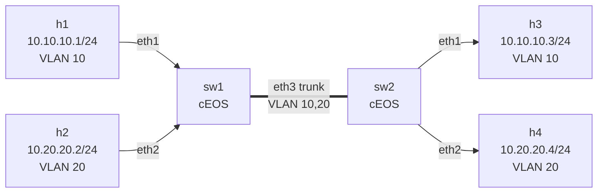

# Lab 01 — VLAN Basics

## Goal

Understand what a VLAN actually *does*. By the end of this lab you should be able to answer:

- Why doesn't "cable plugged in" mean "can communicate"?
- What's the difference between an **access port** and a **trunk port**?
- What is an 802.1Q tag, and where is it added/removed?
- How does a single physical link (the trunk) carry traffic for multiple isolated networks?

## Topology



- Two Arista cEOS switches, connected by a single trunk link
- Four Linux hosts (Alpine-based `network-multitool`), two per switch, in two VLANs
- Note: **no router anywhere**, so inter-VLAN traffic is impossible by design

## IP plan

| Host | IP            | VLAN |
|------|---------------|------|
| h1   | 10.10.10.1/24 | 10   |
| h3   | 10.10.10.3/24 | 10   |
| h2   | 10.20.20.2/24 | 20   |
| h4   | 10.20.20.4/24 | 20   |

The two VLANs use deliberately different subnets — that's the *L3* layer of the separation. The VLANs themselves are an *L2* construct (separate broadcast domains). Both layers matter; we'll see why below.

## Deploy

On the VM:

```bash
cd ~/containerlab/labs/01-vlan-basics
sudo containerlab deploy
```

First boot of cEOS takes ~30–60 seconds per switch — be patient.

When it's up, `sudo containerlab inspect` shows you the running nodes and their management IPs.

## Things to try

### 1. Same VLAN across the trunk — should work

From h1, ping h3:

```bash
docker exec -it clab-vlan-basics-h1 ping -c 3 10.10.10.3
```

✅ Should succeed. The frame leaves h1 untagged → sw1's Ethernet1 (access port in VLAN 10) tags it with VLAN 10 → out the trunk (Ethernet3) carrying that tag → into sw2's trunk → sw2 strips the tag because Ethernet1 is access VLAN 10 → h3 receives an untagged frame.

### 2. Different VLAN — should *not* work

From h1, try to ping h2 (same switch, different VLAN):

```bash
docker exec -it clab-vlan-basics-h1 ping -c 3 10.20.20.2
```

❌ Should fail (no route on h1 — it's not even in the same subnet). Even if you added a route, the switch would refuse to forward, because VLAN 10 and VLAN 20 are separate broadcast domains.

### 3. Peek at the switch — verify VLANs are configured

```bash
docker exec -it clab-vlan-basics-sw1 Cli
```

Then in the EOS CLI:

```
show vlan
show interfaces status
show interfaces Ethernet3 switchport
```

You should see:
- VLAN 10 (USERS) with Et1 as a member
- VLAN 20 (SERVERS) with Et2 as a member
- Et3 in trunk mode, allowed VLANs 10,20

### 4. See the tag on the wire

This is the satisfying part. Capture on the trunk and watch the 802.1Q header appear:

```bash
sudo ip netns exec clab-vlan-basics-sw1 tcpdump -i eth3 -nn -e vlan
```

…then in another terminal, ping h3 from h1 again. You'll see frames with `vlan 10` in the header. Now try pinging h4 from h2 — same tcpdump will now show `vlan 20`. Same wire, different tags, traffic stays separated.

### 5. Break it on purpose

In `configs/sw2.cfg`, change `switchport trunk allowed vlan 10,20` to just `switchport trunk allowed vlan 10`, redeploy, and watch h4 lose connectivity to h2 while h3↔h1 still works. This is how you'd intentionally restrict which VLANs cross a trunk.

## Cleanup

```bash
sudo containerlab destroy --cleanup
```

`--cleanup` removes the per-lab directory containerlab creates next to the topology file.

## Concepts cheat-sheet

- **Broadcast domain** — a set of devices that hear each other's broadcasts. Without VLANs, one switch = one broadcast domain. With VLANs, one switch = many smaller broadcast domains.
- **Access port** — belongs to exactly one VLAN. Frames in/out are untagged from the host's perspective; the switch handles the tag internally.
- **Trunk port** — carries multiple VLANs between switches. Frames on the wire have 802.1Q tags so the receiving switch knows which VLAN each frame belongs to.
- **802.1Q tag** — 4 extra bytes inserted into the Ethernet header containing the VLAN ID (12 bits → up to 4094 usable VLANs).
- **Native VLAN** — the one VLAN whose frames are *not* tagged on a trunk. Defaults to VLAN 1. Mismatched native VLANs between switches is a classic security/connectivity bug — we'll explore in a later lab.

## What's missing (deliberately)

- No inter-VLAN routing. h1 cannot reach h2 at all. Adding a router or an SVI (Switched Virtual Interface) is **lab 02**.
- No spanning tree to worry about (only one trunk, no loops).
- No port security, no DHCP — everything is static and trusting.
