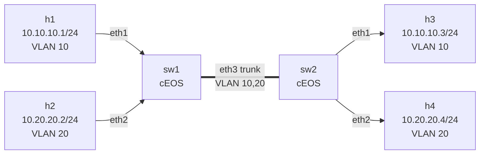

# Lab 01 — VLAN Basics

> **Format:** Hands-on. The starter switches boot with only a hostname; you'll configure VLANs and ports yourself. A complete reference answer lives in [`solutions/`](solutions/) — peek only after you've tried.

## Goal

Understand what a VLAN actually *does*. By the end you should be able to answer:

- Why doesn't "cable plugged in" mean "can communicate"?
- What's the difference between an **access port** and a **trunk port**?
- What is an 802.1Q tag, and where is it added/removed?
- How does a single physical link (the trunk) carry traffic for multiple isolated networks?

## Topology



| Host | IP            | VLAN | Connects to    |
|------|---------------|------|----------------|
| h1   | 10.10.10.1/24 | 10   | sw1 Ethernet1  |
| h2   | 10.20.20.2/24 | 20   | sw1 Ethernet2  |
| h3   | 10.10.10.3/24 | 10   | sw2 Ethernet1  |
| h4   | 10.20.20.4/24 | 20   | sw2 Ethernet2  |
| sw1↔sw2 trunk |    |      | Ethernet3 ↔ Ethernet3 |

**No router exists in this lab.** Inter-VLAN traffic is impossible by design.

## Theory primer (read before configuring)

A switch by default puts every port in the same **broadcast domain** — any host plugged in can hear every other host's broadcasts (ARP, DHCP discover, etc.). That's fine for tiny networks, terrible for everything else (noise, security, scale).

A **VLAN** is the switch's way of pretending it's actually *multiple* switches. Each VLAN is its own broadcast domain. Two hosts in different VLANs on the same physical switch are as isolated as if they were in different buildings — they cannot talk at L2 at all.

Two port modes matter here:

- **Access port** — belongs to exactly one VLAN. The host plugged in doesn't know VLANs exist; it sends and receives ordinary untagged Ethernet frames. The switch adds/removes the VLAN association internally.
- **Trunk port** — used between switches (or to virtualization hosts). Carries frames from *many* VLANs over a single link. To keep them separated, each frame gets a 4-byte **802.1Q tag** in its Ethernet header containing the VLAN ID. The receiving switch reads the tag and knows which VLAN the frame belongs to.

So the path for h1 → h3 in this lab is:

```
h1 ──(untagged)──► sw1:Et1 (access VLAN 10)
                    │ switch adds VLAN 10 tag internally
                    ▼
                  sw1:Et3 (trunk) ──(tagged VLAN 10)──► sw2:Et3 (trunk)
                                                          │ switch sees tag, knows it's VLAN 10
                                                          ▼
                                                        sw2:Et1 (access VLAN 10)
                                                          │ switch strips tag
                                                          ▼
                                                        h3 ──(untagged)──► receives frame
```

## Your task

Configure **sw1** and **sw2** so that:

1. Both switches know about **VLAN 10 (name: USERS)** and **VLAN 20 (name: SERVERS)**.
2. On each switch:
   - `Ethernet1` is an **access port in VLAN 10**.
   - `Ethernet2` is an **access port in VLAN 20**.
   - `Ethernet3` is a **trunk port** carrying both VLANs 10 and 20 (and *only* those — don't allow all VLANs).

That's it. No IPs on the switch, no routing. Just L2.

### Two ways to do it

- **Live in the EOS CLI** (recommended first time — immediate feedback):

  ```bash
  docker exec -it clab-vlan-basics-sw1 Cli
  ```

  Then `enable`, `configure terminal`, and start configuring. You can save with `write memory` but it won't persist across `containerlab destroy` — that's what the next mode is for.

- **Edit the starter config and redeploy** (infrastructure-as-code mindset):

  Edit `configs/sw1.cfg` and `configs/sw2.cfg`, then:

  ```bash
  sudo containerlab destroy
  sudo containerlab deploy
  ```

  The startup-config will be applied on boot. This is what you want once your config is working and you want to reproduce the lab cleanly.

## Hints

These are the EOS commands you'll need — figure out the order and arguments yourself.

```
configure terminal
  vlan <id>
    name <name>
  exit
  interface Ethernet<n>
    description <text>
    switchport mode access
    switchport access vlan <id>
  exit
  interface Ethernet<n>
    switchport mode trunk
    switchport trunk allowed vlan <comma-separated-ids>
  exit
end
write memory
```

If a command isn't accepted, EOS will tell you why. Tab completion (`?` at any point) shows available options.

## Deploy

On the VM:

```bash
cd ~/containerlab/labs/01-vlan-basics
sudo containerlab deploy
```

First boot of cEOS takes ~30–60 seconds per switch.

## Verification

### 1. Same VLAN across the trunk — should work

```bash
docker exec -it clab-vlan-basics-h1 ping -c 3 10.10.10.3
docker exec -it clab-vlan-basics-h2 ping -c 3 10.20.20.4
```

Both ✅ if your trunk allows VLANs 10 and 20.

### 2. Different VLAN — should *not* work

```bash
docker exec -it clab-vlan-basics-h1 ping -c 3 10.20.20.2
```

❌ Should fail. Even if you set up a route on h1, sw1 wouldn't forward — VLANs 10 and 20 are separate broadcast domains.

### 3. Peek at the switch

```bash
docker exec -it clab-vlan-basics-sw1 Cli
```

Then:

```
show vlan
show interfaces status
show interfaces Ethernet3 switchport
```

You should see Et1 in VLAN 10, Et2 in VLAN 20, Et3 in trunk mode with VLANs 10,20.

### 4. See the tag on the wire (the satisfying one)

```bash
sudo ip netns exec clab-vlan-basics-sw1 tcpdump -i eth3 -nn -e vlan
```

Then in another terminal: `docker exec -it clab-vlan-basics-h1 ping 10.10.10.3`. You'll see frames with `vlan 10` in the header. Try `h2 → h4` next — same wire, different tag.

### 5. Break it on purpose

Restrict the trunk on sw2 to VLAN 10 only:

```
interface Ethernet3
   switchport trunk allowed vlan 10
```

Now h2↔h4 breaks (VLAN 20 no longer crosses the trunk) but h1↔h3 still works. Restore with `switchport trunk allowed vlan 10,20`.

## Peek at solution

If you're stuck — or once you've finished and want to compare — the reference configs are in [`solutions/sw1.cfg`](solutions/sw1.cfg) and [`solutions/sw2.cfg`](solutions/sw2.cfg). Copy them over `configs/` and redeploy if you want the "known-good" state.

```bash
cp solutions/*.cfg configs/
sudo containerlab destroy
sudo containerlab deploy
```

## Concepts cheat-sheet

- **Broadcast domain** — set of devices that hear each other's broadcasts. One switch = one domain without VLANs; many domains with.
- **Access port** — single VLAN; host-facing; untagged on the wire.
- **Trunk port** — multiple VLANs; switch-to-switch; tagged on the wire (802.1Q).
- **802.1Q tag** — 4 bytes in the Ethernet header; 12-bit VLAN ID → up to 4094 usable VLANs.
- **Native VLAN** — the one VLAN whose frames stay untagged on a trunk. Defaults to VLAN 1. Mismatched native VLANs is a classic bug — explored in a later lab.

## What's missing (deliberately)

- **No inter-VLAN routing.** h1 cannot reach h2 *at all*. Adding a router or an SVI (Switched Virtual Interface) is lab 02.
- **No spanning tree** to worry about — single trunk, no loops.
- **No port security, no DHCP** — everything static and trusting.

## Cleanup

```bash
sudo containerlab destroy --cleanup
```
