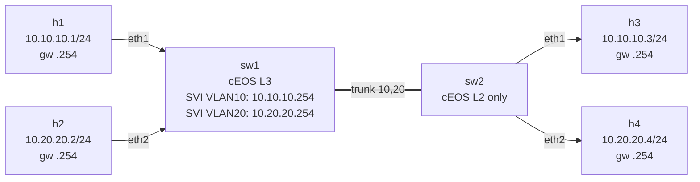

# Lab 02 — Inter-VLAN Routing with SVIs

> **Format:** Hands-on. Builds on lab 01 — the starter configs are the *final state* of lab 01 (VLANs and trunk already configured). Your job is to add the L3 piece. Reference answer in [`solutions/`](solutions/).

## Real-world scenario

Lab 01 isolated the office and dev teams into separate VLANs — and *deliberately*, they can't reach each other at all. That's fine for the security model, but it's not enough for a useful network: the office team's laptops still need to reach the dev team's internal portal, the printer in VLAN 20 still needs to be reachable from VLAN 10, and so on. You need **controlled** communication between VLANs, not flat L2 mixing.

The traditional answer was "buy a router, hang it off the switch" (router-on-a-stick). The modern answer — and the one every L3-capable switch supports — is to make **the switch itself** the gateway for each VLAN, using **SVIs (Switched Virtual Interfaces)**. The same box that does L2 switching also routes between VLANs at line rate. No extra hardware, no extra hops.

In this lab you'll promote sw1 to a true L3 switch: add an IP per VLAN as the host gateway, enable `ip routing`, and watch packets cross the VLAN boundary.

## Goal

In lab 01 you discovered that h1 (VLAN 10) cannot reach h2 (VLAN 20) — different broadcast domains, no router. Now you'll fix that *without* adding a separate router box, by turning sw1 into an L3 switch with **SVIs** (Switched Virtual Interfaces).

By the end you should be able to answer:

- What is an SVI, and how does it differ from a physical interface?
- Why does the switch suddenly need an IP address per VLAN?
- What does a host actually do when it sends a packet to "another VLAN"?
- Why do we need `ip routing` enabled — isn't the switch already moving frames?

## Topology

Same physical topology as lab 01. The new piece is **logical**: sw1 grows two virtual L3 interfaces.



| Host | IP            | VLAN | Gateway       |
|------|---------------|------|---------------|
| h1   | 10.10.10.1/24 | 10   | 10.10.10.254  |
| h3   | 10.10.10.3/24 | 10   | 10.10.10.254  |
| h2   | 10.20.20.2/24 | 20   | 10.20.20.254  |
| h4   | 10.20.20.4/24 | 20   | 10.20.20.254  |

| SVI on sw1 | IP             | Purpose                              |
|------------|----------------|--------------------------------------|
| Vlan10     | 10.10.10.254/24 | gateway for VLAN 10 hosts            |
| Vlan20     | 10.20.20.254/24 | gateway for VLAN 20 hosts            |

**sw2 doesn't change** — it stays a pure L2 switch. All routing happens on sw1.

## Theory primer

### What's an SVI?

In lab 01, the only IPs in the system were on the hosts. sw1 and sw2 were just frame-shovels — no IPs, no routing decisions.

An **SVI (Switched Virtual Interface)** is a virtual L3 interface that lives "inside" a VLAN. When you create `interface Vlan10` on a switch and give it an IP, you're saying: *"any frame on this switch tagged as VLAN 10 that's addressed to me at L2 (my MAC) — pop it up to the L3 stack so I can route it."*

There's no physical port called "Vlan10"; the SVI is reachable from any port that's a member of VLAN 10 (access or trunk).

### What changes for the host?

In lab 01, h1's routing table looked like this:

```
10.10.10.0/24 dev eth1   ← connected, fine for h3
default via 172.20.20.1 dev eth0   ← mgmt, useless for h2
```

When h1 tried to ping 10.20.20.2 (h2), the kernel saw "not in my connected subnets, send to default" → packet went out eth0 toward the mgmt network → dropped. **L3 failure**.

Now you'll add a route: "to reach 10.20.20.0/24, send to 10.10.10.254 (sw1's SVI)". Then:

1. h1 ARPs for 10.10.10.254 on eth1
2. sw1's Vlan10 SVI replies with its MAC
3. h1 builds an Ethernet frame: src=h1 MAC, dst=sw1 SVI MAC, payload IP=10.20.20.2
4. Frame arrives at sw1 — destination MAC is the switch itself → pop into L3 stack
5. sw1's routing table: `10.20.20.0/24` is directly connected via Vlan20 → re-encapsulate for VLAN 20, send out the appropriate port
6. h2 receives the frame on its VLAN 20 access port

### Why `ip routing`?

By default, an Arista switch is a *switch*: it forwards frames at L2 but does NOT route between L3 interfaces. Even with two SVIs configured, packets bounce off unless you explicitly enable IP routing globally:

```
ip routing
```

Forgetting this is one of the top-5 "but I configured everything!" mistakes. We'll deliberately break it later in the verification to see it fail.

## Your task

Configure **only sw1** and the **hosts**. sw2 stays untouched.

1. On sw1, **enable IP routing**.
2. On sw1, create **SVI Vlan10** with IP `10.10.10.254/24`.
3. On sw1, create **SVI Vlan20** with IP `10.20.20.254/24`.
4. On each host, add a route to the *other* VLAN's subnet via the appropriate SVI. (Don't replace the default route — add a specific `/24` route. The hosts need to keep their mgmt default for `eth0`.)

## Hints

EOS commands you'll need on sw1:

```
configure terminal
  ip routing
  interface Vlan<id>
    description <text>
    ip address <ip>/<prefix>
  exit
end
write memory
```

Host route command (from the VM, not inside the host shell — easier):

```
docker exec clab-inter-vlan-svi-<host> ip route add <other-subnet>/24 via <svi-ip>
```

## Deploy

```bash
cd ~/containerlab/labs/02-inter-vlan-svi
sudo containerlab deploy
```

## Verification

### 1. Same VLAN still works

```bash
docker exec -it clab-inter-vlan-svi-h1 ping -c 3 10.10.10.3
docker exec -it clab-inter-vlan-svi-h2 ping -c 3 10.20.20.4
```

Both ✅ — the L2 path didn't change.

### 2. The new thing: ping the gateway

```bash
docker exec -it clab-inter-vlan-svi-h1 ping -c 3 10.10.10.254
docker exec -it clab-inter-vlan-svi-h2 ping -c 3 10.20.20.254
```

Both ✅ once the SVIs are up. If these fail, your SVI config is missing or `ip routing` is off.

### 3. Cross-VLAN (the goal)

After adding host routes:

```bash
docker exec -it clab-inter-vlan-svi-h1 ping -c 3 10.20.20.2
docker exec -it clab-inter-vlan-svi-h3 ping -c 3 10.20.20.4
docker exec -it clab-inter-vlan-svi-h2 ping -c 3 10.10.10.3
```

All ✅. Notice the TTL drops by 1 vs same-VLAN pings — that's the L3 hop through sw1.

### 4. Watch the routing table on sw1

```bash
docker exec -it clab-inter-vlan-svi-sw1 Cli
```

```
show ip route
show ip interface brief
```

You should see two "C" (connected) routes — one for each SVI subnet — and both Vlan10/Vlan20 interfaces "up".

### 5. Break it on purpose — disable IP routing

```
no ip routing
```

Re-test the cross-VLAN ping. It will fail even though all interfaces are up. Same-VLAN still works. Restore: `ip routing`. This is the moment you really understand the difference between L2 forwarding and L3 routing.

### 6. Trace the packet path on the trunk

```bash
sudo nsenter -t $(docker inspect -f '{{.State.Pid}}' clab-inter-vlan-svi-sw1) -n tcpdump -i eth3 -nn -e vlan
```

Run `h3 → h2` ping from another terminal: `docker exec clab-inter-vlan-svi-h3 ping 10.20.20.2`.

You'll see frames going **both directions** on the trunk, with **different VLAN tags**:
- h3 → sw1: tagged VLAN 10 (frame coming up to be routed)
- sw1 → h2: doesn't cross trunk (h2 is on sw1 directly). But h3 → h4 *would* show both VLAN 10 (request leg) and VLAN 20 (reply leg).

Try `h3 → h4`:
```bash
docker exec clab-inter-vlan-svi-h3 ping 10.20.20.4
```
Now you see VLAN 10 *and* VLAN 20 frames on the same wire — one hop routed through sw1.

## Peek at solution

- sw1 reference: [`solutions/sw1.cfg`](solutions/sw1.cfg)
- sw2 reference (unchanged): [`solutions/sw2.cfg`](solutions/sw2.cfg)
- Host gateway routes: [`solutions/host-routes.md`](solutions/host-routes.md)

Restore the known-good state:

```bash
cp solutions/sw1.cfg solutions/sw2.cfg configs/
sudo containerlab destroy
sudo containerlab deploy
# then run the docker exec ... ip route add ... commands from solutions/host-routes.md
```

## Going deeper

- [L3 Switch vs. Router](../../docs/concepts/l3-switch-vs-router.md) — at this point sw1 is doing routing; is it a "router" now, or still an "L3 switch"? Short answer: depends on role, not silicon.

## Concepts cheat-sheet

- **SVI (Switched Virtual Interface)** — virtual L3 interface bound to a VLAN. Switch's "presence" on that VLAN at L3. Aka `interface Vlan<id>` on Arista/Cisco.
- **L3 switch** — a switch that can route. Same hardware, just with IP routing enabled and SVIs/routed ports configured.
- **Default gateway** — the IP a host sends packets to when the destination isn't in a directly connected subnet. From the host's POV, the gateway is "the way out of my subnet".
- **ARP across VLANs** — does NOT happen. ARP is L2; it stays inside the VLAN. h1 ARPs for the gateway's MAC, not for h2's MAC. The gateway re-ARPs on the destination VLAN if needed.
- **TTL decrement** — every routed (L3) hop decrements IP TTL by 1. Pure L2 switching does not. A reliable way to count router hops with `traceroute` or just `ping`.

## What's missing (deliberately)

- **No HSRP/VRRP** — sw1 is a single point of failure. If it dies, inter-VLAN routing dies. First-hop redundancy is a later lab.
- **No DHCP** — hosts still have static IPs and you still manually add gateway routes. We'll add a DHCP relay/server later.
- **No ACLs** — VLAN 10 hosts can freely reach VLAN 20 hosts. Restricting that with access-lists is a later lab.
- **Routing only on one switch** — sw1 carries all the L3 work. In real designs both switches would be L3 with HSRP/VRRP between them.

## Cleanup

```bash
sudo containerlab destroy --cleanup
```
