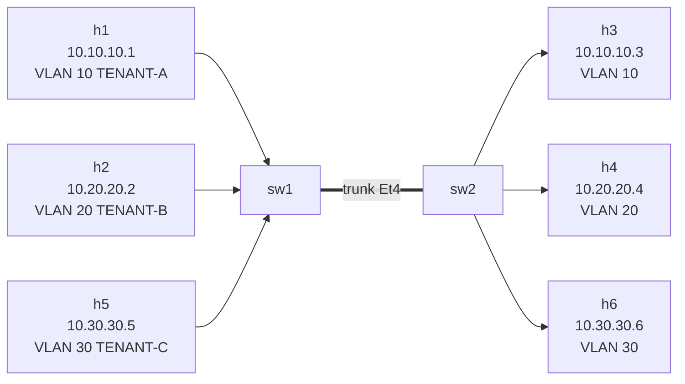

# Lab 03 — Trunk Deep-Dive

> **Format:** Hands-on. Starter is a "lazy admin" trunk config that *works* but has three production-relevant problems. Your job is to harden it. Reference answer in [`solutions/`](solutions/).
>
> **Story chapter:** Phase 1 · Junior · Month 2. An external auditor visits The Company. They flag your inter-switch trunks for allowing all VLANs and using VLAN 1 as native. You learn that vendor defaults are not production defaults. See [`STORY.md`](../../STORY.md).

## Real-world scenario

You're operating a multi-tenant access layer. Three tenants share these two switches via VLANs 10, 20, 30. A new audit just landed: the auditor flagged your trunks as "non-compliant" because they allow **all VLANs** and use **VLAN 1 as native**.

Your job: tighten the trunk between sw1 and sw2 without breaking anything for the tenants, and understand *why* each step matters. The same hardening will need to roll out across every inter-switch link in the network — so the exercise is also a template you'll reuse.

## Goal

Three things you should be able to explain by the end:

1. Why is "trunk allows all VLANs" the wrong default for production?
2. What's the **native VLAN** and why is leaving it as VLAN 1 a problem?
3. What does `vlan dot1q tag native` actually do, and why does turning it on close a known attack vector?

## Topology

Same physical layout as labs 01/02, plus a third tenant on each switch.



| Host pair | VLAN | Subnet           |
|-----------|------|------------------|
| h1 ↔ h3   | 10   | 10.10.10.0/24    |
| h2 ↔ h4   | 20   | 10.20.20.0/24    |
| h5 ↔ h6   | 30   | 10.30.30.0/24    |

## Theory primer

### What "trunk allows all VLANs" actually means

`switchport mode trunk` with no further config = the trunk carries **every VLAN 1–4094** (or whatever the platform supports). Three problems:

1. **Blast radius.** Any new VLAN you create anywhere in the campus shows up on this trunk automatically. If sw1 accidentally has VLAN 99 with a misconfigured port, frames cross to sw2 even if you never intended them to.
2. **MAC table bloat.** Every switch learns MACs for every VLAN it sees on a trunk. Wide-open trunks = every switch learning everything = wasted hardware resources.
3. **Audit / least privilege.** You can't justify "this trunk needs VLAN 1234" if 1234 isn't actually used anywhere — but with allow-all you'd never notice.

The principle of least privilege says: **a trunk should allow exactly the VLANs that legitimately need to traverse it. Nothing more.**

### Native VLAN

On a trunk, frames belonging to the **native VLAN** are sent **untagged** on the wire. All other VLANs get an 802.1Q tag. The default native VLAN is **VLAN 1**.

Why this exists: legacy compatibility with non-VLAN-aware devices that drop tagged frames. Almost nobody needs this today.

Why VLAN 1 is a bad choice for it:
- VLAN 1 is the default for *everything* — any unconfigured access port often defaults to VLAN 1.
- Many control-plane protocols (CDP, VTP, PAgP, DTP on Cisco; LLDP frames don't tag but still) default to VLAN 1.
- An attacker on an access port in VLAN 1 sits in the same broadcast domain as the trunk's native VLAN by default.

### VLAN hopping (double-tag attack)

The classic attack:
1. Attacker is on an access port in VLAN 1 (the native VLAN).
2. They craft a frame with **two 802.1Q tags**: outer = VLAN 1 (native, will be stripped), inner = VLAN 20 (the victim VLAN).
3. The first switch strips the outer tag (because it's the native VLAN, untagged on egress). The frame, now carrying only the VLAN 20 tag, enters the trunk.
4. The next switch reads the VLAN 20 tag and forwards into VLAN 20.
5. Attacker just injected a frame into a VLAN they had no right to touch.

Defenses:
- **Don't use VLAN 1 as native.** Move it to an unused, unrouted VLAN ("parking" VLAN).
- **`vlan dot1q tag native`** — force every frame on every trunk to be tagged, including native VLAN traffic. The "untagged frame" ambiguity disappears entirely, and the double-tag trick fails.
- Don't put any access port in the native VLAN. Native VLAN should be an empty hole.

## Your task

Reconfigure both sw1 and sw2 trunks (Ethernet4) so that:

1. **Allowed VLANs are explicitly listed** — only VLAN 10, 20, 30 (plus whatever native VLAN you choose in step 2).
2. **Native VLAN is moved off VLAN 1** to an unused VLAN (suggest VLAN 999, name it `NATIVE-PARKING`). Create the VLAN on both switches.
3. **All native traffic is tagged on the wire** by enabling `vlan dot1q tag native` globally.

Do *not* break the existing inter-tenant connectivity. After your changes:
- h1 ↔ h3 should still work
- h2 ↔ h4 should still work
- h5 ↔ h6 should still work

## Hints

EOS commands you'll need:

```
configure terminal
  vlan <id>
    name <name>
  exit
  vlan dot1q tag native
  interface Ethernet4
    switchport trunk native vlan <id>
    switchport trunk allowed vlan <comma-separated-list>
  exit
end
write memory
```

Apply identically on both switches. **Native VLAN must match on both ends** — otherwise you've created the very mismatch we're trying to avoid (see verification step 4).

## Deploy

```bash
cd ~/containerlab/labs/03-trunk-deep-dive
sudo containerlab deploy
```

## Verification

### 1. All three tenants work end-to-end

```bash
docker exec -it clab-trunk-deep-dive-h1 ping -c 3 10.10.10.3
docker exec -it clab-trunk-deep-dive-h2 ping -c 3 10.20.20.4
docker exec -it clab-trunk-deep-dive-h5 ping -c 3 10.30.30.6
```

All ✅. Connectivity unchanged from before — hygiene shouldn't break anything.

### 2. Verify allowed-list is restricted

```bash
docker exec -it clab-trunk-deep-dive-sw1 Cli
```

```
show interfaces Ethernet4 switchport
show interfaces trunk
```

You should see allowed VLANs explicitly listed (10,20,30,999), not "1-4094". `show interfaces trunk` is the operationally useful command — gives you a one-line summary of every trunk and what it carries.

### 3. Verify native VLAN moved

In the same Cli:

```
show interfaces Ethernet4 switchport | include Native
```

Native VLAN: 999.

### 4. Native VLAN mismatch demo (break it on purpose)

On sw1 only:

```
interface Ethernet4
   switchport trunk native vlan 998
```

Wait ~30 seconds, then check:

```
show lldp neighbors detail | include Native
show logging | tail
```

LLDP detects the mismatch and logs a warning. The trunk **stays up** — this is the dangerous part: connectivity continues, but frames can leak between native VLANs (998 on sw1, 999 on sw2). This is *exactly* the kind of bug that hides for months in production until someone notices weird traffic in the wrong place.

Restore: `switchport trunk native vlan 999` on sw1.

### 5. See `dot1q tag native` on the wire

With `vlan dot1q tag native` enabled, capture on the trunk and watch — even VLAN 999 (native) frames carry a tag:

```bash
sudo nsenter -t $(docker inspect -f '{{.State.Pid}}' clab-trunk-deep-dive-sw1) -n tcpdump -i eth4 -nn -e vlan
```

Now disable it temporarily:

```
no vlan dot1q tag native
```

Re-capture. Native VLAN traffic (mainly LLDP) now goes untagged. Notice the difference. Re-enable: `vlan dot1q tag native`.

### 6. Operational reflex — `show interfaces trunk`

Get used to this command. In real ops you'll run it constantly:

```
show interfaces trunk
```

Output tells you in one screen: which ports are trunks, what VLANs they're allowed, what VLANs are *actually active* on each, and what native VLAN is in use. This is your single best L2 sanity check.

## Peek at solution

- [`solutions/sw1.cfg`](solutions/sw1.cfg)
- [`solutions/sw2.cfg`](solutions/sw2.cfg)

## Concepts cheat-sheet

- **Allowed VLAN list** — explicit comma-separated list of VLANs that may traverse a trunk. Default is all; production should be explicit.
- **Native VLAN** — the one VLAN on a trunk whose frames are *not* tagged on the wire (unless `dot1q tag native` is on). Default VLAN 1. Move it to an unused VLAN.
- **`vlan dot1q tag native`** — global command that forces every trunk frame to carry an 802.1Q tag, native VLAN included. Closes the double-tag VLAN hopping attack and removes the "untagged frame on a trunk" ambiguity.
- **VLAN hopping** — attacker on an access port crafts a double-tagged frame; first switch strips outer (native) tag, second switch honors inner tag, frame ends up in a VLAN the attacker shouldn't reach. Defense: don't use VLAN 1 as native + tag everything.
- **`show interfaces trunk`** — your operational best friend for L2 sanity.

## What's missing (deliberately)

- **DTP / negotiation** — older platforms negotiate trunk mode automatically. Modern best practice: hard-code mode on both ends, disable negotiation. cEOS doesn't have DTP, so we skip it here, but on Cisco you'd add `switchport nonegotiate`.
- **VLAN pruning protocols** — VTP pruning, MVRP. Largely deprecated in favor of explicit allowed-lists.
- **STP impact** — we still have only one trunk, no loops yet. STP-related VLAN behavior comes in lab 04.

## Cleanup

```bash
sudo containerlab destroy --cleanup
```
