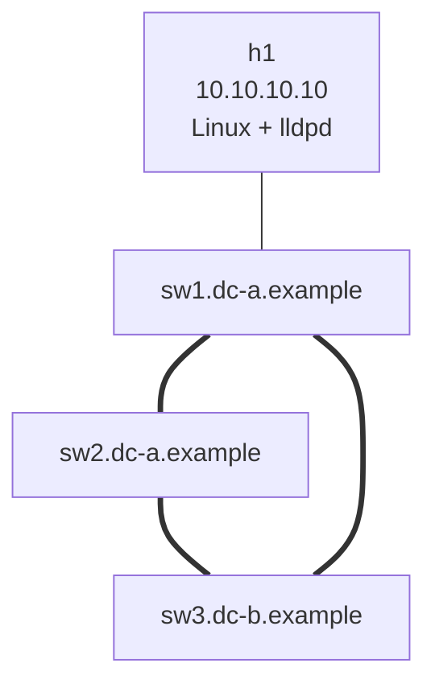

# Lab 03b — LLDP & Operational Link Discovery

> **Format:** Hands-on. Three switches in a triangle + a Linux host. LLDP is enabled by default on cEOS — your job is to use it like a senior operator would. Reference answer in [`solutions/`](solutions/).
>
> **Story chapter:** Phase 1 · Junior · Month 1. Your second week at The Company. The previous engineer left the network documentation in vague shape: a Visio diagram from two years ago that doesn't match the patch panel. You SSH into a switch and need to know what's actually on each port. LLDP is how. See [`STORY.md`](../../STORY.md).

## Real-world scenario

The Visio diagram says `sw3:Ethernet1` goes to `sw1`. The patch panel labels say `sw3:Et1` goes to `sw1`. The configured interface description on `sw3:Et1` also says `trunk-to-sw1`. *Three sources of truth all agree.*

Then you run `show lldp neighbors` and discover that the cable actually goes to `sw2`. Somebody re-patched it 18 months ago and updated none of the three sources.

This is normal. Documentation drifts. Patch labels are old. Interface descriptions are aspirational. **The only reliable source of "what's actually on the wire right now" is LLDP** — because the switches themselves tell each other what they are, in real time, on every active port.

Fluency with LLDP is daily-driver senior-engineer behavior. Most juniors run `show interfaces status`; seniors run `show lldp neighbors` first.

## Goal

By the end you should be able to answer:

- What is **LLDP**, what does it advertise, and what doesn't it?
- How do you read `show lldp neighbors` and `show lldp neighbors detail` quickly?
- What's the difference between **transmit** and **receive** on an LLDP-enabled port?
- What are LLDP **TLVs**, and what are the default ones?
- How does LLDP integrate with **non-switch devices** (Linux hosts running lldpd)?
- Why is LLDP the **first command** to run when troubleshooting "where does this cable go?"

## Topology



Three Arista cEOS switches in a full mesh. A Linux host (with lldpd) attached to sw1. Switches are hostname-FQDN-style on purpose — LLDP advertises hostname, and FQDNs are richer than just "sw1".

## Theory primer

### What LLDP is

**LLDP (Link Layer Discovery Protocol, IEEE 802.1AB)** is a vendor-neutral protocol where every device on an Ethernet link periodically broadcasts a small frame containing information about itself:

- **Chassis ID** — usually the device's MAC address or a system identifier
- **Port ID** — the local port number/name
- **System name** — the hostname
- **System description** — vendor/model/version (e.g., "Arista Networks EOS version 4.35.4M")
- **System capabilities** — what the device is (bridge, router, etc.)
- **Management address** — IP for management plane
- **Port description** — what's configured on the port (your `description`)
- Optional: VLAN ID, link aggregation status, MTU, PoE info

Each piece of information is a **TLV** (Type-Length-Value). Default TLVs on Arista (per the EOS Manual, section 13.2.2.1):

- port-description
- system-capabilities
- system-description
- system-name
- management-address
- port-vlan

You can disable individual TLVs if you don't want them advertised.

### LLDP vs CDP

- **LLDP**: open standard (802.1AB). Multi-vendor. Default in modern designs.
- **CDP (Cisco Discovery Protocol)**: Cisco-proprietary but extremely common in Cisco-shop networks. Carries similar info. Arista supports CDP transmit/receive for interop.

Best practice: enable LLDP everywhere; enable CDP only where Cisco devices are in the mix.

### How a device uses LLDP info

LLDP info is stored in an SNMP MIB. From there:

- `show lldp neighbors` displays it for humans
- Monitoring tools (Observium, LibreNMS, NetBox auto-discovery) read the MIB and build topology graphs
- Configuration tools can use it for "is the cable in the right port?" validation
- Some VoIP phones use it for power negotiation (PoE) and VLAN auto-assignment

### Limitations

- LLDP **only sees one hop**. The neighbor is whatever is directly cabled to this port. To map a multi-hop path you walk LLDP one device at a time.
- LLDP is **L2** — it works even with no L3 config (no IP needed). That's a feature: you can use LLDP to debug before IP is set up.
- LLDP can be **disabled** by operators (sometimes for security on customer-facing ports — your customer doesn't need to know your switch's model).
- LLDP **takes time to converge** — default frames every 30s with 120s hold-time. A cable just plugged in might take ~30s before the neighbor appears.

## Your task

1. Deploy. Run `show lldp` — confirm it's enabled by default.
2. Run `show lldp neighbors` on each switch. Sketch out the topology from what you see. Compare to your assumptions.
3. Run `show lldp neighbors detail` on sw1 Ethernet1. Read every field.
4. Run `show lldp local-info` to see what you advertise.
5. Find the simulated mis-cabling: one of sw3's interface descriptions claims it connects to sw1, but LLDP says otherwise. Identify which port, which actual neighbor, and update the description.
6. Tune LLDP for faster updates: `lldp timer 5` + `lldp hold-time 30`. Verify with `show lldp` that the change took effect.
7. Disable LLDP transmit on one of sw1's interfaces (`no lldp transmit`). On the *neighbor* side, watch the entry disappear after hold-time expires.
8. Verify the Linux host (h1) shows up as a neighbor on sw1.

## Hints

LLDP commands (verified against EOS User Manual v4.36.0F, section 13.2):

```
! Global config
lldp run                              # enable globally (cEOS: usually on by default)
lldp timer <period>                   # update interval (default 30s)
lldp hold-time <period>               # how long neighbors should hold our info (default 120s)
lldp management-address <interface>   # which interface's IP to advertise

! Per-interface
interface Ethernet<n>
   lldp transmit                      # transmit LLDP on this port (default on)
   lldp receive                       # receive LLDP on this port (default on)
   no lldp transmit                   # stop sending (still receives)
   no lldp receive                    # stop accepting

! Inspection
show lldp                             # global state
show lldp neighbors                   # short list — port + neighbor + TTL
show lldp neighbors detail            # everything per neighbor
show lldp local-info                  # what WE advertise (per port)
show lldp counters                    # tx/rx frame counts
clear lldp counters                   # reset counters
clear lldp table                      # forget all neighbors (they'll re-appear)
```

## Deploy

```bash
cd ~/containerlab/labs/03b-lldp-and-discovery
sudo containerlab deploy
```

Wait ~30 seconds for LLDP to converge on its default timers (or apply the tuned timers immediately to see neighbors faster).

## Verification

### 1. Confirm LLDP is up

```bash
docker exec -it clab-lldp-discovery-sw1 Cli
```

```
show lldp
```

You should see:
- LLDP transmit interval: 30 seconds (default)
- LLDP hold-time: 120 seconds
- Per-port "Tx Enabled / Rx Enabled" status

### 2. Walk the topology via LLDP

```
show lldp neighbors
```

Expected on sw1:
- Et1 → neighbor with system name `sw2.dc-a.example`
- Et2 → neighbor with system name `sw3.dc-b.example`
- Et3 → neighbor `h1` (or whatever lldpd advertises for the Linux host)

If h1 doesn't show up immediately: lldpd takes 30-60s to send its first frame after starting. Wait and retry.

### 3. Detailed view

```
show lldp neighbors ethernet 1 detail
```

For each neighbor you should see:
- Chassis ID (MAC)
- Port ID and description
- System Name (FQDN of neighbor)
- System Description (cEOS version etc.)
- System Capabilities (Bridge, Router)
- Management address
- Time remaining (countdown to expiry)

### 4. What WE advertise

```
show lldp local-info
```

You'll see, per port, the TLVs you transmit. Cross-reference with what your neighbor receives on the corresponding port via `show lldp neighbors detail`.

### 5. Find the mis-cabling

The starter has a deliberate inconsistency:

- `sw3:Ethernet1` description says `trunk-to-sw1`
- But the actual cable goes to `sw2:Ethernet2`

Detect it:

```bash
docker exec -it clab-lldp-discovery-sw3 Cli
show lldp neighbors ethernet 1
```

Output should show the neighbor on Et1 is **sw2**, not sw1. The interface description was wrong.

Fix it:

```
configure terminal
  interface Ethernet1
    description trunk-to-sw2 (corrected from "sw1" per LLDP discovery)
```

This is the canonical "LLDP saved me from believing the wrong documentation" workflow. Run it on every switch when you onboard at a new company.

### 6. Tune for fast updates

On sw1:

```
configure terminal
  lldp timer 5
  lldp hold-time 30
```

```
show lldp
```

Should show updated values. Now do the same on sw2 and sw3 if you want consistent behavior across the fabric.

### 7. Demonstrate LLDP disable

On sw1:

```
configure terminal
  interface Ethernet1
    no lldp transmit
```

Wait ~30 seconds (or whatever your hold-time is). On sw2:

```
show lldp neighbors ethernet 1
```

sw1 should have disappeared from sw2's neighbor table on the Et1 entry — because sw1 stopped sending, and sw2's hold-time for sw1's info expired.

Note: sw2 → sw1 still works (sw1 is still receiving, just not transmitting). This is unidirectional LLDP — sometimes desirable, often a misconfiguration.

Restore:

```
configure terminal
  interface Ethernet1
    lldp transmit
```

### 8. The Linux host side

```bash
docker exec clab-lldp-discovery-h1 lldpcli show neighbors
```

Should show sw1 as a detected neighbor — with the same TLVs that sw1 sees from the switch side. Two-way LLDP works between Linux and a switch.

> Note: the network-multitool image is Alpine-based; the binary is `lldpcli`. On Debian/Ubuntu the binary is usually `lldpctl` (or `lldpcli` — both exist, `lldpctl` is the legacy name).

```bash
docker exec clab-lldp-discovery-h1 lldpcli show neighbors -f keyvalue
```

Same info in a parser-friendly format — useful for scripting (auto-update DNS records, build topology graphs, validate cabling at boot, etc.).

## Peek at solution

- [`solutions/sw1.cfg`](solutions/sw1.cfg), [`solutions/sw2.cfg`](solutions/sw2.cfg), [`solutions/sw3.cfg`](solutions/sw3.cfg)

## Concepts cheat-sheet

- **LLDP** — IEEE 802.1AB. Open-standard L2 neighbor discovery. Default-on in modern designs.
- **TLV** (Type-Length-Value) — granular pieces of advertised info. You can selectively disable.
- **One-hop only** — LLDP sees the directly-connected neighbor, nothing further.
- **L2-only requirement** — works even without IP. Useful for early-boot debug.
- **Default timer**: 30s tx / 120s hold. Tune lower for fast change detection.
- **`show lldp neighbors`** is the senior's first command in any unfamiliar network.
- **`lldpcli`** / **`lldpctl`** on Linux hosts (via `lldpd` daemon) integrates servers into LLDP topology.

## Operational patterns

- **Onboard at a new company**: walk every switch with `show lldp neighbors`. Build the topology *yourself*. Trust this above any wiki.
- **After a re-patching event**: `show lldp neighbors` to verify cables went where you intended.
- **Detect rogue switches plugged in**: a port that previously had no LLDP neighbor suddenly shows one — investigate.
- **NetBox / IPAM auto-population**: scripts that read LLDP via SNMP can keep topology databases honest.
- **VoIP phone deployment**: phones use LLDP-MED to negotiate voice VLAN + PoE class with the switch.

## Production deployment notes

- **Enable LLDP on every internal switch port.** Negligible CPU cost, massive operational value.
- **Disable LLDP on customer-facing or untrusted ports.** Your switch model and software version is *information leakage* you don't owe a customer. Configure `no lldp transmit` (still receive, so you see *them*).
- **Lower the timer on critical fabrics** (5s / 30s) so neighbor changes are detected fast. Default 30s is too slow when troubleshooting active issues.
- **Don't disable globally for "security through obscurity"** — internal teams need the info more than attackers benefit from its absence.
- **Pair with `show interfaces transceiver`** — LLDP tells you "what's on the other end logically"; transceiver telemetry tells you "is the physical link healthy". Different layers, both useful.

## What's missing (deliberately)

- **CDP (Cisco Discovery Protocol)** — Cisco-proprietary; cEOS can interop. Add when running in mixed Cisco/Arista environments.
- **LLDP-MED** — Media Endpoint Discovery extension for VoIP/PoE. Covered briefly in the VoIP lab (planned, lab 43).
- **LLDP-based ZTP** — some platforms use LLDP info during Zero Touch Provisioning to auto-locate themselves. Vendor-specific.

## Cleanup

```bash
sudo containerlab destroy --cleanup
```
