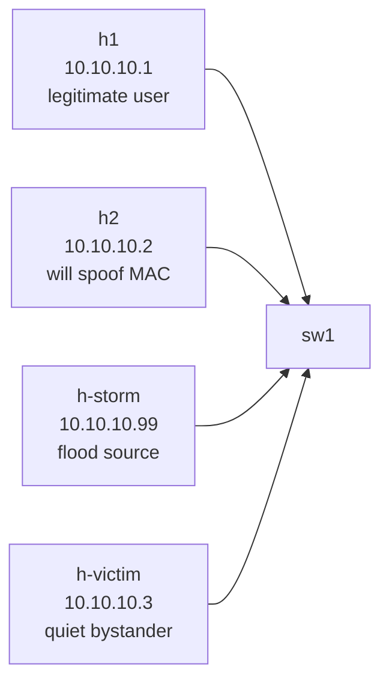

# Lab 06 — Port Security & Storm Control

> **Format:** Hands-on. Single switch, four hosts. Starter has the lab 05 STP protections baked in; your job is to add MAC-level and bandwidth-level access-port protections. Reference answer in [`solutions/`](solutions/).

## Real-world scenario

Two recent incidents on the access network:

1. **"NAC bypass"** — security found that an unauthorized laptop connected from a conference room jack by spoofing a registered endpoint's MAC address. The legitimate device was elsewhere, but the access port had no MAC limit, so the spoofed MAC was accepted. The user got LAN access for 4 hours before someone noticed.
2. **"The Tuesday Storm"** — a misbehaving NIC on a customer VM started sending broadcast traffic at line rate. The switch faithfully flooded it to every port in the VLAN. CPU on neighboring devices spiked, monitoring alerts fired across half the rack, and an SSH session got knocked offline mid-`reload`.

Your task: harden the access ports against both classes of failure.

## Goal

By the end you should be able to answer:

- What does **port security** actually do, and what are the trade-offs of `shutdown` vs `restrict` vs `protect`?
- What's the difference between **static**, **dynamic**, and **sticky** MAC learning?
- How does **storm control** measure "too much" traffic — by percent of port bandwidth or packets-per-second?
- Why do storm control thresholds need to be set per traffic type (broadcast vs multicast vs unknown unicast)?
- When should err-disabled ports auto-recover, and when should they require human attention?

## Topology



One switch, four host ports — each demonstrating one protection scenario.

## Theory primer

### Port security

Limits how many (and optionally which) MAC addresses can appear on a port.

- `switchport port-security` — turn the feature on.
- `switchport port-security maximum <n>` — allow at most n MACs. Default is 1.
- `switchport port-security mac-address sticky` — learn dynamically but **save** the learned MAC to running-config. After the first MAC is seen, any other MAC is a violation.
- `switchport port-security violation { shutdown | restrict | protect }`:
  - **shutdown** — port goes err-disabled (loud, manual recovery). Default and recommended.
  - **restrict** — drop frames from the violating MAC, log + SNMP trap. Port stays up.
  - **protect** — silently drop the violating MAC's frames. No log. Almost never the right choice.

Use cases:
- **Hosted hosting / customer-port scenarios** — bind a customer port to exactly one MAC so they can't multi-home or sublease the cable.
- **Office endpoint enforcement** — limit each port to N MACs (N=2 if you allow VoIP phones daisy-chained with PCs).
- **Anti-spoofing** — combined with sticky, the first device "claims" the port and any other MAC is rejected.

### Storm control

Measures traffic rate per port, per traffic class. When the rate exceeds a threshold, the switch drops excess frames (or err-disables the port, depending on platform/config).

Traffic classes that need separate thresholds:
- **Broadcast** — destined to `ff:ff:ff:ff:ff:ff`. Floods everywhere.
- **Multicast** — group-addressed (`01:00:5e:...` for IPv4, `33:33:...` for IPv6). Often flooded unless IGMP/MLD snooping is on.
- **Unknown unicast** — destination MAC not in the MAC table → flooded just like broadcast.

Why separate thresholds? Multicast might be legitimate (IPTV, PTP, video). Broadcast at high rates is almost never legitimate. Unknown unicast suggests a learning problem (or attack).

Levels can be expressed as:
- **percent of bandwidth** (`storm-control broadcast level 1` = 1% of port speed)
- **pps (packets per second)** on platforms that support it

Start conservative: 1% broadcast is plenty for a host port. Datacenter server ports may need higher multicast (clustering software, gossip protocols).

### Err-disable recovery

When something fires (BPDU guard, port-security violation, storm control on some platforms), the port goes err-disabled. Two recovery modes:

- **Manual** — operator does `no shutdown`. Forces investigation. Good for security events.
- **Automatic** — after a cooldown timer, the port automatically `no shutdown`s. Good for transient causes (e.g. storm control), bad for security events that need RCA.

Tunable per cause:

```
errdisable recovery cause portsecurity
errdisable recovery cause bpduguard
errdisable recovery interval 300
```

A common pattern: auto-recover storm-related causes (transient), require manual recovery for security causes (port-security, BPDU guard).

## Your task

1. Enable **port security** on Et1 and Et2:
   - max 1 MAC
   - sticky learning
   - violation: shutdown
2. Enable **storm control** on Et3:
   - broadcast threshold: 1%
   - multicast threshold: 1%
3. Configure **err-disable recovery** globally for port-security and BPDU guard violations, 5-minute interval.

## Hints

Per-port port-security:

```
interface Ethernet<n>
  switchport port-security
  switchport port-security maximum 1
  switchport port-security mac-address sticky
  switchport port-security violation shutdown
```

Per-port storm-control:

```
interface Ethernet<n>
  storm-control broadcast level <percent>
  storm-control multicast level <percent>
```

Global err-disable recovery:

```
errdisable recovery cause portsecurity
errdisable recovery cause bpduguard
errdisable recovery interval <seconds>
```

## Deploy

```bash
cd ~/containerlab/labs/06-port-security-storm-control
sudo containerlab deploy
```

## Verification

### 1. Port security — baseline learning

Apply your port-security config to Et1. Make h1 send a ping to populate the MAC table:

```bash
docker exec clab-port-security-storm-control-h1 ping -c 1 10.10.10.3
```

On sw1:

```bash
docker exec -it clab-port-security-storm-control-sw1 Cli
```

```
show port-security
show port-security interface Ethernet1
```

You should see h1's MAC listed as a sticky-learned secure MAC.

### 2. Port security — trigger the violation

Spoof h1's MAC from h2's port by changing h2's MAC. (We want the MAC seen on Et2 to suddenly change.) From the VM:

```bash
docker exec clab-port-security-storm-control-h2 ip link set eth1 down
docker exec clab-port-security-storm-control-h2 ip link set eth1 address 02:42:ac:11:00:99
docker exec clab-port-security-storm-control-h2 ip link set eth1 up
docker exec clab-port-security-storm-control-h2 ping -c 1 10.10.10.3
docker exec clab-port-security-storm-control-h2 ip link set eth1 down
docker exec clab-port-security-storm-control-h2 ip link set eth1 address aa:bb:cc:dd:ee:ff
docker exec clab-port-security-storm-control-h2 ip link set eth1 up
docker exec clab-port-security-storm-control-h2 ping -c 1 10.10.10.3
```

The second MAC change triggers the violation on Et2. On sw1:

```
show interfaces Ethernet2 status
show port-security
```

Et2: `errdisabled`. Log line: `SECURITY-2-PORT_SECURITY_VIOLATION`.

### 3. Storm control — generate a broadcast storm

From the VM, flood broadcasts from h-storm using `arping` (broadcasts ARP requests):

```bash
docker exec -d clab-port-security-storm-control-h-storm arping -i eth1 -U 10.10.10.99 -w 30
```

(Background, 30 seconds.)

Quickly, on sw1:

```
show storm-control
show interfaces Ethernet3 counters rates
```

Watch the broadcast rate climb toward your 1% threshold. Storm control will start dropping frames once exceeded. You may also see `STORM_CONTROL` log messages.

While the storm is running, check that h-victim is still reachable from h1:

```bash
docker exec clab-port-security-storm-control-h1 ping -c 5 10.10.10.3
```

This should still work — storm control prevented the broadcast from drowning the segment. Without storm control, h-victim's CPU and the switch's flooding cost would degrade everyone.

### 4. Err-disable recovery — manual vs auto

After Et2 was err-disabled in step 2, try `no shutdown` immediately:

```
configure terminal
  interface Ethernet2
    no shutdown
```

If err-disable auto-recovery is configured with a 300s interval, you don't even need to do this manually — the port will come back automatically after 5 minutes. But for the spoofing scenario, you probably *want* manual recovery so a human reviews the incident. Toggle behavior:

```
no errdisable recovery cause portsecurity
```

→ port-security violations are now manual-only.

```
errdisable recovery cause portsecurity
```

→ back to auto-recover after the interval.

## Peek at solution

- [`solutions/sw1.cfg`](solutions/sw1.cfg)

## Concepts cheat-sheet

- **Port security** — limit MACs per port. Sticky = learn-and-stick. Violation modes: shutdown (default), restrict (drop+log), protect (drop silently — rarely right).
- **Storm control** — rate-limit broadcast/multicast/unknown-unicast per port. Set thresholds per traffic class, not just one global limit.
- **Err-disable** — switch's way of saying "port has misbehaved; cut it off". Recovery is either manual (`no shutdown`) or automatic (`errdisable recovery cause <x>` + `interval <s>`).
- **MAC table vs port-security MAC table** — different tables. The MAC table is the forwarding table (dynamic, ages out). Port-security MACs are a security-policy table (sticky → saved to config).

## Operational reminders

- Pair sticky port-security with **`copy running-config startup-config`** after the first user attaches — otherwise the learned MAC is lost on reboot.
- **Don't set port-security maximum to "very large"** to avoid violations — that defeats the purpose. If you need a multi-MAC port (server with multiple VMs), use the real value (e.g., 8) and monitor.
- **Storm control thresholds should be reviewed quarterly** — application teams add multicast services, NICs change, the ceiling drifts.
- **Document err-disable recovery policy** — a port that auto-recovered after a security event with no record is the worst of both worlds.

## What's missing (deliberately)

- **802.1X / NAC integration** — proper port authentication; way beyond MAC pinning. Future lab.
- **MAC ACLs** (`mac access-list`) — denylist specific MACs. Niche.
- **MACsec** — link-layer encryption. Datacenter-edge topic, future lab.
- **DHCP-side anti-spoofing** — covered in lab 07 (DHCP snooping + DAI + IPSG).

## Cleanup

```bash
sudo containerlab destroy --cleanup
```
