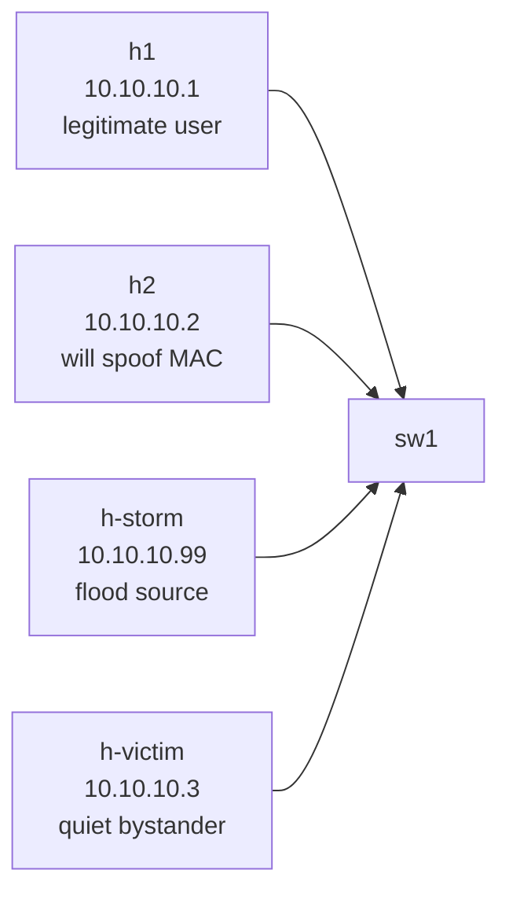

# Lab 06 — Port Security & Storm Control

> **Format:** Hands-on. Single switch, four hosts. Starter has the lab 05 STP protections baked in; your job is to add MAC-level and bandwidth-level access-port protections. Reference answer in [`solutions/`](solutions/).
>
> **Story chapter:** Phase 2 · Junior+ · Month 4. The Company hired its first part-time security consultant. They flagged two incidents: an unauthorized laptop got LAN access from a conference room jack via MAC spoofing, and a misbehaving NIC on a customer VM caused a broadcast storm that took down a segment. See [`STORY.md`](../../STORY.md).

## Real-world scenario

Two recent incidents on the access network:

1. **"NAC (Network Access Control) bypass"** — security found that an unauthorized laptop connected from a conference room jack by spoofing a registered endpoint's MAC address. The legitimate device was elsewhere, but the access port had no MAC limit, so the spoofed MAC was accepted. The user got LAN access for 4 hours before someone noticed.
2. **"The Tuesday Storm"** — a misbehaving NIC on a customer VM started sending broadcast traffic at line rate. The switch faithfully flooded it to every port in the VLAN. CPU on neighboring devices spiked, monitoring alerts fired across half the rack, and an SSH session got knocked offline mid-`reload`.

Your task: harden the access ports against both classes of failure.

## Goal

By the end you should be able to answer:

- What does **port security** actually do, and what are the trade-offs of `shutdown` vs `protect` violation modes?
- What's the difference between **static** and **dynamic** MAC learning on a secure port, and how does persistent port-security keep dynamic MACs across reboots?
- How does **storm control** measure "too much" traffic — by percent of port bandwidth or packets-per-second?
- Why do storm control thresholds need to be set per traffic type (broadcast vs multicast vs unknown unicast)?
- When should err-disabled ports auto-recover, and when should they require human attention?

## Topology



One switch, four host ports — each demonstrating one protection scenario.

## Theory primer

### Port security

Limits how many (and optionally which) MAC addresses can appear on a port.

- `switchport port-security` — turn the feature on.
- `switchport port-security mac-address maximum <n>` — allow at most n MACs. Default is 1.
- `switchport port-security violation { shutdown | protect }` (Arista — `restrict` doesn't exist; Cisco has it):
  - **shutdown** — port goes err-disabled (loud, manual recovery). Default and recommended.
  - **protect** — silently drop the violating MAC's frames. No log. Almost never the right choice.

> **Persistent secure MACs on Arista.** "Persistent port security" is **enabled globally by default** — dynamically learned secure MACs survive reboots and link flaps automatically. Check with `show port-security` → `Secure address reboot persistence: enabled`. If you want to pin a specific MAC explicitly, use `mac address-table static <mac> vlan <id> interface <name>`. (Cisco's per-port `mac-address sticky` keyword has no direct equivalent on Arista; it's a global property instead.)

Use cases:
- **Hosted hosting / customer-port scenarios** — bind a customer port to exactly one MAC so they can't multi-home or sublease the cable.
- **Office endpoint enforcement** — limit each port to N MACs (N=2 if you allow VoIP phones daisy-chained with PCs).
- **Anti-spoofing** — the first device "claims" the port and any other MAC is rejected.

### Storm control

Measures traffic rate per port, per traffic class. When the rate exceeds a threshold, the switch drops excess frames (or err-disables the port, depending on platform/config).

Traffic classes that need separate thresholds:
- **Broadcast** — destined to `ff:ff:ff:ff:ff:ff`. Floods everywhere.
- **Multicast** — group-addressed (`01:00:5e:...` for IPv4, `33:33:...` for IPv6). Often flooded unless IGMP/MLD snooping is on.
- **Unknown unicast** — destination MAC not in the MAC table → flooded just like broadcast.

Why separate thresholds? Multicast might be legitimate (IPTV, PTP, video). Broadcast at high rates is almost never legitimate. Unknown unicast suggests a learning problem (or attack).

Levels can be expressed as:
- **percent of bandwidth** (`storm-control broadcast level 1` = 1% of port speed)
- **pps (packets per second)** on platforms that support it

Start conservative: 1% broadcast is plenty for a host port. Datacenter server ports may need higher multicast (clustering software, gossip protocols).

### Err-disable recovery

When something fires (BPDU guard, port-security violation, storm control on some platforms), the port goes err-disabled. Two recovery modes:

- **Manual** — operator does `no shutdown`. Forces investigation. Good for security events.
- **Automatic** — after a cooldown timer, the port automatically `no shutdown`s. Good for transient causes (e.g. storm control), bad for security events that need RCA.

Tunable per cause:

```
errdisable recovery cause portsecurity
errdisable recovery cause bpduguard
errdisable recovery interval 300
```

A common pattern: auto-recover storm-related causes (transient), require manual recovery for security causes (port-security, BPDU guard).

## Your task

1. Enable **port security** on Et1 and Et2:
   - max 1 MAC
   - violation: shutdown
   (Persistent port-security is global-default on Arista, so dynamically learned MACs survive reboots without an extra knob.)
2. Enable **storm control** on Et3:
   - broadcast threshold: 1%
   - multicast threshold: 1%
   > **cEOS limitation:** `storm-control` is **not supported on the virtual hardware** (`storm-control not supported on this hardware platform`). The config syntax is shown for production-hardware reference (DCS-7280/7500 etc.); on cEOS you'll see the error and can't validate it live. Configure it on Et3 anyway if you want to read about the syntax, but expect rejection.
3. Configure **err-disable recovery** globally for port-security and BPDU guard violations, 5-minute interval.

## Hints

Per-port port-security:

```
interface Ethernet<n>
  switchport port-security
  switchport port-security mac-address maximum 1
  switchport port-security violation shutdown
```

Per-port storm-control:

```
interface Ethernet<n>
  storm-control broadcast level <percent>
  storm-control multicast level <percent>
```

Global err-disable recovery:

```
errdisable recovery cause portsecurity
errdisable recovery cause bpduguard
errdisable recovery interval <seconds>
```

## Deploy

```bash
cd ~/containerlab/labs/06-port-security-storm-control
sudo containerlab deploy
```

## Verification

### 1. Port security — baseline learning

Apply your port-security config to Et1. Make h1 send a ping to populate the MAC table:

```bash
docker exec clab-port-security-storm-control-h1 ping -c 1 10.10.10.3
```

On sw1:

```bash
docker exec -it clab-port-security-storm-control-sw1 Cli
```

```
show port-security
show port-security interface Ethernet1
```

You should see h1's MAC listed as a learned secure MAC.

### 2. Port security — trigger the violation

We need to inject a **second source MAC** on Et2 **without cycling the physical link** — because on cEOS, the per-port `Shutdown Mode Persistence` flag is disabled by default, meaning a link-down event clears the secure-MAC table. So `ip link set eth1 down; change MAC; up` would just learn the new MAC fresh, no violation.

The trick: create a **macvlan sub-interface** with a spoofed MAC over h2's `eth1`. The physical link stays up, but frames from the sub-interface carry a different source MAC.

```bash
docker exec clab-port-security-storm-control-h2 sh -c "
  ip link add link eth1 macv1 type macvlan
  ip link set dev macv1 address de:ad:be:ef:00:01 up
  ip addr add 10.10.10.99/24 dev macv1
  ping -c 2 -I macv1 10.10.10.3
"
```

On sw1:

```
show interfaces Ethernet2 status
show port-security
```

Expect Et2 in **errdisabled** (or `notconnect`), `Security Violation Count: 1`, and a log line `SECURITY-2-PORT_SECURITY_VIOLATION`.

> If you preferred to cycle MACs via `ip link set down / address / up`, that would **not** trigger here — by design — because the link-cycle clears the secure-MAC slot. To make that approach work you'd need to flip the per-port shutdown-mode persistence; it's not worth it for this lab.

### 3. Storm control — read-only on cEOS

> **cEOS does not support storm-control.** Configuring `storm-control broadcast/multicast level <n>` on an interface returns `storm-control not supported on this hardware platform`. `show storm-control` and `show interfaces ... counters rates` exist but won't show storm-control state because there is none. The block below shows the **production-hardware** test you'd run on a real switch (DCS-7280/7500/7800); on cEOS it's read-the-code-only.

Production-hardware test (won't work on cEOS, kept for reference):

```bash
# Flood broadcasts from h-storm using arping (broadcast ARP)
docker exec -d clab-port-security-storm-control-h-storm arping -i eth1 -U 10.10.10.99 -w 30
```

On the switch (production hardware):

```
show storm-control
show interfaces Ethernet3 counters rates
```

You'd watch the broadcast rate climb toward the 1% threshold; storm control would start dropping frames and log `STORM_CONTROL` messages. h-victim (`10.10.10.3`) would stay reachable from h1 because the storm is capped before it can saturate the segment.

On cEOS the storm itself still happens (the arping does flood), but nothing rate-limits it — so the lab can only demonstrate the *config syntax* of storm-control, not its runtime effect. To validate runtime behavior, run this lab on production hardware or skip section 3.

### 4. Err-disable recovery — manual vs auto

After Et2 was err-disabled in step 2, try `no shutdown` immediately:

```
configure terminal
  interface Ethernet2
    no shutdown
```

If err-disable auto-recovery is configured with a 300s interval, you don't even need to do this manually — the port will come back automatically after 5 minutes. But for the spoofing scenario, you probably *want* manual recovery so a human reviews the incident. Toggle behavior:

```
no errdisable recovery cause portsecurity
```

→ port-security violations are now manual-only.

```
errdisable recovery cause portsecurity
```

→ back to auto-recover after the interval.

## Peek at solution

- [`solutions/sw1.cfg`](solutions/sw1.cfg)

## Concepts cheat-sheet

- **Port security** — limit MACs per port. Arista has two violation modes: shutdown (default, port → err-disabled, recommended) and protect (silently drops violating MACs — rarely right). Persistent port-security is global-default, so dynamic learned MACs survive reboots.
- **Storm control** — rate-limit broadcast/multicast/unknown-unicast per port. Set thresholds per traffic class, not just one global limit. **cEOS limitation: not supported on the virtual platform.**
- **Err-disable** — switch's way of saying "port has misbehaved; cut it off". Recovery is either manual (`no shutdown`) or automatic (`errdisable recovery cause <x>` + `interval <s>`).
- **MAC table vs port-security MAC table** — different tables. The MAC table is the forwarding table (dynamic, ages out). Port-security MACs are a security-policy table (persistent across reboot by default on Arista).

## Operational reminders

- After the first device attaches to a secure port and is learned, save with **`copy running-config startup-config`** so the global persistence has something to persist (otherwise a wipe-and-reboot loses the learned MAC).
- **Don't set port-security maximum to "very large"** to avoid violations — that defeats the purpose. If you need a multi-MAC port (server with multiple VMs), use the real value (e.g., 8) and monitor.
- **Storm control thresholds should be reviewed quarterly** — application teams add multicast services, NICs change, the ceiling drifts.
- **Document err-disable recovery policy** — a port that auto-recovered after a security event with no record is the worst of both worlds.

## What's missing (deliberately)

- **802.1X / NAC integration** — proper port authentication; way beyond MAC pinning. Future lab.
- **MAC ACLs** (`mac access-list`) — denylist specific MACs. Niche.
- **MACsec** — link-layer encryption. Datacenter-edge topic, future lab.
- **DHCP-side anti-spoofing** — covered in lab 07 (DHCP snooping + DAI + IPSG).

## Cleanup

```bash
sudo containerlab destroy --cleanup
```
