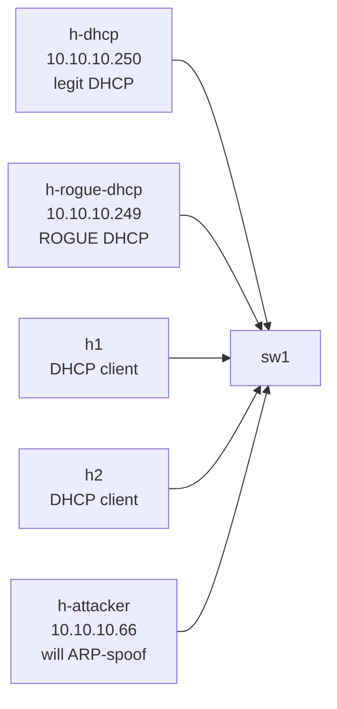

# Lab 07 — L2 Security Trifecta: DHCP Snooping + DAI + IP Source Guard

> **Format:** Hands-on. The topology has a legitimate DHCP server, a rogue DHCP server, two clients, and an attacker. Your job is to lock down the access layer so the rogue can't lease IPs, the attacker can't ARP-poison, and stolen IPs don't pass traffic. Reference answer in [`solutions/`](solutions/).

## Real-world scenario

Customer support keeps getting tickets that boil down to:

- **"DHCP gave me a weird IP and I lost internet."** The "weird IP" is from a rogue DHCP server someone plugged in — accidentally (a SOHO router with DHCP on by default) or maliciously. The real DHCP server is being raced and losing about 1 in 10 leases.
- **"Suddenly all my traffic was going to someone else's machine."** ARP spoofing — an attacker on the same VLAN sent gratuitous ARPs claiming to own the gateway IP, and every host happily updated its ARP cache. Classic man-in-the-middle.
- **"This customer is sending traffic from IPs that aren't theirs."** Someone is using their VLAN access to spoof source IPs belonging to other customers, evading per-IP filtering and rate-limits.

The defense in depth: **DHCP snooping → DAI → IP Source Guard**. They build on each other — each layer relies on the previous one's database of legitimate `(MAC, IP, port)` bindings.

## Goal

By the end you should be able to answer:

- What does **DHCP snooping** actually do, and what's a "trusted" port?
- What's the **DHCP snooping binding table**, and why is it the foundation for everything else?
- How does **Dynamic ARP Inspection (DAI)** use the binding table to validate ARPs?
- How does **IP Source Guard** use the binding table to drop spoofed source IPs?
- Why is the order — DHCP snooping first, then DAI, then IPSG — non-negotiable?

## Topology



| Host | Role | Pre-config |
|------|------|-----------|
| h-dhcp | Legitimate DHCP server | dnsmasq, range 10.10.10.100-199, default gw 10.10.10.1 |
| h-rogue-dhcp | Malicious DHCP server | dnsmasq, range 10.10.10.50-59, fake gw 10.10.10.99, fake DNS 9.9.9.9 |
| h1, h2 | DHCP clients | dhclient on boot |
| h-attacker | Static IP attacker | 10.10.10.66 |

## Theory primer

### DHCP snooping

The switch watches DHCP traffic on each access port and classifies ports as:

- **Trusted** — DHCP servers live here. Server messages (DHCPOFFER, DHCPACK) are allowed *out* of this port.
- **Untrusted** (default) — clients live here. Server messages received *on* an untrusted port are **dropped immediately**. Clients can still send DHCPDISCOVER/REQUEST.

The result: a rogue DHCP server plugged into an untrusted port can talk to itself, but its offers never reach clients. The real server's offers are the only ones clients see.

Side effect: the switch builds a **DHCP snooping binding table** — a database of `(MAC, IP, VLAN, port, lease time)` for every successful DHCP lease it witnessed. This table is the foundation for DAI and IPSG.

### Dynamic ARP Inspection (DAI)

ARP has no authentication. Anyone on a VLAN can claim to own any IP, and other hosts will update their ARP caches accordingly. This enables MITM attacks trivially.

DAI looks at every ARP packet on an untrusted port and checks: *"Does the sender's `(MAC, IP)` pair match the DHCP snooping binding table?"* 
- If yes → forward the ARP normally.
- If no → drop it, log it.

Trusted ports skip validation — same model as DHCP snooping. Uplinks and known servers are typically trusted.

Static hosts (no DHCP) need **manual entries** in the binding table (`ip source binding ...`) or DAI will drop their ARPs.

### IP Source Guard (IPSG)

DAI validates ARPs. IPSG validates **regular IP traffic**: every packet arriving on a port must have a source IP matching the binding table for that port.

When IPSG is on, the switch installs a per-port packet filter that allows only the bound `(MAC, IP)` pair. A host that tries to use a different IP gets every frame dropped at the switch.

Practical effect:
- A host gets a DHCP lease → switch installs filter "Et3 may source 10.10.10.123 with MAC aa:bb:cc:..."
- Same host tries to spoof 10.10.10.250 (the DHCP server's IP) → packets dropped.
- Static hosts need either a manual binding or no IPSG on their port.

### Why the order matters

- DHCP snooping builds the binding table.
- DAI uses the binding table to validate ARP.
- IPSG uses the binding table to validate IP source.

Enable DAI without snooping → no bindings exist → everything is dropped or everything is allowed (depending on default). Enable IPSG without snooping → static hosts must have manual bindings or they can't pass any IP traffic. Always layer them up.

## Your task

1. Enable **DHCP snooping** globally and on VLAN 10.
2. Mark **Et1** (real DHCP server) as DHCP-snooping trusted.
3. Enable **Dynamic ARP Inspection** on VLAN 10. Mark **Et1** as ARP-inspection trusted (the DHCP server is also trusted for ARPs of its own IP).
4. Enable **IP Source Guard** (`ip verify source`) on **Et3, Et4, Et5** (client ports + attacker).

Do NOT enable IPSG on Et1 (server) or Et2 (rogue) — the lab is structured so we can directly observe the rogue's behavior.

## Hints

Global + VLAN:

```
ip dhcp snooping
ip dhcp snooping vlan <id>
ip arp inspection vlan <id>
```

Per port:

```
interface Ethernet<n>
  ip dhcp snooping trust          ! on the server-facing port
  ip arp inspection trust         ! on the server-facing port
  ip verify source                ! on client ports (IPSG)
```

Verification:

```
show ip dhcp snooping
show ip dhcp snooping binding
show ip arp inspection
show ip arp inspection statistics
show ip verify source
```

## Deploy

```bash
cd ~/containerlab/labs/07-l2-security-trifecta
sudo containerlab deploy
```

Wait ~30 seconds for cEOS to converge and for dnsmasq + dhclients to do their initial exchange.

## Verification

### 1. Before hardening — observe the chaos

Check what IPs the clients ended up with:

```bash
docker exec clab-l2-security-trifecta-h1 ip addr show eth1 | grep inet
docker exec clab-l2-security-trifecta-h2 ip addr show eth1 | grep inet
```

You may see addresses from `10.10.10.100-199` (real server) or `10.10.10.50-59` (rogue), depending on who answered first. Roll the dice a few times:

```bash
docker exec clab-l2-security-trifecta-h1 sh -c "dhclient -r eth1 && dhclient -v eth1"
docker exec clab-l2-security-trifecta-h1 ip route show
```

If the route shows `default via 10.10.10.99` — the rogue won. **That's traffic going to an attacker-chosen gateway.**

### 2. Enable DHCP snooping + trust Et1

Apply the snooping config. Then release/renew on clients:

```bash
docker exec clab-l2-security-trifecta-h1 sh -c "dhclient -r eth1 && dhclient -v eth1"
docker exec clab-l2-security-trifecta-h2 sh -c "dhclient -r eth1 && dhclient -v eth1"
```

Both should now consistently get IPs from the real range (`10.10.10.100-199`). The rogue's offers are dropped at the switch.

On sw1:

```
show ip dhcp snooping binding
```

You should see entries for h1 and h2 with their leased IPs, VLAN 10, source port, and lease expiry. **This is the binding table that everything else hinges on.**

### 3. Try the rogue from another angle

The rogue is on Et2 (untrusted). Trigger a fresh lease and confirm the rogue is silenced:

```bash
docker exec clab-l2-security-trifecta-h1 sh -c "dhclient -r eth1 && dhclient -v eth1 2>&1 | grep -E 'DHCPOFFER|DHCPACK'"
```

Only offers/acks from `10.10.10.250` (real server). Rogue is invisible to clients.

### 4. Enable DAI — block ARP spoofing

The attacker tries to claim 10.10.10.1 (the gateway IP from the real DHCP server) via gratuitous ARP:

```bash
docker exec clab-l2-security-trifecta-h-attacker arping -i eth1 -U -S 10.10.10.1 10.10.10.1 -c 3
```

Without DAI: h1's and h2's ARP cache would now point 10.10.10.1 → attacker's MAC. Verify before:

```bash
docker exec clab-l2-security-trifecta-h1 ip neigh show 10.10.10.1
```

Now apply DAI config. Retry the attack — DAI should drop the spoofed ARPs at the switch:

```
show ip arp inspection statistics
```

`Drop` count rises. The attacker's gratuitous ARPs never reach the other clients.

### 5. Enable IPSG — block IP spoofing

Without IPSG, the attacker can source-spoof any IP. Demonstrate:

```bash
docker exec clab-l2-security-trifecta-h-attacker sh -c "ip addr add 10.10.10.250/32 dev eth1 && ping -c 2 -I 10.10.10.250 10.10.10.100"
```

Without IPSG: pings go out (and may be replied to — the DHCP server's IP being spoofed is a problem).

Now apply `ip verify source` on Et5. Retry:

```bash
docker exec clab-l2-security-trifecta-h-attacker ping -c 2 -I 10.10.10.250 10.10.10.100
```

Packets dropped at sw1. On the switch:

```
show ip verify source
```

You'll see the active filter binding the port to the attacker's *real* IP (10.10.10.66), and traffic from any other source IP is dropped.

## Peek at solution

- [`solutions/sw1.cfg`](solutions/sw1.cfg)

## Going deeper

- [L2 security binding table](../../docs/concepts/l2-security-binding-table.md) — the shared binding table mechanism behind all three features; IPv6 equivalents; persistence; static entries; operational gotchas.

## Concepts cheat-sheet

- **DHCP snooping** — switch filters DHCP server messages by port trust. Trusted ports = where servers live. Builds the binding table.
- **DHCP snooping binding** — `(MAC, IP, VLAN, port, lease-time)` entries. Foundation for DAI + IPSG.
- **DAI (Dynamic ARP Inspection)** — validates ARPs against the binding table; drops mismatches on untrusted ports.
- **IPSG (IP Source Guard)** — validates IP source addresses on every packet against the binding table; drops mismatches.
- **Trust model** — server-facing ports + inter-switch trunks = trusted. Host-facing access ports = untrusted.
- **Static hosts** — need manual binding entries (`ip source binding ...`) or they break under DAI/IPSG.

## Production deployment notes

- **Watch the binding table size.** Large access switches with thousands of clients have thousands of entries. Hardware has limits; check platform datasheets.
- **Lease time interactions.** DHCP snooping bindings expire with the lease. If your switch reboots and DHCP leases are still valid, clients can't reach anything until they renew (or you persist the binding table across reboots — `ip dhcp snooping database`).
- **DAI rate-limiting.** A port that legitimately ARPs a lot (e.g. a router doing thousands of ARPs/sec) can trigger DAI's per-port rate limiter and err-disable. Set a sensible threshold (`ip arp inspection limit rate <pps>`).
- **IPSG and IPv6.** IPSG covers IPv4 only. The IPv6 equivalent is **IPv6 Source Guard** + **ND inspection** + **DHCPv6 snooping**. Same pattern, different commands.
- **Trunks.** Don't enable IPSG or DAI on trunk ports; they carry traffic for many clients. Trust trunks, validate at the access edge.

## What's missing (deliberately)

- **MAC ACLs** (`mac access-list`) — niche, rarely the right tool.
- **Port-based 802.1X / NAC** — real port authentication; future lab.
- **MACsec** — link-layer encryption; future lab.
- **IPv6 equivalents** — when we add IPv6 deployment (Chapter 8).

## Cleanup

```bash
sudo containerlab destroy --cleanup
```
