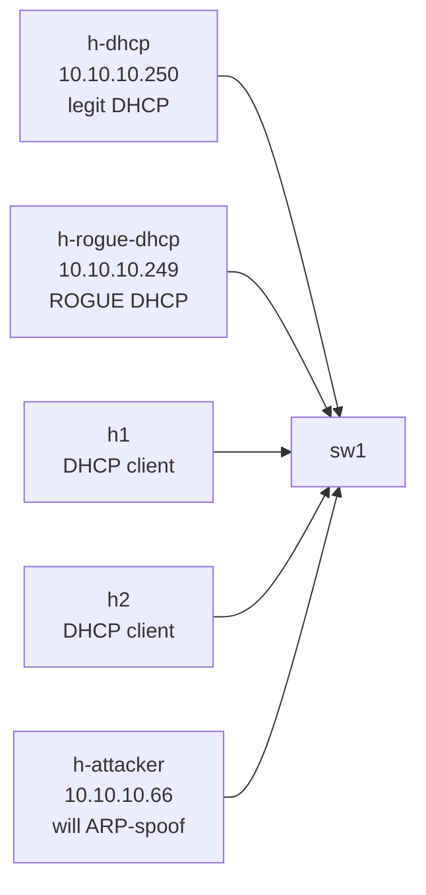

# Lab 07 — L2 Security Trifecta: DHCP Snooping + DAI + IP Source Guard

> **Format:** Hands-on configuration pattern + concept-heavy. The topology has a legitimate DHCP server, a rogue DHCP server, two clients, and an attacker. Your job is to *configure* the access-layer defenses (DHCP snooping, DAI, IP Source Guard) correctly and read their operational state. cEOS limitation: all three features are ASIC-enforced on production hardware (DCS-7050X/7280R/7500R etc.); on cEOS the syntax is accepted but the data-plane drops are partial or absent — you learn the config + the model, hardware enforces. Reference answer in [`solutions/`](solutions/).
>
> **Story chapter:** Phase 2 · Junior+ · Month 5. Customer support keeps getting tickets about "weird IPs" and "the gateway suddenly being someone else's machine." You discover a rogue DHCP server (someone plugged a home router in DHCP-server mode into a wall jack) and successful ARP spoofing attacks on the access VLAN. Time for the binding-table-based L2 defense. See [`STORY.md`](../../STORY.md).

> **Note (cEOS limitation — read first; verified live on cEOS 4.35.4M):** DHCP snooping, Dynamic ARP Inspection, and IP Source Guard are **hardware/ASIC-enforced** in EOS. cEOS is a container with **no forwarding ASIC**, and live testing shows two different failure modes: DHCP-snooping config (`ip dhcp snooping …`) **loads** but isn't enforced, while **Dynamic ARP Inspection (`ip arp inspection …`) and IP Source Guard (`ip verify source`) are rejected outright** — cEOS returns `% Unavailable command (not supported on this hardware platform)`, so you **cannot even configure them** in the container. They are hardware-only. So treat this lab as **study-the-config + read the binding-table model**, not a hands-on enforcement exercise: the snooping/binding-table portion you can configure and inspect; the DAI/IPSG portion is reference config for real hardware (DCS-7050X/7280R/7500R) where the commands exist and the drops happen. The solution keeps the full production config for that reference. Steps that only work on hardware are marked **(HW only)** below.

> **EOS vs Cisco note:** EOS DHCP snooping is **not** the Cisco-IOS trusted/untrusted rogue-blocking model. EOS snooping is "snooping with bridging / Option-82": its job is inserting Option-82 (circuit-id/remote-id) and building the binding table — there is **no `ip dhcp snooping trust` interface command** in EOS, and EOS snooping does not classify ports as trusted/untrusted to drop a rogue server's offers. Rogue-server containment on Arista access layers is done with DAI + IPSG + (on hardware) MAC/port controls, not snooping trust. We keep the snooping config because it builds the binding table that DAI and IPSG consume.

## Real-world scenario

Customer support keeps getting tickets that boil down to:

- **"DHCP gave me a weird IP and I lost internet."** The "weird IP" is from a rogue DHCP server someone plugged in — accidentally (a SOHO router with DHCP on by default) or maliciously. The real DHCP server is being raced and losing about 1 in 10 leases.
- **"Suddenly all my traffic was going to someone else's machine."** ARP spoofing — an attacker on the same VLAN sent gratuitous ARPs claiming to own the gateway IP, and every host happily updated its ARP cache. Classic man-in-the-middle.
- **"This customer is sending traffic from IPs that aren't theirs."** Someone is using their VLAN access to spoof source IPs belonging to other customers, evading per-IP filtering and rate-limits.

The defense in depth: **DHCP snooping → DAI → IP Source Guard**. They build on each other — each layer relies on the previous one's database of legitimate `(MAC, IP, port)` bindings.

## Goal

By the end you should be able to answer:

- What does **DHCP snooping** actually do on EOS (Option-82 + binding table), and how is that different from the Cisco trusted-port model?
- What's the **DHCP snooping binding table**, and why is it the foundation for everything else?
- How does **Dynamic ARP Inspection (DAI)** use the binding table to validate ARPs?
- How does **IP Source Guard** use the binding table to drop spoofed source IPs?
- Why is the order — DHCP snooping first, then DAI, then IPSG — non-negotiable?
- Which of these enforce in software vs. only in ASIC (so you know what you can and can't observe in cEOS)?

## Topology



| Host | Role | Pre-config |
|------|------|-----------|
| h-dhcp | Legitimate DHCP server | dnsmasq, range 10.10.10.100-199, default gw 10.10.10.1 |
| h-rogue-dhcp | Malicious DHCP server | dnsmasq, range 10.10.10.50-59, fake gw 10.10.10.99, fake DNS 9.9.9.9 |
| h1, h2 | DHCP clients | dhclient on boot |
| h-attacker | Static IP attacker | 10.10.10.66 |

## Theory primer

### DHCP snooping (the EOS way)

First, the difference from what you may have read elsewhere. On **Cisco IOS**, DHCP snooping classifies each port as *trusted* (servers) or *untrusted* (clients), and silently **drops server messages (DHCPOFFER/DHCPACK) arriving on untrusted ports** — that's how IOS blocks a rogue DHCP server. **EOS does not work this way.** EOS has no `ip dhcp snooping trust` interface command and does not drop a rogue server's offers based on port trust.

What EOS DHCP snooping ("snooping with bridging") actually does:

- The switch **watches** the DHCP exchange on the VLAN and inserts **Option-82** (circuit-id / remote-id) so a relay/server can tell which port a request came from.
- As a side effect it builds a **DHCP snooping binding table** — a database of `(MAC, IP, VLAN, port, lease time)` for every lease it witnessed. **This table is the whole point for us**: it's the foundation DAI and IPSG consume.
- For snooping to be *operational* on a VLAN, EOS requires (per the 4.36.0F manual): global `ip dhcp snooping`, **`ip dhcp snooping information option`** (Option-82 — "must be enabled for DHCP snooping to be functional"), `ip dhcp snooping vlan <id>`, and a DHCP relay / bridging path on the VLAN. Enable snooping without Option-82 and `show ip dhcp snooping` reports it not operational.

So how do we contain the rogue on Arista? Not with snooping trust (it doesn't exist). We rely on **DAI + IPSG** (below) plus, on hardware, port/MAC controls. In *this* lab the rogue is left reachable on purpose so you can see — honestly — that EOS snooping alone does **not** silence it, and so the binding table has something to build from.

### Dynamic ARP Inspection (DAI)

ARP has no authentication. Anyone on a VLAN can claim to own any IP, and other hosts will update their ARP caches accordingly. This enables MITM attacks trivially.

DAI looks at every ARP packet on an untrusted port and checks: *"Does the sender's `(MAC, IP)` pair match the DHCP snooping binding table?"* 
- If yes → forward the ARP normally.
- If no → drop it, log it.

Trusted ports skip validation (`ip arp inspection trust`). Uplinks and known servers are typically trusted.

**Where do the bindings come from?** DAI validates against the IP-MAC binding table, whose entries are either **dynamic** (created by DHCP snooping when it witnesses a lease) or **static** (`ip source binding <IP> <MAC> vlan <id> interface <intf>`). Two consequences you must design for:

- **Static-IP hosts (no DHCP)** — e.g. servers, the attacker host — never produce a dynamic binding, so without a static entry DAI/IPSG would drop *their* traffic too. The DHCP server here is given an `ip arp inspection trust` port so its own ARPs are never inspected; if you instead wanted to inspect it, you'd add a static `ip source binding` for it.
- **In cEOS specifically**, dynamic snooping bindings are not reliably created (no ASIC — see the cEOS-limitation note). So if you want the binding table populated for h1/h2 to *see* DAI/IPSG behaviour in `show` output, you add **static** `ip source binding` entries for them once you know the IP they leased. The solution shows the static-binding syntax; on real hardware with working snooping you would not need to.

### IP Source Guard (IPSG)

DAI validates ARPs. IPSG validates **regular IP traffic**: every packet arriving on a port must have a source IP matching the binding table for that port.

When IPSG is on, the switch installs a per-port packet filter that allows only the bound `(MAC, IP)` pair. A host that tries to use a different IP gets every frame dropped at the switch.

Practical effect:
- A host gets a DHCP lease → switch installs filter "Et3 may source 10.10.10.123 with MAC aa:bb:cc:..."
- Same host tries to spoof 10.10.10.250 (the DHCP server's IP) → packets dropped.
- Static hosts need either a manual binding or no IPSG on their port.

### Why the order matters

- DHCP snooping builds the binding table.
- DAI uses the binding table to validate ARP.
- IPSG uses the binding table to validate IP source.

Enable DAI without snooping → no bindings exist → everything is dropped or everything is allowed (depending on default). Enable IPSG without snooping → static hosts must have manual bindings or they can't pass any IP traffic. Always layer them up.

## Your task

1. Enable **DHCP snooping** globally, enable **Option-82 insertion**, and enable snooping on VLAN 10. (Remember: EOS has no `ip dhcp snooping trust` port command — don't look for one.)
2. Enable **Dynamic ARP Inspection** on VLAN 10. Mark **Et1** as **ARP-inspection trusted** (`ip arp inspection trust`) — the DHCP server is trusted for ARPs of its own IP.
3. Enable **IP Source Guard** (`ip verify source`) on **Et3, Et4, Et5** (client ports + attacker).
4. Because dynamic snooping bindings won't populate reliably in cEOS, add a **static** `ip source binding` for any host whose `(IP, MAC)` you need DAI/IPSG to recognise (at minimum the DHCP server's `10.10.10.250`; optionally h1/h2 once you read their leased IP/MAC). On real hardware with working snooping this is only needed for static-IP hosts.

Do NOT enable IPSG on Et1 (server) or Et2 (rogue) — the lab is structured so we can directly observe the rogue's (un)blocked behaviour.

> Syntax here is per the **EOS 4.36.0F** User Manual; this lab pins **cEOS 4.35.4M** (the DHCP-snooping / DAI / IPSG command set is stable across these minor versions), per the repo convention of noting versions for version-sensitive security features.

## Hints

CLI verbs and config skeletons — work out the exact ports, VLAN IDs and addresses yourself:

Global + VLAN:

```
ip dhcp snooping
ip dhcp snooping information option   ! Option-82 — required for snooping to be operational
ip dhcp snooping vlan <id>
ip arp inspection vlan <id>
```

Static IP-MAC binding (feeds DAI/IPSG when no dynamic snooping entry exists):

```
ip source binding <IP> <MAC-dotted> vlan <id> interface Ethernet<n>
! EOS order is IP first, then dotted-quad MAC, e.g.:
! ip source binding 10.10.10.250 aabb.cc00.0250 vlan 10 interface Ethernet1
```

Per port (note: there is NO `ip dhcp snooping trust` in EOS):

```
interface Ethernet<n>
  ip arp inspection trust         ! on the server-facing port
  ip verify source                ! on client ports (IPSG)
```

Verification:

```
show ip dhcp snooping
show ip source binding
show ip arp inspection
show ip arp inspection statistics
show ip verify source
```

## Deploy

```bash
cd ~/containerlab/labs/07-l2-security-trifecta
sudo containerlab deploy
```

Wait ~30 seconds for cEOS to converge and for dnsmasq + dhclients to do their initial exchange.

## Verification

### 1. Before hardening — observe the chaos

Check what IPs the clients ended up with:

```bash
docker exec clab-l2-security-trifecta-h1 ip addr show eth1 | grep inet
docker exec clab-l2-security-trifecta-h2 ip addr show eth1 | grep inet
```

You may see addresses from `10.10.10.100-199` (real server) or `10.10.10.50-59` (rogue), depending on who answered first. Roll the dice a few times:

```bash
docker exec clab-l2-security-trifecta-h1 sh -c "dhclient -r eth1 && dhclient -v eth1"
docker exec clab-l2-security-trifecta-h1 ip route show
```

If the route shows `default via 10.10.10.99` — the rogue won. **That's traffic going to an attacker-chosen gateway.**

### 2. Enable DHCP snooping (Option-82 + VLAN)

Apply the snooping config. Confirm it's *operational* on the switch (this is the part cEOS can show you):

```
show ip dhcp snooping
```

You should see snooping enabled, Option-82 (information option) enabled, and VLAN 10 in the snooping VLAN list. If Option-82 is shown disabled, snooping is **not** operational — add `ip dhcp snooping information option`.

> **(HW only)** On production hardware, snooping witnesses the lease exchange and installs **dynamic** binding entries. In **cEOS** (no ASIC) those dynamic entries are not reliably created, so the binding table may stay empty. To give DAI/IPSG something to validate against, add **static** bindings (next step). Inspect whatever bindings exist with:
>
> ```
> show ip source binding
> ```
>
> Columns: `MacAddress / IpAddress / Lease(sec) / Type / VLAN / Interface`. **This binding table is what everything else hinges on.**

> **Honest note on the rogue:** Because EOS snooping does **not** drop rogue server offers (no trusted/untrusted port model — see the EOS-vs-Cisco note up top), and because cEOS doesn't enforce anyway, the rogue on Et2 is **still able to answer**. Re-running `dhclient` on h1/h2 may still pull a `10.10.10.50-59` lease with gateway `10.10.10.99`. That is the truthful EOS/cEOS behaviour: snooping's value here is the **binding table**, not rogue suppression. On Arista, you'd contain the rogue with DAI + IPSG (below) plus port/MAC controls on hardware — not with snooping trust.

### 3. Add static bindings so DAI/IPSG have data

Read the IP/MAC the clients ended up with, then bind them (cEOS-only workaround for the missing dynamic bindings):

```bash
docker exec clab-l2-security-trifecta-h1 ip -br addr show eth1   # note IP + MAC
docker exec clab-l2-security-trifecta-h2 ip -br addr show eth1
```

On sw1, add a static binding per host (EOS order: IP, dotted-MAC, vlan, interface):

```
ip source binding <h1-ip> <h1-mac-dotted> vlan 10 interface Ethernet3
ip source binding <h2-ip> <h2-mac-dotted> vlan 10 interface Ethernet4
```

Re-check `show ip source binding` — the entries should appear with `Type` `Static`.

### 4. Enable DAI — inspect ARP spoofing

The attacker tries to claim 10.10.10.1 (the gateway IP) via gratuitous ARP. The `network-multitool` image ships **iputils arping**, which uses lowercase `-s` for the source IP (not the Habets `-S`):

```bash
docker exec clab-l2-security-trifecta-h-attacker arping -i eth1 -U -s 10.10.10.1 10.10.10.1 -c 3
```

(If your image's arping rejects `-U`/`-s`, fall back to a scapy one-liner or `arpspoof`; the exact arping variant is image-dependent.)

Without DAI, h1/h2's ARP cache would now point 10.10.10.1 → attacker's MAC. Check before/after:

```bash
docker exec clab-l2-security-trifecta-h1 ip neigh show 10.10.10.1
```

Now apply the DAI config and re-run the attack. On the switch:

```
show ip arp inspection            ! confirm DAI enabled on VLAN 10, Et1 trusted
show ip arp inspection statistics
```

> **(HW only)** On hardware, DAI traps ARPs and the per-VLAN counters **`ARP Req Dropped` / `ARP Res Dropped`** increment as the attacker's gratuitous ARPs are dropped, and they never reach h1/h2. In **cEOS** there is no ARP-trap datapath, so these counters typically stay at 0 and the spoofed ARP still propagates — the config and `show ip arp inspection` state are correct, but the *drop* is a hardware behaviour. Verify your config is right by confirming VLAN 10 shows DAI active and Et1 shows as trusted, not by watching the counter move.

### 5. Enable IPSG — inspect IP spoofing

Without IPSG, the attacker can source-spoof any IP. Demonstrate the attack:

```bash
docker exec clab-l2-security-trifecta-h-attacker sh -c "ip addr add 10.10.10.250/32 dev eth1 && ping -c 2 -I 10.10.10.250 10.10.10.100"
```

The pings go out sourced from the DHCP server's IP — exactly the spoofing IPSG is meant to stop.

Now apply `ip verify source` on Et5 and re-run the ping. On the switch:

```
show ip verify source
```

> **(HW only)** On hardware, IPSG installs a per-port filter allowing only the bound `(MAC, IP)` for Et5 (the attacker's *real* `10.10.10.66`), and frames sourced from `10.10.10.250` are dropped at the switch. `show ip verify source` only shows a binding as **active** once it's "programmed into hardware." In **cEOS** there is no such filter in the datapath, so the spoofed ping still passes and `show ip verify source` may show the binding inactive / not-in-hardware. Again: the config is correct; the drop is the ASIC's job. Confirm the intended binding is present (or marked inactive) rather than expecting the spoofed traffic to be blocked.

## Peek at solution

- [`solutions/sw1.cfg`](solutions/sw1.cfg)

## Going deeper

- [L2 security binding table](../../docs/concepts/l2-security-binding-table.md) — the shared binding table mechanism behind all three features; IPv6 equivalents; persistence; static entries; operational gotchas.

## Concepts cheat-sheet

- **DHCP snooping (EOS)** — watches the DHCP exchange, inserts Option-82, and builds the binding table. Requires `ip dhcp snooping information option` to be operational. **No `ip dhcp snooping trust` port command** — unlike Cisco IOS, EOS snooping does not drop rogue offers by port trust.
- **DHCP snooping binding** — `(MAC, IP, VLAN, port, lease-time)` entries; shown with `show ip source binding`. Foundation for DAI + IPSG.
- **DAI (Dynamic ARP Inspection)** — validates ARPs against the binding table; drops mismatches on untrusted ports (counters: `ARP Req/Res Dropped`). Trust the server port with `ip arp inspection trust`.
- **IPSG (IP Source Guard)** — `ip verify source` per port; validates IP source addresses against the binding table; drops mismatches.
- **DAI trust model** — server-facing ports + inter-switch trunks = ARP-inspection trusted. Host-facing access ports = untrusted. (This trust is DAI's, not snooping's.)
- **Static hosts / static bindings** — `ip source binding <IP> <MAC-dotted> vlan <id> interface Ethernet<n>` (IP first, then dotted-quad MAC) or they break under DAI/IPSG.
- **cEOS caveat** — all three are ASIC-enforced; cEOS accepts the config but does not drop. Verify via `show` operational state, not packet drops.

## Production deployment notes

- **Watch the binding table size.** Large access switches with thousands of clients have thousands of entries. Hardware has limits; check platform datasheets.
- **Lease time interactions.** Dynamic snooping bindings expire with the lease. If your switch reboots and DHCP leases are still valid, clients can't reach anything until they renew, since the runtime binding table is rebuilt from scratch. Plan maintenance windows accordingly, and on platforms that support it, persist/back up the binding database. (Persistence syntax differs from Cisco IOS; check the EOS reference for your platform — don't assume the IOS `ip dhcp snooping database flash:` form.)
- **DAI rate-limiting.** A port that legitimately ARPs a lot (e.g. a router doing thousands of ARPs/sec) can trigger DAI's per-port rate limiter and err-disable. Set a sensible threshold (`ip arp inspection limit rate <pps>`).
- **IPSG and IPv6.** IPSG covers IPv4 only. The IPv6 equivalent is **IPv6 Source Guard** + **ND inspection** + **DHCPv6 snooping**. Same pattern, different commands.
- **Trunks.** Don't enable IPSG or DAI on trunk ports; they carry traffic for many clients. Trust trunks, validate at the access edge.

## What's missing (deliberately)

- **MAC ACLs** (`mac access-list`) — niche, rarely the right tool.
- **Port-based 802.1X / NAC** — real port authentication; future lab.
- **MACsec** — link-layer encryption; future lab.
- **IPv6 equivalents** — when we add IPv6 deployment (Chapter 8).

## Cleanup

```bash
sudo containerlab destroy --cleanup
```
