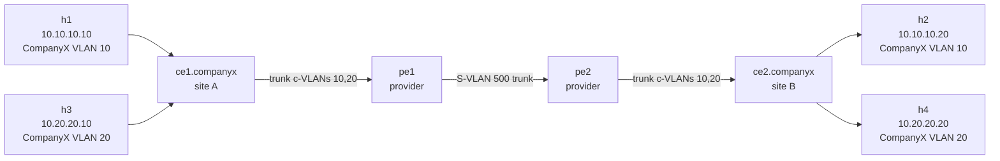

# Lab 07b — QinQ / 802.1ad Tunneling

> **Format:** Hands-on. Two provider switches and two customer switches. Customer-side VLAN structure travels across the provider transparently. Reference answer in [`solutions/`](solutions/).
>
> **Story chapter:** Phase 2 · Junior+ · Month 6. A new customer onboards: "CompanyX". They have their own internal VLAN structure (VLANs 10, 20, 30) at two of their offices and want connectivity between the offices through The Company's network — *while keeping their own VLAN IDs unchanged*. You can't reassign their VLAN IDs because VLAN 10 is already used by three other customers in your network. Solution: QinQ. See [`STORY.md`](../../STORY.md).

## Real-world scenario

CompanyX is opening a second office. They use VLANs 10/20/30 internally for user/server/management. They want their existing infrastructure to extend to the second office as if it were one network.

The naive approach: "just put their traffic on VLANs 10/20/30 in our fabric." Problems:
- You also have CustomerY using VLAN 10 for a different subnet. They'd merge.
- You'd run out of the 4094-VLAN space fast as customers multiply.
- Every customer onboarding requires VLAN renumbering on their side. They'll refuse.

**QinQ (IEEE 802.1ad / "Q-in-Q" / "dot1q tunneling")** solves it. The provider gives this customer one **service VLAN (S-VLAN)** — let's say S-VLAN 500. CompanyX's traffic enters the provider's network at a **dot1q-tunnel port** which wraps the entire CompanyX frame (with its existing 802.1Q tag) inside an outer S-VLAN 500 tag. The frame travels across the provider's backbone tagged with VLAN 500. At the egress dot1q-tunnel port (toward CompanyX's other office), the outer tag is stripped and CompanyX's original frame — with its original VLAN tag intact — is delivered.

From CompanyX's view: their VLAN 10 traffic at office A magically appears in VLAN 10 at office B. From the provider's view: just S-VLAN 500 traffic between two ports.

## Goal

By the end you should be able to answer:

- What's the difference between a **C-VLAN** (customer VLAN / inner tag) and an **S-VLAN** (service VLAN / outer tag)?
- What's a **dot1q-tunnel port**, and how is it different from an access port or a trunk port?
- What is **TPID 0x88a8** versus the default 0x8100, and when does it matter?
- Why does the provider's transit between PEs need an **MTU larger than 1500** to safely carry QinQ?
- What are the trade-offs of QinQ vs **EVPN VPWS / E-LINE** for the same use case?

## Topology



The provider's view of the world is simple — they only see/route S-VLAN 500 between pe1 and pe2. Two CompanyX switches at the customer's two sites get a "transparent L2 pipe" between them.

## Theory primer

### C-VLAN vs S-VLAN — and the frame on the wire

A frame entering ce1's access port from h1 (VLAN 10, untagged):

```
[Eth header] [payload]
```

After ce1's trunk to pe1 (CompanyX tags it as VLAN 10):

```
[Eth header] [802.1Q VLAN 10] [payload]
                ↑ this is the C-VLAN (customer's tag)
```

At pe1's dot1q-tunnel port, the existing tag is **preserved** and a NEW outer tag (S-VLAN 500) is added:

```
[Eth header] [802.1Q S-VLAN 500] [802.1Q VLAN 10] [payload]
                ↑ S-tag                ↑ C-tag (untouched)
```

This double-tagged frame travels across the provider's backbone. At pe2's dot1q-tunnel port toward ce2, the outer S-tag is stripped:

```
[Eth header] [802.1Q VLAN 10] [payload]    ← back to just C-VLAN
```

ce2 sees this frame on its trunk, knows it's VLAN 10, delivers to h2's access port (untagged). h2 receives the frame as if h1 were right next to it.

**The provider never looks at the inner tag.** The S-VLAN forwarding decision is made on the OUTER tag only. CompanyX's VLAN structure is invisible to the provider.

### dot1q-tunnel port behavior

Unlike a regular access port (which drops tagged frames) or a trunk port (which preserves all tags), a **dot1q-tunnel port**:

- **Inbound** (from customer): treats whatever the customer sends as the inner payload. Adds the configured S-VLAN tag as the outer.
- **Outbound** (toward customer): strips the outer S-VLAN tag. Whatever was inside leaves untouched.

Arista syntax (verified against EOS User Manual v4.36.0F, section 13.3.3.2.2):

```
interface Ethernet2
   switchport mode dot1q-tunnel
   switchport access vlan 500   ! ← the S-VLAN
```

### TPID — 0x8100 vs 0x88a8

The **Tag Protocol Identifier** identifies a frame as 802.1Q-tagged. Default for both customer and provider tags is `0x8100`.

IEEE 802.1ad (the proper "provider bridging" standard) specifies that the **service-VLAN tag** (outer tag) should use `0x88a8` (or `0x9100` in some legacy deployments), with the customer's inner tag remaining `0x8100`. This distinguishes "this is a provider's S-tag" from "this is a customer's C-tag".

In practice most provider deployments use `0x8100` for both (works fine for transparent transit). The `0x88a8` matters when:
- Interoperating with other providers
- Some platforms can detect/distinguish provider vs customer tags by TPID
- Compliance with IEEE 802.1ad strictly

On Arista:

```
interface Ethernet1   ! provider backbone port
   switchport dot1q ethertype 0x88a8
```

This lab uses default 0x8100 to keep it simple.

### MTU on the provider backbone

Adding an outer 802.1Q tag adds **4 bytes** to the frame. A standard 1500-byte payload frame is 1518 bytes on the wire (1500 + 14 Eth header + 4 FCS). With QinQ:

- Standard frame: 1500 + 14 + 4 (C-tag) + 4 (FCS) = 1522 bytes
- QinQ-wrapped: 1500 + 14 + 4 (C-tag) + 4 (S-tag) + 4 (FCS) = **1526 bytes**

If the provider's transit MTU is exactly 1518, your QinQ frames get fragmented or dropped. Fix: **set provider transit MTU to 1526 or higher** (1600+ is conventional). For modern jumbo-capable transit (9000+), no issue.

### QinQ vs more modern alternatives

| | QinQ | EVPN VPWS | EVPN VLAN-aware |
|---|---|---|---|
| Encapsulation | 802.1ad (two 802.1Q tags) | Pseudo-wire over MPLS or VXLAN | VXLAN with VLAN-aware bundle |
| Customer VLAN preservation | Native | Yes | Yes |
| Multipoint support | No — point-to-point only | No (E-Line) | Yes (E-LAN style) |
| Provider scale | 4094 S-VLANs ceiling | Service-ID-based, large | VNI-based, 16M |
| Operational complexity | Low | Medium-high | Medium |

For a small provider doing point-to-point connections, QinQ is a fine, low-complexity option. For larger or multipoint deployments, EVPN-based services scale better.

## Your task

1. On both **pe1** and **pe2**:
   - Make **Et2** (the customer-facing port) a **dot1q-tunnel** port with access VLAN 500 (the S-VLAN).
   - Make **Et1** (the provider backbone trunk) a regular trunk allowing VLAN 500.
2. Leave **ce1** and **ce2** alone — they're just running ordinary trunks to "their uplink". They don't know QinQ is happening.
3. Verify end-to-end:
   - h1 ↔ h2 (both in CompanyX's VLAN 10) should ping
   - h3 ↔ h4 (both in CompanyX's VLAN 20) should also ping (proves both customer VLANs traverse)
   - h1 ↔ h4 should **NOT** ping (different VLANs, different subnets, no inter-VLAN routing in CompanyX's network)

## Hints

Per the EOS Manual section 13.3.3.2.2:

```
interface Ethernet<N>
   switchport mode dot1q-tunnel
   switchport access vlan <s-vlan>
```

Verification:

```
show vlan
show interfaces <intf> switchport
```

For inspecting frames on the wire (the satisfying part):

```bash
sudo nsenter -t $(docker inspect -f '{{.State.Pid}}' clab-qinq-tunneling-pe1) -n tcpdump -i eth1 -nn -e vlan
```

The capture will show **double-tagged frames** with both the outer S-tag (500) and the inner C-tag (10 or 20).

## Deploy

```bash
cd ~/containerlab/labs/07b-qinq-tunneling
sudo containerlab deploy
```

## Verification

### 1. Before QinQ — no end-to-end

```bash
docker exec clab-qinq-tunneling-h1 ping -c 2 10.10.10.20
```

❌ Fails — pe1 doesn't know what to do with CompanyX's tagged traffic on a port that isn't configured as a tunnel.

### 2. Apply dot1q-tunnel configuration

After applying the config on pe1 and pe2:

```bash
docker exec -it clab-qinq-tunneling-pe1 Cli
show interfaces Ethernet2 switchport
```

Should show `Switchport: Enabled`, `Operational Mode: dot1q-tunnel`, `Access Mode VLAN: 500`.

```
show vlan 500
```

VLAN 500 should be active with Et1 (trunk) and Et2 (tunnel) as members.

### 3. End-to-end pings

```bash
docker exec clab-qinq-tunneling-h1 ping -c 3 10.10.10.20   # h1 → h2, VLAN 10
docker exec clab-qinq-tunneling-h3 ping -c 3 10.20.20.20   # h3 → h4, VLAN 20
```

Both ✅. CompanyX's two offices are now L2-connected on both VLANs through the provider.

### 4. Cross-VLAN should still NOT work

```bash
docker exec clab-qinq-tunneling-h1 ping -c 2 10.20.20.20
```

❌. h1 (VLAN 10) can't reach h4 (VLAN 20) because:
- Different subnets (no L3 in CompanyX's network here)
- Different VLANs — CompanyX hasn't deployed inter-VLAN routing
- QinQ doesn't bridge customer VLANs together; it only tunnels them transparently

### 5. Capture the double-tagged frame

```bash
sudo nsenter -t $(docker inspect -f '{{.State.Pid}}' clab-qinq-tunneling-pe1) -n tcpdump -i eth1 -nn -e vlan
```

Run a ping from h1 → h2 in another terminal. The capture should show:

```
... vlan 500, p 0, ethertype 802.1Q, vlan 10, p 0, ethertype IPv4, ...
```

**Two VLAN tags in one frame.** The outer 500 is what pe1↔pe2 forwarding uses. The inner 10 is CompanyX's tag, completely untouched in the transit.

### 6. Observe the strip-and-restore on the customer side

```bash
sudo nsenter -t $(docker inspect -f '{{.State.Pid}}' clab-qinq-tunneling-ce1) -n tcpdump -i eth1 -nn -e vlan
```

On the link ce1↔pe1 (the customer side), you'll see only **single-tagged** frames (VLAN 10 or 20). The S-tag is added at the dot1q-tunnel port on pe1's side.

## Peek at solution

- [`solutions/pe1.cfg`](solutions/pe1.cfg), [`solutions/pe2.cfg`](solutions/pe2.cfg), [`solutions/ce1.cfg`](solutions/ce1.cfg), [`solutions/ce2.cfg`](solutions/ce2.cfg)

## Concepts cheat-sheet

- **C-VLAN** — customer's own VLAN tag (inner)
- **S-VLAN** — service provider's VLAN tag (outer, added at the tunnel port)
- **dot1q-tunnel port** — adds the S-tag on ingress, strips on egress; preserves the inner tag transparently
- **TPID 0x88a8** — IEEE 802.1ad-compliant S-tag identifier (vs default 0x8100)
- **MTU planning** — the extra S-tag adds 4 bytes; provider transit needs ≥ 1522 bytes (or jumbo)
- **Point-to-point only** — QinQ wraps customer's frames between two tunnel ports; not a multipoint L2 service

## Production deployment notes

- **One S-VLAN per customer** is the cleanest model. Allocate ranges (e.g., 500-599 for "Enterprise customers", 1000-1999 for "Hosting customers").
- **TPID consistency** — within your network use one TPID (either 0x8100 default or 0x88a8); don't mix unless you have a reason.
- **MTU end-to-end check** — easy to forget; bites months later when a customer sends a large frame. Set provider transit MTU well above QinQ overhead.
- **STP behavior** — STP BPDUs from the customer side are typically tunneled too (the dot1q-tunnel port doesn't process them as STP); customer's STP topology stays the customer's problem.
- **L2 protocol tunneling** — sometimes you want certain L2 protocols (CDP, LLDP) tunneled too; sometimes not. Per-protocol config exists if needed.
- **Don't accidentally trunk** — a dot1q-tunnel port is NOT a trunk. Putting it in trunk mode would inspect inner tags, which defeats the encapsulation.
- **Provider should not see customer VLANs in their show output** — `show vlan` on the provider should only show S-VLANs in use, not C-VLANs. If you see C-VLAN IDs, the tunnel isn't tunneling.

## What's missing (deliberately)

- **L2 Protocol Tunneling (CDP/LLDP/STP tunneling specifically)** — vendor-specific; covered in dedicated docs if needed.
- **TPID negotiation** — automatic TPID detection at the provider edge. Niche.
- **Mixed L2/L3 customer services** — when QinQ is layered with L3 services on a customer's behalf. Operational complexity beyond the lab scope.
- **EVPN VPWS (Virtual Private Wire Service)** — the modern alternative for point-to-point customer L2 services. Could be a dedicated lab in Chapter 7+.

## Cleanup

```bash
sudo containerlab destroy --cleanup
```
