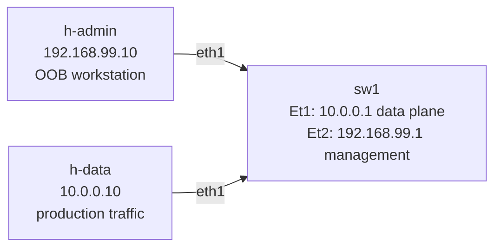

# Lab 08 — Management VRF

> **Format:** Hands-on. One switch with two interfaces — data plane and management. Starter has them sharing one VRF (the common mistake). Your job is to separate them. Reference answer in [`solutions/`](solutions/).

## Real-world scenario

It's Friday at 17:45. You SSH into a production core switch to change a static route. You make a typo — accidentally point `0.0.0.0/0` at the wrong next-hop. The switch immediately drops your SSH session because your management traffic, which had been transiting that same default route, now has nowhere to go.

You drive to the datacenter. You attach a console cable. You undo the change. It's 22:30 by the time you're home.

**The fix that would have prevented this:** management traffic and data traffic shouldn't share a routing table. A dedicated **management VRF** isolates the control path so data-plane mistakes can't lock you out.

This is one of the highest-leverage hygiene changes you can make to a production switch. Cost: a small config block. Benefit: not losing SSH every time someone fat-fingers a route.

## Goal

By the end you should be able to answer:

- What is a **VRF**, and how does it relate to the routing table?
- Why does a "management VRF" specifically matter, and what does it isolate?
- How do you make services (SSH, SNMP, syslog, NTP) listen/send in a specific VRF?
- What's the difference between an **OOB management network** and a management VRF — and why do you ideally want both?

## Topology



Single switch with two interfaces in two distinct subnets. Starter: both in default VRF.

## Theory primer

### What a VRF is

A **VRF** (Virtual Routing and Forwarding instance) is an independent routing context inside a single switch/router. Each VRF has:
- Its own routing table (RIB) and forwarding table (FIB)
- Its own ARP / neighbor cache
- Its own interfaces (an interface belongs to exactly one VRF at a time)
- Its own protocol instances (you can have OSPF or BGP per VRF)

Two VRFs on the same device cannot reach each other by default. Traffic in VRF A is invisible to anything in VRF B, even on the same box, unless you explicitly leak routes between them.

VRFs are the standard mechanism for **multi-tenancy** in DCs (one VRF per customer) and for **separation of concerns** (data vs management).

### Why a management VRF

Without VRF separation:
- A bad route in your global table can knock out your SSH session.
- Management traffic (telemetry, NTP, syslog, SNMP) competes with data traffic for routes, sometimes interfering.
- Convergence events on the data plane (BGP withdrawal, OSPF reconvergence) temporarily black-hole management traffic too.

With a dedicated **MGMT VRF**:
- The management interface and its routes live in their own world.
- Whatever happens to the global RIB doesn't touch the MGMT RIB.
- SSH, SNMP, NTP, syslog can all be pinned to the MGMT VRF — traffic always uses the dedicated path.
- Even better: pair this with a physically separate **OOB network** so failures in the data switching fabric don't reach the management path at all. (Lab 11.)

### How services know which VRF

Each service (SSH server, SNMP, NTP client, syslog client) has to be configured to bind/source in a specific VRF. On Arista EOS:

```
management ssh
   vrf MGMT
      no shutdown
```

Means: SSH listens in VRF MGMT. Optionally also in default; or *only* in MGMT.

Outbound clients (NTP, syslog, RADIUS) similarly need a VRF specified:

```
ntp server 10.99.0.1 vrf MGMT
logging vrf MGMT host 10.99.0.50
```

If you forget to specify the VRF, the service tries the default VRF and silently fails to send anywhere useful.

### Management VRF vs OOB network — the difference

- **Management VRF** is a *logical* separation inside one device.
- **OOB network** is a *physical* separation: dedicated mgmt ports, dedicated switches, dedicated wiring, sometimes a separate router and even a separate physical site path.

You ideally want both:
- OOB network gives you connectivity when the data plane is completely down.
- MGMT VRF on each device guarantees management traffic uses the OOB path consistently and doesn't get tangled in data-plane state.

This lab is the VRF half. Lab 11 is the OOB half.

## Your task

1. Create a VRF named `MGMT`.
2. Move Et2 into VRF MGMT. Re-apply the IP after the move.
3. Enable IP routing in VRF MGMT.
4. Reconfigure the SSH management daemon to also listen in VRF MGMT.
5. Test that h-admin can still SSH to 192.168.99.1.
6. **Demonstrate isolation**: break a default-VRF route or interface and confirm mgmt connectivity survives.

## Hints

```
configure terminal
  vrf instance MGMT
  ip routing vrf MGMT
  interface Ethernet2
    no switchport
    vrf MGMT
    ip address 192.168.99.1/24
  management ssh
    vrf MGMT
      no shutdown
end
write memory
```

Verify per-VRF state:

```
show vrf
show ip route vrf MGMT
show ip interface vrf MGMT brief
show management ssh
```

## Deploy

```bash
cd ~/containerlab/labs/08-management-vrf
sudo containerlab deploy
```

## Verification

### 1. Baseline — SSH works (no VRF separation yet)

From the VM:

```bash
docker exec -it clab-management-vrf-h-admin ssh admin@192.168.99.1
# password: admin
```

You should land on sw1's CLI.

### 2. Apply VRF separation

Configure VRF MGMT, move Et2, restore IP, enable SSH in MGMT. Then re-test SSH:

```bash
docker exec -it clab-management-vrf-h-admin ssh admin@192.168.99.1
```

Should still work.

### 3. Inspect

On sw1:

```
show vrf
show ip route vrf MGMT
show ip route                   ! still shows the default VRF — Et1 only
```

You'll see Et2 listed in VRF MGMT, Et1 in default. Two separate route tables.

### 4. Demonstrate isolation — break the data plane

While an SSH session from h-admin is open, shut Et1 (the data interface):

```
configure terminal
  interface Ethernet1
    shutdown
```

The SSH session **stays connected**. h-data is now unreachable; data-plane traffic is dead; mgmt is unaffected. That's the win.

Restore: `no shutdown` on Et1.

Now do the opposite (the "without VRF" disaster) to drive the point home. Move Et2 back to default VRF:

```
interface Ethernet2
  no vrf
  ip address 192.168.99.1/24
```

(SSH might reconnect.) Now add a black-hole default route in default VRF:

```
ip route 0.0.0.0/0 Null0
```

If your SSH used a route that's now overridden, you lose the session. Recovery requires console access. **This is what a management VRF prevents.**

Restore: put Et2 back in MGMT, remove the bad route.

### 5. Bonus — what about NTP, syslog, SNMP?

Look at how each is configured for a specific VRF:

```
show running-config | section ntp
show running-config | section logging
show running-config | section snmp
```

In a real deployment you'd configure all of these to source from VRF MGMT, e.g.:

```
ntp server 10.99.0.1 vrf MGMT
logging vrf MGMT host 10.99.0.50
snmp-server vrf MGMT
```

This lab doesn't configure those services (no servers in the topology), but the pattern is the same — always specify the VRF.

## Peek at solution

- [`solutions/sw1.cfg`](solutions/sw1.cfg)

## Concepts cheat-sheet

- **VRF** — independent routing context (RIB, FIB, ARP cache, interfaces, protocols). Default VRF is the unnamed one.
- **VRF assignment** — an interface belongs to exactly one VRF at a time. Changing it usually drops the IP; reapply afterward.
- **Service binding** — every service (SSH, SNMP, NTP, syslog, RADIUS, TACACS+) needs explicit VRF configuration. Defaults to default VRF.
- **Route leaking** — if VRFs need to selectively communicate, you import/export routes between them via route-targets. Not common for mgmt VRF; usually fully isolated.
- **OOB vs in-band** — OOB = dedicated physical mgmt network. In-band = mgmt rides the data plane. With a mgmt VRF you can do in-band-but-isolated; with a real OOB you add physical isolation.

## Production deployment notes

- **Apply MGMT VRF as the very first config block** when bringing up a new switch. It's painful to retrofit because you have to renumber addresses and restart services.
- **Watch service-startup ordering** — some platforms have known quirks where moving an interface to a VRF takes effect immediately but service rebinds are eventual. After a `vrf` change, verify with `show management ssh` that the listener is where you expect.
- **DHCP for mgmt-VRF interfaces** — supported on most platforms (`ip address dhcp vrf MGMT`), useful when bootstrapping from ZTP.
- **Don't dual-home the mgmt interface across VRFs** — if you need OOB reach via two paths, pick one VRF and put both interfaces in it.

## What's missing (deliberately)

- **Route leaking between VRFs** — advanced topic, rare for mgmt VRF use case.
- **AAA in VRF MGMT** — covered in lab 09 (we'll point TACACS at VRF MGMT there).
- **Logging / NTP in VRF MGMT** — covered in lab 10.
- **Physical OOB design** — lab 11.

## Cleanup

```bash
sudo containerlab destroy --cleanup
```
