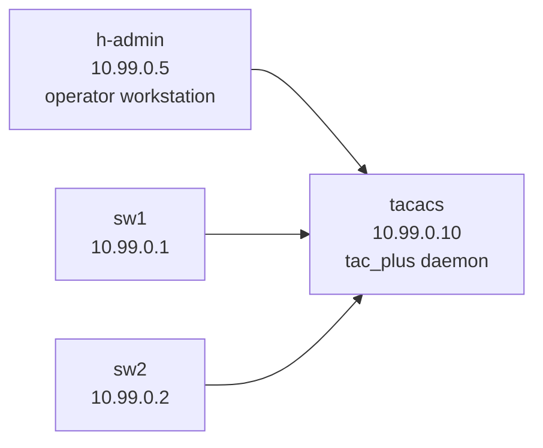

# Lab 09 — AAA with TACACS+

> **Format:** Hands-on. Two switches and a TACACS+ server. Two pre-defined users — alice (admin) and bob (read-only) — exist on the server. Your job is to wire up authentication, authorization, and accounting on the switches and verify the access controls. Reference answer in [`solutions/`](solutions/).
>
> **Story chapter:** Phase 3 · Mid-level · Month 9. The Company grew to 35 people. The on-call rotation jumped from "just you" to 12 people. Every switch still has a shared `admin` password. Someone ran `clear bgp *` at 02:14 last Tuesday and nobody can prove who. Offboarding the part-time contractor means changing passwords on dozens of devices. Time for real AAA. See [`STORY.md`](../../STORY.md).

## Real-world scenario

The on-call rotation just expanded from 3 people to 12. Today:

- Every switch has a shared local `admin` account with the same password.
- Nobody can prove who ran `clear ip bgp *` at 02:14 last Tuesday.
- Onboarding requires changing passwords on dozens of switches; offboarding requires the same.
- A junior engineer accidentally ran a config-changing command they shouldn't have touched — there's no way to restrict that.

You need **centralized AAA**:

- **Authentication** — "who are you?" Per-user logins from a central directory. Onboard/offboard in one place.
- **Authorization** — "what are you allowed to do?" Senior engineers can `configure`; NOC reads but can't change. Per-command granularity.
- **Accounting** — "what did you do?" Every command, every user, shipped to a central log for forensics and audit.

TACACS+ is the standard protocol for this in the network world. (RADIUS is the alternative, used more for VPN/wireless and 802.1X — see notes below.)

## Goal

By the end you should be able to answer:

- What are the three A's in AAA, and what does each provide?
- Why TACACS+ instead of RADIUS for network device login?
- What's the **method list** model and what does `group tacacs+ local` mean?
- Why is a **local emergency account** still required even with TACACS+?
- What does **per-command authorization** buy you versus **privilege levels**?

## Topology



The TACACS+ container acts as a "switch" too — everyone connects via its eth interfaces. In a real deployment the TACACS server sits in the OOB management network.

## Pre-configured server-side state

The TACACS+ server already has two users (see [`tacacs/tac_plus.conf`](tacacs/tac_plus.conf)):

| User | Password    | Group       | Permissions |
|------|-------------|-------------|-------------|
| alice | `AlicePass!` | netadmins | Privilege 15, all commands |
| bob   | `BobPass!`   | readonly  | Privilege 1, only `show *` and `enable` |

Shared key between switches and server: `labkey123`.

## Theory primer

### The three A's

- **Authentication (AuthN)** — verifying identity. "Are you really alice?"
- **Authorization (AuthZ)** — what alice may do. "Can alice run `clear bgp *`?"
- **Accounting (AcctG)** — what alice did. Audit trail of every command and session.

These can use different sources. Common pattern: TACACS for all three on switches, local users as fallback when TACACS is unreachable.

### Method lists

A **method list** is an ordered list of mechanisms a switch consults for an AAA decision. Example:

```
aaa authentication login default group tacacs+ local
```

Means: for login, first try TACACS+; if TACACS+ is unreachable (not "wrong password"), fall back to local accounts. If TACACS responds *deny*, the user is denied — fallback only triggers on the server being unavailable.

You can name method lists too (`aaa authentication login mynamedlist ...`) and apply them per VTY line, etc. `default` is what applies if nothing else is specified.

### TACACS+ vs RADIUS

| | TACACS+ | RADIUS |
|---|---|---|
| Encrypts | Entire payload | Only password (PAP/MS-CHAPv2 dependent) |
| Separates A/A/A | Yes — independently configurable | Auth+Authz combined into one exchange |
| Per-command authorization | Native | Requires Vendor-Specific Attributes; clunky |
| TCP/UDP | TCP/49 | UDP/1812 (auth), UDP/1813 (acct) |
| Typical use | Network device admin login | VPN, 802.1X, wireless, end-user dial-up legacy |
| Vendor | Originally Cisco (open since); broad support | IETF standard; broad support |

**For switch/router admin access: use TACACS+.** Cleaner separation, full-payload encryption, command-level authorization works out of the box.

### Privilege levels vs per-command authorization

Two ways to control what someone can do once logged in:

- **Privilege levels (0/1/15)** — coarse: read (1), full (15), or custom (2-14). Hard to maintain at scale.
- **Per-command authorization** — fine: for each command typed, switch asks TACACS "may $user run $command?" TACACS replies permit/deny. Defined in the server config, centrally managed, audit-friendly.

Per-command is the modern default and what we configure here.

### The emergency local account

Even with TACACS, **always** keep a local account with `privilege 15`. If TACACS is down (server crashed, network partition, expired cert), this is your way in. Treat the password like a Tier-1 secret — rotate it after every use, store in a secrets manager, never reuse across switches in plaintext.

A method list like `group tacacs+ local` means: TACACS first, local as fallback **only when TACACS is unreachable**. If TACACS is up and says "no", the user is denied — local is not consulted.

## Your task

On **both** sw1 and sw2:

1. Configure the TACACS+ server: host `10.99.0.10`, key `labkey123`.
2. Configure AAA method lists for login, enable, exec authorization, command authorization, and accounting — TACACS first, local fallback for the authentication/authorization parts; accounting goes only to TACACS.
3. Verify alice (netadmin) can SSH in and `configure terminal`.
4. Verify bob (readonly) can SSH in but cannot `configure terminal`.
5. Verify localadmin still works when TACACS is unreachable.

## Hints

```
tacacs-server host <ip> key 0 <shared-key>

aaa authentication login default group tacacs+ local
aaa authentication enable default group tacacs+ local
aaa authorization exec default group tacacs+ local
aaa authorization commands all default group tacacs+ local
aaa accounting commands all default start-stop group tacacs+
aaa accounting exec default start-stop group tacacs+
```

Verification commands:

```
show aaa
show tacacs
show users detail
show logging | include AAA
```

## Deploy

```bash
cd ~/containerlab/labs/09-aaa-tacacs
sudo containerlab deploy
```

Wait ~30 seconds for tac_plus to start and read its config.

## Verification

### 1. TACACS server is alive

From the VM:

```bash
docker logs clab-aaa-tacacs-tacacs
```

You should see tac_plus listening on port 49.

### 2. alice can SSH and configure (admin)

```bash
docker exec -it clab-aaa-tacacs-h-admin ssh alice@10.99.0.1
# password: AlicePass!
```

Once in:

```
enable
configure terminal
hostname sw1-test
no hostname
end
```

Should work. Now check accounting on the TACACS server:

```bash
docker exec clab-aaa-tacacs-tacacs cat /var/log/tac_plus.acct
```

You should see entries for alice running each command, with timestamps. **This is the audit trail.**

### 3. bob cannot configure (readonly)

```bash
docker exec -it clab-aaa-tacacs-h-admin ssh bob@10.99.0.1
# password: BobPass!
```

```
show running-config           ! ✅ should work
configure terminal            ! ❌ should be denied
```

The deny is per-command — bob can read everything but can't change anything.

### 4. Fallback works when TACACS is down

Shut down the TACACS server:

```bash
docker stop clab-aaa-tacacs-tacacs
```

Now try logging in as alice:

```bash
docker exec -it clab-aaa-tacacs-h-admin ssh alice@10.99.0.1
```

❌ Fails — alice exists only in TACACS, and TACACS is unreachable.

Now try the local emergency account:

```bash
docker exec -it clab-aaa-tacacs-h-admin ssh localadmin@10.99.0.1
# password: localemergency
```

✅ Works. The switch fell back to local authentication because TACACS was unreachable.

Restart TACACS:

```bash
docker start clab-aaa-tacacs-tacacs
```

### 5. Watch a live authentication flow

While someone logs in, on sw1:

```
show logging | include AAA
```

Each step (authn, authz, acct) is logged. You can correlate these with the TACACS server's log to see the full round-trip.

## Peek at solution

- [`solutions/sw1.cfg`](solutions/sw1.cfg), [`solutions/sw2.cfg`](solutions/sw2.cfg)
- TACACS server config (already in place): [`tacacs/tac_plus.conf`](tacacs/tac_plus.conf)

## Concepts cheat-sheet

- **AAA** — Authentication (who), Authorization (what may be done), Accounting (what was done).
- **TACACS+** — TCP/49, full-payload encrypted, separates AAA cleanly, native per-command authorization. The standard for network-device admin login.
- **RADIUS** — UDP, password-only encryption, AA bundled, clunky per-command. Used for VPN/wireless/802.1X, less ideal for switch admin.
- **Method list** — ordered list of sources for a given AAA decision; `default` applies unless overridden per-line. Fallback only triggers on unreachable, not deny.
- **Local emergency account** — always required. TACACS goes down → this is your way in. Treat password as Tier-1 secret.
- **Per-command authorization** — every command queried against TACACS in real time. Centrally managed permissions, no privilege-level math.

## Production deployment notes

- **Always test fallback before the outage**. Pull the network cable on the TACACS server during a maintenance window and confirm local login works. If you only find out at 3 AM, you've already lost.
- **Source TACACS traffic from a known interface/VRF** — usually the management VRF. If you have lab 08's MGMT VRF, add `tacacs-server vrf MGMT` and `tacacs-server host ... vrf MGMT`.
- **Two TACACS servers, not one.** A single TACACS box is a single point of failure for *every login on every switch in the network*. Always at least two, in different sites.
- **Rotate the shared key** periodically. Don't reuse the same key across all servers, in case one is compromised.
- **Encrypt the channel** — modern TACACS+ uses RFC 8907 with TLS support (`tacacs+` over TLS via `radsec` or native TLS). If your platform supports it, enable it.
- **Audit retention** — accounting logs must be kept long enough for compliance (often 1+ year). Ship them off the TACACS box to your SIEM.

## What's missing (deliberately)

- **TACACS+ with TLS (RFC 8907)** — newer feature; supported on modern Arista. Add when standardizing.
- **RADIUS** — same lab adaptable for it. Add if/when needed.
- **802.1X / NAC** — port-based user authentication, different problem.
- **Mgmt VRF integration** — covered conceptually here; lab 08 has the VRF setup.
- **Logging shipping to SIEM** — covered in lab 10.

## Cleanup

```bash
sudo containerlab destroy --cleanup
```
