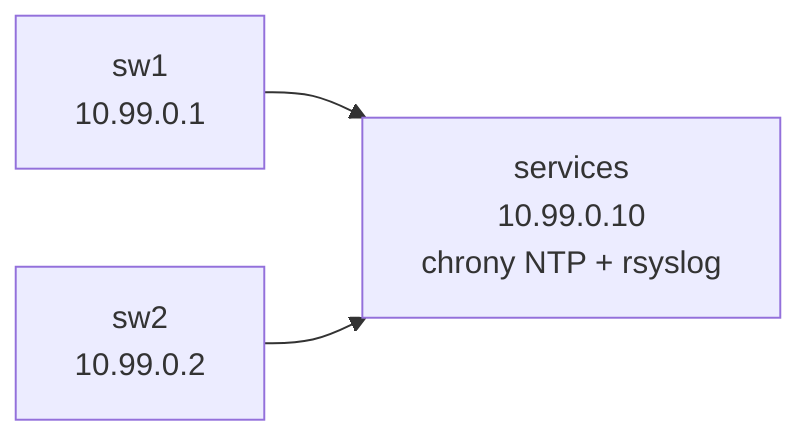

# Lab 10 — Logging, NTP, and Baseline Hardening

> **Format:** Hands-on. Two switches + a combined NTP/syslog server. Your job is to make every switch ship logs centrally, sync time, and apply a baseline hardening profile that ought to be on every device from day one. Reference answer in [`solutions/`](solutions/).

## Real-world scenario

Three issues from last quarter's post-mortems:

1. **The 03:00 outage.** Something broke. By 07:00, when the on-call engineer looked, the switch's local log buffer had rotated and the relevant lines were gone. There was no remote log. Root cause: never identified.
2. **Timestamps don't line up.** sw1 says `13:42:01`, sw2 says `13:39:48`, the firewall says `13:48:12`. Tracing a request across devices is guesswork because nobody's clock agrees. Some devices had drifted by minutes since their last reboot.
3. **The "default settings" audit finding.** Auditor flagged: no login banner, no idle timeout on SSH sessions, HTTP server enabled, default timeouts on console. None of these is a critical CVE; together they're an embarrassment.

You need a **baseline hardening profile** every switch gets the moment it's racked. NTP + remote syslog + sensible defaults — small effort, massive payoff.

## Goal

By the end you should be able to answer:

- Why is **central syslog** non-negotiable for any production network?
- What syslog **severity levels** exist, and which should you forward?
- Why does NTP matter for security and operations, not just clocks?
- What's in a **baseline hardening profile** and why does each item belong there?
- What's the difference between **`logging trap`**, **`logging buffered`**, and **`logging host`**?

## Topology



The `services` container runs both an NTP server (chrony) and a syslog collector (rsyslog). In a real deployment these would be separate boxes (or part of larger telemetry stacks).

## Theory primer

### Syslog 101

Syslog is the de-facto log protocol for network devices. Every event the device wants to record gets tagged with:

- **Facility** — what subsystem (kernel, auth, daemon, local0–local7)
- **Severity** — how important (0=emergency through 7=debug)

| Sev | Name | Forward? |
|---|---|---|
| 0 | Emergency | yes |
| 1 | Alert | yes |
| 2 | Critical | yes |
| 3 | Error | yes |
| 4 | Warning | yes |
| 5 | Notice | yes |
| 6 | Informational | usually yes |
| 7 | Debug | usually no — high volume |

Production rule of thumb: forward severity 6 (informational) and up. Skip debug unless you've enabled it for a specific troubleshooting session.

### Three log destinations

Most platforms have three independent logging "targets":

- **Console** — printed to anyone logged in via serial console. Set to severity 4 (warning) and up; otherwise console floods.
- **Buffered (in-memory)** — `show logging` ring buffer. A few thousand lines locally for quick inspection. Set to severity 6.
- **Host (remote syslog)** — shipped to one or more central servers. Set to severity 6 minimum.

A switch losing power loses its buffered log. Only the remote log survives. **If you're not shipping to a remote, you have no logs.**

### NTP — why it matters beyond clocks

- **Forensics**: when an event happens, the timestamps across all your devices must agree to within a second. Without NTP they drift apart, sometimes hours over months.
- **Certificate validity**: TLS depends on time. A clock 2 years off → all your cert validations fail.
- **Kerberos / AAA tokens**: time skew breaks ticket validation.
- **Scheduled events**: cron-like local schedulers fire at the wrong time.

Always at least two NTP sources. Inside a DC, often you have local stratum-2 servers that sync from public stratum-1 sources upstream.

### What's in a baseline hardening profile

The "bare minimum" config items every production switch should have, separate from the protocol/topology configs:

1. **Login banner** — legal notice ("authorized access only") visible *before* authentication. Required for evidence in many jurisdictions.
2. **MOTD banner** — short operational message after login (which device, which environment, "managed by team X").
3. **Idle timeout** — SSH/console sessions that go quiet for N minutes auto-disconnect. 10 minutes is a sane default. Forgotten sessions are a security hole.
4. **Authentication retry limit** — N attempts then drop the session. Slows brute-force.
5. **Disable insecure protocols** — Telnet (yes, still defaults to on on some platforms), HTTP, SNMPv1/v2c if SNMPv3 is available.
6. **TLS for management API** — if you must use HTTP, force HTTPS.
7. **NTP** — sync from known sources.
8. **Remote syslog** — ship logs centrally.
9. **AAA** — TACACS/RADIUS (lab 09).
10. **Management VRF** — separation (lab 08).

All ten go on every device at provisioning. Add to your golden config template.

## Your task

On both sw1 and sw2:

1. Configure NTP client with `10.99.0.10` as the server.
2. Configure logging:
   - Send logs to `10.99.0.10`
   - Severity 6 (informational) for buffered and trap
   - Source from the management interface (Ethernet1)
3. Apply a login banner (legal warning) and an MOTD banner.
4. Set SSH and console idle timeouts to 10 minutes.
5. Enforce SSH authentication retry limit of 3.
6. Disable HTTP management; force HTTPS only.
7. Set timezone to UTC (or your local TZ).

## Hints

```
clock timezone UTC
ntp server 10.99.0.10 prefer

logging host 10.99.0.10
logging trap informational
logging buffered 16384 informational
logging source-interface Ethernet1

banner login
^ legal text here
EOF

banner motd
^ operational text here
EOF

management ssh
   no shutdown
   idle-timeout 10
   authentication retries 3

management console
   idle-timeout 10

management api http-commands
   no shutdown
   protocol https
   no protocol http
```

Verification:

```
show ntp associations
show ntp status
show clock
show logging
show logging hosts
show users detail
```

## Deploy

```bash
cd ~/containerlab/labs/10-logging-ntp-baseline
sudo containerlab deploy
```

Wait ~60 seconds — the `services` container needs to install/start chrony and rsyslog.

## Verification

### 1. Server-side: confirm NTP and syslog are listening

```bash
docker exec clab-logging-ntp-baseline-services ss -lnp | grep -E '514|123'
```

You should see `udp 514` (syslog), `tcp 514` (syslog over TCP), `udp 123` (NTP).

### 2. NTP sync

After applying NTP config on sw1, wait ~30 seconds, then:

```bash
docker exec -it clab-logging-ntp-baseline-sw1 Cli
```

```
show ntp associations
show ntp status
show clock
```

The status should eventually show "synchronised to NTP server 10.99.0.10". `show clock` should match the host clock within seconds.

### 3. Remote syslog

Generate a log event by logging in (just SSH and `exit`):

```bash
docker exec -it clab-logging-ntp-baseline-services ssh admin@10.99.0.1
# log in, then exit
```

Then check the syslog server:

```bash
docker exec clab-logging-ntp-baseline-services tail /var/log/network.log
```

You should see log lines from sw1 showing login/logout events. **This is the audit trail that survives power-cycling the switch.**

### 4. Banner displayed

SSH to the switch and confirm the banner appears *before* the password prompt:

```bash
docker exec -it clab-logging-ntp-baseline-services ssh admin@10.99.0.1
```

The legal warning should display. After login, the MOTD appears.

### 5. Idle timeout works

SSH in, type nothing for 10 minutes. The session should drop. (Or shorten the timeout to 1 minute temporarily to verify in less time: `idle-timeout 1` under `management ssh`, then test, then revert.)

### 6. HTTP is off, HTTPS is on

```bash
curl -k -m 3 http://10.99.0.1/
curl -k -m 3 https://10.99.0.1/
```

HTTP should be refused (connection refused or rejected). HTTPS should respond with the EOS management API.

## Peek at solution

- [`solutions/sw1.cfg`](solutions/sw1.cfg), [`solutions/sw2.cfg`](solutions/sw2.cfg)

## Concepts cheat-sheet

- **Syslog severity** — 0 (emergency) through 7 (debug). Production: forward sev 6 and up, skip debug.
- **Logging destinations**: console (4+), buffered/local (6+), host/remote (6+). Remote is the only one that survives a reboot.
- **`logging source-interface`** — ensures every log packet leaves from a known, stable source IP — important for source-based ACLs at the syslog server.
- **NTP** — at least two sources; sync within seconds across all devices; time matters for security, TLS, AAA, and operations.
- **Baseline hardening profile** — banners, idle timeout, disable insecure services, AAA, NTP, remote logging, mgmt VRF. Apply on every device at provisioning, not later.

## Production deployment notes

- **Two syslog servers, two NTP servers.** Single points of failure don't belong in your visibility pipeline.
- **Centralized syslog goes to a SIEM**, not just a log file. Splunk, ELK/OpenSearch, Loki, Wazuh — pick one. Cold storage for old logs is fine; hot search of the last 30 days isn't optional.
- **Don't log debug to remote** — high volume, low signal, costs you in SIEM ingestion fees.
- **Source-interface choice** — pick a stable loopback or the management interface; never an interface that might flap.
- **Rate-limit logs** at the switch (`logging rate-limit`) to prevent a busy port from drowning your collector during a storm.
- **Test ageing-out scenarios** — what happens when the syslog server is unreachable? The switch buffers locally; if buffers fill, oldest lines are lost. Tune buffer sizes.
- **Time** — if you have GPS in your facility, use it as a stratum-1 source. Otherwise sync to a known-good public pool (`pool.ntp.org`, NIST, your country's metrology institute).

## What's missing (deliberately)

- **Streaming telemetry (gNMI / OpenConfig)** — modern alternative for high-volume operational data. Covered in lab 38.
- **AAA-driven access control** — lab 09.
- **Mgmt VRF for these services** — see lab 08 for the VRF pattern; in real configs you'd add `vrf MGMT` to `ntp server`, `logging host`, etc.
- **Log retention policy** — organizational, not a switch config.

## Cleanup

```bash
sudo containerlab destroy --cleanup
```
