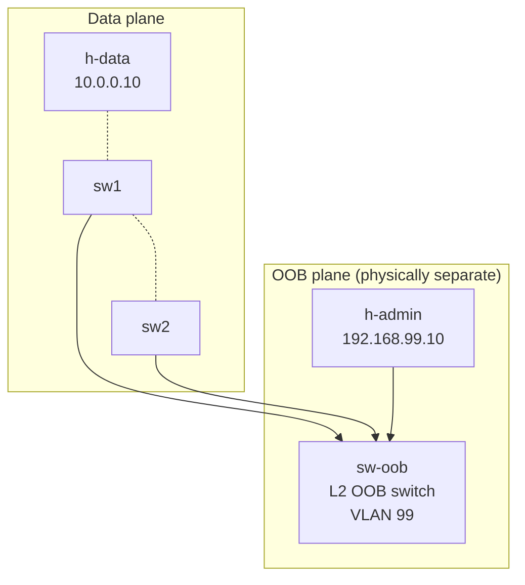

# Lab 11 — Out-of-Band Management Network

> **Format:** Hands-on. Three switches (two production, one OOB) plus admin and data-plane hosts. Combines lab 08's mgmt VRF with a *physically separate* mgmt network. Reference answer in [`solutions/`](solutions/).

## Real-world scenario

Last quarter's worst outage timeline:

- **14:02** — Routing protocol bug bites. sw1 stops forwarding correctly between two VLANs.
- **14:03** — Monitoring fires alerts.
- **14:05** — On-call engineer attempts SSH to sw1. **No response.** Their management traffic was crossing sw1's data path.
- **14:06** — They try sw2. Also unreachable — for the same reason.
- **14:11** — Engineer drives to the DC. (They're 25 minutes away.)
- **14:38** — Engineer arrives, plugs into console, fixes the issue.
- **14:41** — Service restored. **~40 minutes of downtime** the team was helpless to fix remotely.

**The fix:** a dedicated OOB management network. A separate set of switches and cables, completely independent of the production data plane. When the data plane melts, the OOB plane keeps working — and the engineer can SSH in from their living room.

This lab builds the OOB design and combines it with the mgmt VRF from lab 08, giving you two layers of separation (logical + physical).

## Goal

By the end you should be able to answer:

- What's an **OOB (out-of-band) management network**, and how is it physically different from in-band management?
- Why isn't a management VRF alone enough?
- What devices live on an OOB network in real deployments?
- How should the OOB network reach the outside world (for admin access from off-site)?
- What's the **dual-supervisor / dual-control-plane** consideration when designing OOB?

## Topology



| Path | Purpose |
|------|---------|
| sw1 ↔ h-data, sw1 ↔ sw2 | Production data traffic. May fail. |
| sw1 Et3 → sw-oob, sw2 Et3 → sw-oob, h-admin → sw-oob | OOB management. Independent of data plane. |

In a real deployment, `sw-oob` would be a small dedicated mgmt switch (often a cheap 1GbE box, sometimes a console server with its own LAN ports) connected to its own router with its own internet/VPN uplink. Admins reach it from outside via a separate VPN.

## Theory primer

### In-band vs OOB

- **In-band management** — mgmt traffic shares the same physical infrastructure as data. SSH to sw1 by reaching it via its data-plane IP, through whatever switches forward data. Simple, cheap, common.
- **Out-of-band management** — separate physical network exclusively for mgmt. Dedicated ports on every device, dedicated switches connecting them, dedicated uplink for admin access.

Trade-off: OOB costs extra hardware and complexity, but it survives outages of the very network you're trying to manage. **For anything beyond a tiny shop, OOB is mandatory.**

### What lives on an OOB network

- The dedicated mgmt port (`Management0` or a specific Ethernet) of every switch/router
- Console server / terminal server — provides serial-over-IP to every device's console port (the *real* last-resort)
- Out-of-band IPMI / iLO / iDRAC of every server (for hardware-level access when the OS is down)
- PDU management interfaces (power-cycle a stuck device)
- Environmental sensors (temperature, humidity, leak detection)
- Cameras, door sensors (physical security)
- Sometimes a dedicated jumphost in the OOB network

### How OOB reaches the outside world

You can't manage your DC remotely if the OOB is "just an island". Common patterns:

- **OOB VPN concentrator** — separate VPN gateway, separate router, separate ISP if budget allows. Engineers VPN into the OOB realm specifically.
- **Cellular uplink** — LTE/5G modem on the OOB router. Doesn't depend on the production ISP. Used by hyperscalers and ISPs.
- **Console server with dial-in / cellular** — old-school but bulletproof. Modern variants have IP+cellular.

The key property: the OOB's outside-world path must **not depend on the production network**.

### MGMT VRF + OOB = two layers of defense

| Failure | Mgmt VRF only | OOB only | Both |
|---|---|---|---|
| Bad route in default VRF | Survives | Survives | Survives |
| Production switch crash | Lost | Survives (if mgmt port doesn't depend on the crashed device) | Survives |
| Both production *and* mgmt fabric crash | Lost | Lost | Lost (need console server fallback) |

Mgmt VRF gives you logical isolation cheaply on every device. OOB gives you physical isolation expensively at the network level. Together: defense in depth.

### Dual-supervisor / dual-control-plane consideration

Big chassis switches and routers have two supervisors / route processors for HA. Each typically has its own management port. **Wire both** to the OOB network, on separate cables to separate OOB switches if possible — otherwise an OOB switch failure costs you mgmt on both sides.

## Your task

Lab 08 set up VRF MGMT on a single switch. Now apply it to a multi-device design:

1. On both sw1 and sw2:
   - Create VRF `MGMT`.
   - Move **Ethernet3** (the OOB port to sw-oob) into VRF MGMT.
   - Re-add the IP (192.168.99.1/24 on sw1, 192.168.99.2/24 on sw2).
   - Configure SSH to also listen in VRF MGMT.
2. Leave Et1 and Et2 (data plane) alone — they stay in the default VRF and route data traffic.
3. Verify h-admin can SSH to both 192.168.99.1 and 192.168.99.2.
4. Break the data plane (`shutdown` Et1 or Et2) and confirm OOB still works.

sw-oob is just a dumb L2 switch in VLAN 99 — its config is already complete in the starter.

## Hints

Same pattern as lab 08, applied to two switches:

```
vrf instance MGMT
ip routing vrf MGMT

interface Ethernet3
   no switchport
   vrf MGMT
   ip address 192.168.99.<n>/24

management ssh
   no shutdown
   vrf MGMT
      no shutdown
```

Verification:

```
show vrf
show ip interface vrf MGMT brief
show ip route vrf MGMT
show management ssh
```

## Deploy

```bash
cd ~/containerlab/labs/11-oob-management
sudo containerlab deploy
```

## Verification

### 1. h-admin reaches both switches via OOB

After applying VRF config:

```bash
docker exec -it clab-oob-management-h-admin ping -c 2 192.168.99.1
docker exec -it clab-oob-management-h-admin ping -c 2 192.168.99.2
```

Both ✅.

```bash
docker exec -it clab-oob-management-h-admin ssh admin@192.168.99.1
# password: admin
```

You're on sw1.

### 2. Data plane still works

From sw1, ping sw2's data-plane IP:

```bash
docker exec -it clab-oob-management-sw1 Cli
```

```
ping 10.1.1.2
```

✅. The OOB separation didn't touch data.

### 3. The big demo — data plane is dead, OOB lives on

While an SSH session from h-admin to sw1 is open, kill the data trunk between sw1 and sw2:

```
configure terminal
  interface Ethernet2
    shutdown
```

Or kill the data-plane host:

```
interface Ethernet1
  shutdown
```

SSH session stays alive. Sw1's data plane is dead; mgmt is fine. From a separate terminal you can still SSH to sw1 and sw2 via OOB and fix things.

Restore: `no shutdown` on the data interfaces.

### 4. The other big demo — kill sw1's data-plane IP

Even more aggressive: completely take away sw1's default-VRF connectivity. From sw1:

```
configure terminal
  interface Ethernet1
    no ip address
  interface Ethernet2
    no ip address
```

SSH session from h-admin survives. The OOB path doesn't care about default-VRF state.

Restore the IPs.

### 5. Trace the path

From h-admin, traceroute to sw1's OOB IP:

```bash
docker exec -it clab-oob-management-h-admin traceroute 192.168.99.1
```

The hop is sw-oob (probably invisible because L2 only — just one hop directly to sw1). The path never touches sw1's data interfaces.

### 6. What would happen with no OOB

To appreciate the value, imagine the topology without sw-oob and without dedicated OOB ports. h-admin would have to reach sw1/sw2 via the production data path. When the data path breaks, you lose access. **That's the 40-minute outage from the scenario.**

## Peek at solution

- [`solutions/sw1.cfg`](solutions/sw1.cfg), [`solutions/sw2.cfg`](solutions/sw2.cfg), [`solutions/sw-oob.cfg`](solutions/sw-oob.cfg) (unchanged from starter)

## Concepts cheat-sheet

- **In-band mgmt** — shares data plane. Simple, fragile.
- **OOB mgmt** — dedicated network for management. Survives data-plane failures.
- **OOB ingredients** — dedicated mgmt ports, dedicated mgmt switches, console servers, IPMI/iLO/iDRAC LAN, dedicated VPN/cellular uplink.
- **Console servers** — last-resort access via the serial console of every device. When even mgmt LAN is dead, console is your way in. Don't skip this.
- **Mgmt VRF + OOB** — orthogonal protections. Mgmt VRF is logical isolation per device; OOB is physical isolation across devices. Use both.
- **OOB uplink** — must not depend on production. Cellular, separate ISP, separate physical path.

## Production design notes

- **Cost vs reach.** A small DC can get away with a single OOB switch and a console server. Big DCs have OOB hierarchies (per-rack OOB switch → per-row OOB aggregator → DC OOB core → DC OOB uplink).
- **Dual-home OOB ports** when devices have multiple supervisors or LACP-capable mgmt — but the OOB switches must support it.
- **Document every OOB cable.** It's the network you rely on when nothing else works — it must be perfect at the physical layer.
- **OOB management of the OOB switches.** Don't laugh — if sw-oob dies, what now? Answer: console server. Don't skip the console server.
- **Time and remote logging from OOB** — your NTP and syslog servers should be reachable via OOB (lab 10 services would live in the OOB realm in real deployments).
- **Security** — OOB is high-value. Restrict who can reach it; treat the OOB jump host like a Tier-0 asset.

## What's missing (deliberately)

- **Console servers** — not labbable easily with containerlab; mention only.
- **OOB routing** — in real deployments OOB has its own router with its own routing protocols (often a small OSPF or just static). We use one L2 segment here for simplicity.
- **IPMI / iLO / iDRAC** — server-side concern, not switch.
- **Cellular / VPN uplink** — design topic, not lab.

## Cleanup

```bash
sudo containerlab destroy --cleanup
```
