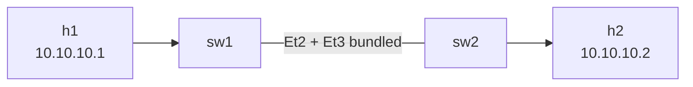

# Lab 12 — LACP Port-Channel

> **Format:** Hands-on. Two switches with two parallel uplinks. Starter has both links as independent trunks (and STP blocks one). Your job: bundle them into a Port-Channel via LACP so both forward. Reference answer in [`solutions/`](solutions/).
>
> **Story chapter:** Phase 4 · Mid-level · Year 1. The Company won a contract that requires a second DC. Suddenly you have inter-switch uplinks hitting 80% utilization, and the "spare cable for redundancy" is sitting idle because STP blocked it. Buying 10G is expensive; bundling the two 1G links is free. See [`STORY.md`](../../STORY.md).

## Real-world scenario

The access-to-distribution uplink between sw1 and sw2 is at 80% utilization. Buying a single 10G port upgrade is expensive and means downtime. You have a second 1G cable already in place "for redundancy" — but STP is blocking it, so it's not actually carrying any traffic. You're paying for it with nothing to show.

The fix: **LACP Port-Channel** (also called LAG, Etherchannel, bond). Bundle both physical links into one logical link. Both forward simultaneously, doubling effective bandwidth. STP sees only the logical link, so blocking is no longer an issue. Bonus: if either member fails, traffic continues on the survivor with no manual intervention.

## Goal

By the end you should be able to answer:

- What's a **Port-Channel**, and what's the difference between **static** bundling and **LACP**?
- What does LACP's **active vs passive** mode mean?
- How is traffic distributed across the member links — is it round-robin?
- What happens to traffic during a single-member failure?
- Why does STP see a Port-Channel as one link instead of N?

## Topology



Two switches, two parallel uplinks (Ethernet2 + Ethernet3), to become Port-Channel1.

## Theory primer

### Why bundle

- **Bandwidth aggregation** — N members ≈ N× usable bandwidth (with caveats — see hashing below).
- **Redundancy without STP convergence** — losing one member means the others keep forwarding immediately; no spanning-tree reconvergence event.
- **Logical single link** — STP, MAC learning, and routing treat the bundle as one interface. Less state, less complexity.

### Static vs LACP

- **Static (mode on)** — both ends just declare "these N ports are a bundle". No negotiation. Fragile: if one side believes Et2+Et3 are bundled but the other doesn't, you'll loop or black-hole traffic.
- **LACP (mode active/passive)** — IEEE 802.3ad standard. Members exchange LACPDUs every second to negotiate the bundle. Mismatched configs → bundle doesn't form, members come up as individual ports (STP then blocks the extras safely).

**Always use LACP.** Static bundling is a footgun.

### LACP active vs passive

- **Active** — sends LACPDUs unilaterally. Initiates negotiation.
- **Passive** — only responds to LACPDUs. Doesn't initiate.

For a bundle to form: at least one side must be `active`. Two passive → silence → no bundle. Common practice: both sides active. We do that here.

### Hash-based load distribution (not round-robin)

When a frame enters the Port-Channel, the switch hashes some fields of the frame and picks **one** member to send it on. Subsequent frames in the same flow take the **same** member — because the hash inputs are the same.

Why hash and not round-robin: round-robin would deliver frames out of order at L4, breaking TCP. Hashing keeps each flow on a single path so order is preserved.

Hash inputs vary by platform and EOS version (typical Arista hash inputs: src/dst MAC + src/dst IP + L4 ports for IP traffic). The exact default field set differs across hardware platforms, and cEOS software forwarding need not match any hardware profile. You can tune `port-channel load-balance` to add fields.

**Consequence**: one big flow uses *one* member's bandwidth, not the whole bundle. A 1G + 1G bundle does NOT give 2G for a single TCP stream. It gives 2G for many parallel flows balanced across members. If you have few elephant flows, LACP doesn't help much — you need real 2G/10G/etc. ports.

### What STP sees

The Port-Channel appears as one interface. STP runs on the logical port, not the physical members. If you have one Po1 between two switches and no other path, there's no loop and no blocked state. If you have two Po's between the same pair of switches (rare but possible), STP blocks one.

## Your task

On both sw1 and sw2:

1. Create `Port-Channel1` as a trunk with VLAN 10 allowed.
2. Move the trunk config off Et2 and Et3 — they become "L2-default" plus a `channel-group 1 mode active` line that puts them into the bundle.
3. Verify both members are bundled and the Po is "up".
4. Test traffic across the bundle.
5. Shut one member, verify the other carries on.

## Hints

```
interface Port-Channel<n>
  description ...
  switchport mode trunk
  switchport trunk allowed vlan ...

interface Ethernet<m>
  channel-group <n> mode active
```

When you put a port into a channel-group, **its switchport config is inherited from the Port-Channel.** Don't try to configure switchport on the physical members — it'll fight the bundle.

Verification:

```
show port-channel summary
show port-channel detail
show lacp neighbor
show lacp counters
show interfaces Port-Channel1
```

## Deploy

```bash
cd ~/containerlab/labs/12-lacp
sudo containerlab deploy
```

## Verification

### 1. Before bundling — observe STP blocking the redundant link

```bash
docker exec -it clab-lacp-sw1 Cli
show spanning-tree
```

One of Et2 or Et3 will be `Altn` (alternate/blocked). You have two links and only one carries traffic — wasteful.

### 2. After bundling — both members active

Apply the LACP config. Then:

```
show port-channel summary
```

Output shows `Po1` with both Et2 and Et3 as members, both in "P" (bundled) state.

```
show lacp neighbor
```

Lists sw2 as the neighbor on both members. If you see "no neighbor" — your sw2 side isn't configured yet.

```
show spanning-tree
```

Now STP sees only `Po1`. No blocked ports. **Both physical links are now forwarding traffic.**

### 3. Connectivity test

```bash
docker exec clab-lacp-h1 ping -c 3 10.10.10.2
```

✅. Traffic crosses the bundle.

### 4. Failover demo

Start a sustained ping:

```bash
docker exec clab-lacp-h1 ping 10.10.10.2
```

In another terminal, kill one member:

```bash
docker exec -it clab-lacp-sw1 Cli
configure terminal
  interface Ethernet2
    shutdown
```

The ping should lose at most one packet (often zero) before recovering — the bundle redistributes traffic to the survivor. Compare with STP convergence (lab 04) — that took seconds; LACP failover is sub-second.

Restore:

```
no shutdown
```

### 5. Observe hashing

> ⚠️ **cEOS limitation:** This step is **illustrative of the concept, not a hard verification.** cEOS is a containerized control plane with no forwarding ASIC, so per-member egress hashing and per-interface data-plane counters do not reliably reflect how real hardware would distribute flows. With only a handful of short flows you may see all of them land on one member, or no per-member spread at all. The theory primer above is correct regardless of what the counters show here — don't be alarmed if the distribution looks lopsided or inconclusive. On real hardware with many concurrent flows you would see the load spread across members.

LACP picks a member per-flow. The hash inputs include the L4 source port, so opening several TCP connections (each from a fresh ephemeral source port) is what would exercise different members.

Start a single iperf3 server on h2:

```bash
docker exec -d clab-lacp-h2 iperf3 -s
```

Then run several short back-to-back flows from h1. iperf3 opens a distinct ephemeral source port for each run, which is what varies the hash:

```bash
docker exec clab-lacp-h1 sh -c 'for i in $(seq 1 5); do iperf3 -c 10.10.10.2 -t 1 2>/dev/null; done'
```

Then on sw1, look at the per-member state:

```
show port-channel detail | begin "Member ports"
show interfaces Ethernet2 counters
show interfaces Ethernet3 counters
```

(`show interfaces Port-Channel1 counters` reports the **aggregate** across the bundle, so to see distribution you have to read the **member** interface counters individually.)

On hardware, different flows would ride different members and you'd see both members' counters climb. In cEOS, as noted above, the distribution is often not observable — that's expected.

## Peek at solution

- [`solutions/sw1.cfg`](solutions/sw1.cfg), [`solutions/sw2.cfg`](solutions/sw2.cfg)

## Concepts cheat-sheet

- **Port-Channel / LAG / Etherchannel / bond** — synonyms across vendors for "logical bundled link".
- **LACP (802.3ad)** — standard negotiation protocol for bundling. Always use it, never static.
- **active/passive modes** — at least one side must be active. Both active is the common default.
- **Hash-based forwarding** — per-flow, not per-frame. Single big flow uses one member's bandwidth.
- **Port-Channel inherits switchport config** — configure switchport mode/VLAN on `Port-Channel<n>`, not on member ports.
- **STP sees one logical link** — no blocking when you only have one bundle between two switches.

## Production deployment notes

- **Always LACP**, never `channel-group mode on` (static).
- **Both sides must agree on mode, VLAN config, speed, MTU.** A mismatch → bundle doesn't form. Use `show port-channel summary` to verify "P" state.
- **`port-channel min-links`** — declare the bundle "down" if fewer than N members are up. Useful when a half-degraded bundle would overrun a partner with traffic it can't handle.
- **Member ports should be identical** — same speed, same duplex, same media. Don't mix 1G and 10G.
- **Don't mix LACP and static** — pure LACP everywhere.
- **Hash algorithm tuning** — default is fine for most. If you have hash polarization (many flows landing on one member), add L4 ports or tune `port-channel load-balance`.
- **Po numbers** are local — sw1's Po1 doesn't need to match sw2's Po number. Conventionally we match them anyway for sanity.

## What's missing (deliberately)

- **MLAG** — LACP across *two* switches making them look like one. Lab 14.
- **Multi-chassis LAG vs MLAG terminology** — vendor-specific names for the same idea.
- **Bond modes on Linux** (mode=4 / 802.3ad) — same protocol on the host side; covered when we wire up servers.
- **Min-links and hash algorithms** in depth — production tuning, mentioned above.

## Cleanup

```bash
sudo containerlab destroy --cleanup
```
