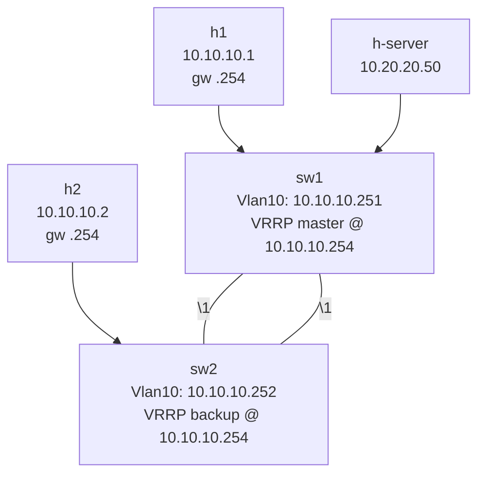

# Lab 13 — VRRP (Gateway Redundancy)

> **Format:** Hands-on. Two L3 switches sharing a virtual gateway IP via VRRP. Reference answer in [`solutions/`](solutions/).
>
> **Story chapter:** Phase 4 · Mid-level · Year 1. The Company is now in two physical sites and selling "high availability" to customers. When sw1 reloaded for a planned maintenance window last month, every host lost its gateway for 8 minutes. The founders want a status page that doesn't show outages during routine work. See [`STORY.md`](../../STORY.md).

## Real-world scenario

Currently sw1 is the sole gateway for the USERS VLAN. When sw1 reloaded last month for a maintenance window, every host in VLAN 10 lost its default route for the entire 8 minutes — even though sw2 was sitting right there doing nothing.

The fix: **VRRP** (Virtual Router Redundancy Protocol). sw1 and sw2 share a single **virtual IP** (e.g., 10.10.10.254). The hosts use the virtual IP as their gateway. At any moment, exactly one switch is "master" and responds to that IP — the other is "backup", silent but watching. If the master disappears, the backup takes over within seconds, the virtual IP stays the same, and hosts don't even know anything happened.

## Goal

By the end you should be able to answer:

- What's a **VRRP virtual IP** and how do hosts use it?
- How is the **master** elected, and what does **priority** do?
- What's **preempt**, and why is it usually on?
- What's the difference between **VRRP, HSRP, and GLBP**?
- What's the limitation of VRRP that motivates anycast gateway / MLAG-based designs (lab 15)?

## Topology



Two L3 switches with VRRP between them on VLAN 10. h-server represents a backend the users need to reach via the gateway — failover is "boring" if hosts can only ping the gateway itself; demonstrating reachability *through* the gateway is the real test.

## Theory primer

### How VRRP works

Two or more routers form a VRRP group. Each advertises its presence every second (default). They share:
- A **virtual router ID (VRID)** — `1` here; arbitrary, must match on both ends.
- A **virtual IP** — `10.10.10.254` here; hosts use this as gateway.
- A **virtual MAC** — `00:00:5e:00:01:<VRID>` (RFC 5798 format). The master responds to ARP for the virtual IP with this MAC.

At any time, the router with the highest **priority** is master. If priorities tie, highest IP wins. Default priority is 100; the **IP address owner** (a router whose actual interface IP equals the virtual IP) has implicit priority 255 (unbeatable) — but we don't typically use this mode in production, instead giving the virtual IP its own dedicated address.

### Failover sequence

- Master sends VRRP advertisement frames every 1s (default).
- Backups listen.
- If a backup doesn't hear from master for 3× advert interval (~3s by default), it assumes mastership.
- The new master sends a **gratuitous ARP** with the virtual MAC, so upstream switches update their MAC tables and start forwarding the virtual MAC's frames to the new master's port.

Total failover: ~3 seconds with default timers, sub-second with tuned timers (advertisement-interval 100ms).

### Preempt

If sw1 (priority 110) goes down and sw2 (priority 100) takes over, what happens when sw1 comes back?

- **Preempt on (default)** — sw1's higher priority retakes mastership immediately.
- **Preempt off** — sw2 stays master until *it* fails, even though sw1 is back.

Why preempt on: predictable mastership. Why preempt off (rarely): avoid a second blip when a flapping router comes back; but flapping should be fixed, not worked around with this.

### Track interfaces / objects

Real-world tip: VRRP priority can be **decremented when a critical interface goes down**. Example: sw1's uplink to the internet goes down. Hosts now reach the gateway via sw1 successfully, but the upstream path is broken — packets vanish into a black hole. If you `track` the uplink and lower sw1's priority by 20 when it's down, sw2 (priority 100) becomes greater than sw1 (110-20=90), takes over, and the new path works.

Always track the dependencies that make a gateway *actually useful*, not just the gateway interface itself.

### VRRP vs HSRP vs GLBP

| | VRRP | HSRP | GLBP |
|---|---|---|---|
| Vendor | RFC 5798, all vendors | Cisco | Cisco |
| Multi-active forwarders | No (one master) | No | Yes (multiple gateways share load) |
| Standard | IETF | Cisco proprietary | Cisco proprietary |

VRRP is the open standard. Cisco shops historically use HSRP; multi-vendor shops use VRRP. The functional difference is small. GLBP is interesting but Cisco-only and superseded by anycast gateway / EVPN.

### The active-standby limitation

In VRRP, **only one router forwards** for the virtual IP at any time. sw2 sits idle waiting. You're paying for hardware that doesn't carry traffic — half your routing capacity is on standby.

The modern alternative: **anycast gateway** (lab 15) — both routers carry the same gateway IP simultaneously, and each host's traffic exits via whichever router it's closer to. Active/active, both used. But anycast gateway typically requires MLAG (lab 14) or EVPN.

VRRP is still everywhere in production because it's simple and reliable. But understand its limitation — that's why labs 14 and 15 exist.

## Your task

Both switches already have SVIs for VLAN 10 and VLAN 20 with their own real IPs. Configure VRRP for the VLAN 10 gateway:

1. On sw1, under `interface Vlan10`:
   - VRRP group 10, virtual IP `10.10.10.254`
   - Priority 110
   - Preempt enabled
2. On sw2, under `interface Vlan10`:
   - VRRP group 10, virtual IP `10.10.10.254`
   - Priority 100
   - Preempt enabled
3. Verify h1 and h2 (which use 10.10.10.254 as gateway) can reach 10.20.20.50.
4. Reload or shut down sw1's VRRP-tracked interfaces; confirm sw2 takes over and traffic continues.

## Hints

Arista VRRP under an SVI:

```
interface Vlan<id>
  ip address <local-ip>/<prefix>
  vrrp <vrid> ip <virtual-ip>
  vrrp <vrid> priority-level <n>
  vrrp <vrid> preempt
  vrrp <vrid> description <text>
```

Verification:

```
show vrrp
show vrrp detail
show vrrp brief
```

## Deploy

```bash
cd ~/containerlab/labs/13-vrrp
sudo containerlab deploy
```

## Verification

### 1. Confirm hosts have the right default route

```bash
docker exec clab-vrrp-h1 ip route
docker exec clab-vrrp-h2 ip route
```

Both should show `default via 10.10.10.254`.

### 2. Before VRRP — connectivity fails

```bash
docker exec clab-vrrp-h1 ping -c 2 10.10.10.254
```

❌ Fails — 10.10.10.254 doesn't exist yet (only .251 and .252 do).

### 3. Configure VRRP, re-test

After applying VRRP on both switches:

```bash
docker exec clab-vrrp-h1 ping -c 3 10.10.10.254
docker exec clab-vrrp-h1 ping -c 3 10.20.20.50
docker exec clab-vrrp-h2 ping -c 3 10.20.20.50
```

All ✅.

### 4. Inspect VRRP state

```bash
docker exec -it clab-vrrp-sw1 Cli
```

```
show vrrp
```

sw1 should be **Master** for VRID 10. Then on sw2:

```bash
docker exec -it clab-vrrp-sw2 Cli
```

```
show vrrp
```

sw2 should be **Backup**.

### 5. Failover demo

Start a sustained ping from h1:

```bash
docker exec clab-vrrp-h1 ping 10.20.20.50
```

In another terminal, kill sw1's VRRP-relevant interface — shut down Vlan10:

```bash
docker exec -it clab-vrrp-sw1 Cli
configure terminal
  interface Vlan10
    shutdown
```

The ping pauses for ~3 seconds (default VRRP advert timeout), then resumes via sw2.

```bash
docker exec -it clab-vrrp-sw2 Cli
```

```
show vrrp
```

sw2 is now Master.

Restore sw1:

```
configure terminal
  interface Vlan10
    no shutdown
```

With preempt on, sw1 takes mastership back. Ping pauses briefly again.

### 6. Trace the virtual MAC

While sw1 is master, ARP for the gateway on h1:

```bash
docker exec clab-vrrp-h1 sh -c "ip neigh flush all && arping -c 1 -I eth1 10.10.10.254 && ip neigh show 10.10.10.254"
```

The MAC should be `00:00:5e:00:01:0a` (`0a` = VRID 10 in hex). After failover, the same MAC stays — because **the virtual MAC moves with the virtual IP**. That's why hosts don't need to ARP again after failover.

## Peek at solution

- [`solutions/sw1.cfg`](solutions/sw1.cfg), [`solutions/sw2.cfg`](solutions/sw2.cfg)

## Going deeper

- [First-hop redundancy comparison](../../docs/concepts/first-hop-redundancy-comparison.md) — VRRP vs HSRP vs GLBP vs VARP vs EVPN anycast gateway; lineage, when to pick which, operational gotchas.

## Concepts cheat-sheet

- **VRRP** — RFC 5798. Master/backup routers share a virtual IP + virtual MAC for gateway redundancy.
- **VRID** — identifies the VRRP group. Determines the virtual MAC (`00:00:5e:00:01:VRID`).
- **Priority** — highest wins. Default 100. Adjust to deterministically pick master.
- **Preempt** — higher priority retakes mastership on return. Usually on.
- **Tracking** — decrement priority when a critical interface fails; lets backup take over if master's upstream is broken.
- **Advert interval** — default 1s; reduce (with `advertisement interval centiseconds 10` = 100ms) for sub-second failover.
- **Active/standby only** — one master at a time. Backup sits idle. Half the capacity wasted in steady state.

## Production deployment notes

- **Two routers minimum, three is robust** — VRRP supports many backups, but two covers most needs.
- **Match VRID with VLAN ID** as a convention (VRID 10 for VLAN 10) — makes troubleshooting obvious.
- **Use tracking aggressively** — track uplinks, track upstream reachability via IP SLA, track BGP session state. The gateway is only useful if the *path beyond it* works.
- **Don't share VRIDs across multiple SVIs** unintentionally — VRID is locally significant per VLAN, but consistent naming matters for sanity.
- **Authentication** — VRRP supports plaintext password authentication. Not strong, but stops accidental misconfiguration in adjacent VLANs.
- **Symmetric L3 design** — VRRP master changes path direction. Ensure return traffic via sw2 also works (e.g., upstream router sees both sw1 and sw2 as valid next hops). A common bug: sw1 master, return traffic prefers sw2's path → asymmetric routing → stateful firewalls drop the return.

## What's missing (deliberately)

- **VRRPv3** — newer, supports IPv6. Same conceptually; add when doing IPv6 deployment.
- **Tracking with IP SLA** — covered in routing labs.
- **HSRP and GLBP** — Cisco-specific; this is multivendor.
- **Anycast gateway** — lab 15, the modern active/active alternative.
- **MLAG-based dual-active** — lab 14.

## Cleanup

```bash
sudo containerlab destroy --cleanup
```
