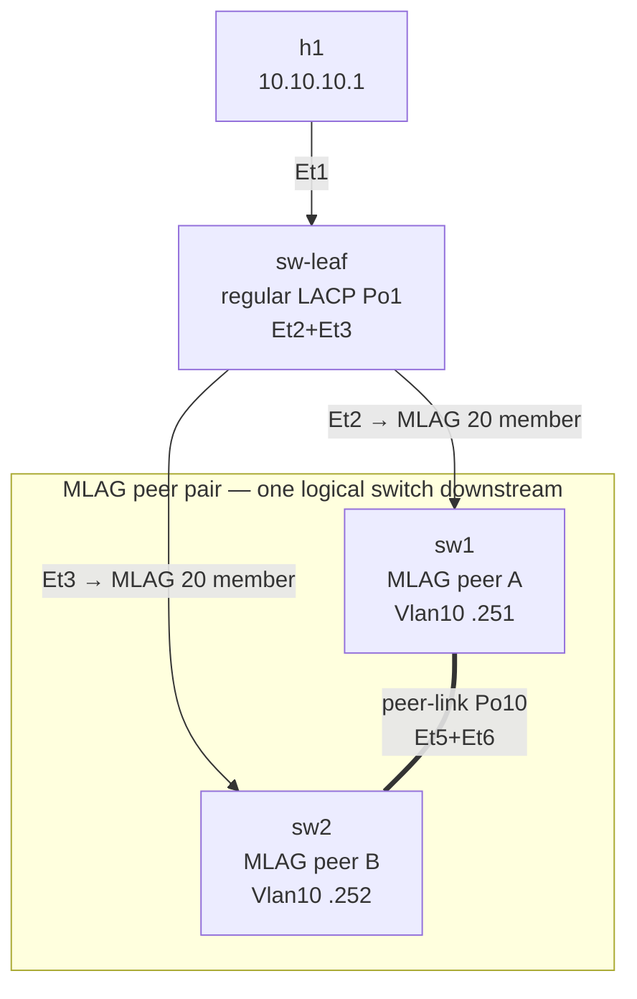

# Lab 14 — MLAG (Multi-chassis LAG)

> **Format:** Hands-on. Three switches: an MLAG peer pair (sw1, sw2) and a downstream access switch (sw-leaf). The two peers cooperate to look like one LACP partner to sw-leaf. Reference answer in [`solutions/`](solutions/).
>
> **Story chapter:** Phase 4 · Mid-level · Year 1. VRRP solved the gateway-IP-SPOF (lab 13), but the switch *itself* is still a SPOF. If sw1 dies catastrophically (PSU failure, software bug), the LACP bundle on the downstream side dies with it. The Company's biggest customer just asked: "what happens if a whole switch fails?" You need MLAG. See [`STORY.md`](../../STORY.md).

## Real-world scenario

Lab 12 (LACP) got you bundled uplinks — both cables forwarding. But the *switch* is still a single point of failure. If sw1 dies, the bundle dies, even if sw2 is right there.

Solution: **MLAG (Multi-chassis Link Aggregation)**. Two switches form a synchronized pair (the "MLAG peer pair"). To downstream devices they appear as **one logical switch**. The downstream device runs ordinary LACP and bundles its uplinks — but those uplinks terminate on two different physical switches. If either MLAG peer dies, the survivor keeps forwarding. No switch SPOF, full bandwidth (both members active), and no STP blocking.

This is the canonical pre-EVPN datacenter L2 design: every access switch dual-homes to a pair of MLAG distribution switches. It survives single-link AND single-switch failures.

## Goal

By the end you should be able to answer:

- What's an **MLAG peer-link** and what crosses it?
- What's an **MLAG peer-keepalive** and why is it separate from the peer-link?
- What's **split-brain** and what prevents it?
- What's an **orphan port** and what gotchas does it have?
- How is MLAG different from a stack (logical single chassis)?

## Topology



The two `Et2`/`Et3` links from sw-leaf are members of the **same logical bundle** — Po20 / `mlag 20` — even though they land on two different physical switches. That shared bundle is the dashed grouping (the `subgraph`), *not* a separate cable between sw1 and sw2. The only physical link directly between the peers is the peer-link (Po10).

| Cable group | Purpose |
|---|---|
| sw1 Et5+Et6 ↔ sw2 Et5+Et6 | **MLAG peer-link** (Port-Channel10) — carries all VLAN traffic between peers, including MLAG control |
| sw1 Et1 ↔ sw-leaf Et2 | **MLAG member** of Port-Channel20 (mlag 20) |
| sw2 Et1 ↔ sw-leaf Et3 | **MLAG member** of Port-Channel20 (mlag 20) — same MLAG ID, different physical switch |
| sw-leaf Et2+Et3 | Bundled into sw-leaf's Port-Channel1 (regular LACP, no MLAG awareness) |

## Theory primer

### Peer-link

The high-bandwidth backbone between MLAG peers. **Carries everything**:
- All data VLANs that traverse the MLAG (so traffic that lands on the "wrong" peer can be redirected to the right one)
- MLAG control protocol traffic
- LACP synchronization data so both peers respond to the downstream as one entity

Sized big — typically 2× the bandwidth of any single downstream link, sometimes more. Always at least 2 physical cables (you'll see why under "orphan ports" and "split-brain").

### Peer-keepalive

A separate liveness mechanism. While the peer-link carries data and MLAG control, peer-keepalive is a tiny lightweight check ("are you alive?"). If the peer-link fails and the keepalive *still* responds, the peers know "the data link is down but you're still up — don't both become master". If both fail simultaneously, that's split-brain (see below).

On Arista cEOS, peer-keepalive runs over the MLAG control VLAN (VLAN 4094 by convention) and an SVI bound to it. In some platforms it's a separate physical interface.

### Split-brain

Worst MLAG failure mode: peer-link **and** keepalive both fail. Each peer thinks the other is dead and tries to forward independently. Two switches claim the same MLAG bundle to the downstream → MAC table flapping → traffic black-holes.

Mitigations:
- **Redundant peer-link** (multiple cables, multiple line cards if possible) — what we do here (Po10 has 2 members).
- **Out-of-band keepalive path** — keepalive doesn't ride the peer-link's failure domain.
- **dual-active detection** — some platforms have a "if I lose peer-link, but peer-keepalive shows peer is up, I shut down all my MLAG ports to be safe".

### Orphan ports

An **orphan port** is a port on an MLAG peer that's NOT part of an MLAG bundle — typically a single-homed device attached to only one peer. Examples:
- A legacy server with one NIC plugged into only sw1.
- A switch that doesn't support LACP and is uplinked to only sw1.

Orphan port traffic: when the peer-link is up, it can be reached from either peer via the peer-link. When the peer-link is down, only the peer it's physically connected to can reach it. There's no redundancy.

Best practice: **eliminate orphan ports**. Dual-home everything. If you must have an orphan, document it.

### MLAG vs stacking

| | MLAG | Stack |
|---|---|---|
| Control planes | Two separate (independent boxes) | One (active + standby supervisor) |
| Software upgrades | One peer at a time, no impact | Single image; complex upgrade |
| Failure domain | Per-box | Stack-wide (some bugs take all stack members down) |
| Architecture | Independent + cooperating | Logical single device |
| Vendor lock-in | Standard concept, vendor protocols | Proprietary |

Modern DC designs use MLAG, not stacking, because independent control planes survive software bugs that would crash a stack.

### How LACP "sees" both peers as one

When sw1 and sw2 form an MLAG, they synchronize their **LACP system-ID** so downstream switches see *one* LACP partner. The LACP frames from sw1 Et1 and sw2 Et1 both carry the same system-ID + same per-port info, so sw-leaf's LACP state machine bonds them into one logical bundle (Po1 on sw-leaf side).

This is the magic. No special config on sw-leaf — it thinks it's plugged into one big switch.

## Your task

1. On **sw1 and sw2**: build the MLAG peer-link (Port-Channel10 with Et5+Et6, carrying the MLAG control VLAN 4094 via trunk group).
2. On **sw1 and sw2**: create VLAN 4094 + SVI Vlan4094 with IPs (sw1: .1, sw2: .2 in 192.168.255.0/30).
3. On **sw1 and sw2**: configure the `mlag configuration` block with the domain-id, peer-address, peer-link.
4. On **sw1 and sw2**: wrap Et1 into Port-Channel20 with `mlag 20` (note: both peers use the same mlag ID for the same bundle).
5. On **sw-leaf**: bundle Et2+Et3 into Port-Channel1 (regular LACP — no MLAG awareness needed).
6. On **sw1 and sw2**: add a plain SVI `interface Vlan10` so h1 has a real L3 target to ping across the MLAG (sw1: `10.10.10.251/24`, sw2: `10.10.10.252/24`). These are *different* IPs on purpose — making both peers active L3 with one shared virtual IP is VARP, which is lab 15. Here we just need a reachable address that survives sw1 dying, so we point the failover test at sw2's `.252`.
7. Verify the MLAG bundle is up, both peers active, and the downstream sees one LACP partner.
8. Failover test: from h1, run a sustained ping to sw2's SVI (`10.10.10.252`), then kill sw1 (member port, then whole switch) and confirm the ping recovers via sw2.

## Hints

MLAG control VLAN setup:

```
vlan 4094
   name mlag-peer
   trunk group mlagpeer

no spanning-tree vlan-id 4094

interface Vlan4094
   no autostate
   ip address 192.168.255.<n>/30
```

Peer-link:

```
interface Port-Channel10
   switchport mode trunk
   switchport trunk group mlagpeer

interface Ethernet5
   channel-group 10 mode active
interface Ethernet6
   channel-group 10 mode active
```

MLAG configuration block:

```
mlag configuration
   domain-id <name>
   local-interface Vlan4094
   peer-address <peer-svi-ip>
   peer-link Port-Channel10
```

Downstream MLAG bundle:

```
interface Port-Channel20
   switchport mode trunk
   switchport trunk allowed vlan 10
   mlag 20

interface Ethernet1
   channel-group 20 mode active
```

Data-VLAN SVI (a reachable target for h1 — plain per-peer SVI, different IPs, no VARP):

```
interface Vlan10
   ip address 10.10.10.<251|252>/24
```

Verification:

```
show mlag
show mlag detail
show mlag interfaces
show port-channel summary
```

## Deploy

```bash
cd ~/containerlab/labs/14-mlag
sudo containerlab deploy
```

Wait ~60 seconds — MLAG negotiation takes longer than regular LACP.

## Verification

### 1. MLAG peer status

```bash
docker exec -it clab-mlag-sw1 Cli
show mlag
```

You should see:
```
MLAG Configuration:
domain-id           :   mlag-pair
local-interface     :   Vlan4094
peer-address        :   192.168.255.2
peer-link           :   Port-Channel10
peer-config         :   consistent

MLAG Status:
state               :   active
negotiation status  :   connected
peer-link status    :   up
local-int status    :   up
system-id           :   xx:xx:xx:xx:xx:xx
dual-primary detection : Disabled
```

Both peers report `state: active`, `peer-link status: up`. If `peer-config: inconsistent`, something differs between sw1 and sw2 (mismatched VLAN allowed-lists are a common cause).

### 2. MLAG bundle visible to downstream as one LACP partner

```bash
docker exec -it clab-mlag-sw-leaf Cli
show port-channel summary
show lacp neighbor
```

sw-leaf sees Po1 up with Et2 + Et3 as members. **`show lacp neighbor` shows a single system-ID** for both members — that's the MLAG illusion working.

### 3. End-to-end traffic

h1 (`10.10.10.1`) lives behind sw-leaf. Its traffic into VLAN 10 goes up sw-leaf's Po1, hashes onto either Et2 (→sw1) or Et3 (→sw2), and crosses the MLAG. Ping both peers' SVIs to prove the data path through each side of the bundle:

```bash
docker exec clab-mlag-h1 ping -c 3 10.10.10.251   # sw1's SVI
docker exec clab-mlag-h1 ping -c 3 10.10.10.252   # sw2's SVI
```

Both should reply — h1 reaches each peer across the MLAG, regardless of which member sw-leaf hashed onto.

Add a quick peer-link reachability test:

```bash
docker exec clab-mlag-sw1 Cli -c "ping 192.168.255.2"
```

Should reply through the peer-link (control VLAN 4094 SVI).

### 4. Switch failover

Start a sustained ping from h1 to **sw2's** SVI — sw2 stays up throughout this test, so the target stays reachable, and the only variable is whether the MLAG re-paths h1's traffic when sw1 drops:

```bash
docker exec clab-mlag-h1 ping 10.10.10.252
```

In another terminal, kill sw1's MLAG member port:

```bash
docker exec -it clab-mlag-sw1 Cli
configure terminal
  interface Ethernet1
    shutdown
```

The ping should pause for <1s and recover via sw2. On sw-leaf:

```
show port-channel summary
```

Po1 still up — sw-leaf doesn't care that the underlying MLAG lost a member.

Restore: `no shutdown` on sw1 Et1.

### 5. Full-switch failover

The big test: with the `ping 10.10.10.252` from step 4 still running, kill sw1 entirely.

```bash
sudo docker stop clab-mlag-sw1
```

sw-leaf's Po1 loses one member but stays up. The ping to sw2's `.252` keeps replying — traffic continues via sw2. Restart:

```bash
sudo docker start clab-mlag-sw1
```

Wait ~60s for MLAG to renegotiate. Should return to dual-active.

### 6. Peer-link failure (and why it causes split-brain here)

While both peers up, kill one peer-link member:

```bash
docker exec -it clab-mlag-sw1 Cli
configure terminal
  interface Ethernet5
    shutdown
```

Peer-link still up (Po10 has Et6 left). MLAG continues normally — this is why the peer-link has multiple members.

Kill both:

```
interface Ethernet6
  shutdown
```

Now the peer-link is down. **Here's the catch in this lab's topology:** the peer-keepalive runs over the VLAN 4094 SVI, and VLAN 4094 only rides the peer-link (Po10). So when you kill both peer-link members, you kill the keepalive *at the same time* — there is no surviving liveness path. This is exactly the **split-brain** failure mode from the Theory primer.

What actually happens (and what you'll see in `show mlag`):

```
show mlag
show mlag interfaces detail
```

- `peer-link status : down`
- `state : disabled` (MLAG is torn down — there's no peer to coordinate with)

With MLAG disabled and **no** independent keepalive, each peer reverts to its **independent** state and keeps forwarding its own MLAG-bundle ports on its own. Both switches now drive the downstream bundle independently with no synchronization — sw-leaf hears two un-coordinated partners on Po1, MAC entries flap between Et2 and Et3, and traffic black-holes. That is the live split-brain the design is supposed to avoid, **not** an automatic protective shutdown.

> The protective behavior — one peer (the secondary) shutting its MLAG ports to stay out of the way — only happens when the **keepalive survives** the peer-link loss (e.g. a dedicated out-of-band keepalive interface). The secondary can then tell "peer is still alive, just the data link died" and safely stand down. This lab has no such path, which is the whole point: it shows *why* you want one.

This is the lab's real lesson: a keepalive that shares fate with the peer-link gives you no protection against split-brain. In production you'd run the peer-keepalive over a **separate** physical path (dedicated management/keepalive link) so losing the peer-link doesn't also blind the keepalive. Tuning that — plus dual-primary detection, which arms the secondary to shut its ports automatically — is a production topic beyond this lab.

Restore: `no shutdown` on Et5 and Et6, then give MLAG a few seconds to renegotiate (`show mlag` returns to `state : active`).

## Peek at solution

- [`solutions/sw1.cfg`](solutions/sw1.cfg), [`solutions/sw2.cfg`](solutions/sw2.cfg), [`solutions/sw-leaf.cfg`](solutions/sw-leaf.cfg)

## Concepts cheat-sheet

- **MLAG** — two switches presenting a synchronized LACP system-ID so downstream devices bundle to "one" logical partner.
- **Peer-link** — high-bandwidth inter-peer link. Carries all VLANs + MLAG control. Multi-cable, sized big.
- **Peer-keepalive** — separate liveness check. Should ideally not share fate with the peer-link.
- **mlag <id>** — declares a Port-Channel as MLAG-paired. Same ID on both peers = same logical downstream bundle.
- **Orphan port** — single-homed port on an MLAG peer. Loses redundancy when peer-link fails. Avoid.
- **Split-brain** — both peer-link and keepalive fail. Both peers think they're sole master. Mitigations: redundant peer-link, OOB keepalive, dual-active detection.

## Production deployment notes

- **Peer-link sizing**: at least 2× the largest single downstream link's bandwidth. Big DCs use 4× 100G between MLAG peers.
- **Two cards minimum** — split peer-link across two line cards on chassis switches, so a card failure doesn't drop the whole peer-link.
- **MLAG version compatibility** — both peers should run the same EOS version. Mixed-version MLAG can cause subtle bugs; upgrade together.
- **VLAN allowed-list consistency** — peer-link must allow every VLAN that traverses any MLAG bundle, otherwise `peer-config inconsistent` and traffic drops.
- **No shared L3 gateway on MLAG peers without VARP** — see lab 15. The plain per-peer SVIs we added here (`.251`/`.252`) are fine as *distinct* reachable addresses, but if you tried to give hosts a single default gateway by putting the *same* IP on both, you'd get active/standby behaviour (one peer wins ARP), which wastes the second peer's L3 capacity. VARP fixes that by making both peers active L3 behind one shared virtual IP.
- **MLAG with EVPN** — modern DC fabric uses EVPN multi-homing instead of MLAG. MLAG is the pre-EVPN standard and still very common; EVPN is the future. Labs 30-33 cover that.
- **Connecting servers to MLAG**: use bonding mode 4 (802.3ad / LACP) on the server side. Servers with mode 1 (active-backup) work too but waste a NIC.

## What's missing (deliberately)

- **VARP (Anycast Gateway)** — lab 15 builds on this topology.
- **EVPN multi-homing** — modern alternative; lab 30+.
- **Dual-active detection / fast-failover tuning** — production tuning topic.
- **MLAG with L3 services (HSRP/VRRP/anycast gateway)** — partially in lab 15.

## Cleanup

```bash
sudo containerlab destroy --cleanup
```
