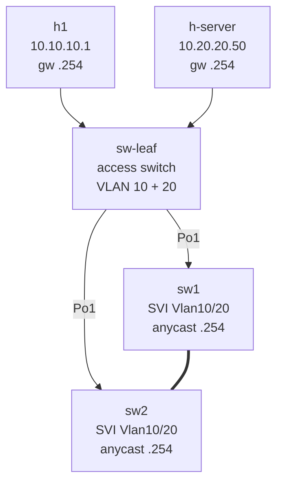

# Lab 15 — Anycast Gateway (VARP on MLAG)

> **Format:** Hands-on. Same MLAG topology as lab 14, now with L3 services and Arista's VARP (Virtual ARP) to make both peers active gateways for the same virtual IP. Reference answer in [`solutions/`](solutions/).

## Real-world scenario

Lab 14's MLAG fixed L2 redundancy — both switches forward simultaneously, no SPOF. But the moment you add SVIs for inter-VLAN routing, you're back to VRRP-style active/standby for L3:

- sw1 has `Vlan10` with IP `10.10.10.251`
- sw2 has `Vlan10` with IP `10.10.10.252`
- Hosts use one of them as gateway → that peer carries all L3 traffic, the other does nothing at L3
- VRRP could share an IP but still — only one peer is active at a time

You bought two switches; you want both routing.

The fix: **anycast gateway** (Arista calls it **VARP** — Virtual ARP). Both MLAG peers respond to ARP for the **same** virtual IP with the **same** virtual MAC. Hosts ARP once, learn the virtual MAC, and from then on every frame sent to the gateway gets delivered to *whichever peer is closer*. Both peers route simultaneously. No master, no standby — both active, all the time.

This is the modern DC default for inter-VLAN routing inside an MLAG fabric.

## Goal

By the end you should be able to answer:

- What's the difference between **anycast gateway (VARP)** and **VRRP**?
- Why does anycast gateway require a **shared virtual MAC**?
- Why is anycast gateway only safe inside an **MLAG pair** (or EVPN fabric)?
- What does "shortest path to the gateway" mean here, and how does the switch decide?
- How is anycast gateway in EVPN (chapter 5+) different from VARP?

## Topology

Same as lab 14 + a second host in VLAN 20, both VLAN 10 and VLAN 20 with anycast gateways on the MLAG pair.



## Theory primer

### The "anycast" idea

In an anycast deployment, the same IP exists on multiple devices. Whoever you reach is *whoever's closest*. The network's routing/switching layer delivers your packet to the nearest instance.

For gateways: every host's L2 frames to the virtual MAC are delivered to whichever MLAG peer is closer (i.e., the one its MAC learning happened to populate first via the LACP hash). Both peers happily route the traffic. Return traffic comes back via the same or the other peer — doesn't matter, both work.

### Why a shared virtual MAC

If sw1 and sw2 both respond to ARP for `10.10.10.254` with their **own** MACs, hosts would get different answers depending on who replied first, and ARP cache thrashing breaks everything.

Solution: both peers use the **same virtual MAC** for the virtual IP. Hosts always learn one MAC for the gateway. Frames sent to that MAC are forwarded by the MLAG fabric to either peer — both are configured to accept it, and both can route the resulting L3 packet.

On Arista: `ip virtual-router mac-address aa:bb:cc:00:00:01` (must be identical on both peers).

### Why only inside MLAG (or EVPN)

Without MLAG, having two switches respond to the same IP/MAC would cause:
- MAC table flapping (both ports see frames with the same source MAC)
- Loops
- General disaster

MLAG synchronizes MAC tables between peers and gives them a unified view of the downstream — so they can both legally claim the same virtual MAC without confusion. EVPN does the same at the routed-fabric level (anycast gateway across many leaves, distributed via BGP).

Outside of these contexts, **anycast gateway IS broken** — use VRRP instead.

### Anycast gateway vs VRRP — quick comparison

| | VRRP | Anycast gateway (VARP) |
|---|---|---|
| Active forwarders | 1 (the master) | All peers, simultaneously |
| Failover | Master election, ~3s default | Instant — surviving peers were already forwarding |
| Requires MLAG/EVPN? | No | Yes |
| Bandwidth utilization | 50% (one peer idle) | 100% (both peers used) |
| Complexity | Low | Medium |
| Failure model | Master-backup, easy to reason about | Multi-master, requires correct underlay |

For a modern MLAG-based DC: always anycast gateway. VRRP is fine for non-MLAG L3 between a pair of routers, or for legacy designs.

### Anycast gateway in EVPN (preview)

In an EVPN fabric (lab 30+), **every leaf** that participates in a tenant VLAN has the same anycast gateway IP+MAC. A host moves between racks → its first-hop is the local leaf, regardless of where it is. No more "gateway lives on these two switches"; the gateway is distributed everywhere. VARP is the MLAG-era predecessor; EVPN anycast gateway is the routed-fabric generalization.

## Your task

On both sw1 and sw2:

1. Add the **shared virtual MAC** at global level:
   ```
   ip virtual-router mac-address aa:bb:cc:00:00:01
   ```
   (Same on both peers — critical.)
2. On each SVI (Vlan10 and Vlan20), add an **anycast virtual IP**:
   - Vlan10: `ip virtual-router address 10.10.10.254`
   - Vlan20: `ip virtual-router address 10.20.20.254`
3. Verify both peers respond to ARP for the virtual IPs with the shared virtual MAC.
4. Verify cross-VLAN connectivity through the anycast gateway.

## Hints

```
! Global — must match on both peers
ip virtual-router mac-address aa:bb:cc:00:00:01

! Per SVI
interface Vlan<id>
   ip address <local-ip>/<prefix>
   ip virtual-router address <virtual-ip>
```

Verification:

```
show ip virtual-router
show ip route
show ip arp                       ! on hosts via docker exec
```

## Deploy

```bash
cd ~/containerlab/labs/15-anycast-gateway
sudo containerlab deploy
```

## Verification

### 1. Both peers active for the same IP

After applying VARP config, on sw1:

```bash
docker exec -it clab-anycast-gateway-sw1 Cli
```

```
show ip virtual-router
```

You should see Vlan10 and Vlan20 with virtual address `.254` and the shared virtual MAC `aabb.cc00.0001`. Repeat on sw2 — same output. Both peers think they own `.254`.

### 2. Host ARPs the gateway, learns the virtual MAC

```bash
docker exec clab-anycast-gateway-h1 sh -c "ip neigh flush all && ping -c 2 10.10.10.254 && ip neigh show 10.10.10.254"
```

The neighbor entry should show `lladdr aa:bb:cc:00:00:01` — the shared virtual MAC.

### 3. Cross-VLAN works

```bash
docker exec clab-anycast-gateway-h1 ping -c 3 10.20.20.50
```

✅. h1's packet to h-server transits whichever MLAG peer the LACP hash picks; that peer routes between Vlan10 and Vlan20; the reply takes the same path (or the other one — both are valid).

### 4. Single-peer failover

While a sustained ping runs:

```bash
docker exec clab-anycast-gateway-h1 ping 10.20.20.50
```

Kill sw1:

```bash
sudo docker stop clab-anycast-gateway-sw1
```

The ping should miss at most 1–2 packets (LACP failover within Po20 on sw-leaf). The host doesn't re-ARP — the virtual MAC is still owned by sw2.

Restart sw1:

```bash
sudo docker start clab-anycast-gateway-sw1
```

Wait for MLAG to renegotiate.

### 5. Inspect MAC table entries on the access switch

```bash
docker exec -it clab-anycast-gateway-sw-leaf Cli
```

```
show mac address-table dynamic
```

You should see the gateway MAC `aabb.cc00.0001` learned on Port-Channel1. Just one entry — sw-leaf sees it as "behind the MLAG bundle", whichever member that resolves to.

### 6. Compare to VRRP

In lab 13 (VRRP), `show vrrp` on the *master* showed "Master" and the backup showed "Backup". Only the master was forwarding.

Here, both sw1 and sw2 show identical `show ip virtual-router` output. There's no "master" — there's no concept of mastery in anycast. Both are always-on. **This is the key conceptual shift.**

## Peek at solution

- [`solutions/sw1.cfg`](solutions/sw1.cfg), [`solutions/sw2.cfg`](solutions/sw2.cfg), [`solutions/sw-leaf.cfg`](solutions/sw-leaf.cfg)

## Going deeper

- [First-hop redundancy comparison](../../docs/concepts/first-hop-redundancy-comparison.md) — where VARP sits in the FHR lineage; what EVPN anycast gateway adds beyond VARP.

## Concepts cheat-sheet

- **Anycast gateway** — same IP and MAC on multiple devices; nearest one serves the host.
- **VARP** — Arista's MLAG-era implementation. `ip virtual-router mac-address` + `ip virtual-router address`.
- **Shared virtual MAC** — non-negotiable. Both peers must use exactly the same MAC for ARP responses.
- **Active/active L3** — every peer routes simultaneously. No election, no failover delay.
- **Requires MLAG (or EVPN)** — outside synchronized contexts, multiple devices answering the same IP is broken.
- **EVPN anycast gateway** — same idea, scaled to every leaf in a routed fabric. The modern default for DC.

## Production deployment notes

- **MAC choice convention** — use a locally administered MAC range (second-to-last bit of first octet = 1) like `aa:bb:cc:00:00:01`. Don't use OUIs you don't own — they can collide with real vendor MACs.
- **Pre-allocate virtual MACs per fabric/site** in a spreadsheet — different MLAG pairs across the DC should have distinct virtual MACs.
- **MTU consistency** — both peers' SVIs must have the same MTU for the virtual IP to behave consistently.
- **First-hop ACLs apply identically on both peers** — otherwise traffic landing on one peer is treated differently from traffic landing on the other. Synchronize SVI configs religiously.
- **Don't mix VRRP and VARP** on the same VLAN — pick one. If you migrate from VRRP to VARP, do it during a maintenance window.
- **EVPN supersedes** — when you build a fabric with EVPN multi-homing (lab 30+), you don't need MLAG anymore, and anycast gateway becomes a property of every leaf in the fabric instead of just an MLAG pair.

## What's missing (deliberately)

- **EVPN anycast gateway** — chapter 7. Same concept at fabric scale.
- **First-hop redundancy with both VRRP and anycast** — not idiomatic; skip.
- **IPv6 anycast gateway** — same approach, `ipv6 virtual-router` style commands. Add in IPv6 lab.
- **Anycast gateway for L3 services like DHCP relay or HSRP-as-anycast** — not a real thing; mention.

## Cleanup

```bash
sudo containerlab destroy --cleanup
```
