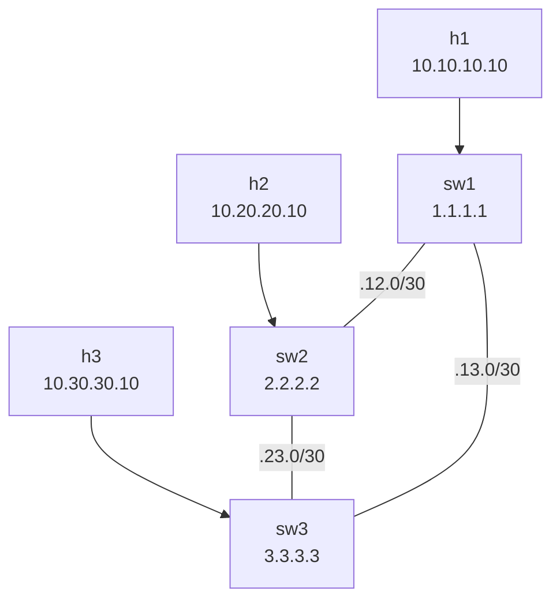

# Lab 17 — OSPF Basics

> **Format:** Hands-on. Three L3 switches in a triangle, all in single OSPF area 0. Reference answer in [`solutions/`](solutions/).
>
> **Story chapter:** Phase 4 · Mid-level · Year 1.5. The static-route spreadsheet from lab 16 finally broke you. You scheduled a maintenance window, replaced it with OSPF across every L3 device in the network, and slept properly for the first time in months. See [`STORY.md`](../../STORY.md).

## Real-world scenario

Your network grew. You used to have two L3 switches with static routes between them (lab 16), and that was fine. Then you added a third site, then a fourth, then redundant paths between them. Now the static-routes spreadsheet has 47 entries and changes require touching every switch. The last "small" topology change took 2 hours and broke connectivity for 8 minutes when someone forgot to update sw3.

You need **dynamic routing**: a protocol where switches discover each other, share what they know, and automatically recompute paths when something changes.

**OSPF** (Open Shortest Path First) is the standard choice for an enterprise/DC IGP. Every L3 device runs OSPF; each advertises its connected networks; together they build a complete picture of the topology and compute shortest paths. Add a new link or switch — OSPF discovers and incorporates it automatically. A link fails — OSPF reroutes within a second or two.

This lab is the foundational single-area OSPF setup. Lab 18 adds multi-area design.

## Goal

By the end you should be able to answer:

- What's a **link-state protocol** and how is it different from distance-vector?
- What's an **LSA**, and what's the **LSDB**?
- What's an **OSPF area**, and why is everything area 0 in this lab?
- What's a **router-id**, and why pin it to a loopback?
- What does **`passive-interface`** do, and why is it best practice?
- What's the difference between **OSPF point-to-point** and **broadcast** network types?

## Topology



Three L3 switches with loopbacks (`1.1.1.1`, `2.2.2.2`, `3.3.3.3`), three `/30` transit links, one host LAN per switch.

## Theory primer

### Link-state vs distance-vector

- **Distance-vector** (e.g. RIP, EIGRP) — routers tell their neighbors "I can reach X with cost N". Neighbors trust this and propagate. Slow to converge, "routing by rumor".
- **Link-state** (OSPF, IS-IS) — every router **floods** information about its own links to every router in the area. Each router independently builds the full topology graph and runs **Dijkstra's algorithm** to compute shortest paths. Faster convergence, more deterministic, but requires more CPU/memory at scale.

OSPF and IS-IS are the standard link-state IGPs. OSPF is more common in enterprise; IS-IS is preferred at SP/ISP scale (better at carrying many routes, cleaner multi-protocol support).

### LSA and LSDB

- **LSA (Link State Advertisement)** — a piece of information one router floods. Different types describe different things:
  - **Type 1 (Router LSA)** — "I'm router X, here are my interfaces and their costs, and I'm in area Y."
  - **Type 2 (Network LSA)** — "I'm the DR on this broadcast segment, here are the attached routers."
  - **Type 3 (Summary LSA)** — "From area A, here are the prefixes I'm advertising into area B." (multi-area only)
  - **Type 4, 5, 7** — for redistribution from outside OSPF or for NSSAs. Covered in lab 18.

- **LSDB (Link State Database)** — every router stores all LSAs from all routers in its area. Every router in the same area has an identical LSDB. From the LSDB, each router computes its own shortest-path tree.

### Areas

For scale, OSPF lets you split the topology into **areas**:
- **Area 0** — the backbone. Always exists. All non-zero areas must connect to area 0.
- **Other areas** (1, 2, 3, ...) — attach to area 0 via Area Border Routers (ABRs). Internal LSAs stay within the area; only summarized routes (Type 3) leak across.

Smaller LSDBs → less CPU/memory. Faster convergence within each area. Less flapping noise spreading across the whole network.

In this lab everything's in area 0 because the topology is small. Lab 18 adds a second area.

### Router-ID

Each OSPF router needs a unique **32-bit ID** in `x.x.x.x` form (looks like an IP, but doesn't need to be reachable — purely an identifier). 

Best practice: set it explicitly to the IP of a **loopback** interface. Loopbacks don't go down with physical interfaces, so the router-ID stays stable. If you don't set it, OSPF picks the highest IP on any interface at boot — which can change unpredictably if interfaces flap.

In this lab: `router-id 1.1.1.1` matches Loopback0's IP on sw1, etc.

### Neighbor adjacency formation

Two OSPF routers on the same segment do:
1. **Hello** packets — discover each other.
2. **2-way** — they've seen each other's Hellos.
3. **ExStart / Exchange / Loading** — they exchange LSDB summaries and fill gaps.
4. **Full** — adjacency is established; both routers have synced LSDBs.

`show ip ospf neighbor` should show `Full` state for every working adjacency. Anything else = something's wrong.

### Network types

OSPF treats different link types differently:

- **point-to-point** (`network point-to-point`) — for direct router-to-router links (most modern transit). Hellos every 10s, dead 40s, no DR election. **Use this on inter-switch /30 transits.**
- **broadcast** — for shared media like Ethernet LAN. Elects a Designated Router (DR) and Backup DR to reduce LSA flooding. Slower than P2P. Default for Ethernet interfaces unless overridden.

For inter-switch links between exactly two routers, `network point-to-point` is faster, simpler, and avoids DR-election quirks. Always set it on `/30` or `/31` transits.

### `passive-interface`

If you enable OSPF on an interface but no neighbor exists (e.g., a host-facing port), OSPF still sends Hellos every 10s — wasted CPU, plus a potential information leak if someone plugs in a malicious OSPF router.

**`passive-interface`** disables Hellos on the interface but still **advertises its connected subnet into OSPF**. Best practice:

```
router ospf 1
   passive-interface default
   no passive-interface Ethernet2
   no passive-interface Ethernet3
```

Means: passive on everything by default, except the explicitly-listed transit ports. Adds a layer of safety against rogue OSPF speakers on access ports.

### Cost (metric)

Each link has a **cost**, by default derived from interface bandwidth: `cost = ref-bw / link-bw`. Default `ref-bw` is 100 Mbps, so a 1 Gbps link has cost 1 (capped), and a 10 Mbps link has cost 10.

For modern fast links, default ref-bw isn't useful — everything is cost 1. Tune with `auto-cost reference-bandwidth 10000` (for 10 Gbps reference) or set per-interface cost manually.

OSPF picks the path with the lowest sum of costs.

## Your task

On all three switches:

1. Configure OSPF process 1 with router-id matching Loopback0.
2. Enable OSPF on Loopback0, host LAN interface, and both transit interfaces, all in area 0.
3. Make the host LAN and Loopback0 **passive** (no Hellos).
4. Make the transit links **point-to-point network type**.
5. Verify neighbor adjacencies form (Full state) between sw1↔sw2, sw2↔sw3, sw1↔sw3.
6. Verify h1 can reach h2 and h3.
7. Failover demo: shut a link, observe rerouting.

## Hints

Per interface:

```
interface <name>
  ip ospf area 0.0.0.0
  ip ospf network point-to-point     ! on transit links only
```

OSPF process — note that passivity is configured **here**, at the process level, not on the interface (there is no `ip ospf passive` interface command in EOS). `passive-interface default` makes every interface passive, then you re-enable Hellos only on the transit ports:

```
router ospf 1
   router-id <id>
   passive-interface default
   no passive-interface <transit-1>
   no passive-interface <transit-2>
```

This leaves the host LAN and Loopback0 passive (subnet still advertised, no Hellos) while the two transit links speak OSPF.

Verification:

```
show ip ospf neighbor
show ip ospf interface brief
show ip ospf database
show ip route ospf
```

## Deploy

```bash
cd ~/containerlab/labs/17-ospf-basics
sudo containerlab deploy
```

## Verification

### 1. Before OSPF — h1 cannot reach h2

```bash
docker exec clab-ospf-basics-h1 ping -c 2 10.20.20.10
```

❌. No routes between subnets.

### 2. After OSPF on all 3 switches — adjacencies up

```bash
docker exec -it clab-ospf-basics-sw1 Cli
show ip ospf neighbor
```

Should show two neighbors (sw2 and sw3), both in `Full` state.

### 3. Routes populated

```
show ip route ospf
```

Should show learned routes:
- 10.20.20.0/24 via sw2's transit IP
- 10.30.30.0/24 via sw3's transit IP
- 2.2.2.2/32, 3.3.3.3/32 (other loopbacks)
- The "other" transit /30 (e.g., 192.168.23.0/30)

Each marked as `O` (intra-area OSPF route).

### 4. Connectivity

```bash
docker exec clab-ospf-basics-h1 ping -c 3 10.20.20.10
docker exec clab-ospf-basics-h1 ping -c 3 10.30.30.10
```

Both ✅.

### 5. Look at the LSDB

```
show ip ospf database
```

You should see:
- 3 Router LSAs (one per switch)
- 0 Network LSAs (we're using point-to-point, no DR election)

Each Router LSA lists the switch's interfaces and link costs.

### 6. Trace a path — see the shortest

```bash
docker exec clab-ospf-basics-h1 traceroute -n 10.30.30.10
```

Direct via sw1 → sw3 (one transit hop), not sw1 → sw2 → sw3 (two hops).

### 7. Failover

Sustained ping:

```bash
docker exec clab-ospf-basics-h1 ping 10.30.30.10
```

Kill sw1's direct link to sw3:

```
configure terminal
  interface Ethernet3
    shutdown
```

Ping pauses ~1–2 seconds, recovers. New path: sw1 → sw2 → sw3.

```
show ip route 10.30.30.0/24
```

Now via sw2's transit IP.

Restore:

```
interface Ethernet3
  no shutdown
```

Within ~1 second, direct path is restored.

### 8. Mismatched area demo (instructive failure)

On sw2 only, change Ethernet3's area to 1:

```
configure terminal
  interface Ethernet3
    ip ospf area 1
```

```
show ip ospf neighbor
```

The sw2↔sw3 neighbor **disappears from `show ip ospf neighbor`** entirely. An OSPF area-ID mismatch fails the area check on the received Hello, so the Hello is silently discarded *before* the neighbor state machine even runs — the adjacency never forms and the existing one times out after the dead-interval (~40s). Mismatched area = no adjacency. This is a very common production bug — every switch on a link must agree on the area.

(Aside: a neighbor genuinely **stuck in `Init`** is a *different* failure mode — it means Hellos are arriving one-way, i.e. the router hears the neighbor but doesn't see itself listed in the neighbor's Hello. That usually points to a unidirectional link, an authentication mismatch, or an ACL filtering Hellos in one direction — not an area mismatch.)

Restore: `ip ospf area 0`.

## Peek at solution

- [`solutions/sw1.cfg`](solutions/sw1.cfg), [`solutions/sw2.cfg`](solutions/sw2.cfg), [`solutions/sw3.cfg`](solutions/sw3.cfg)

## Concepts cheat-sheet

- **OSPF** — link-state IGP. Floods LSAs, each router builds full topology, Dijkstra computes paths.
- **LSA / LSDB** — units of state OSPF floods / the database every router maintains. Same LSDB across an area.
- **Area** — scaling boundary. Area 0 always exists; others connect via ABRs (lab 18).
- **Router-ID** — 32-bit identifier; pin to a loopback IP for stability.
- **Adjacency states**: Down → Init → 2-way → ExStart → Exchange → Loading → Full. Should be Full.
- **Network types** — point-to-point for /30 transit; broadcast (default Ethernet) for shared LANs.
- **Passive interface** — advertise the subnet but don't send Hellos; protects host-facing ports.
- **Cost** — bandwidth-derived metric; lower is better; tune `auto-cost reference-bandwidth` for modern links.

## Production deployment notes

- **Always set the router-id explicitly.** Tied to a loopback.
- **Use `passive-interface default` + selective `no passive-interface`** for transit ports. Default-passive is the safer posture.
- **Set `network point-to-point` on all /30 transits.** Faster, simpler, no DR election.
- **`auto-cost reference-bandwidth`** — bump it (10000 or higher) so modern links have meaningful cost differences.
- **OSPF authentication** — supports MD5 or HMAC-SHA. Configure between neighbors to prevent rogue OSPF speakers.
- **Avoid summary-address in area 0** — keep summaries at ABRs, not inside area 0.
- **MTU mismatches break adjacencies** — `show ip ospf neighbor` stuck in ExStart/Exchange? Check MTU on both sides.
- **`max-lsa`** — protects against runaway LSA injection (a misbehaving neighbor flooding too many).
- **Loopbacks should always be in OSPF** as `/32` passive — gives stable, predictable next-hop for iBGP and management.

## What's missing (deliberately)

- **Multi-area design, ABR/ASBR, stub areas** — lab 18.
- **External route redistribution** (Type 5 LSAs) — when OSPF imports from BGP/static, covered in BGP labs.
- **OSPF authentication** — production must-do, covered in operations chapter.
- **NSSA areas, virtual links** — corner-case design topics; mention only.
- **Sub-second convergence** — BFD in lab 19.

## Cleanup

```bash
sudo containerlab destroy --cleanup
```
