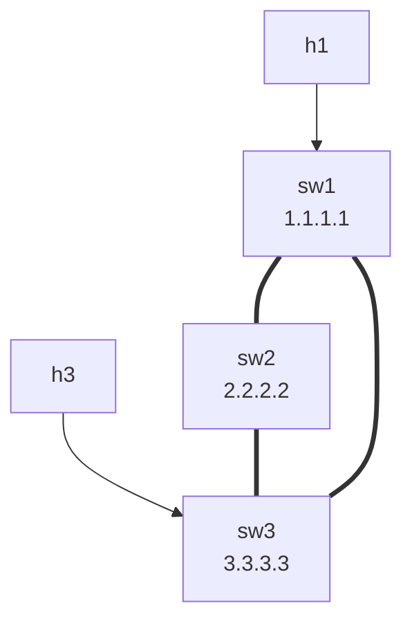

# Lab 19 — BFD (Sub-Second Failure Detection)

> **Format:** Hands-on. Same OSPF triangle as lab 17, with BFD added to all transit links so routing protocols detect failure in milliseconds instead of tens of seconds. Reference answer in [`solutions/`](solutions/).
>
> **Story chapter:** Phase 4 · Senior IC · Year 2. A transport switch between two of your core routers had a partial hardware failure. The link looked up at L1; OSPF kept sending Hellos into a black hole for 40 seconds before declaring the neighbor dead. A customer's voice call dropped. The post-mortem listed BFD as the missing piece. See [`STORY.md`](../../STORY.md).

## Real-world scenario

Customer VoIP traffic dropped for 38 seconds last Tuesday. Post-mortem: a transport switch between two of your core routers had a partial hardware failure — it stopped forwarding packets but didn't shut the link. OSPF's default **dead timer is 40 seconds** (Hello every 10s, dead after 4 missed Hellos). For 40 seconds, OSPF kept sending packets into a black hole because the physical link looked fine.

You need **BFD (Bidirectional Forwarding Detection)**: a lightweight protocol that sends rapid heartbeats between routers (every 300ms by default in modern designs) and tells routing protocols "your peer is dead" in well under a second. OSPF reroutes immediately. Voice traffic might lose 1–2 packets instead of 40 seconds.

BFD has become a standard ingredient of every production WAN/DC routing design. If you have any link that goes through external equipment (DWDM, customer-edge switches, dark fiber with media converters), you want BFD.

## Goal

By the end you should be able to answer:

- Why isn't fast convergence just "tune OSPF hello/dead timers"?
- How does BFD work — what's a session, what are the timers, what's the multiplier?
- How does BFD integrate with OSPF (or BGP, or static routes)?
- What's the difference between **asynchronous** and **demand** mode, and which is used in practice?
- What's the **echo function** and when does it help?

## Topology



Three L3 switches, full OSPF triangle, two hosts at the edges. Same wiring as lab 17. We'll enable BFD on every transit interface.

## Theory primer

### Why not just tune OSPF timers?

You CAN drop OSPF Hello/dead to 1s/3s and get 3-second failure detection. Problems with this approach:
- **CPU cost** — every protocol on every interface starts running its own fast keepalives. OSPF + BGP + others = N concurrent timer loops on every box.
- **Per-protocol** — tuning OSPF doesn't help BGP, doesn't help static-route tracking. Each needs its own tuning.
- **Floor** — going below 1-second OSPF Hello is not officially supported and causes more issues than it solves.

BFD solves this generically: one lightweight protocol does failure detection, multiple routing protocols **subscribe** to its session state. Detect once, notify many. Far less CPU. Configurable detection times under 100ms if needed.

### How BFD works

Two routers establish a **BFD session** on a link. They exchange tiny UDP packets (port 3784) at the configured **interval**. Each packet says "I'm alive, expect my next one in X ms".

A session has three timers:

- **TX interval** (`bfd interval N`) — how often I send a packet (N ms).
- **RX interval** (`min-rx N`) — minimum interval I'm willing to receive packets at.
- **Multiplier** (`multiplier K`) — declare neighbor dead if K packets in a row don't arrive.

Negotiated rate = max(my TX, peer's RX). Detection time = negotiated rate × multiplier.

Common conservative tuning: `interval 300 min-rx 300 multiplier 3` → detection in ~900ms.
Aggressive: `interval 50 min-rx 50 multiplier 3` → ~150ms.

### Asynchronous vs demand mode

- **Asynchronous mode (default)** — both routers continuously send BFD packets. Always-on heartbeat.
- **Demand mode** — only send BFD packets when needed (e.g., when traffic is flowing). Lower overhead but more complex; rarely used in practice.

99% of deployments use asynchronous. Don't worry about demand.

### Echo function

A BFD session can include an **echo function**: one side sends packets that the *peer's data plane* loops back without involving the peer's control plane. Tests the actual forwarding path, not just the control plane. Adds robustness against control-plane bugs that keep BFD alive but break forwarding.

Most platforms support it; not always enabled by default. For modern designs, echo + asynchronous is the best combo.

### Protocol subscriptions

Once a BFD session is up, routing protocols **subscribe** to it. Examples:

- **OSPF**: `router ospf 1` → `bfd default` (enables BFD on all OSPF interfaces), or per-interface `ip ospf neighbor bfd`.
- **BGP**: `neighbor X.X.X.X fall-over bfd`.
- **Static route tracking**: more complex; uses BFD sessions independently.
- **HSRP/VRRP**: can use BFD to detect peer failure faster.

When BFD declares "session down", every subscribed protocol immediately treats its neighbor as down — no waiting for protocol-specific dead timers.

### What BFD does NOT do

- Doesn't detect application-layer failures (the server beyond the next-hop crashed).
- Doesn't replace routing protocol Hello (still needed for adjacency state and feature negotiation).
- Doesn't help against link congestion (legitimate packets dropped due to load look the same as failure).

## Your task

On all three switches:

1. Set BFD timers globally: `bfd interval 300 min-rx 300 multiplier 3`. (These happen to be the EOS defaults, so the line documents intent rather than changing behavior — see the note below.)
2. Under the OSPF process, subscribe OSPF to BFD on all its interfaces: `bfd default`.
3. Verify BFD sessions come up on each transit interface.
4. Compare failure detection time: OSPF-only vs OSPF+BFD.

> **Note:** `300 min-rx 300 multiplier 3` are the EOS default BFD parameters, so step 1 is effectively a no-op that makes the intended timers explicit. The behavioral change in this lab comes from step 2 (`bfd default`), which makes OSPF react to BFD session-down events instead of waiting for its own 40-second dead timer. If you want to actually change timing, drop to `interval 50 min-rx 50 multiplier 3` as in the aggressive-tuning step.

## Hints

BFD timers — set them **per routed interface** (in EOS this is an interface-level command, not global). Optional: `bfd default` under OSPF already uses the 300ms × 3 EOS defaults, so you only need this if you want to tune:

```
interface Ethernet<n>
  bfd interval <ms> min-rx <ms> multiplier <n>
```

OSPF BFD integration (subscribes all OSPF interfaces to BFD):

```
router ospf 1
   bfd default
```

Per-interface override (if needed):

```
interface Ethernet2
   ip ospf neighbor bfd
   bfd interval 50 min-rx 50 multiplier 3
```

Verification:

```
show bfd peers
show bfd peers detail
show ip ospf neighbor detail
```

## Deploy

```bash
cd ~/containerlab/labs/19-bfd
sudo containerlab deploy
```

## Verification

> **cEOS note (read before you reach for a stopwatch):** cEOS is a containerized control-plane image with **no forwarding ASIC and no hardware BFD offload** — BFD here is pure software. The session state machine works (you can expect `show bfd peers` to reach `Up` and OSPF to subscribe), so this lab is a faithful exercise in the *config and control-plane behavior* of BFD. What is **not** faithful on cEOS is the exact sub-second timing: the ~900ms and ~150ms detection numbers below are real-hardware figures. Under container scheduling jitter and software timers, your measured loss may be larger, noisier, or occasionally miss a session bring-up entirely. Treat the timing numbers as "what this would do on real hardware" and treat the cEOS run as "did BFD come Up, did OSPF react to it faster than its 40s dead timer" — not a precise measurement. If a session won't come up at all, bounce the interface (`shutdown` / `no shutdown`) or redeploy.

### 1. Baseline OSPF without BFD — slow failure detection

Run a sustained ping while it works:

```bash
docker exec clab-bfd-h1 ping 10.30.30.10
```

In another terminal, simulate a "silent failure" — drop ALL packets on sw2's Ethernet3 (toward sw3) via an ACL. This keeps the link "up" administratively but black-holes traffic.

```bash
docker exec -it clab-bfd-sw2 Cli
configure terminal
  ip access-list standard BLACKHOLE
    deny any
  interface Ethernet3
    ip access-group BLACKHOLE in
```

Watch the ping. Without BFD, OSPF takes ~40 seconds (default dead timer) before noticing the neighbor's silence and rerouting via sw1. **You'll see ~40 seconds of dropped packets.**

Remove the ACL:

```
interface Ethernet3
  no ip access-group BLACKHOLE in
```

OSPF reconverges, ping resumes.

### 2. Enable BFD

Apply BFD config on all three switches. Then:

```bash
docker exec -it clab-bfd-sw1 Cli
show bfd peers
```

You should see two BFD sessions (to sw2 and sw3), both `Up`. The **Detection Time** field should read ~900ms (negotiated 300ms × multiplier 3). On real hardware that 900ms is also roughly how fast a failure is caught; on cEOS the field reflects the negotiated timers but the measured loss in step 3 will be jitterier (see the cEOS note above).

```
show bfd peers detail
```

More info: local/remote discriminators, packets sent/received, timer details.

### 3. Same failure with BFD — sub-second detection

Run ping again, then apply the ACL on sw2 Et3.

Watch the ping. With BFD, on real hardware you lose **~1 second** of packets at most — BFD detects in ~900ms, OSPF reconverges immediately. The key contrast is qualitative and holds even on cEOS: with BFD you lose around a second instead of the ~40 seconds you saw in step 1. (On cEOS the exact count of lost pings will vary run-to-run; don't read too much into a precise number.)

Remove the ACL.

### 4. Tune more aggressively

If you want to play with the timers, set them lower **on the routed interfaces** (Ethernet2/Ethernet3 toward the neighbours):

```
interface Ethernet2
  bfd interval 50 min-rx 50 multiplier 3
interface Ethernet3
  bfd interval 50 min-rx 50 multiplier 3
```

The negotiated Detection Time in `show bfd peers` should now read ~150ms. On real hardware that translates to ~150ms of loss; on cEOS the *configured/negotiated* timer changes as expected, but software timing jitter means you won't reliably measure a clean 150ms — the point is to see the timers (and detection-time field) drop, not to clock it precisely.

**Don't go too low in real deployments** — packet loss from legitimate causes (microbursts, queue overflow) can falsely trigger BFD. 300ms × 3 is a common safe default; sub-100ms is for highly tuned datacenter fabrics with strict packet loss SLAs.

### 5. BFD on point-to-point only

```
show bfd peers
```

Note: BFD sessions are between **directly connected** routers on point-to-point or LAN segments. It's not a hop-by-hop end-to-end check. For **multi-hop BFD** (between peers several physical hops apart, such as iBGP loopback peers), EOS uses a separate multi-hop BFD configuration — the session is anchored to the peer addresses rather than an interface. Same idea, different config; not covered here.

## Peek at solution

- [`solutions/sw1.cfg`](solutions/sw1.cfg), [`solutions/sw2.cfg`](solutions/sw2.cfg), [`solutions/sw3.cfg`](solutions/sw3.cfg)

## Concepts cheat-sheet

- **BFD** — Bidirectional Forwarding Detection. Lightweight UDP-based heartbeat for sub-second failure detection.
- **Session** — pair of routers exchanging BFD packets on a link.
- **Timers** — TX interval, RX interval (`min-rx`), multiplier. Detection time = effective rate × multiplier.
- **Async vs Demand** — async is the default and the one you'll use.
- **Echo function** — bounces packets through peer's data plane; tests forwarding, not just control.
- **Subscription** — routing protocols (OSPF, BGP, etc.) subscribe to BFD session state and react to "session down" immediately.
- **Multi-hop BFD** — a separate BFD configuration for peers not directly connected (e.g., iBGP loopback peers across the fabric); the session tracks peer addresses instead of a single interface.

## Production deployment notes

- **Enable BFD on every L3 transit link** in your fabric. Cost is negligible; convergence improvement is huge.
- **Standardize timers across the fabric** — don't have one pair running 300ms and another at 50ms unless you have a reason. Operationally simpler.
- **Use BFD for BGP too** — `neighbor X fall-over bfd` is one of the highest-leverage config lines you can add.
- **Watch CPU under high session counts** — a router with 1000 BFD sessions at 50ms timers is using non-trivial CPU. Tune to needs; not every link needs 50ms detection.
- **Hardware BFD** is much better than software — most modern ASICs offload BFD to silicon. If yours doesn't (older platforms, virtual routers), be conservative with timers.
- **Mixed-vendor**: BFD is standardized (RFC 5880, 5881, 5882, 5883), most vendors interoperate. Timers and multipliers can be negotiated; protocol subscription model is the same.
- **Don't forget mgmt path**: don't run BFD on the management VRF unless you have a reason. Mgmt path failures should not trigger data-plane reconvergence.

## What's missing (deliberately)

- **BFD with BGP** — covered in BGP chapter.
- **BFD-tracked statics** — `ip route ... track bfd` syntax for static-route reachability. Niche.
- **Per-neighbor timers** — most folks use global. Tune per-interface when bandwidth/latency varies.
- **BFD authentication** — supported (MD5/SHA1); use in untrusted environments.

## Cleanup

```bash
sudo containerlab destroy --cleanup
```
