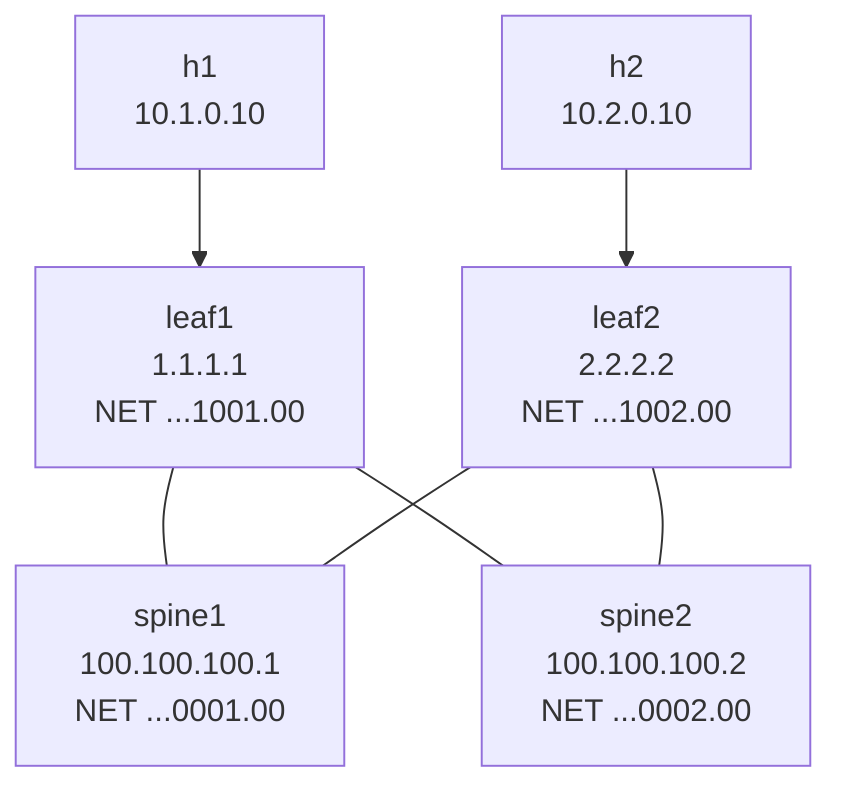

# Lab 19b — IS-IS as Alternative Underlay

> **Format:** Hands-on. Same spine-leaf topology as lab 27, but with IS-IS instead of BGP as the underlay routing protocol. Reference answer in [`solutions/`](solutions/).
>
> **Story chapter:** Phase 4 · Senior IC · Year 2. You're evaluating a new fabric design — the CTO read a hyperscaler engineering blog about IS-IS underlays and asks "should we be using this?" You build a small IS-IS-underlay fabric to see what the differences are versus your current OSPF (lab 17-18) and what hyperscalers like Microsoft, Facebook, and LinkedIn use in their internal builds. See [`STORY.md`](../../STORY.md).
>
> **Syntax verification:** Configs based on standard Arista IS-IS commands. Verify against EOS User Manual v4.36.0F section 16.4 (IS-IS) when deploying — IS-IS syntax has been stable but always good to confirm for the exact EOS version.

## Real-world scenario

OSPF (labs 17-18) is the IGP most enterprises and small/mid hosting providers use. Hyperscalers — Microsoft Azure, Meta/Facebook, LinkedIn, Cloudflare's edge — overwhelmingly use **IS-IS** for their internal underlay. Why?

- IS-IS scales better with very large LSDBs (10000+ nodes) because of how it encodes information.
- IS-IS is **TLV-based**, so extending it is easier than OSPF (adding new info types doesn't require new LSA types).
- IS-IS runs **directly on L2** (no IP transport for the protocol itself), so adjacencies form even before IP is fully set up.
- IS-IS handles dual-stack (IPv4 + IPv6) more naturally with one process; OSPFv2 and OSPFv3 are separate.

In your hosting provider context, **you probably don't need IS-IS** — OSPF will scale to your DC size for the foreseeable future. But knowing the differences and being able to read an IS-IS config matters because:
- Your transit providers may run IS-IS; understanding `show isis` output helps when troubleshooting jointly.
- If you grow into a larger operator, you might migrate.
- It's a routine interview question.

This lab is *additive*. After this you can speak about both protocols with the same fluency.

## Goal

By the end you should be able to answer:

- What's a **NET (Network Entity Title)**, and how does it encode area + system-ID?
- What's the difference between **Level-1**, **Level-2**, and **L1/L2** in IS-IS?
- Why is **`is-type level-2-only`** the typical DC underlay choice?
- How does IS-IS LSP flooding compare to OSPF LSA flooding?
- Why is IS-IS sometimes called "the protocol that runs without IP"?

## Topology



Identical to lab 27 (spine-leaf with eBGP underlay) — same number of devices, same wiring. The only difference is the IGP.

## Theory primer

### NET (Network Entity Title)

Every IS-IS speaker has a **NET** that encodes:
- **AFI** (Address Family Identifier) — usually `49` for "private use", like RFC 1918 for IS-IS area numbers
- **Area** — variable length, conventionally 2 bytes: `0001`
- **System ID** — exactly 6 bytes (12 hex digits): a unique identifier per device, often derived from the loopback IP. Convention: encode the loopback as `0010.0100.0001` for `100.100.100.1`.
- **NSEL (NSAP Selector)** — `00` indicates "router" (vs end-system)

Format: `<AFI>.<Area>.<SystemID>.<NSEL>`

Example: `49.0001.0010.0100.0001.00`
- AFI: `49`
- Area: `0001`
- System ID: `0010.0100.0001` (matches loopback `100.100.100.1`)
- NSEL: `00`

Pick a convention and stick with it across the network. The system-ID **must be unique** across the IS-IS domain.

### Levels (L1, L2, L1/L2)

IS-IS has a built-in two-level hierarchy:
- **Level 1 (L1)** — intra-area. Routes within the area.
- **Level 2 (L2)** — inter-area / backbone. Routes between areas.
- **Level 1-2 (L1/L2)** — a router that participates in both, acting as the border between an L1 area and the L2 backbone.

In modern DC underlay designs, **everything runs in L2 only**:
```
is-type level-2-only
```

Why: with all loopbacks and transit subnets in one logical L2 backbone, every router sees every other router directly. There's no operational reason to introduce area boundaries in a DC underlay. The OSPF "area 0" equivalent is "L2-only IS-IS".

For SPs or very large networks, L1/L2 hierarchy is used — same way OSPF uses multi-area design.

### LSP flooding vs LSA flooding

OSPF floods **LSAs** (Link State Advertisements) — multiple types for different info (router LSA, network LSA, summary LSA, external LSA).

IS-IS floods **LSPs** (Link State PDUs) — each device generates one LSP, containing multiple **TLVs** (Type-Length-Value) representing different types of info. Adding a new info type means adding a new TLV — no new LSP type needed.

Practical effect: IS-IS handles protocol extension more cleanly. New features (IS-IS for IPv6, IS-IS-SR for Segment Routing, IS-IS-LFA for fast convergence) added TLVs without changing the protocol's wire format.

### Why "runs without IP"

IS-IS is a member of the OSI protocol family (CLNS). Its control packets are sent at L2 with a CLNS header — **not in IP**. This means:
- IS-IS adjacencies can form before IP is configured. Useful for ZTP scenarios.
- IS-IS is less vulnerable to IP-layer attacks (you can't send IS-IS Hellos from across the internet because they're not IP-routable).
- Multi-protocol payloads — IS-IS carries IPv4 and IPv6 reachability info in the same LSPs.

This isn't usually visible day-to-day, but it's a real architectural property.

### Network type: point-to-point

Just like OSPF (lab 17), IS-IS on a /30 or /31 transit link should be configured as `network point-to-point` (no DIS election, faster convergence).

```
interface Ethernet1
   isis network point-to-point
```

### Passive interface

Same concept as OSPF passive — advertise the prefix into IS-IS but don't send IS-IS Hellos out. Use for host-facing interfaces and loopbacks (loopbacks are passive by virtue of having no neighbor, but explicit passive is sometimes clearer).

```
interface Ethernet3
   isis passive
```

## Your task

On all four devices:

1. Enable IS-IS process `CORE` with the appropriate NET (system-ID convention: derived from the loopback IP).
2. Set `is-type level-2-only`.
3. Activate IPv4 unicast address-family.
4. Enable `isis enable CORE` on every interface that should participate (loopback + transit links + host-facing).
5. Set transit links to `isis network point-to-point`.
6. Set host-facing interfaces to `isis passive`.
7. Enable ECMP (`maximum-paths 64`).
8. Verify neighbor formation, LSDB sync, end-to-end reachability between h1 and h2.

## Hints

```
router isis <tag>
   net <NET>
   is-type level-2-only
   maximum-paths 64
   address-family ipv4 unicast

interface <name>
   isis enable <tag>
   isis network point-to-point     ! on /30 or /31 transit links
   isis passive                    ! on host-facing or loopback
```

Verification:

```
show isis neighbors
show isis database
show isis interface
show ip route isis
```

## Deploy

```bash
cd ~/containerlab/labs/19b-isis-underlay
sudo containerlab deploy
```

## Verification

### 1. Neighbors formed

```bash
docker exec -it clab-isis-underlay-leaf1 Cli
show isis neighbors
```

Should show 2 neighbors (spine1, spine2) both in `UP` state.

Same on spine1, spine2, leaf2 (each spine sees both leaves; each leaf sees both spines).

### 2. LSDB

```
show isis database
```

Shows the LSPs from all four devices. Each LSP contains TLVs describing the router's interfaces, neighbors, and reachable prefixes.

```
show isis database detail
```

Shows the TLV contents — neighbor info, IP reachability, etc. This is the IS-IS equivalent of `show ip ospf database router`.

### 3. Routes

```
show ip route isis
```

Should show:
- Loopbacks of remote routers (`I  100.100.100.1/32`, `100.100.100.2/32`, `2.2.2.2/32`)
- Remote host LAN (`I  10.2.0.0/24`)
- Other-side transit /31s

The `I` code in `show ip route` indicates an IS-IS route (instead of `O` for OSPF).

### 4. ECMP

```
show ip route 2.2.2.2/32
```

Should show two paths (via spine1 AND via spine2) — IS-IS ECMP works the same as OSPF ECMP.

### 5. End-to-end

```bash
docker exec clab-isis-underlay-h1 ping -c 3 10.2.0.10
```

✅. h1 reaches h2 over the IS-IS underlay.

### 6. Adjacency loss demo

Sustained ping:

```bash
docker exec clab-isis-underlay-h1 ping 10.2.0.10
```

Kill one path:

```
docker exec -it clab-isis-underlay-leaf1 Cli
configure terminal
  interface Ethernet1
    shutdown
```

Ping pauses ~1-2 sec, recovers via the other spine. `show isis neighbors` on leaf1 now shows only spine2.

Restore:

```
no shutdown
```

## Peek at solution

- [`solutions/spine1.cfg`](solutions/spine1.cfg), [`solutions/spine2.cfg`](solutions/spine2.cfg), [`solutions/leaf1.cfg`](solutions/leaf1.cfg), [`solutions/leaf2.cfg`](solutions/leaf2.cfg)

## Concepts cheat-sheet

- **NET** — Network Entity Title; encodes AFI + Area + System-ID + NSEL.
- **System ID** — 6 bytes (12 hex), unique per device. Convention: derive from loopback.
- **L1 / L2 / L1-L2** — IS-IS levels. Modern DC underlay = L2 only.
- **LSP / TLV** — IS-IS's analog of OSPF LSAs. Single LSP type, extensible via TLVs.
- **`isis network point-to-point`** — same as OSPF P2P; for transit links.
- **`isis passive`** — advertise prefix, don't send Hellos. For loopbacks and host ports.

## OSPF vs IS-IS quick comparison

| | OSPF (labs 17-18) | IS-IS (this lab) |
|---|---|---|
| Standard | IETF (RFC 2328 / RFC 5340) | ISO/IEC 10589 (adopted by IETF) |
| Transport | Over IP (protocol 89) | Directly over L2 (CLNS) |
| Hierarchy | Areas (0 + others) | Levels (L1, L2) |
| Extensibility | New LSA types | New TLVs |
| Multi-protocol | Separate processes (v2 for IPv4, v3 for IPv6) | One process, multi-AF natively |
| Typical DC use | Enterprise / small-mid hosting | Hyperscaler / very large fabric |
| Convergence speed | Sub-second with BFD | Sub-second with BFD |
| Operational tools | Mature, well-known | Mature, less common in non-SP environments |

## Production deployment notes

- **NET allocation is sacred** — system-IDs must be unique. Allocate via IPAM, document.
- **Use L2-only for DC underlay** — don't introduce L1/L2 hierarchy unless you have a specific reason.
- **`auto-cost reference-bandwidth`** — IS-IS has cost too. Default cost calculation may need tuning for modern 10G+/100G links. Set explicitly via `isis metric` on interfaces if you want deterministic costs.
- **IS-IS authentication** — supported (HMAC-MD5 / -SHA); use in untrusted environments.
- **BFD with IS-IS** — `isis bfd` per interface, same as OSPF BFD. Sub-second convergence on link failures.
- **Pair with BGP overlay** — many hyperscaler designs are exactly this: IS-IS for underlay routing (loopback reachability), BGP/EVPN for tenant overlay (lab 30+). The IS-IS underlay just carries loopbacks.

## When to choose IS-IS over OSPF

Honest decision criteria:

**Pick OSPF if**:
- Your team knows it well
- You're under ~500 L3 devices in one IGP domain
- You'll never grow to 5000+ devices
- You want simpler troubleshooting and tooling

**Pick IS-IS if**:
- You're planning very large scale (1000+ devices in one IGP)
- You want IPv4/IPv6 dual-stack with a single protocol
- You'll be running Segment Routing (IS-IS-SR is more mature than OSPF-SR in some implementations)
- Your team has IS-IS background (often the case in SP-derived engineering)
- You're following hyperscaler-style designs

Most hosting providers in the small/mid range stay with OSPF and never regret it.

## What's missing (deliberately)

- **IS-IS-SR (Segment Routing extensions)** — large topic; SP-heavy.
- **IS-IS authentication, mesh-groups, overload bit** — production tuning details.
- **L1/L2 hierarchical design** — large network topology; covered conceptually only.
- **Migrating from OSPF to IS-IS** — operational topic; rarely done in practice.

## Cleanup

```bash
sudo containerlab destroy --cleanup
```
