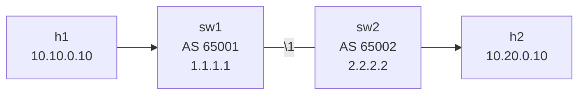

# Lab 20 — BGP Fundamentals

> **Format:** Hands-on. Two routers, two ASes, one eBGP session. The "hello world" of BGP. Reference answer in [`solutions/`](solutions/).
>
> **Story chapter:** Phase 5 · Senior IC · Year 2. The Company stopped reselling someone else's transit. You got your own AS from RIPE, leased a /22 of IPv4, and just signed a contract with the first upstream ISP. Your first eBGP session is in an hour. Your stomach is in knots — if you screw this up, the company is offline. See [`STORY.md`](../../STORY.md).

## Real-world scenario

Your network has been entirely OSPF-driven (chapter 5). It works fine within your administrative domain — every device runs the same routing protocol, trusts every other device's announcements, and computes shortest paths cooperatively.

You're about to peer with a partner organization (a customer, an upstream ISP, a Tier-2 transit provider, an internet exchange). You don't want to share your full OSPF database with them. You don't want their topology changes to trigger SPF runs on your routers. You don't trust them not to advertise something insane. You want **policy** — pick what you accept from them, pick what you announce to them, pick what they're allowed to influence.

**BGP** is the protocol for this. Routing **between administrative domains** (Autonomous Systems). Policy-driven, slow-by-design, attribute-rich, opinionated. The protocol that holds the internet together.

This lab is the smallest possible BGP: two routers, two ASes, one session. Once this clicks, every BGP lab after it is "add more of this".

## Goal

By the end you should be able to answer:

- What's an **Autonomous System** and what's an **ASN**?
- What's the difference between **eBGP** and **iBGP**?
- What's a **BGP session**, and what does **Established** state mean?
- What does **`network <prefix>`** actually do in BGP, and how is it different from OSPF advertising?
- What's the **BGP RIB** vs the **IP RIB** vs the **FIB**?

## Topology



| Router | AS | Router-ID | Advertises |
|---|---|---|---|
| sw1 | 65001 | 1.1.1.1 | 10.10.0.0/24 |
| sw2 | 65002 | 2.2.2.2 | 10.20.0.0/24 |

ASNs 64512–65535 are reserved for **private use** — fine for labs and internal designs. Public ASNs go through your RIR (RIPE/ARIN/etc.) — covered in lab 25.

## Theory primer

### Autonomous System (AS)

An **AS** is a network under a single administrative control with a unified routing policy. Your company, an ISP, a university — each is its own AS.

ASes are identified by a 16-bit (or now 32-bit) **ASN (Autonomous System Number)**. Public ASNs are registered with regional internet registries (RIPE for Europe, ARIN for North America, etc.) and are unique globally.

### eBGP vs iBGP

- **eBGP (external BGP)** — between two routers in **different ASes**. The session has special properties: by default, AS-path-loop prevention, TTL=1 (one hop), more processing of incoming attributes.
- **iBGP (internal BGP)** — between two routers in the **same AS**. No AS-path manipulation between iBGP peers; multi-hop by default (routers don't need to be directly connected); requires more careful design (route reflectors — lab 21).

This lab is pure eBGP — directly connected routers, different ASes.

### A BGP session

A BGP session is a **TCP connection** between two routers on port **179**. Once TCP is up, they exchange OPEN messages (advertising capabilities, AS, hold timer) and then UPDATE messages (advertising prefixes with attributes).

Session states progress: `Idle → Connect → Active → OpenSent → OpenConfirm → Established`. **`Established`** is the only useful state — only then are routes exchanged.

If your session is stuck in any other state, BGP is broken. Common causes: TCP connectivity to port 179 broken (firewall), wrong AS configured, router-id collision, MTU mismatch (rare but exists).

### BGP attributes

Every prefix in BGP carries **attributes**: AS-path, next-hop, local-preference, MED, communities, origin, etc. The whole protocol is about manipulating these to express policy. Lab 22 dives into path selection by attributes; lab 23 covers policy via route-maps.

For now, just know: BGP routes are not just "prefix + next-hop" like OSPF — they're rich objects.

### `network` statement

The `network 10.10.0.0/24` line in BGP says: **"Advertise 10.10.0.0/24 into BGP if and only if a route to that exact prefix already exists in my IP routing table."**

Key points:
- The mask MUST match an existing route. If you have a connected `10.10.0.0/24`, `network 10.10.0.0/24` works. `network 10.10.0.0/16` would NOT work (no `/16` route exists).
- "Already exists" can mean connected, static, or learned from another protocol.
- Without a matching route, the `network` statement does nothing silently. Common newbie bug.

The alternative to `network` is **`redistribute`** — pull all routes from another source (OSPF, connected, static) into BGP. Use with care; it's a firehose without filters.

### `no bgp default ipv4-unicast`

By default, Arista (and many other vendors) activates each new BGP neighbor for IPv4-unicast automatically. This is dangerous: in production you want EXPLICIT activation per address-family so neighbors only get what you intended.

`no bgp default ipv4-unicast` disables the implicit activation. Then under `address-family ipv4`, you do `neighbor X activate`. This is the modern best practice and works cleanly for IPv6, EVPN, VPNv4, etc. when you add other address-families later.

### BGP RIB vs IP RIB vs FIB

Three tables, all related:

- **BGP RIB** — what BGP knows. All prefixes received from all neighbors with all their attributes. Many entries per prefix possible.
- **IP RIB (routing table)** — the best route per prefix, across all sources (BGP, OSPF, static, etc.). One entry per prefix.
- **FIB (forwarding table)** — the hardware-installed version of the IP RIB, used for actual packet forwarding.

`show ip bgp` shows the BGP RIB. `show ip route` shows the IP RIB. `show ip route bgp` filters to BGP-sourced routes only.

## Your task

On both sw1 and sw2:

1. Configure BGP process with your AS number.
2. Set the router-id to your loopback IP.
3. Disable `bgp default ipv4-unicast`.
4. Define the eBGP neighbor (the other side's IP + their AS).
5. Under `address-family ipv4`, activate the neighbor.
6. Use `network` to advertise your local /24.
7. Verify the session reaches Established and the prefix shows up on the other side.
8. Test connectivity h1 ↔ h2.

## Hints

Arista BGP syntax:

```
router bgp <my-asn>
   router-id <my-router-id>
   no bgp default ipv4-unicast
   neighbor <peer-ip> remote-as <peer-asn>
   neighbor <peer-ip> description <free-form>
   !
   address-family ipv4
      neighbor <peer-ip> activate
      network <prefix>/<mask>
```

Verification:

```
show ip bgp summary
show ip bgp
show ip bgp neighbors <peer-ip>
show ip bgp neighbors <peer-ip> advertised-routes
show ip bgp neighbors <peer-ip> received-routes
show ip route bgp
```

## Deploy

```bash
cd ~/containerlab/labs/20-bgp-fundamentals
sudo containerlab deploy
```

## Verification

### 1. TCP between peers works (prerequisite)

Before BGP can succeed, the underlying IP connectivity must work. From sw1:

```bash
docker exec -it clab-bgp-fundamentals-sw1 Cli
ping 192.168.12.2
```

✅ should respond. If not, BGP can't talk.

### 2. Session reaches Established

After applying config:

```
show ip bgp summary
```

Expected:
```
Neighbor V AS    MsgRcvd MsgSent  InQ OutQ  Up/Down State  PfxRcd
192.168.12.2 4 65002  ...      ...     0    0   00:00:30 1
```

The `State` should be a duration (meaning Established) and `PfxRcd` should be 1 (you received sw2's prefix).

If state shows `Idle`, `Active`, `OpenSent` etc., something's wrong. Common causes:

- TCP not reaching port 179 (firewall, wrong IP)
- ASN mismatch (you configured remote-as 65002, peer thinks it's in 65003)
- Authentication mismatch (if you set MD5)

Check logs: `show logging | include BGP`.

### 3. Routes received

```
show ip bgp
```

Output shows BGP RIB. You should see:
- Your own advertised `10.10.0.0/24` marked with `>` (best path) and `*` (valid).
- The peer's `10.20.0.0/24` learned via eBGP, next-hop `192.168.12.2`.

The IP routing table picks up the BGP route:

```
show ip route bgp
```

`B    10.20.0.0/24 [20/0] via 192.168.12.2`

AD 20 = eBGP. (iBGP would be AD 200.)

### 4. Connectivity test

```bash
docker exec clab-bgp-fundamentals-h1 ping -c 3 10.20.0.10
```

✅. The packet leaves h1, routes via sw1 (BGP next-hop to sw2), crosses the eBGP link, sw2 delivers to h2.

### 5. Inspect the path

```
show ip bgp 10.20.0.0/24
```

Detail of the route as received:
- AS-path: `65002` (just one AS hop because it's directly from sw2)
- Next-hop: `192.168.12.2`
- Origin: `IGP` (because sw2 sourced it from `network`)
- Local pref: not set (only meaningful inside iBGP)
- MED: 0 (default)

### 6. What happens if I don't `activate`?

Remove the `neighbor 192.168.12.2 activate` under `address-family ipv4`:

```
configure terminal
  router bgp 65001
    address-family ipv4
      no neighbor 192.168.12.2 activate
```

```
show ip bgp summary
```

The session might stay up (TCP is fine), but `PfxRcd` drops to 0. Without activation, no IPv4 prefixes are exchanged. Re-add activation.

### 7. What happens with bad ASN?

On sw2, change to a wrong remote-as:

```
router bgp 65002
   no neighbor 192.168.12.1 remote-as 65001
   neighbor 192.168.12.1 remote-as 65999
```

Session drops, stuck in Idle/Active. Log:
```
BGP-4-AS_MISMATCH: ... Notification received from neighbor ...
```

Restore correct ASN.

### 8. Watch the session reform

If you want to see the full state transition, clear the session:

```
clear ip bgp 192.168.12.2 soft
```

Soft clear doesn't drop the TCP — it just re-exchanges UPDATEs.

```
clear ip bgp 192.168.12.2
```

Hard clear — drops TCP, full re-establish. Watch in `show ip bgp summary` as the state cycles back to Established.

## Peek at solution

- [`solutions/sw1.cfg`](solutions/sw1.cfg), [`solutions/sw2.cfg`](solutions/sw2.cfg)

## Concepts cheat-sheet

- **AS / ASN** — administrative routing domain / its 16/32-bit number.
- **eBGP / iBGP** — between different ASes / within same AS. Different default behaviors.
- **BGP session** — TCP/179 connection. `Established` is the only good state.
- **`network` statement** — advertises a prefix only if matching route exists in IP RIB.
- **`redistribute`** — alternative to `network`; pulls from another protocol; use with route-maps.
- **BGP RIB / IP RIB / FIB** — three tables. BGP RIB has all candidates; IP RIB has the best route per prefix from all sources; FIB is the hardware-installed forwarding.
- **AS-path** — list of ASNs a route has crossed. eBGP prepends; iBGP doesn't. Loop prevention is "if I see my own AS in the path, drop".

## Operational reminders

- **`show ip bgp summary`** is the daily-driver. Glance at PfxRcd, state, uptime — everything looks OK or it doesn't.
- **Document every neighbor** with `description` — six months later you'll need it.
- **Always set `router-id` explicitly** — based on loopback. Don't let it drift.
- **`no bgp default ipv4-unicast`** as the first line. Then per-AF explicit activation.
- **TCP MD5 / TCP-AO authentication** — common production hardening. Add `neighbor X password ...` (or modern TCP-AO equivalent).
- **TTL security** — `neighbor X ttl-security hops 1` rejects packets with TTL not exactly 1 hop. Stops off-link spoofing attempts.

## What's missing (deliberately)

- **iBGP** — lab 21.
- **Path selection attributes** — lab 22.
- **Route policy / route-maps / communities** — lab 23.
- **Multi-homing and traffic engineering** — lab 24.
- **Business / RIR / RPKI** — lab 25.
- **Operations / convergence tuning** — lab 26.
- **BGP authentication** — operations chapter.

## Cleanup

```bash
sudo containerlab destroy --cleanup
```
