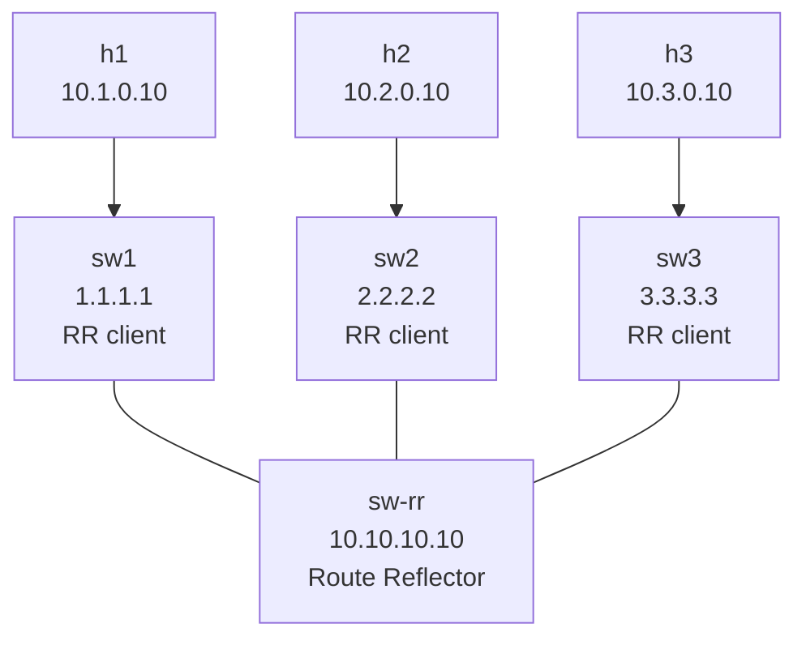

# Lab 21 — iBGP with Route Reflectors

> **Format:** Hands-on. Three "client" L3 switches each peering only with a central route reflector, all in AS 65001. OSPF underneath for next-hop reachability. Reference answer in [`solutions/`](solutions/).
>
> **Story chapter:** Phase 5 · Senior IC · Year 2. The Company's internal BGP grew to 5 routers, and you're adding a 6th. Full-mesh iBGP needs 15 sessions for 6 routers, 21 for 7, 28 for 8 — and you have to remember to add the new neighbor on every existing box every time. You're tired of it. See [`STORY.md`](../../STORY.md).

## Real-world scenario

Your DC grew. You now have BGP not just at the edge (peering with upstream ISPs) but also internally, carrying internal services and customer prefixes between your own routers. You configured iBGP between every pair of routers — full mesh — and it worked great when you had 5 boxes.

Now you have 50 boxes. Full mesh = N×(N-1)/2 sessions = **1225 sessions**. Adding a new router means configuring 50 new sessions on it AND adding 1 new session to every existing router. Maintenance nightmare. CPU on every router is busy keeping 49 sessions alive.

**Route reflectors** solve this. Designate one or two routers as RRs. Every other router peers only with the RRs (not with each other). The RR re-advertises routes it learns from one client to all the others. Now your 50-router AS needs only ~50 iBGP sessions total instead of 1225.

This is the standard scaling pattern for iBGP in any non-trivial AS. Every SP, every large DC, every multi-pop network uses route reflectors.

## Goal

By the end you should be able to answer:

- Why does iBGP have a **full-mesh requirement** by default, and what would happen without it?
- What does a **route reflector** do that makes the full-mesh requirement go away?
- What's an **RR client** vs an **RR non-client**?
- Why must iBGP sessions usually source from a **loopback**, not a physical interface?
- Why is an **IGP (OSPF/IS-IS) required underneath** iBGP?

## Topology



Four routers in one AS (65001). OSPF provides reachability between loopbacks. iBGP rides on top of OSPF. sw-rr reflects routes between clients.

## Theory primer

### Why iBGP needs full mesh by default

In eBGP, the AS-path **prevents loops**: when a router receives a route with its own AS in the path, it drops it. In iBGP, all routers share the same AS — so AS-path can't be used for loop prevention within an AS.

The fix: iBGP has a strict rule — **a route learned from one iBGP peer is never re-advertised to another iBGP peer**. This stops loops cold.

Consequence: every iBGP router must hear every other iBGP router's routes **directly**. That's the full mesh.

### Why full mesh doesn't scale

- N routers → N×(N-1)/2 sessions
- 10 routers → 45 sessions
- 100 routers → 4950 sessions
- 1000 routers → 499500 sessions

Beyond ~20 routers, this is operationally unmanageable. Adding/removing a router touches every other router.

### Route reflector to the rescue

A **route reflector** is allowed to break the "no re-advertise iBGP routes" rule, in a controlled way:

- Routes from an **RR client** can be reflected to:
  - Other RR clients
  - Non-clients (regular iBGP peers)
  - eBGP peers
- Routes from a **non-client iBGP peer** can be reflected to:
  - RR clients only

This way, clients only need to peer with the RR(s). The RR distributes everything for them. Loop prevention is maintained via the **Originator-ID** and **Cluster-list** attributes added by the RR (so even with multiple RRs, you can't loop).

### RR hierarchies and redundancy

- **One RR** is a single point of failure for BGP advertisements (though existing routes keep working since they're already in client RIBs).
- **Two RRs in a "cluster"** — both reflect, both are clients to each other's RR. Provides redundancy.
- **Hierarchical RRs** — RRs of RRs. Used at very large scale (Tier-1 SPs).

For DCs: usually two RRs per fabric, placed redundantly (e.g., one per spine pair, or on dedicated route-server hardware).

### Why source iBGP from a loopback

If you peer between physical interface IPs, the session is tied to that interface. If the interface flaps, BGP drops. Even worse: if there are multiple physical paths between two routers (which is normal in a fabric), you'd have to choose one for the BGP session.

**Loopback** interfaces are virtual, never go physically down, and are reachable via any available physical path (the IGP figures that out). Peering between loopbacks means:
- BGP session survives any single physical link failure
- ECMP across multiple physical paths is automatic
- Predictable, stable session source

This is why every iBGP peering looks like:

```
neighbor X.X.X.X update-source Loopback0
```

Where `X.X.X.X` is the peer's loopback IP, and `update-source Loopback0` tells TCP to use *your* loopback as the source.

### Why iBGP needs an IGP

iBGP carries prefixes, but the **next-hop attribute** of those prefixes is usually the IP of the eBGP peer that announced them in the first place. Inside your AS, that next-hop IP isn't directly connected to most of your iBGP routers — they need to know how to reach it.

Enter the IGP (OSPF, IS-IS, etc.): it carries the routes to every loopback and transit IP within the AS. iBGP learns "to reach this prefix, send to next-hop Y"; IGP knows "to reach Y, go via interface Z".

iBGP relies on IGP. Without IGP, iBGP routes have unresolved next-hops and are unusable.

In this lab, OSPF carries loopback reachability between all four routers. iBGP rides on top.

### `ebgp-multihop` and `ibgp-multihop`

Default eBGP requires TTL=1 (peers directly connected). For loopback-to-loopback eBGP (e.g., between two of your routers in different ASes via multiple hops), you need `ebgp-multihop <N>`.

iBGP doesn't have this restriction — it's multi-hop by default. Just give it the right update-source and an IGP path to the peer.

## Your task

1. On all four routers: OSPF is already configured. Verify loopback reachability between all routers.
2. On **sw-rr**:
   - Configure BGP for AS 65001.
   - Three iBGP neighbors (sw1, sw2, sw3) by their loopback IPs.
   - `update-source Loopback0` on each.
   - Activate each under `address-family ipv4`.
   - Mark each as `route-reflector-client`.
3. On **each client (sw1, sw2, sw3)**:
   - Configure BGP for AS 65001.
   - One iBGP neighbor: `10.10.10.10` (the RR's loopback).
   - `update-source Loopback0`.
   - Advertise the local LAN with `network`.
4. Verify each client learns the other two clients' prefixes via the RR.
5. Verify end-to-end h1 ↔ h2 ↔ h3.

## Hints

iBGP session (same AS on both sides):

```
router bgp <asn>
   router-id <my-loopback>
   no bgp default ipv4-unicast
   neighbor <peer-loopback> remote-as <asn>
   neighbor <peer-loopback> update-source Loopback0
   !
   address-family ipv4
      neighbor <peer-loopback> activate
      ! On RR only:
      neighbor <peer-loopback> route-reflector-client
      network <my-prefix>/<mask>
```

Verification:

```
show ip ospf neighbor                  ! IGP first
show ip bgp summary
show ip bgp
show ip bgp 10.2.0.0/24
show bgp neighbors <peer> received-routes
show bgp neighbors <peer> advertised-routes
```

## Deploy

```bash
cd ~/containerlab/labs/21-ibgp-route-reflectors
sudo containerlab deploy
```

## Verification

### 1. OSPF up first

```bash
docker exec -it clab-ibgp-rr-sw-rr Cli
show ip ospf neighbor
```

Three Full neighbors. Then:

```
show ip route ospf
```

Loopbacks of sw1, sw2, sw3 visible.

### 2. iBGP sessions Established

After applying BGP config:

```
show ip bgp summary
```

On sw-rr: three Established sessions (to 1.1.1.1, 2.2.2.2, 3.3.3.3), each with PfxRcd=1.

On sw1: one Established session (to 10.10.10.10), PfxRcd=2 (two prefixes from the OTHER clients reflected via the RR).

### 3. RR reflection working

```bash
docker exec -it clab-ibgp-rr-sw1 Cli
show ip bgp
```

You should see:
- Your own 10.1.0.0/24 (sourced locally)
- 10.2.0.0/24 via 2.2.2.2 (sw2 originated, reflected by RR)
- 10.3.0.0/24 via 3.3.3.3 (sw3 originated, reflected by RR)

For the reflected routes, `show ip bgp 10.2.0.0/24` will show extra attributes:
- **Originator-ID**: 2.2.2.2 (sw2's router-id)
- **Cluster-list**: 10.10.10.10 (the RR's ID, prepended when it reflected)

These attributes are the loop-prevention mechanism for RR.

### 4. End-to-end connectivity

```bash
docker exec clab-ibgp-rr-h1 ping -c 3 10.2.0.10
docker exec clab-ibgp-rr-h1 ping -c 3 10.3.0.10
docker exec clab-ibgp-rr-h2 ping -c 3 10.3.0.10
```

All ✅.

### 5. Trace the path

```bash
docker exec clab-ibgp-rr-h1 traceroute -n 10.2.0.10
```

Path: h1 → sw1 → sw-rr → sw2 → h2. Two L3 hops between hosts (sw1 and sw-rr in the middle, sw2 as destination's gateway).

Note: the actual **data plane** goes through sw-rr because it's also a transit router. In production designs, RRs are sometimes dedicated boxes that **only do BGP control plane** and aren't in the data path. We use sw-rr as both here for simplicity.

### 6. Failure modes

**RR session down**: shut sw1's link to sw-rr.

```
configure terminal
  interface Ethernet2
    shutdown
```

OSPF reconverges (no path to 10.10.10.10), iBGP session drops, sw1 loses all reflected routes. sw1 can't reach sw2 or sw3 anymore (until you restore).

In real production, you'd have **two RRs** — each client peers with both. Lose one RR, the other keeps things going.

Restore: `no shutdown`.

**Loopback used as router-id mismatch**: the router-id must be unique within an AS. If two routers had the same router-id, BGP rejects the session. We picked unique loopbacks to avoid this.

## Peek at solution

- [`solutions/sw-rr.cfg`](solutions/sw-rr.cfg), [`solutions/sw1.cfg`](solutions/sw1.cfg), [`solutions/sw2.cfg`](solutions/sw2.cfg), [`solutions/sw3.cfg`](solutions/sw3.cfg)

## Concepts cheat-sheet

- **iBGP** — BGP between routers in the same AS. No AS-path manipulation, multi-hop by default, requires update-source loopback.
- **Full mesh requirement** — without RRs, every iBGP router must peer with every other (N² scale).
- **Route reflector** — allowed to re-advertise iBGP routes between clients. Cuts iBGP sessions from N² to ~N.
- **RR client** — a router that peers with the RR; doesn't need direct peering with other clients.
- **Originator-ID / Cluster-list** — loop-prevention attributes added by RRs.
- **`update-source Loopback0`** — sources BGP TCP from your loopback for stability.
- **IGP under iBGP** — required for loopback reachability. Lose IGP, lose iBGP.

## Production design notes

- **Two RRs minimum.** Single RR = single point of failure for BGP advertisement (existing routes stay alive but no new advertisements).
- **RRs in different physical locations** (different racks, different power feeds, different sites if multi-DC) for failure isolation.
- **RR placement**: often on spine switches or dedicated control-plane appliances. The latter scales better.
- **RR clustering** with `cluster-id` — multiple RRs sharing the same cluster-id reflect to each other only once (avoids duplicate advertisements). Pick a sensible cluster-id (commonly the RR's loopback or a shared design value).
- **Don't run RR on a transit-heavy box** — control plane CPU can suffer under high data-plane load. Separating is preferred in large designs.
- **Confederations** (`bgp confederation`) — alternative to RRs at very large scale. Split AS into sub-ASes that internally use full mesh, with eBGP-confederation between them. Rarely used; RRs are simpler.

## What's missing (deliberately)

- **BGP confederations** — alternative to RRs; complex, niche.
- **Path attributes and selection** — lab 22.
- **Route policy** — lab 23.
- **RR redundancy with cluster-id** — covered conceptually here; full lab in operations chapter.
- **iBGP for EVPN** — different address-family on top of the same iBGP plumbing; chapter 7.

## Cleanup

```bash
sudo containerlab destroy --cleanup
```
