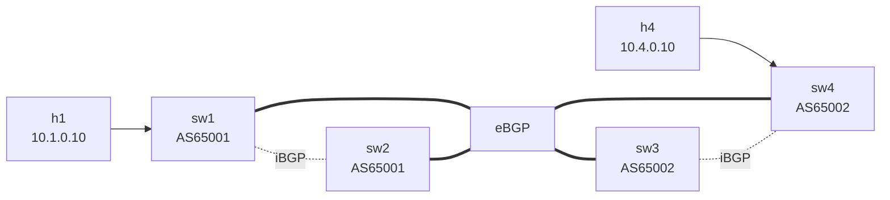

# Lab 22 — BGP Path Selection

> **Format:** Hands-on. Two ASes with two parallel eBGP paths between them. You'll deliberately steer traffic using local-preference, AS-path prepend, and MED. Reference answer in [`solutions/`](solutions/).
>
> **Story chapter:** Phase 5 · Senior IC · Year 2.5. The Company contracted with a second upstream ISP for redundancy. ISP1 is faster but expensive (premium routes); ISP2 is cheaper but higher-latency. You want most outbound via ISP1, but inbound traffic should come back via ISP2 to save money. The finance team wants the bill optimized. See [`STORY.md`](../../STORY.md).

## Real-world scenario

You're peering with two upstream ISPs (or two paths through one ISP, or two paths to a partner network). Both work, but:

- Upstream A has higher bandwidth → you want most outbound traffic to go that way.
- Upstream B is cheaper per-byte → you want most inbound traffic to come from there to save money.
- A is failing some packets in the past hour → you want to temporarily prefer B without disabling A entirely.

BGP gives you a toolkit of **attributes** to express exactly these preferences:

- **Local-preference** controls your **outbound** path (you decide which upstream you send to).
- **AS-path prepending** and **MED** influence the **other AS's choice** (you suggest which path they should send to you on).

Knowing which attribute does what — and especially which works outbound vs inbound — is the bread and butter of every multi-homed network.

## Goal

By the end you should be able to answer:

- What's the **BGP best-path selection algorithm** (the 13-step decision process)?
- Which attribute affects YOUR outbound? Which affects the PEER's inbound (i.e., your inbound)?
- What's the difference between **local-preference** and **MED**?
- Why is **AS-path prepending** a coarse, polite suggestion rather than a hard control?
- What's **`next-hop-self`** and when do you need it?

## Topology



Two ASes, two inter-AS links, iBGP inside each AS. sw1 has TWO paths to reach `10.4.0.0/24` (h4):
- **Path A**: sw1 → sw3 (eBGP) → sw4 (iBGP) → h4
- **Path B**: sw1 → sw2 (iBGP) → sw4 (eBGP) → h4

Tweak attributes to flip between them.

## Theory primer

### The BGP decision process

When multiple BGP routes exist for the same prefix, BGP picks one **best path** to install in the IP RIB. The decision process is **strictly ordered**:

1. **Weight** (Cisco-only; locally significant, highest wins)
2. **Local-preference** (higher wins) — set per-router, shared via iBGP
3. **Locally originated** (own `network`/`redistribute` routes beat learned ones)
4. **AS-path length** (shorter wins)
5. **Origin** (IGP < EGP < incomplete; IGP wins)
6. **MED** (lower wins; compared only between routes from same neighbor AS by default)
7. **eBGP over iBGP**
8. **IGP metric to next-hop** (lower wins)
9. **Oldest route** (in some platforms)
10. **Lowest router-ID**
11. **Lowest cluster-list length** (for RR-reflected routes)
12. **Lowest neighbor address**
13. **ECMP if multipath enabled**

In practice, steps 1–4 are the ones operators routinely manipulate. The rest are tiebreakers.

### Outbound vs inbound control

Critical distinction:

- **`local-preference`** lives only inside your AS (carried by iBGP, never crosses eBGP boundary). YOU control which exit your traffic takes. **Outbound traffic engineering.**
- **`AS-path prepend`** — you make your route look "longer" when advertising to a specific peer, so OTHER ASes pick a different path to send to you. **Inbound traffic engineering, hint-only** (the other AS can override).
- **`MED`** (Multi-Exit Discriminator) — when an AS has multiple links to YOU, you can hint which one you want them to use. Lower is preferred. Compared only between routes from the same AS by default (`bgp always-compare-med` overrides). **Inbound hint, more specific than AS-path prepend.**
- **`Communities`** — tags that you and your peer pre-agree on, e.g., "community 65002:100 means deprefer this route from your end". Both inbound and outbound by convention. Covered in lab 23.

### Local-preference: outbound

Default local-pref is 100. To prefer routes via sw3 on sw1's side, mark inbound routes from sw3 with local-pref 200. iBGP then carries the local-pref into sw2's BGP RIB too — both routers in AS 65001 will prefer the sw1→sw3 path for any traffic to AS 65002.

```
route-map PREFER-SW3 permit 10
   set local-preference 200

neighbor 10.13.0.2 route-map PREFER-SW3 in
```

`in` direction: applied to routes received from sw3 BEFORE they enter the BGP RIB.

### AS-path prepend: inbound (hint)

To make AS 65001 prefer the sw2-sw4 path inbound (i.e., make sw3 look less attractive from AS 65001's perspective), sw3 prepends its own AS twice when advertising to sw1:

```
route-map LONGER-PATH-TO-SW1 permit 10
   set as-path prepend 65002 65002

neighbor 10.13.0.1 route-map LONGER-PATH-TO-SW1 out
```

`out` direction: applied to routes advertised TO sw1.

sw1 sees AS-path = `[65002 65002 65002]` via this peer (the prepended 65002 65002 + the real one). Through sw2 it sees AS-path = `[65002]`. Step 4 of decision process: shorter wins → sw1 picks the sw2 path.

**This is a hint, not a guarantee.** If sw1 has a local-pref override, that beats AS-path. The peer might also override AS-path via their own policy. It works in practice because most networks just trust shortest-AS-path.

### MED: inbound (hint, more specific)

MED applies when one AS has multiple peering points with another AS. AS 65002 (sw3, sw4) has two ways for AS 65001 to send traffic to `10.4.0.0/24`: via sw3 or via sw4.

AS 65002 can suggest "prefer sw3" by setting **lower MED** on sw3's advertisement than sw4's:

```
! On sw4 (the "less preferred" exit):
route-map HIGH-MED permit 10
   set metric 100

! On sw3 (the "more preferred" exit):
route-map LOW-MED permit 10
   set metric 50
```

By default, MED is compared **only between routes from the same neighboring AS** — if you're worried about that constraint, `bgp always-compare-med` removes it.

### `next-hop-self` on iBGP

When sw3 sends a route to its iBGP peer sw4, the BGP next-hop is by default the **original eBGP peer** (sw1's IP `10.13.0.1`). sw4 may have no route to `10.13.0.1` in its IGP. If so, the iBGP route is unreachable on sw4 and gets dropped.

**`next-hop-self`** tells sw3: "when reflecting to your iBGP peer, set the next-hop to MY loopback (or interface), not the external one." That way sw4 only needs IGP reachability to sw3, not to AS 65001's transit subnet.

Always `next-hop-self` on iBGP peerings, unless you specifically want the original next-hop carried (rare).

In this lab, transit subnets are NOT in OSPF (there's no OSPF here at all; we're using the eBGP edges as the only L3 connectivity). `next-hop-self` is essential or iBGP routes are unreachable.

## Your task

### Phase 0 — observe the baseline

Deploy starter. Without any policy:

```bash
docker exec -it clab-bgp-path-selection-sw1 Cli
show ip bgp 10.4.0.0/24
```

Both paths are present. The best path is chosen by the decision process. Trace the path:

```bash
docker exec clab-bgp-path-selection-h1 traceroute -n 10.4.0.10
```

Note which path is taken.

### Phase 1 — local-preference (outbound from AS 65001)

On sw1, make routes learned from sw3 carry **local-pref 200**. Verify sw1 (and sw2 via iBGP) now prefer the sw3 path regardless of AS-path.

### Phase 2 — AS-path prepend (inbound to AS 65001)

Remove the local-pref change. On sw3, **prepend AS-path twice** when advertising to sw1. Verify sw1 picks the sw2-sw4 path (because AS-path via sw3 is now longer).

### Phase 3 — MED (inbound hint, more granular)

Remove the AS-path prepend. On sw4, **set higher MED** outbound to sw2; on sw3, set **lower MED** outbound to sw1. Verify sw1 prefers sw3.

### Phase 4 — combine and observe priority

Apply BOTH local-pref (Phase 1) and AS-path prepend (Phase 2). Watch which wins. Local-pref earlier in the decision process → it wins.

## Hints

Route-map syntax:

```
route-map <name> permit 10
   set local-preference <n>
   set metric <n>
   set as-path prepend <asn> <asn> ...

! Apply to a neighbor inbound or outbound:
neighbor <peer> route-map <name> in    ! inbound — affects what YOU receive
neighbor <peer> route-map <name> out   ! outbound — affects what THEY receive
```

`next-hop-self` (already in the starter on iBGP neighbors):

```
neighbor <ibgp-peer> next-hop-self
```

Verification:

```
show ip bgp                                ! see all paths
show ip bgp 10.4.0.0/24                    ! detail per prefix
show ip route 10.4.0.0/24                  ! winning path in RIB
show ip bgp neighbors <peer> received-routes
show ip bgp neighbors <peer> advertised-routes
clear ip bgp <peer> soft in                ! re-process inbound policy without dropping session
clear ip bgp <peer> soft out               ! re-process outbound policy without dropping session
```

## Deploy

```bash
cd ~/containerlab/labs/22-bgp-path-selection
sudo containerlab deploy
```

## Verification

### 1. Baseline path

```bash
docker exec -it clab-bgp-path-selection-sw1 Cli
show ip bgp 10.4.0.0/24
```

You should see two paths. Best (marked `>`) is whichever wins by default tiebreakers.

```bash
docker exec clab-bgp-path-selection-h1 traceroute -n 10.4.0.10
```

Note the route taken.

### 2. Local-pref to prefer sw3 path

After applying the route-map on sw1:

```
clear ip bgp 10.13.0.2 soft in
show ip bgp 10.4.0.0/24
```

The sw3-learned route now shows local-preference 200. Best path is via sw3.

```bash
docker exec clab-bgp-path-selection-h1 traceroute -n 10.4.0.10
```

Path: h1 → sw1 → sw3 → sw4 → h4.

### 3. Remove local-pref, apply AS-path prepend on sw3

```
configure terminal
  router bgp 65001
    address-family ipv4
      no neighbor 10.13.0.2 route-map PREFER-SW3 in

clear ip bgp 10.13.0.2 soft in
```

On sw3:

```
configure terminal
  router bgp 65002
    address-family ipv4
      neighbor 10.13.0.1 route-map LONGER-PATH-TO-SW1 out

clear ip bgp 10.13.0.1 soft out
```

On sw1:

```
show ip bgp 10.4.0.0/24
```

The sw3-path now has AS-path `[65002 65002 65002]`, sw2-path has `[65002]`. Best = via sw2.

```bash
docker exec clab-bgp-path-selection-h1 traceroute -n 10.4.0.10
```

Now: h1 → sw1 → sw2 → sw4 → h4.

### 4. Remove AS-path prepend, apply MED

On sw3:

```
no neighbor 10.13.0.1 route-map LONGER-PATH-TO-SW1 out
```

On sw4:

```
route-map HIGH-MED permit 10
   set metric 100

router bgp 65002
   address-family ipv4
      neighbor 10.24.0.2 route-map HIGH-MED out
```

On sw3:

```
route-map LOW-MED permit 10
   set metric 50

router bgp 65002
   address-family ipv4
      neighbor 10.13.0.1 route-map LOW-MED out
```

Clear the relevant outbound caches:

```
clear ip bgp 10.13.0.1 soft out      ! on sw3
clear ip bgp 10.24.0.2 soft out      ! on sw4
```

On sw1:

```
show ip bgp 10.4.0.0/24
```

The sw3-path now has MED 50, sw2-path has MED 100. Best = sw3 (lower MED).

### 5. Local-pref + AS-path: which wins?

Re-apply local-pref 200 on sw1's inbound from sw3 AND leave the AS-path prepend in place. Local-pref (step 2) wins over AS-path (step 4). sw1 picks sw3 despite the prepend.

## Peek at solution

- [`solutions/sw1.cfg`](solutions/sw1.cfg), [`solutions/sw2.cfg`](solutions/sw2.cfg), [`solutions/sw3.cfg`](solutions/sw3.cfg), [`solutions/sw4.cfg`](solutions/sw4.cfg)

## Concepts cheat-sheet

- **Best-path decision** — strict 13-step order. Weight → local-pref → AS-path → origin → MED → eBGP-over-iBGP → IGP metric → tiebreakers.
- **Local-preference** — controls YOUR outbound; iBGP-carried; doesn't cross eBGP.
- **AS-path prepend** — coarse inbound hint; "make my path look longer" so others avoid me.
- **MED** — fine inbound hint between same neighbor AS; lower is preferred.
- **`next-hop-self`** — iBGP only; rewrites next-hop to your local interface so peers don't need transit IPs in their IGP.
- **`clear ip bgp X soft in/out`** — re-process policy without dropping the TCP session. Always preferred over hard clear.

## Operational tips

- **Local-pref is your hammer** for outbound steering. Use it for primary/backup ISP selection, blackholing, etc.
- **AS-path prepend is your polite suggestion** for inbound. Two prepends works for most peers; some downstreams ignore prepends entirely.
- **MED is for sibling sites of one neighbor AS** — most useful when peering with a single ISP at multiple POPs.
- **Communities are the "real" inbound TE knob** in modern designs — most large ISPs publish supported communities (e.g., "tag with 65010:101 to set local-pref 50 inside our AS"). Lab 23.
- **Document why each route-map exists** — operational reviewers six months later will thank you.
- **Always `clear ip bgp ... soft`** for policy changes. Hard clears reset sessions and drop traffic.

## What's missing (deliberately)

- **Communities** — lab 23.
- **Multi-homing patterns (multi-AS, ASes-on-a-stick, etc.)** — lab 24.
- **Internet-edge TE in practice** — lab 24.
- **ECMP / multipath** — `maximum-paths` knob; not deeply covered here.

## Cleanup

```bash
sudo containerlab destroy --cleanup
```
