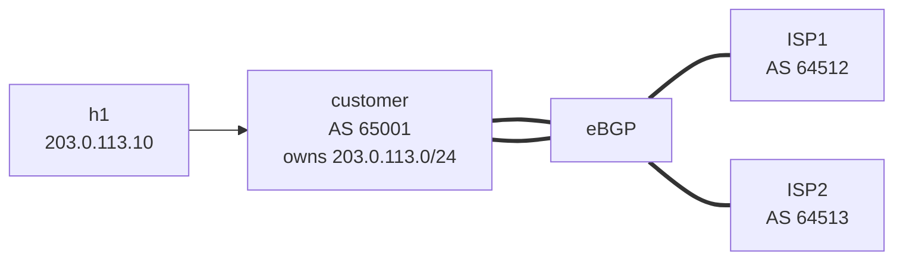

# Lab 23 — BGP Route Policy

> **Format:** Hands-on. One customer router multi-homed to two ISP routers. Apply prefix-lists, route-maps, and community-based policy to filter inbound junk, tag by source, and prevent accidentally becoming a transit provider. Reference answer in [`solutions/`](solutions/).
>
> **Story chapter:** Phase 5 · Senior IC · Year 2.5. Both ISPs are blasting their full table at you, including bogons (`10.0.0.0/8`, `192.168.0.0/16`) and your own /22 mirrored back. Worse: by default, BGP would happily re-advertise ISP1's routes to ISP2, turning you into free transit. You need real inbound + outbound policy on every peering. See [`STORY.md`](../../STORY.md).

## Real-world scenario

You're a customer multi-homed to two upstream ISPs. By default, BGP is **wildly trusting**: ISP1 and ISP2 will gladly send you every route they have, including:
- **Bogons** — addresses that should never be on the public internet (`10.0.0.0/8`, `192.168.0.0/16`, etc.). If you accept these, your traffic to legitimate destinations may black-hole.
- **Your own prefix** — both ISPs see your `203.0.113.0/24` from each other and will happily try to re-advertise it back to you. Without filtering, you might accept it and create a loop.
- **Everything** — full internet table (1M+ routes). You probably don't have memory for that on every router; you want just enough to make path decisions.

And from the **outbound** side, you must never advertise routes you don't own. If you accidentally announce ISP1's prefixes to ISP2 (because BGP has a default permit policy), you've turned yourself into a transit provider — your interconnect bandwidth handles ISP1↔ISP2 traffic that has nothing to do with you. **This is the classic "BGP leak" that has taken down chunks of the internet many times.**

Three policy mechanisms close these gaps:

- **prefix-list** — filter routes by destination prefix
- **route-map** — apply complex policy (match + set + permit/deny) per neighbor per direction
- **community** — tag routes with metadata for downstream policy decisions

This lab applies all three.

## Goal

By the end you should be able to answer:

- What's the difference between a **prefix-list** and an **access-list** for BGP filtering?
- How do **route-maps** chain match+set conditions?
- What's a **BGP community**, and how does it carry policy intent across routers?
- What's an **outbound advertisement policy**, and why is "permit only my own prefixes" the right default?
- Why is **inbound bogon filtering** a defense-in-depth even when ISPs claim they filter their own announcements?

## Topology



One customer router peering with two simulated ISPs. ISPs advertise a mix of legitimate prefixes, bogons, and the customer's own /24 (to demonstrate filtering).

## Theory primer

### prefix-list

A list of prefix patterns with permit/deny actions. Used to filter routes by destination prefix.

```
ip prefix-list BOGONS seq 10 permit 0.0.0.0/8 le 32
ip prefix-list BOGONS seq 20 permit 10.0.0.0/8 le 32
ip prefix-list BOGONS seq 30 permit 169.254.0.0/16 le 32
...
```

Each entry: a base prefix + optional length modifier (`le` = less than or equal to, `ge` = greater than or equal to).

- `permit 10.0.0.0/8` — matches exactly `10.0.0.0/8`, nothing else.
- `permit 10.0.0.0/8 le 32` — matches any subnet under `10.0.0.0/8` (10.0.0.0/8, 10.0.0.0/24, 10.5.5.5/32, etc.).
- `permit 0.0.0.0/0 ge 25` — matches any prefix /25 or longer (used to filter "too-specific" routes).

In a route-map context, prefix-lists are usually invoked via `match ip address prefix-list <name>`.

### Why prefix-list over access-list

ACLs work but treat prefix lengths as masks (clunky). Prefix-lists understand prefixes natively. Always use prefix-lists for BGP filtering.

### route-map

A route-map is an **ordered list of `permit` / `deny` clauses**, each with **match** conditions and **set** actions. Applied to a BGP neighbor inbound or outbound.

```
route-map FROM-ISP1 deny 10
   match ip address prefix-list BOGONS
route-map FROM-ISP1 deny 20
   match ip address prefix-list OUR-PREFIXES
route-map FROM-ISP1 permit 100
   set community 65001:101
   set local-preference 200
```

Processing:
1. Each route is checked against clause 10. Match? → deny → drop the route.
2. No match? → continue to clause 20. Match? → deny.
3. No match? → clause 100. (Permit; set actions apply.)
4. **Implicit deny at the end** — anything not explicitly permitted is dropped.

The last-clause-permit-with-no-match pattern (just `permit 100` with no `match`) is the common "permit everything else" idiom.

Apply to a neighbor:

```
neighbor X route-map FROM-ISP1 in     ! affects inbound
neighbor X route-map TO-ISP out       ! affects outbound
```

### Community

A **community** is a 32-bit tag attached to a route. Conventionally written as `<asn>:<value>` (e.g., `65001:101`). Has no inherent meaning — meaning is established by **agreement between operators**.

Common uses:
- **Internal tagging**: tag routes by source ISP, then use the tag to drive local-pref or other policy.
- **Customer signaling**: ISPs publish lists like "tag a route with 64512:200 and we'll set local-preference 50 inside our AS" — letting customers do basic TE via tags.
- **Geographic/role classification**: communities indicating "this prefix is in Europe", "this is a customer route", etc.

To match on community:

```
ip community-list FROM-ISP1 permit 65001:101

route-map LOCAL-POLICY permit 10
   match community FROM-ISP1
   set local-preference 200
```

To send communities to a neighbor, you must explicitly enable it (off by default for security):

```
neighbor X send-community
```

### Inbound policy: filter the firehose

A typical customer-of-ISP inbound policy:
1. **Reject bogons** — drop anything in private/reserved/multicast ranges.
2. **Reject your own prefixes** — don't accept routes for things you announce yourself.
3. **Reject too-specific** — anything longer than /24 (or /48 for IPv6) is suspect; could be a leak or hijack.
4. **Tag with community** — note which ISP this came from.
5. **Set local-preference** — based on which ISP and possibly the community received.

### Outbound policy: be a good citizen

For a customer (not a transit provider):
- **Announce ONLY your own prefixes.** Never transit between ISPs.
- **Strip private/internal communities** before sending out (your internal communities are not for public consumption).

For a transit provider:
- More complex — customers, peers, and upstreams each get different prefix sets and community-based policies.

## Your task

1. Build a **bogon prefix-list** with the classic bogon ranges (`0.0.0.0/8`, `10.0.0.0/8`, `100.64.0.0/10`, `127.0.0.0/8`, `169.254.0.0/16`, `172.16.0.0/12`, `192.0.2.0/24`, `192.168.0.0/16`, `198.18.0.0/15`, `224.0.0.0/4`, `240.0.0.0/4`).
2. Build an `OUR-PREFIXES` prefix-list with `203.0.113.0/24`.
3. Inbound from ISP1: deny BOGONS, deny OUR-PREFIXES, permit everything else with community `65001:101` and local-preference 200.
4. Inbound from ISP2: same but community `65001:102` and local-preference 100.
5. Outbound to BOTH ISPs: only advertise OUR-PREFIXES. Implicit deny on everything else.
6. Enable `send-community` on both neighbors so the tags propagate.
7. Verify: bogons are filtered, your own prefix isn't re-accepted, ISP1 is preferred (lp 200 > 100), and you don't transit between ISPs.

## Hints

prefix-list:

```
ip prefix-list NAME seq <n> permit <prefix>/<len> [le <len>] [ge <len>]
```

community-list (filter by community):

```
ip community-list NAME permit <community>
```

route-map:

```
route-map NAME { permit | deny } <seq>
   match ip address prefix-list <name>
   match community <name>
   set local-preference <n>
   set community <comm>
   set as-path prepend <asn> ...
```

Apply:

```
neighbor X route-map NAME { in | out }
neighbor X send-community
```

Verification:

```
show ip prefix-list
show ip community-list
show route-map
show ip bgp                                  ! see filtered RIB
show ip bgp 1.0.0.0/24                       ! detail (incl. community)
show ip bgp neighbors X advertised-routes    ! what YOU send
show ip bgp neighbors X received-routes      ! what THEY send (pre-policy)
show ip bgp regexp <pattern>                 ! filter by AS-path regex
```

## Deploy

```bash
cd ~/containerlab/labs/23-bgp-route-policy
sudo containerlab deploy
```

## Verification

### 1. Baseline (no policy) — observe the mess

```bash
docker exec -it clab-bgp-route-policy-customer Cli
show ip bgp summary
show ip bgp
```

You should see:
- ISP1 sending you `0.0.0.0/8`, `192.168.0.0/16`, `203.0.113.0/24` (bogons + your own /24!)
- ISP2 sending similar junk
- Your BGP RIB filled with garbage routes

```bash
docker exec clab-bgp-route-policy-customer Cli -c "show ip bgp 0.0.0.0/8"
```

The bogon is present. Without filtering, your default-route handling could route legitimate traffic into oblivion.

### 2. Apply inbound policy on both neighbors

After applying the route-maps:

```
clear ip bgp 198.51.100.2 soft in
clear ip bgp 198.51.100.6 soft in
show ip bgp
```

Bogons gone. Your own /24 is no longer accepted from either ISP. Each remaining route is tagged with its source community.

```
show ip bgp 1.0.0.0/24
```

Should show:
- AS-path: `64512`
- Community: `65001:101`
- Local-preference: `200`

```
show ip bgp 1.1.1.0/24
```

- AS-path: `64513`
- Community: `65001:102`
- Local-preference: `100`

### 3. Best-path uses local-pref

If a prefix is advertised by both ISPs, you should prefer ISP1's version (lp 200).

In this lab, no prefix is advertised by both, but you can simulate: have ISP2 advertise `1.0.0.0/24` too:

```bash
docker exec -it clab-bgp-route-policy-isp2 Cli
configure terminal
  ip route 1.0.0.0/24 Null0
  router bgp 64513
    address-family ipv4
      network 1.0.0.0/24
```

Now on customer:

```
show ip bgp 1.0.0.0/24
```

Two paths. Best (marked `>`) should be via ISP1 (local-pref 200).

### 4. Outbound policy — only your /24 leaves

```
show ip bgp neighbors 198.51.100.2 advertised-routes
show ip bgp neighbors 198.51.100.6 advertised-routes
```

Only `203.0.113.0/24` should be in both lists. Even though you've learned routes from both ISPs, you're NOT advertising them to each other — you're not a transit.

Verify on the ISP side:

```bash
docker exec -it clab-bgp-route-policy-isp2 Cli
show ip bgp
```

ISP2 sees `203.0.113.0/24` from customer, but NOT `1.0.0.0/24` (which would mean customer is leaking ISP1's routes).

### 5. The "leak demo" — see what happens without outbound filtering

Remove the outbound route-map on customer temporarily:

```
router bgp 65001
   address-family ipv4
      no neighbor 198.51.100.2 route-map TO-ISP out
      no neighbor 198.51.100.6 route-map TO-ISP out

clear ip bgp 198.51.100.2 soft out
clear ip bgp 198.51.100.6 soft out
```

On ISP2:

```
show ip bgp
```

ISP2 now sees ALL of ISP1's routes (`1.0.0.0/24`, `8.8.8.0/24`, etc.) via customer! You've become a transit between them. In real life, this is a **BGP leak** — has caused real outages affecting millions.

Re-apply the outbound filter immediately:

```
router bgp 65001
   address-family ipv4
      neighbor 198.51.100.2 route-map TO-ISP out
      neighbor 198.51.100.6 route-map TO-ISP out
```

### 6. Try a community-based action

Bonus: add a route-map that does something based on community. For example, deprefer any route tagged `65001:102` (from ISP2):

```
route-map ADJUST-LP permit 10
   match community FROM-ISP2
   set local-preference 50
route-map ADJUST-LP permit 100
```

Apply somewhere in your processing chain. This shows how communities carry policy intent through the network — you make a decision on one router, others can act on the tag downstream.

## Peek at solution

- [`solutions/customer.cfg`](solutions/customer.cfg), [`solutions/isp1.cfg`](solutions/isp1.cfg), [`solutions/isp2.cfg`](solutions/isp2.cfg)

## Concepts cheat-sheet

- **prefix-list** — ordered list of prefix patterns; the BGP-native way to filter by destination.
- **route-map** — match-and-set policy clauses; sequence-ordered; implicit deny at end.
- **community** — 32-bit policy tag, `asn:value` form. Conventionally meaningful only by operator agreement.
- **send-community** — must be explicitly enabled per neighbor; off by default.
- **Inbound policy (`route-map ... in`)** — filter what you accept.
- **Outbound policy (`route-map ... out`)** — filter what you advertise.
- **`clear ip bgp X soft in/out`** — apply policy changes without dropping the TCP session.
- **Implicit deny** — anything not explicitly permitted by a route-map is dropped.

## Production tips

- **Always have inbound bogon filtering**, even if your ISP claims they filter. Defense in depth.
- **Always have outbound prefix filtering** — match only the prefixes you own. This prevents accidental transit.
- **Document every route-map** with descriptions. Operational reviewers will thank you.
- **Use community-driven design** — set tags inbound, act on tags everywhere else. Decouples discovery from action.
- **Use `bgp maximum-routes` and `neighbor X maximum-routes`** to limit how many prefixes a neighbor can advertise — protects against accidental floods.
- **Use IRR/RPKI validation** for prefix-list generation — see lab 25.
- **Test policy in staging** — apply soft-clear, verify diff with `show ip bgp neighbors X received-routes`, then production.
- **Don't `clear ip bgp *`** in production — that resets every session at once. Use targeted clears.

## What's missing (deliberately)

- **AS-path access-lists** — for filtering by AS-path regex (e.g., "drop any route whose AS-path contains certain bad ASes"). Common production tool; not deeply covered here.
- **`bgp maximum-routes`** — covered briefly above; lab 26 dives into operational tuning.
- **RPKI / IRR-derived prefix-lists** — lab 25.
- **More complex communities (large communities, extended communities)** — lab 25 / chapter 7.

## Cleanup

```bash
sudo containerlab destroy --cleanup
```
