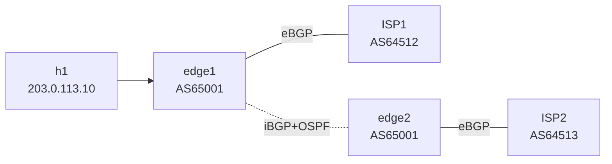

# Lab 24 — BGP at the Internet Edge

> **Format:** Hands-on. Customer with two edge routers, each peering with a different ISP. Apply the canonical "default-only inbound, own-prefixes outbound, AS-prepend for inbound TE" pattern. Reference answer in [`solutions/`](solutions/).
>
> **Story chapter:** Phase 5 · Senior IC · Year 2.5. Putting the pieces together: The Company's proper customer-facing edge. Two edge routers (one per ISP for hardware redundancy), iBGP between them, default-only inbound from each ISP (no need for a full table on these boxes), AS-prepend for inbound TE, floating static for the doomsday "both BGP sessions are down somehow" scenario. See [`STORY.md`](../../STORY.md).

## Real-world scenario

You operate a small-to-medium business with a public `/24`. You've contracted with two ISPs for redundancy. Today:

- Both ISPs offer to send you the full internet routing table (~1M prefixes). Your edge routers are sized for that, but most of your decisions don't benefit from it.
- You want to **prefer ISP1 for outbound** (cheaper transit) AND **prefer inbound via ISP1** (faster path to your customers).
- If ISP1 dies entirely, you want traffic to fail over to ISP2 automatically.
- If BOTH BGP sessions die (control-plane bug, both routers reload), you want a static last-resort path so things don't go fully offline.

This is the canonical small-business / mid-size DC internet-edge design. The patterns generalize directly to larger setups.

## Goal

By the end you should be able to answer:

- Why is **default-route inbound** often preferable to a full table?
- How do you prefer one ISP **outbound** (lp / TE), and how do you influence **inbound** (AS-prepend / MED / communities)?
- What's a **floating static default**, and when is it the right last-resort?
- How does the iBGP backbone between two edge routers actually work? Why does each edge need to advertise its own prefix?
- What's **`next-hop-self`** doing here, again?

## Topology



Two customer-side routers (edge1, edge2) form a small internal fabric. Each peers with one ISP. iBGP + OSPF carry state between them.

## Theory primer

### Default-only vs full-table inbound

**Full table** (default behavior most ISPs offer):
- ~1M IPv4 prefixes
- Lets your edge make per-destination decisions ("for this prefix, ISP1 has shorter AS-path, use that one")
- Requires routers with enough memory/CPU for the table (modern hardware is fine, older not)
- More accurate path selection but more state to manage

**Default-only** (request from your ISP):
- Just `0.0.0.0/0` per session
- Tiny RIB
- Path selection between ISPs is based on which ISP's default has lower AD/local-pref — coarse
- Common pattern for small businesses, branches, or edges with limited resources

**Partial table**: middle ground. Get a default + customer routes + your immediate region. Some ISPs offer this via community-based filters.

For this lab: we use default-only as the canonical pattern.

### Outbound preference (you control)

`local-preference` set via inbound route-map. Higher = preferred. Within your AS, iBGP carries local-pref to every router, so the whole AS routes outbound the same way.

We set lp 200 on default from ISP1, lp 100 on default from ISP2 → all outbound traffic exits via edge1 → ISP1. If ISP1 disappears, lp 100 default from ISP2 wins.

### Inbound preference (hint to upstream)

You can't force what other ASes do, only suggest. Two main mechanisms:

- **AS-path prepend** — make your prefix look "longer" when advertised to the less-preferred upstream. Other ASes consider longer AS-path as "worse" in step 4 of decision process.
- **Communities** — many ISPs publish community values you can tag with to influence their internal decisions (e.g., "tag with 64512:50 to set local-pref 50 inside our network"). More precise than prepending.

We use AS-prepend in this lab. ISP2's view of your /24 has AS-path `[65001 65001 65001]` (your AS twice prepended + the real one), ISP1's view has `[65001]`. The rest of the internet sees ISP1's path as shorter → returns traffic via ISP1.

### Floating static default

The BGP-learned defaults rely on the BGP sessions being up. If BOTH sessions drop (rare but possible — both ISPs misconfigure simultaneously, both routers reload during a maintenance window mis-sequenced), you have NO default route. Even though the physical link to the ISP is still up.

**Floating static default**: `ip route 0.0.0.0/0 <isp-next-hop> 250` (AD 250). Sits dormant while a BGP default exists (BGP eBGP default AD = 20, iBGP = 200, both lower than 250). If both disappear, the static is installed → traffic still goes out (to whichever ISP you pointed it at), at least until BGP recovers.

Belt-and-suspenders for true outage scenarios.

### iBGP backbone between edges

edge1 and edge2 are in the same AS. They peer via iBGP. Why?

- edge1 learns prefixes from ISP1; edge2 from ISP2. **They need to share what they learned** so both know about all available outbound paths.
- They both originate `203.0.113.0/24`. Without iBGP, neither would know the other is also announcing it — making failover broken.
- If edge1 disappears, edge2 still announces `203.0.113.0/24` to ISP2 — inbound traffic continues via ISP2.

`next-hop-self` is essential: when edge1 learns ISP1's default (next-hop = ISP1's interface IP `198.51.100.2`) and sends it to edge2 via iBGP, edge2 wouldn't know how to reach `198.51.100.2` unless it had a route to that subnet. `next-hop-self` makes edge1 rewrite the next-hop to its own loopback when advertising the route to edge2 over iBGP. edge2 has OSPF reachability to edge1's loopback. ✅

## Your task

1. On edge1:
   - **Inbound from ISP1**: accept ONLY `0.0.0.0/0`, tag with community `65001:101`, and **set local-preference 200** so the whole AS prefers ISP1 outbound.
   - **Outbound to ISP1**: advertise ONLY your `203.0.113.0/24`.
   - Add a **floating static default** via ISP1's next-hop with AD 250.
2. On edge2:
   - **Inbound from ISP2**: accept ONLY `0.0.0.0/0`, tag with community `65001:102`, and **set local-preference 100** (lower than ISP1's 200, so ISP2's default is the backup).
   - **Outbound to ISP2**: advertise your `/24` BUT **prepend AS-path twice** so external ASes prefer your ISP1 path inbound.
   - Add a similar floating static default via ISP2's next-hop.
3. Verify h1 can reach external prefixes via ISP1 normally; via ISP2 when ISP1 is dead.
4. Verify the BGP RIB on both edges shows the expected default + community tags.

## Hints

```
ip prefix-list DEFAULT-ONLY seq 10 permit 0.0.0.0/0
ip prefix-list OWN-PREFIXES seq 10 permit 203.0.113.0/24

route-map FROM-ISPx permit 10
   match ip address prefix-list DEFAULT-ONLY
   set local-preference <higher on the preferred ISP, lower on the other>
   set community <community>
route-map FROM-ISPx deny 99      ! drop everything else

route-map TO-ISPx permit 10
   match ip address prefix-list OWN-PREFIXES
   ! Optional: set as-path prepend <asn> <asn> on the less-preferred upstream

ip route 0.0.0.0/0 <next-hop> 250
```

Verification:

```
show ip bgp
show ip route 0.0.0.0/0
show ip bgp 0.0.0.0/0
show ip bgp neighbors <peer> received-routes
show ip bgp neighbors <peer> advertised-routes
```

## Deploy

```bash
cd ~/containerlab/labs/24-bgp-internet-edge
sudo containerlab deploy
```

## Verification

### 1. Inbound filtered to default-only

After applying inbound policies on both edges:

```
docker exec -it clab-bgp-internet-edge-edge1 Cli
show ip bgp
```

Should show only `0.0.0.0/0` learned from 198.51.100.2 (ISP1). Other prefixes from ISP1 (`1.1.1.0/24`, etc.) are filtered.

```
show ip bgp 0.0.0.0/0
```

Community: `65001:101`. Local-preference: `200`. Tagged and preferred appropriately.

On edge2, the same command shows the iBGP-learned default from edge1 (lp 200, next-hop = edge1's loopback `10.0.0.1`) winning over edge2's own eBGP default from ISP2 (lp 100). That's what makes the **whole AS** egress via ISP1 — not just h1's flow. Confirm with:

```
docker exec -it clab-bgp-internet-edge-edge2 Cli
show ip route 0.0.0.0/0
```

The active default on edge2 points at `10.0.0.1` (edge1), not at ISP2.

### 2. Outbound is only OWN /24

```
show ip bgp neighbors 198.51.100.2 advertised-routes
```

Just `203.0.113.0/24`. No leakage of ISP1's defaults to ISP1, no transit of ISP2's stuff.

### 3. AS-prepend on edge2

```
docker exec -it clab-bgp-internet-edge-isp2 Cli
show ip bgp 203.0.113.0/24
```

AS-path: `65001 65001 65001` (your prepend × 2 + the original). ISP1's view of your /24 is just `[65001]`. Most other ASes will pick the shorter path → inbound via ISP1.

### 4. End-to-end test

`1.1.1.1` is a Loopback1 on each simulated ISP (a reachable target), so this ping actually succeeds:

```bash
docker exec clab-bgp-internet-edge-h1 ping -c 3 1.1.1.1
docker exec clab-bgp-internet-edge-h1 traceroute -n 1.1.1.1
```

Outbound path: h1 → edge1 → ISP1 (because lp 200 wins). ✅

> **Note on the simulated ISPs:** only `1.1.1.1` is pingable — it lives on `Loopback1` of each ISP. The other "internet" prefixes (`8.8.8.0/24`, `142.250.0.0/16`, `17.0.0.0/8`, `9.9.9.0/24`) point at `Null0` on the ISPs: they exist to fill the BGP table but **silently drop** any packet sent to them. Pinging those addresses will time out — that's expected, they're control-plane fill, not real hosts.

### 5. ISP1 failover demo

Kill edge1's eBGP session to ISP1:

```
docker exec -it clab-bgp-internet-edge-edge1 Cli
configure terminal
  interface Ethernet3
    shutdown
```

Wait a few seconds. Traffic should now follow:
- h1 → edge1 → (iBGP next-hop) edge2 → ISP2

```
show ip route 0.0.0.0/0
```

Should show default via iBGP next-hop (`10.0.0.2`, edge2's loopback), pointing to ISP2.

```bash
docker exec clab-bgp-internet-edge-h1 ping -c 3 1.1.1.1
```

Still ✅ — `1.1.1.1` is also a Loopback1 on ISP2, and ISP2 still has a BGP route back to `203.0.113.0/24` (edge2 originates it), so the return path works too. Failover succeeded.

Restore: `no shutdown` on Et3.

### 6. Both BGP sessions gone — floating static kicks in

This step demonstrates the doomsday case: BGP is down but the physical links are still up (e.g. a control-plane bug, or both ISPs withdrawing during a mis-sequenced maintenance window). We reproduce it by **shutting the BGP sessions, not the interfaces** — which is also the more realistic failure mode.

> **Why not `shutdown` the interface?** The floating static is a *recursive* static — `ip route 0.0.0.0/0 198.51.100.2 250`. If you shut `Ethernet3`, the connected `198.51.100.0/30` is withdrawn, so the next-hop `198.51.100.2` becomes unresolvable and EOS will **not** install the static at all — you'd see no default route, not the floating static. To see the floating static actually take over, the next-hop subnet must stay reachable, so we drop BGP at the session level and leave the link up.

On edge1, administratively shut the eBGP and iBGP sessions:

```
docker exec -it clab-bgp-internet-edge-edge1 Cli
configure terminal
  router bgp 65001
    neighbor 198.51.100.2 shutdown
    neighbor 10.0.0.2 shutdown
```

On edge2, do the same:

```
docker exec -it clab-bgp-internet-edge-edge2 Cli
configure terminal
  router bgp 65001
    neighbor 198.51.100.6 shutdown
    neighbor 10.0.0.1 shutdown
```

Both BGP defaults are gone:

```
docker exec -it clab-bgp-internet-edge-edge1 Cli
show ip bgp 0.0.0.0/0
```

No BGP entry. But the routing table now shows the **floating static** — because `Ethernet3` is still up, `198.51.100.2` is still resolvable, and with no BGP default the AD-250 static finally wins:

```
show ip route 0.0.0.0/0
```

Shows `0.0.0.0/0 [250/0] via 198.51.100.2` (the floating static). This is exactly the belt-and-suspenders behaviour you want: BGP fell over, but the edge still has a default route in its FIB, so it keeps forwarding outbound instead of going dark.

> **Why the ping still won't complete here:** in *this lab* the simulated ISP1 only learned `203.0.113.0/24` over the BGP session we just shut, so ISP1 no longer has a return route — `ping 1.1.1.1` will time out even though the floating static is installed and forwarding correctly outbound. That's an artefact of the simulated ISP, not the floating static. In the real world your upstream keeps a static/default toward your `/24` independent of BGP, so the floating static genuinely keeps you online while BGP recovers. The point of this step is the **routing-table behaviour** (`show ip route 0.0.0.0/0` proves the AD-250 static takes over only when every BGP default is gone), not an end-to-end ping.

Restore: `no neighbor ... shutdown` for each peer on both edges (or just redeploy).

## Peek at solution

- [`solutions/edge1.cfg`](solutions/edge1.cfg), [`solutions/edge2.cfg`](solutions/edge2.cfg), [`solutions/isp1.cfg`](solutions/isp1.cfg), [`solutions/isp2.cfg`](solutions/isp2.cfg)

## Concepts cheat-sheet

- **Default-only inbound** — request from ISP; tiny RIB; coarse path selection.
- **Full table inbound** — every prefix; precise path decisions; more memory.
- **Outbound preference**: local-pref (yours to set, intra-AS).
- **Inbound preference**: AS-prepend / communities (hints to other ASes).
- **Floating static default** — AD 250, last-resort when BGP defaults disappear.
- **iBGP next-hop-self** — must-have for iBGP between edges that learn from different eBGP sessions.

## Production design notes

- **Two edge routers minimum** for redundancy. Each with one ISP (or both ISPs on each, with full TE — more complex).
- **Don't use full-table on every edge** if you don't need it — saves memory and reduces blast radius.
- **AS-prepending more than 3 times is rude** — diminishing returns and some ASes treat very long paths as suspicious.
- **Use community-based TE** when your ISP supports it — more precise and reversible than prepending.
- **Test failover quarterly** — drop one BGP session in a maintenance window, verify traffic goes via the other. Production-validate the design.
- **Floating statics** — set them once, leave them alone. Document the destination so future operators know what they do.
- **MTU** — ensure your edge interfaces match ISP's MTU. Mismatches cause subtle pathological failures.

## What's missing (deliberately)

- **3+ ISP multi-homing** — same concepts, more interfaces.
- **Full-table specific tuning** — `maximum-routes`, prefix-list-derived community filtering, etc.
- **RPKI / IRR** — lab 25.
- **ASes-on-a-stick / multi-AS-via-one-router** — Niche.
- **Operational tuning (convergence, dampening)** — lab 26.

## Cleanup

```bash
sudo containerlab destroy --cleanup
```
