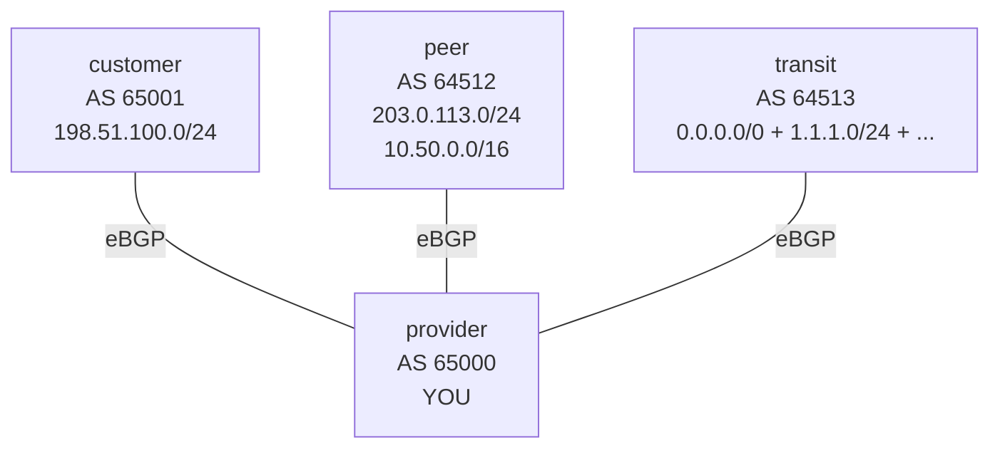

# Lab 25 — BGP: the Business Angle (Customer / Peer / Transit)

> **Format:** Hands-on + concept-heavy. One "provider" router with three neighbor types (customer, peer, transit). Apply the canonical **customer-peer-transit** policy that real ISPs use to make money and not lose money. Reference answer in [`solutions/`](solutions/).
>
> **Story chapter:** Phase 5 · Senior IC · Year 3. The Company pitched a small transit business — sell connectivity to other small companies in the region. The founders are excited; you're nervous because turning into a transit provider is exactly when BGP leaks become real outages that take down other people's businesses. You need to implement the customer/peer/transit policy framework that every legitimate ISP runs. See [`STORY.md`](../../STORY.md).

## Real-world scenario

You operate AS 65000. You have three kinds of BGP neighbors:

- **Customers** pay you (they buy transit service). Your job is to deliver their traffic to the rest of the internet.
- **Peers** swap traffic with you for free (typically through an IXP). You both benefit from the lower latency / lower cost of direct exchange vs going through transit.
- **Transit providers** charge you per megabit. They give you reachability to the entire internet.

The mistake that has caused **major real-world outages** (the 2008 Pakistan/YouTube hijack, the 2017 Google traffic leak through a small ISP, the 2019 Verizon route leak that took down Cloudflare for hours): announcing the wrong prefixes to the wrong neighbors. Specifically, announcing **transit-learned or peer-learned routes to other peers or transits**, accidentally making yourself a free transit between large networks. Your modest hardware suddenly becomes responsible for terabytes of traffic that has nothing to do with you, and **everything melts**.

This lab implements the **Gao-Rexford** routing policy — the formal name for "send customer routes to everyone, peer/transit routes to customers only." It's the policy every ISP runs, and the policy you should implement on any BGP router that interconnects with multiple peers.

## Goal

By the end you should be able to answer:

- What's the economic difference between **customer**, **peer**, and **transit**?
- What's the **Gao-Rexford routing policy** and why does it match the business model?
- How do **communities** make policy expressable and maintainable at scale?
- What's a **BGP leak**, and which class of mistake caused the famous internet outages?
- Why is **local-preference per neighbor type** the standard pattern (customer > peer > transit)?

## Topology



You sit in the middle. Three sessions, three completely different policies.

## Theory primer

### The three relationship types

| Type | Money flow | Why you keep them | What they advertise to you |
|---|---|---|---|
| **Customer** | They pay you | They buy reachability to the entire internet | Their own + their customers' prefixes |
| **Peer** | Neutral | Both sides save money by exchanging traffic directly instead of via paid transit | Their own + their customers' prefixes (NOT their transit-learned routes) |
| **Transit** | You pay them | They give you reachability to everything not behind a customer or peer | Full table (or default) |

### The Gao-Rexford routing policy

A short summary of routing policy that captures real-world economics:

1. **Tag routes inbound by the source's role.** (Customer, Peer, Transit.)
2. **Prefer customer-learned > peer-learned > transit-learned.** Because: cheaper paths for outbound. Customer paths are "free" (you'd transit them anyway). Peer paths are usually direct and free. Transit paths cost money — last resort.
3. **Outbound, who sees what:**
   - **To customers**: send EVERYTHING (your customers paid you for internet reach — they get the full picture).
   - **To peers**: send ONLY customer routes. (Peers don't pay you; you only let them reach your customers, not the rest of the internet through you.)
   - **To transits**: send ONLY customer routes. (Transits pay you to deliver your customers' traffic. You don't backhaul peer or other-transit traffic via them — you're paying them for delivery, not for transit-in-reverse.)

This is the rule. Every real ISP runs it. Variations exist (paid peering, partial transit, complex multi-hop relationships), but the base policy is the universal starting point.

### Communities as the implementation mechanism

How do you implement "this came from a peer, treat it as a peer route" everywhere in your network? **Tag with a community at the inbound boundary**, then match on the community for all subsequent decisions.

```
neighbor PEER-X route-map IN-FROM-PEER in

route-map IN-FROM-PEER permit 10
   set community 65000:200
   set local-preference 200
```

Now every other router in your AS sees the community and knows the route's classification, without needing to know which specific neighbor it came from. Decouples discovery from policy.

The community values are **operator convention**:
- `<your-asn>:100` — customer
- `<your-asn>:200` — peer
- `<your-asn>:300` — transit

Your team agrees on these once and uses them everywhere.

### IRR and RPKI (mention; not configured here)

**IRR (Internet Routing Registry)** — a public database of "AS X is authorized to announce prefix Y". Used to generate prefix-filters automatically:

```bash
bgpq4 -4 -A -l "AS65001-customer-filter" AS65001
```

Produces a prefix-list of every prefix AS65001 has registered the right to announce. Apply as inbound filter → reject anything outside.

**RPKI (Resource Public Key Infrastructure)** — cryptographic version of the same. Each prefix has a signed ROA (Route Origin Authorization) declaring "AS X is authorized to originate this prefix". Routers connect to an RPKI validator via the RTR protocol; routes whose origin doesn't match a valid ROA are marked **invalid** and dropped (or set to a lower local-preference).

A dedicated concept doc on IRR and RPKI is on the to-write list.

### Why "customer over peer over transit"

A simple economic mental model:

- Customer paths are like sending mail directly to the recipient — you wanted to do that anyway.
- Peer paths are like sending mail through a friend's network — free, often shorter.
- Transit paths are like hiring FedEx — expensive, last-resort.

When the same destination is reachable via multiple paths, you want the cheapest one. Local-pref orderings (300 customer > 200 peer > 100 transit) achieve this automatically.

## Your task

On provider:

1. Define **three inbound route-maps** (one per neighbor type) that:
   - Set community: `65000:100` (customer), `65000:200` (peer), `65000:300` (transit).
   - Set local-preference: 300, 200, 100 respectively.
2. Define **three outbound route-maps** following Gao-Rexford:
   - `OUT-TO-CUSTOMER`: permit on community FROM-CUSTOMER, FROM-PEER, FROM-TRANSIT (all three).
   - `OUT-TO-PEER`: permit ONLY on community FROM-CUSTOMER.
   - `OUT-TO-TRANSIT`: permit ONLY on community FROM-CUSTOMER.
3. Apply inbound + outbound on each neighbor + `send-community`.
4. Verify the expected RIB on each neighbor.

## Hints

CLI verbs you'll need (figure out the structure yourself):

- `ip community-list` — define a named list that matches one of your `<asn>:<value>` tags.
- `route-map ... permit` with `set community` / `set local-preference` — for inbound tagging.
- `route-map ... permit` with `match community` — for outbound filtering. Remember a route-map with multiple `permit` sequences is an OR across the matched communities, so "send customer + peer + transit" needs more sequences than "send customer only".
- `neighbor X route-map ... in` / `... out` — bind the maps per neighbor, per direction.
- `neighbor X send-community` — communities are NOT advertised by default; enable explicitly.

All of the route-map / neighbor commands that touch advertised prefixes live under `address-family ipv4`.

Verification (per neighbor):

```
show ip bgp neighbors <X> advertised-routes
show ip bgp neighbors <X> received-routes
show ip bgp community <community>
show ip bgp                                  ! see all RIB + communities + local-pref
```

## Deploy

```bash
cd ~/containerlab/labs/25-bgp-business
sudo containerlab deploy
```

## Verification

### 1. On provider, classify the routes

After applying the inbound route-maps:

```bash
docker exec -it clab-bgp-business-provider Cli
show ip bgp 198.51.100.0/24
```

- AS-path: `65001`
- Community: `65000:100` (customer)
- Local-pref: `300`

```
show ip bgp 203.0.113.0/24
```

- AS-path: `64512`
- Community: `65000:200` (peer)
- Local-pref: `200`

```
show ip bgp 1.1.1.0/24
```

- AS-path: `64513`
- Community: `65000:300` (transit)
- Local-pref: `100`

### 2. Outbound: customer sees everything

```
show ip bgp neighbors 192.0.2.2 advertised-routes
```

Should include `198.51.100.0/24` (themselves), `203.0.113.0/24`, `10.50.0.0/16` (peer), `0.0.0.0/0`, `1.1.1.0/24`, `8.8.8.0/24`, `142.250.0.0/16` (transit). The full picture.

### 3. Outbound: peer sees ONLY customer routes

```
show ip bgp neighbors 192.0.2.6 advertised-routes
```

Should include ONLY `198.51.100.0/24` (your customer's prefix). NO transit defaults, NO other peer routes.

### 4. Outbound: transit sees ONLY customer routes

```
show ip bgp neighbors 192.0.2.10 advertised-routes
```

Should also be only `198.51.100.0/24`.

### 5. Verify on each neighbor's side

```bash
docker exec -it clab-bgp-business-peer Cli
show ip bgp
```

The peer sees `198.51.100.0/24` (your customer's prefix, reachable through you). No other prefixes from you.

```bash
docker exec -it clab-bgp-business-transit Cli
show ip bgp
```

Transit sees `198.51.100.0/24` — they'll route world→customer traffic to you. They don't see anything else from you (you're not paying them to backhaul peer routes).

### 6. The leak demo (don't do in production)

Remove the outbound filter on the peer neighbor temporarily:

```
configure terminal
  router bgp 65000
    address-family ipv4
      no neighbor 192.0.2.6 route-map OUT-TO-PEER out
clear ip bgp 192.0.2.6 soft out
```

On peer:

```
show ip bgp
```

Now the peer sees EVERYTHING from you — including the transit-learned default route. **You just became a free transit for the peer to reach the entire internet via your paid upstream.** Your bandwidth bill skyrockets. Your transit provider notices unusual traffic. Customers experience congestion.

Restore the filter immediately:

```
router bgp 65000
   address-family ipv4
      neighbor 192.0.2.6 route-map OUT-TO-PEER out
clear ip bgp 192.0.2.6 soft out
```

## Peek at solution

- [`solutions/provider.cfg`](solutions/provider.cfg) (the interesting one)
- [`solutions/customer.cfg`](solutions/customer.cfg), [`solutions/peer.cfg`](solutions/peer.cfg), [`solutions/transit.cfg`](solutions/transit.cfg)

## Concepts cheat-sheet

- **Customer / Peer / Transit** — three economic relationship types in interconnection.
- **Gao-Rexford policy** — send customer routes to all; peer/transit routes to customers only.
- **Local-pref ordering** — customer (300) > peer (200) > transit (100). Cheapest path first.
- **Inbound community tagging** — classify at the boundary, act on tags everywhere else.
- **BGP leak** — accidentally announcing transit/peer routes to other peers/transits. Cause of multiple historical major outages.
- **IRR / RPKI** — prefix-origin authorization databases for inbound filter generation.

## RIR / ASN ownership — operator background

- **RIR (Regional Internet Registry)** — distributes IP space and ASNs.
  - RIPE NCC (Europe, Middle East, parts of Asia)
  - ARIN (North America)
  - APNIC (Asia-Pacific)
  - LACNIC (Latin America)
  - AFRINIC (Africa)
- **LIR (Local Internet Registry)** — sub-allocator under a RIR (typically a national ISP or large hosting provider). To get IPs/ASNs you usually become an LIR member or get a sub-allocation from one.
- **ASN sizes**: 16-bit public ASNs (1–64511) are largely exhausted; new allocations are 32-bit (65536+). Private 16-bit: 64512–65534 (per RFC 6996; AS 65535 and the 65535-prefixed block are reserved, not private-use). Private 32-bit: 4200000000–4294967294. Note that AS 0, AS 23456 (AS_TRANS), and AS 64496–64511 are also reserved within the 16-bit space.

## IRR & RPKI for prefix-filter generation

- **IRR**: register your prefixes + the ASes authorized to announce them as `route` and `aut-num` objects in a registry (RIPE DB, RADB, etc.). Use `bgpq4` or similar tools to generate prefix-lists from registered data.
- **RPKI**: cryptographically signed ROAs. Routers connect to a validator (Routinator, rpki-client, FORT) via RTR protocol. Routes are marked Valid / Invalid / NotFound. Drop Invalids; deprefer NotFounds; let Valids through.

Modern best practice: deploy BOTH. RPKI for origin validation, IRR for path validation (peer-lock and similar policies).

## Production tips

- **Apply the Gao-Rexford policy on every BGP-speaking edge router**, even if you only have one peer today. Habit > heroics.
- **Document neighbor classification** in the config (`description CUSTOMER-A` / `description PEER-X-via-IXP`).
- **Use `bgp maximum-routes`** per neighbor — limits how many prefixes a misbehaving neighbor can stuff into your RIB.
- **Send-community is OFF by default for security**. Enable explicitly per neighbor; strip private communities outbound to peers/transits.
- **Monitor for unexpected announcements** — tools like BGPalerter, NLNOG RING let you detect when your prefixes appear at unexpected ASes.
- **RPKI ROAs for all your prefixes** — even if you don't validate, signing is the polite citizenship gesture that helps everyone else reject hijacks of your space.
- **Test the policy regularly** — staging environment with a fake peer, verify that disabling a filter produces the leak you'd expect.

## What's missing (deliberately)

- **RPKI validator setup** — would need a routinator/rpki-client container; planned for a later operational lab.
- **IRR-derived prefix-lists** — `bgpq4` walkthrough; same lab.
- **Paid peering / partial-transit** variations of Gao-Rexford. Common in real ISPs; same mechanics with different community sets.
- **BGPsec** — RPKI's path-validation extension. Niche today.
- **DDoS mitigation via BGP (RTBH, flowspec)** — covered in edge security lab in Chapter 8.

## Cleanup

```bash
sudo containerlab destroy --cleanup
```
