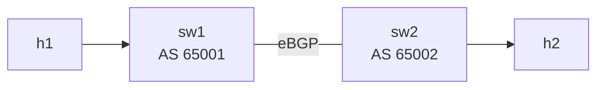

# Lab 26 — BGP Operations

> **Format:** Hands-on. Two routers, one eBGP session. Layer on the operational hardening every production session should have: authentication, TTL security, BFD-driven fast convergence, maximum-routes, graceful restart. Reference answer in [`solutions/`](solutions/).
>
> **Story chapter:** Phase 5 · Senior IC · Year 3. An external auditor (different one this time — your security firm) ran a BGP audit. Findings: no session passwords, no max-prefix limits, slow convergence on real-world failures, no graceful restart for software upgrades. You apply the modern hardening profile across every BGP session in the network. See [`STORY.md`](../../STORY.md).

## Real-world scenario

You inherited a BGP-running network. Three issues uncovered in the first audit:

- **No password on BGP sessions.** Anyone on a transit link could inject a TCP RST or attempt session hijack. Not exploited yet — but no defense either.
- **No maximum-prefix limit.** Last year a peer accidentally announced ~800,000 prefixes for 4 minutes due to a route-map bug. Your edge router's RIB ballooned, control-plane CPU pegged, BFD timeouts started misfiring, customers noticed.
- **Sessions take 90 seconds to recover** when a link is broken. Default BGP hold timer is 180s; even with hello tuning, it's 30+s. Voice traffic notices.

Plus you want every router to **survive a control-plane restart** without dropping its existing routes for the 90 seconds it takes BGP to re-establish — that's **graceful restart**.

This lab applies the modern operational hardening profile: a config block you should add to every BGP-speaking router from day one.

## Goal

By the end you should be able to answer:

- What does `neighbor X password` actually do?
- What's **TTL security**, and why is it the cheap defense against off-link spoofing?
- How does **BFD-driven session fall-over** speed up BGP convergence?
- What's **`maximum-routes`** and when does it save you?
- What's **graceful restart**, and what's the difference between **GR Restarter** and **Helper**?
- What's the BGP operator's daily-show-command checklist?

## Topology



Two routers, eBGP, two host LANs. The same hardening principles apply on iBGP too — practice here, deploy everywhere.

## Theory primer

### Password authentication

```
neighbor 192.168.12.2 password 0 <shared-secret>
```

Adds an **MD5 signature** to every TCP packet of the BGP session. Both peers must agree on the password. Without it, anyone who can route a TCP packet to port 179 of your router could inject session-disruption packets (RSTs, malformed segments).

Limitations:
- MD5 is weak against modern attackers (collisions, key-recovery in some scenarios).
- Modern replacement: **TCP-AO (RFC 5925)** with SHA-256 or similar. Use if your platform supports it.

Even MD5 is way better than nothing. Always set it on every BGP session.

### TTL security (GTSM — Generalized TTL Security Mechanism)

```
neighbor 192.168.12.2 ttl maximum-hops 1
```

For a directly-connected eBGP session, the peer is exactly 1 hop away. BGP-OPEN packets sent over multiple hops by an attacker arrive with TTL < 255 (because the attacker doesn't get to set the initial TTL exactly). TTL security drops any packet whose TTL doesn't match the expected hop count.

For directly-connected eBGP: `maximum-hops 1`. EOS accepts packets whose TTL is **≥ 255 − maximum-hops** — so with `maximum-hops 1` it accepts TTL ≥ 254, i.e. the sender was within 1 hop. Anything routed from further away arrives with a lower TTL and is dropped.

For multi-hop eBGP (e.g., between loopbacks): `maximum-hops <N>` where N is the actual hop count.

For iBGP between loopbacks: same idea with the appropriate N.

Cheap, automatic, blocks a class of off-link attacks. Always on.

### BFD-driven fall-over

```
neighbor 192.168.12.2 bfd
```

In EOS this is simply `neighbor <id> bfd` — it binds BFD to the BGP session. (Cisco IOS calls the same thing `neighbor X fall-over bfd`; if you came from IOS, that's the equivalent.) When BFD declares the underlying link dead (lab 19 — ~900ms with default tuning), BGP **immediately** tears down the session instead of waiting for the BGP hold timer (default 180s, ≥30s even with tuning). Combined with BFD's sub-second detection, BGP reconvergence becomes sub-2-seconds end-to-end.

Requires BFD to be configured (`bfd interval ... min-rx ... multiplier ...`). Both peers must have BFD configured for the session to come up at BFD-protected speeds.

> **cEOS note:** BFD in cEOS is a software-only implementation over veth links — there is no hardware-accelerated BFD datapath as on a real switch. The session will form and `show bfd peers` will report it, but the sub-second detection-and-fall-over timing (Verification steps 1 and 6) is best-effort under containerlab and will not match the deterministic hardware numbers quoted above. Treat the convergence figures as the *concept*; the syntax and capability negotiation are what you're really learning here.

### maximum-routes

```
neighbor 192.168.12.2 maximum-routes 50
```

If the peer announces more than 50 routes, the session drops. Default behavior: peer is shut, manual reset required (some platforms auto-recover after a timer).

Why this matters: a misbehaving neighbor (or a misconfigured route-map on their side) might announce far more prefixes than expected. Without a cap, your RIB balloons, CPU spikes, BFD misfires, customers notice.

Set per-neighbor based on **expected** prefix count + headroom (e.g., 50% more). For customers: agree on their announced count and cap there. For peers: based on registered IRR data. For transits: full-table size (~1M today) plus generous headroom.

A common subtlety: some platforms have a "warning" mode that just logs above a threshold without dropping the session. Use it for production transparency.

### Graceful restart

A modern router has its BGP process and its FIB in different software components. When the BGP process restarts (software bug, config commit reload, etc.), the FIB can stay populated even while BGP re-establishes — packets keep flowing.

For this to work between neighbors, BOTH sides must support and signal **graceful restart capability** during session OPEN. When a peer goes through a restart:

- **Restarter** — the router going through restart. Tells peer "I'm restarting, please hold on to my routes while I come back."
- **Helper** — the peer. Keeps the routes marked "stale" but still in the FIB. If the restarter comes back within `stalepath-time`, routes are re-validated. If not, they're flushed.

Result: data plane keeps working even during control plane restarts. Critical for hitless software upgrades.

In EOS, you enable graceful restart **per neighbor** with `neighbor X graceful-restart` — issued in Router-BGP configuration mode (under `router bgp`), not under an address-family. The helper's hold-down window is set with `graceful-restart stalepath-time`. (EOS has no `graceful-restart restart-time` command — that's Cisco IOS syntax; the restart timer is signalled automatically by the restarting peer.)

```
router bgp 65001
   graceful-restart stalepath-time 360
   neighbor 192.168.12.2 graceful-restart

   address-family ipv4
      neighbor 192.168.12.2 activate
```

### Operational reflex commands

When something's wrong, run these in order. They get you 80% of the way to the answer.

All EOS-native (run as-is on cEOS):

```
show ip bgp summary                ! quick state of every session
show ip bgp neighbors X            ! detailed session info
show ip bgp                        ! RIB
show ip route bgp                  ! best paths
show ip bgp 10.2.0.0/24            ! specific route (use a prefix from this lab)
show ip bgp neighbors X advertised-routes
show ip bgp neighbors X received-routes
show bfd peers                     ! if BFD is in play
show ip bgp regexp 65002           ! routes whose AS-path matches a regex
show logging | include BGP         ! recent events
```

For changes — EOS-native:

```
clear ip bgp X soft in             ! re-apply inbound policy without dropping TCP
clear ip bgp X soft out            ! re-send outbound advertisements
clear ip bgp X                     ! hard reset (drops TCP) — avoid in production
```

Cross-platform variants you may see on Cisco/FRR (NOT the EOS form — don't paste on cEOS):

```
clear bgp ipv4 unicast X soft in   ! Cisco-style; EOS uses `clear ip bgp X soft in`
neighbor X fall-over bfd           ! Cisco-style; EOS uses `neighbor X bfd`
```

## Your task

On both sw1 and sw2:

1. Configure global BFD with non-default timers (e.g. `bfd interval 100 min-rx 100 multiplier 3`).
2. On the BGP neighbor:
   - `password 0 LabSharedSecret123` (must match on both sides).
   - `ttl maximum-hops 1` (directly connected eBGP).
   - bind BFD to the session (the EOS form is `neighbor X bfd`).
   - `maximum-routes 50`.
   - enable graceful restart for the neighbor (`neighbor X graceful-restart`).
3. Under `router bgp`: set the graceful-restart helper hold time (`graceful-restart stalepath-time 360`).
4. Verify everything is in effect.

## Hints

```
bfd interval <ms> min-rx <ms> multiplier <n>

router bgp <asn>
   graceful-restart stalepath-time <s>
   neighbor X password 0 <secret>
   neighbor X ttl maximum-hops <n>
   neighbor X bfd
   neighbor X maximum-routes <n>
   neighbor X graceful-restart
   address-family ipv4
      neighbor X activate
```

Notes:
- The BFD bind verb in EOS is just `neighbor X bfd` (Cisco's `fall-over bfd` is not EOS).
- `neighbor X graceful-restart` lives under `router bgp` (Router-BGP mode), not under the address-family.
- There is no `graceful-restart restart-time` in EOS — only `graceful-restart stalepath-time`.

## Deploy

```bash
cd ~/containerlab/labs/26-bgp-operations
sudo containerlab deploy
```

## Verification

### 1. BFD session up

```bash
docker exec -it clab-bgp-operations-sw1 Cli
show bfd peers
```

Should show one BFD session, state `Up`.

### 2. BGP session uses BFD

EOS does not print the Cisco phrase "fall over". Read the neighbor detail and look for the BFD line, or check the BFD peer table directly:

```
show ip bgp neighbors 192.168.12.2 | include BFD
show bfd peers detail
```

The neighbor output should reference BFD being enabled for the session, and `show bfd peers detail` should list the peer 192.168.12.2 with the application/client tied to BGP.

### 3. Password is set (mismatch demo)

On sw1, change the password to something different:

```
configure terminal
  router bgp 65001
    neighbor 192.168.12.2 password 0 WrongPassword
```

Within seconds the session drops. Logs show MD5 failure. Restore the matching password.

### 4. TTL security

Try to send a BGP OPEN from a router 2 hops away (we don't have that topology, but you can verify the config is in place). Confirm it in the running config and in the neighbor detail:

```
show running-config section bgp | include ttl
show ip bgp neighbors 192.168.12.2 | include ttl|TTL|hops
```

The running-config should show `neighbor 192.168.12.2 ttl maximum-hops 1`. The exact wording in the `show ip bgp neighbors` output varies by EOS build, so if the second filter prints nothing, fall back to reading the full `show ip bgp neighbors 192.168.12.2` and look for the TTL/hop-count line.

### 5. maximum-routes — induce the limit

On sw2 temporarily, advertise more than 50 prefixes. Easy: add a bunch of static null0 routes and `network` them:

```
configure terminal
  ip route 100.0.0.0/24 Null0
  ip route 100.0.1.0/24 Null0
  ! ... add many ...
```

Or use a script. Once sw2 announces > 50 to sw1, sw1 shuts the session. Log line: `BGP-4-MAXROUTES-LIMIT-REACHED`. To re-enable: lower the count, or `clear ip bgp <peer>`.

### 6. Convergence speed

With sustained ping between h1 and h2:

```bash
docker exec clab-bgp-operations-h1 ping 10.2.0.10
```

In another terminal, simulate a link issue without dropping the interface — apply a deny-all ACL temporarily:

```
configure terminal
  ip access-list standard BLACKHOLE
    deny any
  interface Ethernet2
    ip access-group BLACKHOLE in
```

With BFD bound to the session: on real hardware the ping pause is ~1s, versus 30–90s without BFD (you'd be waiting on the BGP hold timer, default 180s, advert 60s). BFD makes BGP nearly as fast as the underlying link state.

> **cEOS note:** as flagged in the Theory primer, cEOS runs software BFD over veth links, so the measured pause here will be best-effort and may not hit the sub-second figure quoted for hardware. What you *can* reliably confirm is the mechanism: with the ACL applied, `show bfd peers` flips the session Down and the BGP session tears down promptly (well before the 180s hold timer would have), rather than waiting out the hold timer.

Remove the ACL.

### 7. Graceful restart capability

```
show ip bgp neighbors 192.168.12.2 | include Restart|restart
```

The neighbor detail should report that the Graceful Restart capability was advertised and received (it's negotiated in the OPEN message, so both sides must have `neighbor X graceful-restart` configured for it to be mutually negotiated). If the filter prints nothing, read the full `show ip bgp neighbors 192.168.12.2` and look for the "Graceful Restart" capability line.

To actually exercise GR you'd restart the BGP agent and watch the helper hold routes stale; in cEOS the capability negotiation is the part you can reliably observe.

### 8. Operational reflex — full playbook

Run each in order:

```
show ip bgp summary
show ip bgp neighbors 192.168.12.2
show ip bgp
show ip bgp 10.2.0.0/24
show ip bgp neighbors 192.168.12.2 received-routes
show ip bgp neighbors 192.168.12.2 advertised-routes
show bfd peers
show logging | include BGP
```

Get muscle memory for this sequence. In real outage, this is the first 60 seconds of every BGP-related incident.

## Peek at solution

- [`solutions/sw1.cfg`](solutions/sw1.cfg), [`solutions/sw2.cfg`](solutions/sw2.cfg)

## Concepts cheat-sheet

- **password** — MD5 (or TCP-AO) on BGP TCP. Always set.
- **TTL security** — drop BGP packets with unexpected TTL. Defense against off-link injection.
- **neighbor X bfd** — bind BFD to the session so BGP tears down when BFD declares the neighbor dead. Sub-second convergence. (EOS verb; Cisco calls it `fall-over bfd`.)
- **maximum-routes** — cap how many prefixes a neighbor can announce. Protects against runaway leaks.
- **Graceful restart** — keep FIB during BGP process restart. Hitless software upgrades.
- **Operational reflex** — daily `show ip bgp summary`; first 60s of every incident.

## Production hardening checklist

Every BGP-speaking router should have:

- ✅ Per-neighbor password / TCP-AO
- ✅ TTL security (`ttl maximum-hops`)
- ✅ BFD on the underlying link + `neighbor X bfd` bound to the session
- ✅ `maximum-routes` per neighbor, sized appropriately
- ✅ Graceful restart enabled per neighbor (`neighbor X graceful-restart`, under `router bgp`) + stalepath-time set
- ✅ Inbound + outbound route-maps (labs 23, 24, 25)
- ✅ Neighbor `description` filled in
- ✅ `update-source` to a loopback for iBGP
- ✅ `send-community` explicitly enabled where needed
- ✅ Sourced from management VRF if running in OOB / mgmt VRF context

## What's missing (deliberately)

- **TCP-AO (RFC 5925)** — modern replacement for MD5; platform support varies. Use when available.
- **BGP dampening** — rarely recommended now (too coarse). Mention only.
- **Route-server / RPKI-validator-driven policy** — touched in lab 25; would need real validator setup for a hands-on demo.
- **Cumulus/FRR specifics** — same concepts, different syntax.

## Cleanup

```bash
sudo containerlab destroy --cleanup
```
