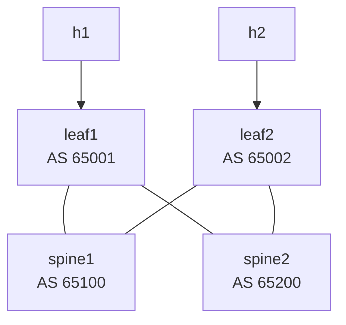

# Lab 27 — Spine-Leaf with BGP Underlay

> **Format:** Hands-on. Two spines, two leaves, eBGP between every leaf-spine pair. Pure L3 fabric — no L2 anywhere. Reference answer in [`solutions/`](solutions/).
>
> **Story chapter:** Phase 6 · Senior, leading DC architecture · Year 3. The Company is building proper datacenter infrastructure. The CTO greenlit a new DC build — greenfield, no legacy. Multi-tenant from day one. You're the architect. You looked at the three-tier diagrams in the operator's handbook, decided they were 15 years old, and chose to design a Clos spine-leaf fabric instead. See [`STORY.md`](../../STORY.md).

## Real-world scenario

The traditional 3-tier DC design (core, distribution, access) made sense when traffic was mostly north-south (servers ↔ users). Modern workloads are east-west — server-to-server traffic in the same DC (microservices, distributed storage, ML training). The 3-tier design hairpins east-west through the distribution layer, oversubscribes the core, and uses STP to break loops.

The replacement: **Clos / spine-leaf** topology. Every leaf connects to every spine. Equal-cost paths everywhere. No STP — the entire fabric is routed (L3 between every box). East-west traffic between leaves takes one hop through a spine. Bandwidth scales by adding spines. Convergence is BGP-fast, not STP-slow.

This lab builds the foundation: a pure-L3 BGP-underlay spine-leaf. Lab 28 simplifies the IP plumbing with BGP unnumbered. Lab 29 introduces VXLAN overlays. Lab 30+ adds EVPN.

## Goal

By the end you should be able to answer:

- What's a **Clos** topology, and why is it the modern DC standard?
- What's the difference between **east-west** and **north-south** traffic, and why does each topology favor one?
- How does **ECMP** make this work? What hashes traffic across paths?
- Why does each leaf get a unique AS in this design (or all-leaves-same-AS — which is also valid)?
- Why is **`network <loopback>`** the canonical announcement, not redistributing connected?

## Topology



Every leaf has equal-cost paths to every other leaf via every spine.

## Theory primer

### Spine-leaf vs 3-tier

- **3-tier**: access → distribution → core. Hierarchical. Layered services (L3 boundary at distribution).
- **Spine-leaf (Clos)**: leaves at the access layer, spines as the interconnect. Every leaf-spine pair has a link; no leaf-leaf or spine-spine links. Flat L3 routed fabric.

For east-west traffic:
- 3-tier: leaf → distribution → distribution → leaf (3 hops, often constrained)
- Spine-leaf: leaf → spine → leaf (2 hops, always)

For bandwidth scale:
- 3-tier: add capacity by upgrading core / distribution boxes
- Spine-leaf: add more spines (horizontally scalable)

### BGP underlay vs OSPF underlay

Both work. Modern hyperscalers (Microsoft, Facebook, etc.) overwhelmingly chose **BGP** for underlay because:

- BGP scales to millions of routes (overlay endpoint information piggybacks well)
- Policy via attributes is more flexible than OSPF tweaking
- Same protocol for underlay and overlay (with different address-families)
- Better explicit control over what's advertised where

OSPF as underlay is fine for smaller fabrics; you'll see both in production.

### AS numbering schemes

- **Per-device unique ASN**: every spine and leaf gets its own ASN. Clearest mental model. Works at any scale with 4-byte ASNs.
- **All-spines-one-AS, per-leaf-AS**: common in some designs. Eliminates AS-path loop prevention issues during certain failure modes.
- **All-spines-one-AS, leaves-in-pairs-share-AS**: similar but accounts for MLAG'd leaves.

This lab uses per-device ASNs (4 ASes total, 4 routers). Simplest to teach.

### ECMP

When multiple BGP paths have equal AS-path length to the same prefix, both are installed in the FIB. Traffic hashes across them (5-tuple usually — src IP, dst IP, src port, dst port, protocol).

`maximum-paths 64 ecmp 64` tells BGP to install up to 64 ECMP paths per prefix. In our 2-spine fabric, leaves see 2 paths to every other leaf (one via each spine).

Critical for spine-leaf — without ECMP, traffic uses only one spine, defeating the design.

### What to advertise

Each leaf advertises:
- Its own **loopback** (for overlay endpoint discovery later — VTEPs use loopbacks)
- Its **directly-attached host LANs** (so other leaves know where to send traffic for those subnets)

Spines just transit; they don't usually originate prefixes other than their own loopback.

`network` statements (not `redistribute connected`) for clean, explicit advertisement. Each prefix should appear in your config so you can grep for it.

## Your task

1. On each spine: BGP AS, neighbor each leaf with the leaf's AS, `maximum-paths 64 ecmp 64`, advertise own loopback.
2. On each leaf: BGP AS, neighbor each spine with the spine's AS, `maximum-paths 64 ecmp 64`, advertise loopback + host LAN.
3. Verify all BGP sessions Established.
4. Verify ECMP installed in FIB on leaves.
5. h1 ↔ h2 ping works; the leaf's FIB shows two equal-cost next-hops (one per spine). A single src/dst host pair will hash to one spine for its traffic — both spines being *used* requires many distinct flows, not one ping.

## Hints

```
router bgp <asn>
   router-id <loopback>
   no bgp default ipv4-unicast
   maximum-paths 64 ecmp 64
   neighbor <peer-ip> remote-as <peer-asn>
   neighbor <peer-ip> description <text>
   !
   address-family ipv4
      neighbor <peer-ip> activate
      network <prefix>/<mask>
```

Verification:

```
show ip bgp summary
show ip bgp
show ip route 2.2.2.2/32          ! should show 2 paths (ECMP)
show ip route                      ! see all routes
```

## Deploy

```bash
cd ~/containerlab/labs/27-spine-leaf
sudo containerlab deploy
```

## Verification

### 1. All BGP sessions up

On each device, `show ip bgp summary` should show 2 Established neighbors (each leaf has 2 spines, each spine has 2 leaves).

### 2. ECMP installed

```bash
docker exec -it clab-spine-leaf-leaf1 Cli
show ip route 2.2.2.2/32
```

Should show **two equal-cost paths**: via spine1's interface AND via spine2's interface.

```
show ip route 10.2.0.0/24
```

Same thing — two paths.

### 3. h1 ↔ h2 connectivity

```bash
docker exec clab-spine-leaf-h1 ping -c 3 10.2.0.10
```

✅.

### 4. ECMP hashing demo

The leaf installs **two** next-hops for the route to h2's subnet — one via each spine. ECMP picks a spine per *flow* by hashing the 5-tuple (src/dst IP, src/dst port, protocol). The clean way to *see* both paths is the FIB itself:

```bash
docker exec -it clab-spine-leaf-leaf1 Cli
show ip route 10.2.0.0/24
```

You should see two equal-cost entries: one via spine1 (`10.0.1.0`, leaf1:eth1) and one via spine2 (`10.0.3.0`, leaf1:eth2).

You can also traceroute, but note the caveat below:

```bash
for i in 1 2 3 4 5; do
  docker exec clab-spine-leaf-h1 traceroute -n 10.2.0.10 2>&1 | head -3
  echo "---"
done
```

When a flow does cross spine1, the second hop is **`10.0.1.0`** (spine1's ingress interface facing leaf1); when it crosses spine2, the second hop is **`10.0.3.0`** (spine2's ingress interface facing leaf1).

> **Caveat — don't expect the traceroute to visibly alternate.** Hashing keys on the 5-tuple, and here the src/dst IPs are fixed (10.1.0.10 → 10.2.0.10). Linux `traceroute` varies only the per-probe UDP destination port, so *which* spine the hash selects can stay constant across every run — seeing the same spine five times in a row is normal, not a bug. The authoritative proof that ECMP is installed is the two-next-hop FIB entry from `show ip route` above, not the traceroute output.

### 5. Failover demo

Sustained ping:

```bash
docker exec clab-spine-leaf-h1 ping 10.2.0.10
```

Kill leaf1's link to spine1:

```bash
docker exec -it clab-spine-leaf-leaf1 Cli
configure terminal
  interface Ethernet1
    shutdown
```

Ping pauses briefly (sub-second to a few seconds depending on BGP timers — add BFD for fast detection). Recovers via spine2 only.

```
show ip route 2.2.2.2/32
```

Only one path now (via spine2). Restore:

```
no shutdown
```

## Peek at solution

- [`solutions/spine1.cfg`](solutions/spine1.cfg), [`solutions/spine2.cfg`](solutions/spine2.cfg), [`solutions/leaf1.cfg`](solutions/leaf1.cfg), [`solutions/leaf2.cfg`](solutions/leaf2.cfg)

## Concepts cheat-sheet

- **Clos topology** — leaves at access, spines as interconnect, every-leaf-to-every-spine.
- **East-west** — server-to-server inside DC; dominant traffic pattern today.
- **ECMP** — equal-cost multi-path; flow-hashed; `maximum-paths` knob.
- **BGP underlay** — modern DC standard; OSPF is also fine.
- **Per-device ASN** — clearest mental model; 4-byte ASNs avoid exhaustion.
- **Loopback advertisement** — required for overlay VTEP discovery (labs 29+).

## Production notes

- **Cabling scale**: in a 4-spine 32-leaf fabric, you have 128 leaf-spine links. Plan structured cabling carefully.
- **Spine count = bandwidth multiplier**: each leaf has N uplinks (one per spine). More spines = more total bandwidth.
- **Add BFD** (lab 19) on every leaf-spine link for sub-second convergence.
- **Hash polarization** can cause one spine to carry more traffic than others. Use platform-specific hash tuning or asymmetric configurations.
- **Use 4-byte ASNs (4200000000–4294967294)** in production — 2-byte private space (64512-65535) is small.

## What's missing (deliberately)

- **BGP unnumbered** — lab 28 simplifies the IP plumbing.
- **VXLAN overlay** — lab 29.
- **EVPN control plane** — lab 30+.
- **MLAG'd leaves** — for dual-homed servers; covered in EVPN labs as EVPN multi-homing.
- **Real BFD setup** — adds the lab 19 BFD config.

## Cleanup

```bash
sudo containerlab destroy --cleanup
```
