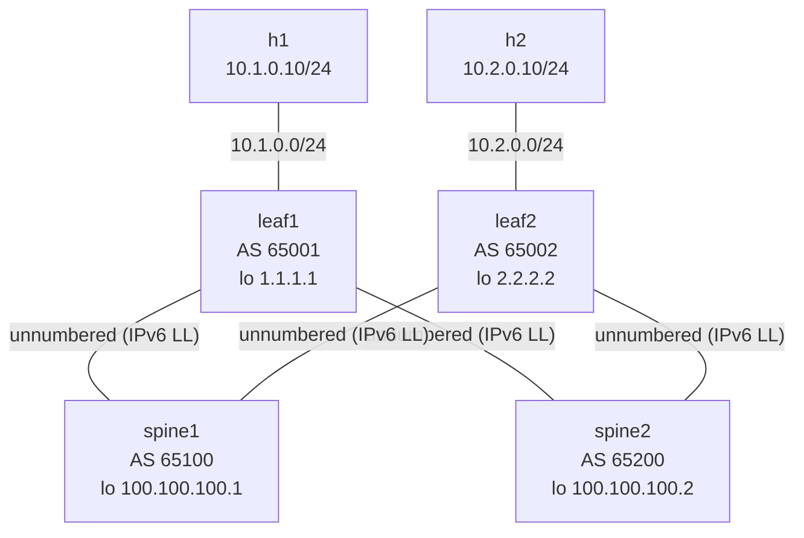

# Lab 28 — BGP Unnumbered Underlay

> **Format:** Hands-on. Same spine-leaf as lab 27, but transit interfaces have **no IPv4 addresses** — peering uses IPv6 link-local and BGP discovers neighbors automatically. Reference answer in [`solutions/`](solutions/).
>
> **Story chapter:** Phase 6 · Senior, leading DC architecture · Year 3. You started filling out the IPAM spreadsheet for the new fabric: /31 per leaf-spine link, separate per pod, per site... 512 transit /31s and counting. You stopped, read about BGP unnumbered, and realized you can skip the entire IPAM-for-transits exercise. See [`STORY.md`](../../STORY.md).

## Real-world scenario

In lab 27 you painstakingly allocated `10.0.1.0/31`, `10.0.2.0/31`, `10.0.3.0/31`, `10.0.4.0/31` — one /31 per leaf-spine link. For 2 spines × 2 leaves that's 4 subnets. For 8 spines × 64 leaves that's 512 subnets. You'd be maintaining an IPAM spreadsheet just for transit links that nobody ever pings.

**BGP unnumbered** eliminates this entirely. The transit interfaces have no IP address — they use IPv6 **link-local** addressing, which is auto-assigned. BGP discovers neighbors via IPv6 Router Advertisements on the link. IPv4 routes are still exchanged (via RFC 5549, IPv4-route-with-IPv6-next-hop). The leaf-spine fabric works exactly like before; you saved hundreds of /31s and the IPAM headache.

Hyperscalers run BGP unnumbered at fabric scale. It's the modern default for new DC builds.

## Goal

By the end you should be able to answer:

- What's **IPv6 link-local**, and why does it exist on every IPv6-enabled interface?
- How does **BGP unnumbered** discover neighbors without configured IPs?
- What's **RFC 5549** (IPv4 routes with IPv6 next-hop), and why does it matter here?
- What's a **BGP peer-group**, and how do `interface ... peer-group` references simplify config?
- What's the trade-off: when WOULD you still use numbered /31 transits?

## Topology

Same spine-leaf as lab 27. Two spines, two leaves, full mesh between them. The only change: the four spine-leaf transit links have **only IPv6 enabled** (link-local), no IPv4 address — so there are no /31s on the fabric. Host links keep their /24s.



Every solid spine-leaf link is unnumbered: `ipv6 enable`, no `ip address`. eBGP peers over the auto-assigned `fe80::` link-locals; IPv4 prefixes (loopbacks + host /24s) still cross the fabric via RFC 5549.

## Theory primer

### IPv6 link-local

Every IPv6-enabled interface auto-generates a **link-local address** in `fe80::/10`. The address is derived from the interface's MAC (modified EUI-64) or random. It's:

- **Unique on the link**, not globally
- **Not routable** outside the link
- **Always present** when IPv6 is enabled
- Used by NDP (the IPv6 ARP equivalent), Router Advertisements, and BGP unnumbered

Two routers connected by a cable, both with `ipv6 enable` on the interface, automatically have IPv6 connectivity over that link without any IP configuration.

### How BGP unnumbered finds the peer

The router sends **IPv6 Router Advertisements** on the interface periodically. The neighbor receives them, learns the sender's link-local address, and BGP establishes the session to that auto-discovered link-local — which is why you bind the neighbor **by interface, not by address** (see "Peer-groups + interface-based neighbors" below). You never type the link-local yourself; BGP discovers it.

No IP planning. No IPAM. No address allocation. The link "just works" once both sides have IPv6 enabled.

### RFC 5549 — IPv4 routes with IPv6 next-hop

BGP can carry IPv4 routes whose **next-hop is an IPv6 link-local address**. The receiving router installs the route into its FIB with the IPv6 link-local as next-hop; the data plane resolves IPv6 next-hops via NDP and forwards the IPv4 packet over the interface.

Result: you carry IPv4 prefixes over the unnumbered fabric without needing IPv4 addresses on the transit links.

(Note: some older platforms don't support RFC 5549. Modern Arista, Cumulus, FRR, Juniper, Cisco IOS-XR/NX-OS all support it.)

### Peer-groups + interface-based neighbors

Rather than configuring each neighbor individually (you'd have to know the link-local address, which would defeat the purpose), use a **peer-group** with **interface-based neighbor binding**:

```
neighbor SPINES peer group
neighbor SPINES remote-as external
neighbor SPINES send-community
neighbor interface Ethernet1 peer-group SPINES
neighbor interface Ethernet2 peer-group SPINES
```

- `remote-as external` means "whatever AS the peer advertises during OPEN" — useful because the peer's AS isn't pre-configured in unnumbered mode.
- `neighbor interface ETHx peer-group NAME` binds a peer-group's settings to whichever neighbor BGP discovers on that interface.

Adding a new spine/leaf = one more `neighbor interface EthernetN peer-group ...` line. No IPs to manage.

### When to NOT use unnumbered

- **Operations / tooling expects /30 transit IPs** — some monitoring or troubleshooting tools work better when they can ping the transit hop. Unnumbered makes per-hop pings impossible (you can't ping a link-local from across the fabric).
- **Older platforms** without RFC 5549 support.
- **Multi-hop eBGP peerings** that don't terminate on a link-local interface.
- **Compliance / audit requirements** that mandate explicit IP allocation.

For pure spine-leaf underlay between modern boxes: unnumbered is the modern default.

## Your task

The L1/L2 plumbing is pre-staged for you in the starter (this is a sequel to lab 27, so the focus is BGP). Verify it, then build the BGP block:

1. Confirm the starter already enables `ipv6 unicast-routing` globally on every device.
2. Confirm every transit interface (Ethernet1/Ethernet2) already has `ipv6 enable` and **no** `ip address`. If you diff the starter against lab 27 you'll see these are the only L1/L2 changes — the real work below is the `router bgp` block.
3. Configure BGP with a peer-group (`SPINES` on leaves, `LEAVES` on spines).
4. Use `neighbor interface <eth> peer-group <name>` to bind peers.
5. `remote-as external` on the peer-group (for eBGP between leaves and spines).
6. Activate the peer-group under `address-family ipv4`.
7. Verify ECMP and end-to-end traffic.

## Hints

```
router bgp <asn>
   router-id <loopback>
   no bgp default ipv4-unicast
   maximum-paths 64 ecmp 64
   neighbor NAME peer group
   neighbor NAME remote-as external
   neighbor NAME send-community
   neighbor interface Ethernet1 peer-group NAME
   neighbor interface Ethernet2 peer-group NAME
   !
   address-family ipv4
      neighbor NAME activate
      network <prefix>/<mask>
```

Verification:

```
show ip bgp summary
show ipv6 interface brief                    ! see link-local addresses
show ip route 2.2.2.2/32                     ! ECMP via two link-local next-hops
```

## Deploy

```bash
cd ~/containerlab/labs/28-bgp-unnumbered
sudo containerlab deploy
```

## Verification

### 1. Link-local addresses present

```bash
docker exec -it clab-bgp-unnumbered-leaf1 Cli
show ipv6 interface brief
```

Each transit interface should show an `fe80::...` link-local address. No global IPv6, no IPv4.

### 2. BGP sessions established (via link-local)

```
show ip bgp summary
```

Two neighbors per leaf, two per spine. Both Established. Notice the neighbor IP shown is the IPv6 link-local of the peer.

### 3. ECMP installed in IPv4 RIB

```
show ip route 2.2.2.2/32
```

Two paths to the other leaf's loopback. Next-hops are **IPv6 link-local addresses** on the leaf's own transit interfaces. The IPv4 packet uses these IPv6 next-hops at forwarding time via NDP.

### 4. End-to-end IPv4 traffic

```bash
docker exec clab-bgp-unnumbered-h1 ping -c 3 10.2.0.10
```

✅. IPv4 packet from h1 reaches h2 over the unnumbered underlay.

### 5. Compare to lab 27

`show running-config | section interface Ethernet1` — much shorter than the lab 27 starter. No /31 subnets. No bgp neighbor IPv4 addresses. Half the config volume in real fabrics.

## Peek at solution

- [`solutions/spine1.cfg`](solutions/spine1.cfg), [`solutions/spine2.cfg`](solutions/spine2.cfg), [`solutions/leaf1.cfg`](solutions/leaf1.cfg), [`solutions/leaf2.cfg`](solutions/leaf2.cfg)

## Concepts cheat-sheet

- **IPv6 link-local** — `fe80::/10`, auto-assigned per interface, link-scope only.
- **BGP unnumbered** — peering over link-local, no /31 transit addresses.
- **RFC 5549** — IPv4 routes with IPv6 next-hop; allows IPv4 over unnumbered.
- **Peer-group** — share config across many neighbors; `interface ... peer-group` binds dynamically.
- **`remote-as external`** — match whatever AS the peer announces (any external AS).

## Production notes

- **Adopt unnumbered for new fabric builds** — it's the modern default.
- **Retrofitting** existing numbered fabrics is risky and rarely worth it; only do during major refresh.
- **Tooling adjustment** — `ping <transit-ip>` doesn't work; use `traceroute` and BGP queries instead.
- **Monitor link-locals stability** — if a port flaps, the link-local stays the same (derived from MAC). MAC-changing scenarios (hot-swap line cards on some platforms) might confuse BGP briefly.
- **Mixed numbered + unnumbered fabrics work** — useful during migration.

## What's missing (deliberately)

- **IPv6 overlay** — IPv6 customer traffic over the unnumbered underlay; same concepts.
- **eBGP between sites** over unnumbered — usually you go back to numbered for inter-site links.
- **MLAG with unnumbered** — modern designs use EVPN MH instead; covered in EVPN labs.

## Cleanup

```bash
sudo containerlab destroy --cleanup
```
