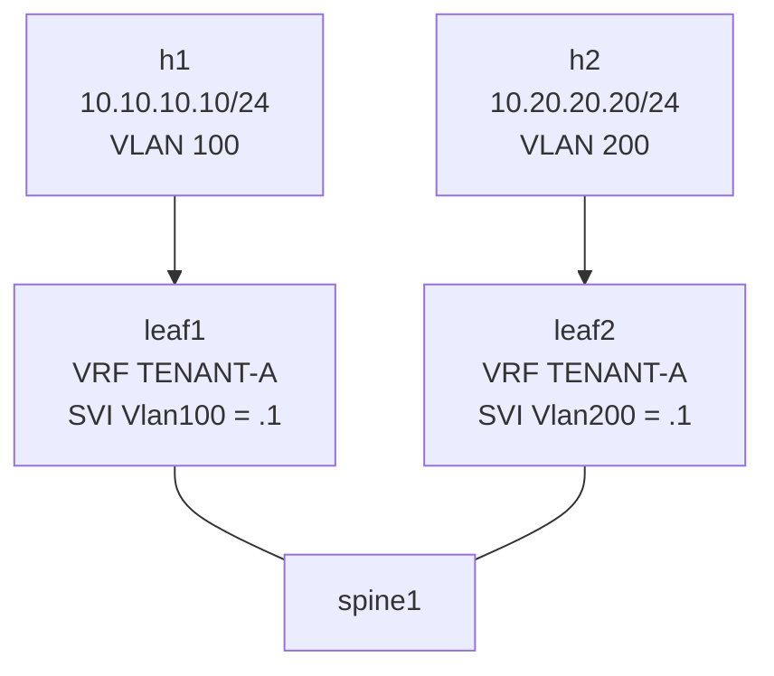

# Lab 31 — EVPN Type 5 (Symmetric IRB / L3 Overlay)

> **Format:** Hands-on. Same fabric, but now two different host subnets on two leaves. EVPN Type 5 routes carry L3 prefixes across the fabric. Reference answer in [`solutions/`](solutions/).
>
> **Story chapter:** Phase 6 · Senior · Year 3.5. Customer feedback: "We don't just want VLAN 100 stretched — we want application-tier (VLAN 100) and database-tier (VLAN 200) on different racks, with controlled inter-subnet routing inside our tenant, isolated from other tenants." You're delivering proper multi-tenant L3 overlay via EVPN Type 5 + tenant VRFs. See [`STORY.md`](../../STORY.md).

## Real-world scenario

Lab 30 stretched a single VLAN across leaves (L2 overlay). Production tenants usually have **multiple subnets** that need to communicate — application tier, database tier, management VLAN, etc. — and those subnets live on different leaves.

This is **L3 overlay**: every leaf runs the gateway for its local subnets in a tenant VRF, and announces tenant prefixes across the fabric via EVPN Type 5 routes. Inter-subnet traffic encapsulates as L3 VXLAN, routes at the destination leaf into the right subnet. Hosts in different subnets, on different leaves, in the same tenant, talk seamlessly.

## Goal

By the end you should be able to answer:

- What's a **Type 5** route, and how is it different from Type 2?
- What's a **tenant VRF**, and why does each tenant get one?
- What's **symmetric IRB** vs asymmetric IRB?
- What's an **L3 VNI**, and how is it different from an L2 VNI?
- Why is `redistribute connected` under the BGP VRF the canonical way to advertise tenant prefixes?

## Topology



Both leaves have a tenant VRF named `TENANT-A`. h1 lives in VLAN 100 (subnet `10.10.10.0/24`) on leaf1, h2 in VLAN 200 (`10.20.20.0/24`) on leaf2. Both subnets belong to the same tenant VRF.

## Theory primer

### EVPN route types — recap

- Type 2: MAC/IP per-host (L2)
- Type 3: per-VNI flood-list builder
- Type 5: **IP prefix per VRF** (L3)

Type 5 advertises "VRF X has prefix Y reachable via me, with L3 VNI Z". The receiving leaf installs the prefix in its own VRF X, with VXLAN encap targeting the originator's VTEP using L3 VNI Z.

### L2 VNI vs L3 VNI

- **L2 VNI** — used for traffic *within* a subnet (intra-VLAN). VLAN 100 on leaf1 maps to VNI 10100; h1 to h2 in the same VLAN crosses the fabric encapsulated with VNI 10100.
- **L3 VNI** — used for traffic *between* subnets within the same tenant. A VRF maps to one L3 VNI. Inter-subnet traffic gets encapsulated with the tenant's L3 VNI, regardless of which specific subnets are involved.

Convention: L2 VNIs in 10000-49999 range (one per VLAN), L3 VNIs in 50000+ range (one per VRF).

### Tenant VRF

A VRF (lab 8) per tenant. Each tenant's VRF carries:
- All the tenant's SVIs (one per subnet)
- Tenant-specific routing decisions
- Tenant-specific RD/RT for EVPN

Multi-tenant DCs: one VRF per customer or per service group. EVPN with VRFs is the **modern DC multi-tenancy** mechanism, replacing MPLS L3VPN in most new builds.

### Symmetric vs Asymmetric IRB

**IRB (Integrated Routing and Bridging)** = combining bridging and routing on the same device. Two flavors:

- **Asymmetric IRB**: ingress leaf routes packet into destination VNI, then bridges across (L2 hop on the destination leaf). Requires every leaf to know every subnet of every tenant locally — doesn't scale well.
- **Symmetric IRB**: ingress leaf routes packet into the L3 VNI, encapsulates, sends across fabric. Egress leaf decapsulates from L3 VNI, routes into destination subnet's SVI. **Each leaf only needs to know the subnets actually attached to it.** Scales much better.

**Symmetric is the modern default.** This lab implements it.

### `redistribute connected` in VRF context

```
router bgp 65001
   vrf TENANT-A
      redistribute connected
```

Inside the BGP VRF context, this advertises every connected subnet of the VRF as an EVPN Type 5 route. Cleaner than `network` per subnet — automatically picks up new SVIs.

In practice you might pair this with a route-map to filter (avoid leaking transit/loopback subnets into the tenant view).

### What about anycast gateway?

In this lab each leaf has the SVI with a unique IP (`.1` on each, but they're in different subnets so no conflict). What if a subnet spanned multiple leaves (lab 30's scenario)? You'd want each leaf to be the local gateway. That's **EVPN anycast gateway** — lab 32.

## Your task

1. On both leaves: create VRF `TENANT-A`, enable IP routing in it.
2. On leaf1: SVI `Vlan100` in VRF TENANT-A, IP `10.10.10.1/24`.
3. On leaf2: SVI `Vlan200` in VRF TENANT-A, IP `10.20.20.1/24`.
4. Vxlan1 config — add **both** L2 VNI mappings (one per leaf's VLAN) AND the L3 VNI:
   - leaf1: `vxlan vlan 100 vni 10100` + `vxlan vrf TENANT-A vni 50001`
   - leaf2: `vxlan vlan 200 vni 10200` + `vxlan vrf TENANT-A vni 50001`
5. Under BGP, add EVPN VRF instance:
   - RD: `<router-id>:50001`
   - RT: `route-target import evpn 50001:50001`, `route-target export evpn 50001:50001`
   - `redistribute connected`
6. Verify Type 5 routes propagate, h1 ↔ h2 works.

## Hints

```
vrf instance <name>
ip routing vrf <name>

interface Vlan<n>
   vrf <name>
   ip address <ip>/<mask>

interface Vxlan1
   vxlan vlan <n> vni <l2-vni>
   vxlan vrf <name> vni <l3-vni>

router bgp <asn>
   vrf <name>
      rd <router-id>:<l3-vni>
      route-target import evpn <vni>:<vni>
      route-target export evpn <vni>:<vni>
      redistribute connected
```

Verification:

```
show vrf
show ip route vrf TENANT-A
show bgp evpn route-type ip-prefix
show vxlan vtep
show vxlan address-table vrf TENANT-A
```

## Deploy

```bash
cd ~/containerlab/labs/31-evpn-type5
sudo containerlab deploy
```

## Verification

### 1. VRF up

```bash
docker exec -it clab-evpn-type5-leaf1 Cli
show vrf TENANT-A
show ip route vrf TENANT-A
```

Initially only connected: `10.10.10.0/24` (Vlan100).

### 2. Type 5 routes appear

After configuring EVPN VRF instance on both sides:

```
show bgp evpn route-type ip-prefix
```

Should show:
- leaf1's own `10.10.10.0/24` (local origination)
- leaf2's `10.20.20.0/24` (learned via EVPN, next-hop = leaf2's VTEP `22.22.22.22`)

Each route is tagged with RT 50001:50001 → imported into both leaves' VRF TENANT-A.

### 3. VRF routing table includes remote subnet

```
show ip route vrf TENANT-A
```

Now shows:
- `C 10.10.10.0/24 is directly connected, Vlan100`
- `B 10.20.20.0/24 [200/0] via 22.22.22.22 (VTEP)`

### 4. h1 ↔ h2 ping works (inter-subnet via L3 overlay)

```bash
docker exec clab-evpn-type5-h1 ping -c 3 10.20.20.20
```

✅. Packet flow:
- h1 → leaf1 (default gw)
- leaf1 looks up 10.20.20.0/24 in VRF TENANT-A → next-hop VTEP 22.22.22.22, L3 VNI 50001
- VXLAN-encap with L3 VNI 50001
- Underlay routes to leaf2 (via spine)
- leaf2 decaps → in VRF TENANT-A → routed via Vlan200 SVI to h2

### 5. Capture the L3 VNI encap

```bash
sudo nsenter -t $(docker inspect -f '{{.State.Pid}}' clab-evpn-type5-leaf1) -n tcpdump -i eth1 -nn udp port 4789
```

Run ping. The VXLAN packets carry VNI `50001` (decimal). Compare to lab 30 where VNI was 10100 — different encapsulation type, same protocol.

## Peek at solution

- [`solutions/leaf1.cfg`](solutions/leaf1.cfg), [`solutions/leaf2.cfg`](solutions/leaf2.cfg), [`solutions/spine1.cfg`](solutions/spine1.cfg)

## Concepts cheat-sheet

- **Type 5** — IP prefix EVPN route; carries L3 prefix + VTEP + L3 VNI.
- **L2 VNI** — for intra-subnet traffic; one per VLAN.
- **L3 VNI** — for inter-subnet traffic; one per VRF.
- **Tenant VRF** — isolation domain per customer/service.
- **Symmetric IRB** — both leaves route; only-attached-subnet knowledge required at each leaf.
- **`redistribute connected` in VRF BGP** — auto-export of tenant subnets.

## Production notes

- **L3 VNI numbering convention** — pick a range distinct from L2 VNIs. e.g., 50000+ for L3.
- **Anycast gateway is usually paired** — without it, only one leaf is the gateway for each subnet. Lab 32.
- **Tenant naming/RT convention** — `<l3-vni>:<l3-vni>` is common. Document the mapping clearly.
- **Route-target schemes scale** — `<asn>:<service-id>` for service-providers, `<vni>:<vni>` for DC fabrics. Don't mix.
- **VRF route leaking between tenants** is possible (shared services VRF) via import/export RT manipulation.
- **EVPN + IPv6** — same Type 5, just IPv6 prefixes. Dual-stack works.

## What's missing (deliberately)

- **Anycast gateway** — lab 32 (essential pair with this).
- **VXLAN unicast for L2 between leaves** — covered in lab 30; same data plane but a different VNI here.
- **Type 2 with IP** — when a Type 2 route includes IP info, it can be used for "host route" advertisement (ARP suppression, mobility). Add later.
- **Inter-VRF leaking** — niche; route-target manipulation between tenant and shared-services VRFs.

## Cleanup

```bash
sudo containerlab destroy --cleanup
```
