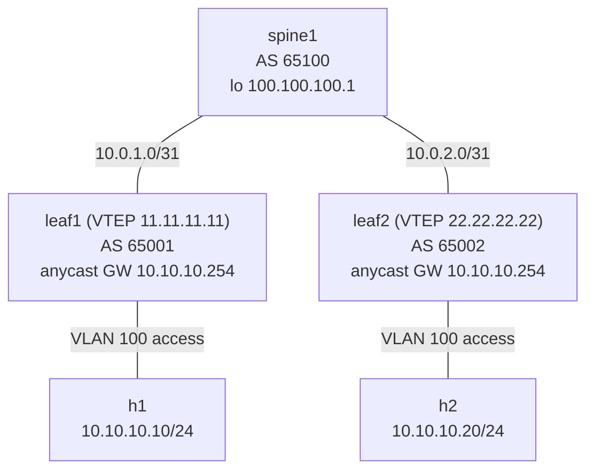

# Lab 32 — EVPN Anycast Gateway

> **Format:** Hands-on. Same fabric, single subnet stretched across leaves (lab 30 style), but every leaf is the gateway via anycast SVI. The modern DC default for first-hop redundancy. Reference answer in [`solutions/`](solutions/).
>
> **Story chapter:** Phase 6 · Senior · Year 4. VM mobility started mattering for real. Customers migrate VMs between racks during DRS / maintenance. With per-VLAN gateway on a single leaf pair, every VM that moves to a different leaf either keeps hairpinning to the original gateway leaf, or has to ARP a new gateway. Some applications (databases, load balancers) drop sessions either way. You deploy distributed anycast gateway. See [`STORY.md`](../../STORY.md).

## Real-world scenario

In lab 15, you saw VARP on MLAG pairs (active/active gateway across two switches). EVPN generalizes that idea to **every leaf in the fabric**.

Consider a tenant subnet `10.10.10.0/24` that's stretched across 10 leaves (VMs in rack 1, rack 3, rack 7, etc.). Without anycast gateway: only one leaf is the L3 gateway for the subnet; all VMs send their default-gw traffic to that leaf, even VMs sitting directly on a different leaf. That's a hairpin — packets cross the fabric to one leaf, then come back to another leaf for the destination. Wasteful.

**Anycast gateway**: every leaf that hosts the subnet runs the SAME gateway IP and SAME gateway MAC for it. Every VM's default-gw traffic goes to its **local** leaf, which routes locally. No hairpin. VM moves between leaves — gateway stays the same (no IP change, no ARP refresh, often not even a TCP reset).

This is the closing piece for EVPN-based fabrics.

## Goal

By the end you should be able to answer:

- How is **EVPN anycast gateway** different from VARP (lab 15)?
- What does `ip address virtual` do, and why is it the same on every leaf?
- Why is the same **virtual MAC** required on every leaf?
- What happens when a VM moves from leaf1 to leaf2?
- How does anycast gateway combine with Type 5 routes (lab 31) for full L2+L3 overlay?

## Topology

Same as [lab 30](../30-evpn-intro/README.md): one VLAN 100 / VNI 10100 stretched across both leaves over a routed (eBGP-over-/31) spine, h1 on leaf1, h2 on leaf2. The only new thing in this lab is the **anycast SVI** (`Vlan100`, `ip address virtual 10.10.10.254/24`, shared virtual MAC) on *both* leaves.



Both leaves present the SAME gateway IP (`10.10.10.254`) and SAME virtual MAC (`aa:bb:cc:00:00:01`) — that is the anycast gateway. h1 and h2 are in the same subnet but on different leaves; each host's gateway is its own local leaf.

## Theory primer

### Anycast gateway in EVPN context

Same conceptual idea as lab 15's VARP, but applied across many leaves in a routed-fabric design:

- Every leaf hosting the subnet has the SAME IP and SAME MAC for the gateway.
- Hosts ARP for the gateway → their LOCAL leaf responds with the shared MAC.
- L3 traffic from the host hits the local leaf directly — no fabric crossings for the first hop.

This combines with Type 5 routing (lab 31) so inter-subnet traffic also uses the local leaf as the first L3 hop, then crosses the fabric encapsulated via L3 VNI.

### `ip address virtual` (Arista)

Specifies the anycast gateway address. **Same value on every leaf**:

```
interface Vlan100
   vrf TENANT-A
   ip address virtual 10.10.10.254/24
```

On Arista, `ip address virtual` makes the anycast IP both the **primary and the virtual** address of the SVI. You must NOT also assign a real `ip address` on the same SVI — the two are mutually exclusive (EOS requires all real IPv4 addresses be removed from the interface before `ip address virtual` is accepted). Some other platforms model anycast as a unique per-leaf real IP *plus* a shared virtual IP; Arista's `ip address virtual` is the cleaner one-IP form.

### Shared virtual MAC

```
ip virtual-router mac-address aa:bb:cc:00:00:01
```

Must be IDENTICAL on every leaf in the fabric. Hosts ARP, get this MAC, send frames to it, the local leaf intercepts.

### Differences from MLAG VARP (lab 15)

| | MLAG VARP (lab 15) | EVPN anycast |
|---|---|---|
| Scope | Two MLAG peers | Every leaf in the fabric |
| Underlay | L2 (MLAG peer-link) | L3 (routed fabric) |
| Mobility | Within MLAG pair | Anywhere in the fabric |
| Scale | 2 leaves per pair | Hundreds of leaves |
| Discovery | Static (MLAG peer config) | EVPN-discovered |

EVPN anycast gateway supersedes VARP in modern fabric designs. VARP remains relevant for non-EVPN MLAG deployments.

## Your task

1. On both leaves:
   - Set `ip virtual-router mac-address aa:bb:cc:00:00:01` globally.
   - Create `interface Vlan100` in VRF TENANT-A.
   - Set `ip address virtual 10.10.10.254/24` (same on both).
   - Add L3 VNI binding: `vxlan vrf TENANT-A vni 50001`.
2. Configure the EVPN VRF instance (RD/RT/redistribute connected) per lab 31.
3. Verify both h1 and h2 see `10.10.10.254` as gateway with the same MAC.
4. h1 ↔ h2 ping works (intra-subnet, via EVPN-stretched VLAN 100).

> **Note on the L3 VNI (task #1 last bullet, task #2):** this lab has only **one** tenant subnet (`10.10.10.0/24`, VLAN 100). The L3 VNI (`vxlan vrf TENANT-A vni 50001`) and the EVPN VRF instance are plumbed here for completeness and consistency with the symmetric-IRB design from [lab 31](../31-evpn-type5/README.md), so this lab's leaf config is a clean superset you can build on — **but with a single subnet there is no inter-subnet traffic to route, so the Type-5 / L3-VNI path is inert and is not exercised by the verification below.** The verification here is limited to anycast gateway reachability (every leaf answers for `.254`) and L2 mobility over the stretched VLAN. To actually see the no-hairpin *inter-subnet* routing the L3 VNI provides, see lab 31 (Type-5 routing between two subnets).
5. Bonus: shut leaf1 → h2 still reaches the gateway via leaf2's anycast presence (h1 would lose connectivity since its leaf is gone, but anycast on the remaining leaves continues serving everyone else).

## Hints

```
ip virtual-router mac-address aa:bb:cc:00:00:01

interface Vlan<n>
   vrf <name>
   ip address virtual <ip>/<mask>
```

Verification:

```
show ip virtual-router
show ip route vrf TENANT-A
show vxlan address-table
show bgp evpn route-type mac-ip
```

On hosts:

```
ip neigh show 10.10.10.254     ! check the MAC the host learned for the gateway
```

## Deploy

```bash
cd ~/containerlab/labs/32-evpn-anycast-gateway
sudo containerlab deploy
```

## Verification

> **Scope:** every step below is about the **anycast gateway itself** (each leaf answers for `.254` with the shared MAC) and **L2 mobility** over the stretched VLAN. The L3 VNI you configured is plumbed for consistency with lab 31 but is **not** exercised here — there is only one subnet (`10.10.10.0/24`), so there is no inter-subnet traffic to route through it. `show ip route vrf TENANT-A` will show only the directly-connected `10.10.10.0/24`; there is no remote tenant prefix to see. The no-hairpin *inter-subnet* benefit is demonstrated in lab 31.

### 1. Both leaves identical for the anycast gateway

```bash
docker exec -it clab-evpn-anycast-gw-leaf1 Cli
show ip virtual-router
```

```bash
docker exec -it clab-evpn-anycast-gw-leaf2 Cli
show ip virtual-router
```

Same `10.10.10.254` + same MAC `aa:bb:cc:00:00:01` on both.

### 2. Hosts learn the gateway

```bash
docker exec clab-evpn-anycast-gw-h1 sh -c "ping -c 1 10.10.10.254 && ip neigh show 10.10.10.254"
```

```bash
docker exec clab-evpn-anycast-gw-h2 sh -c "ping -c 1 10.10.10.254 && ip neigh show 10.10.10.254"
```

Both should see MAC `aa:bb:cc:00:00:01`.

### 3. Intra-subnet via EVPN-stretched VLAN

```bash
docker exec clab-evpn-anycast-gw-h1 ping -c 3 10.10.10.20
```

✅. Same as lab 30 — VXLAN-encapsulated intra-VNI.

### 4. Inspect EVPN Type 2 routes with IP

```bash
docker exec -it clab-evpn-anycast-gw-leaf1 Cli
show bgp evpn route-type mac-ip
```

Should show h1's MAC+IP on leaf1's VTEP, h2's MAC+IP on leaf2's VTEP. Each leaf knows where every host lives.

### 5. Failover demo — leaf1 disappears

Sustained ping from a third entity (we don't have one; conceptually):

Kill leaf1:

```bash
sudo docker stop clab-evpn-anycast-gw-leaf1
```

In a production fabric with more leaves, hosts on the remaining leaves would still use them as anycast gateways for `10.10.10.254` — no failover required (every leaf already was the gateway). h1 itself becomes unreachable because its leaf disappeared — but that's a separate failure mode.

Restart:

```bash
sudo docker start clab-evpn-anycast-gw-leaf1
```

Wait ~60s for EVPN to reconverge.

## Peek at solution

- [`solutions/leaf1.cfg`](solutions/leaf1.cfg), [`solutions/leaf2.cfg`](solutions/leaf2.cfg), [`solutions/spine1.cfg`](solutions/spine1.cfg)

## Concepts cheat-sheet

- **EVPN anycast gateway** — every leaf in the fabric is the L3 gateway for hosted subnets.
- **`ip address virtual`** — anycast gateway IP; same on every leaf.
- **Shared virtual MAC** — identical across leaves; hosts learn one MAC for the gateway.
- **No hairpin** — host's L3 traffic is routed by its local leaf, then crosses fabric via L3 VNI.
- **Seamless mobility** — VM moves between leaves; gateway stays the same.

## Production deployment notes

- **Pick the MAC carefully** — use a locally-administered address (the U/L bit, i.e. the second-least-significant bit of the first octet, is set to 1). Both `02:..` and the `aa:bb:cc:00:00:01` used in this lab qualify — `0xaa` = `1010 1010`, so its U/L bit is set. Document a fabric-wide convention so every leaf uses the identical value.
- **Consistency is critical** — every leaf hosting the subnet must have IDENTICAL virtual IP + MAC. Automation/config templates are essential.
- **First-hop ACLs** must be consistent across leaves — otherwise traffic landing on different leaves gets treated differently.
- **MTU consistency** — every leaf's SVI for the same VLAN should have the same MTU.
- **Pair with EVPN MH (multi-homing)** for server-side redundancy (replaces MLAG in EVPN designs).
- **Anycast IP can be inside the subnet** (`.1`, `.254`, etc.) or even a separate IP outside the host range (depends on platform & convention).

## What's missing (deliberately)

- **EVPN MH** (multi-homing) — replaces MLAG; servers dual-home to two leaves at L2 via EVPN.
- **Multi-site DCI** — lab 33.
- **Per-VRF policy at scale** — multi-tenant scenarios with shared services VRF, leaking, etc.

## Cleanup

```bash
sudo containerlab destroy --cleanup
```
