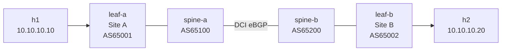

# Lab 33 — EVPN Multi-Site (Stretched Subnet Across Two DCs)

> **Format:** Hands-on. Two minimal EVPN fabrics in two "sites", joined by a DCI link. Same /24 subnet stretched across both sites with anycast gateway local at each leaf. Reference answer in [`solutions/`](solutions/).
>
> **Story chapter:** Phase 6 · Senior · Year 4. The capstone of the story. A long-standing customer — and your CTO — both have the same ask: "we want a /24 that works in both DCs simultaneously, for active-active disaster recovery." This is exactly the problem stretched-subnet-across-sites is supposed to solve. You design the multi-site EVPN extension, validate it in a small fabric, and present the migration plan to leadership. See [`STORY.md`](../../STORY.md).

## Real-world scenario

You operate two physical sites — could be two datacenters in different cities, two halves of one DC across fire zones, or a primary + DR pair. Customers need certain subnets to **work in both sites simultaneously**:

- A customer's VMs in Site A and Site B should be L2-adjacent within their tenant VLAN.
- The gateway IP for those subnets should answer locally in each site (no cross-DC hairpin for first-hop).
- If Site A's connectivity to the inter-site link fails, traffic within Site A keeps working; same for Site B.
- A VM live-migrating from Site A to Site B should not change IP and ideally not even drop the TCP session.

This is the **stretched subnet** / **DC interconnect (DCI)** problem. EVPN solves it: announce Type 2 (MAC/IP) and Type 5 (prefix) routes across the inter-site link; the remote fabric imports them; anycast gateway works in both sites; hosts roam freely.

This lab is the simplest possible multi-site demo: 2 sites, 1 leaf each, joined back-to-back over a DCI link. Production designs use more sophisticated **EVPN Multi-Site** patterns (Border Gateway, ESI handling) — discussed in theory but not configured here.

## Goal

By the end you should be able to answer:

- What's a **stretched subnet** and why is it operationally useful?
- What's the difference between **back-to-back EVPN** and **EVPN Multi-Site (Border Gateway)**?
- Why does the **DCI link need both IPv4 underlay and EVPN address-family**?
- How does **anycast gateway** behave across multi-site (each site's leaves answer locally)?
- What are the **failure-domain implications** of stretching too aggressively?

## Topology



Both leaves run the same VLAN 100 with anycast gateway `10.10.10.254`. h1 is in Site A, h2 in Site B, same subnet.

## Theory primer

### Back-to-back EVPN

The simplest multi-site approach: just **extend the EVPN domain** through the DCI link. Both sites' spines/borders peer with each other in EVPN. Routes flow as if it were one big fabric.

- Pros: minimal config; one big EVPN domain works as expected.
- Cons: **failure-domain coupling**. A BGP misconfiguration in Site A floods to Site B. A MAC mobility event in Site A causes BGP churn in Site B. Operationally you have one bigger blast radius.

OK for small designs (2 sites, modest scale). Production multi-DC at scale uses Multi-Site.

### EVPN Multi-Site (Border Gateway)

A more sophisticated pattern (RFC 9014): designate **Border Gateways** at each site. Within each site, EVPN runs normally. Between sites, the BGs **re-originate** routes — translating Type 2/5 routes across the boundary, with their own VTEP IPs.

- **Each site has its own EVPN domain** — internal BGP state stays local.
- BGs filter, translate, and aggregate between sites.
- Inter-site DCI is its own routing domain.
- Failure isolation: a problem in Site A's EVPN doesn't bleed into Site B.

EOS supports EVPN Multi-Site with per-site **domain isolation** config (`domain identifier <x:y>` / `domain identifier <x:y> remote`, `neighbor <peer> domain remote`, `evpn ethernet-segment domain local|remote`, plus RCF functions for IMET/BUM filtering). Beyond the scope of this lab; mentioned for context. (Syntax per EOS User Guide v4.36.0F.)

### What flows across the DCI

In back-to-back mode:
- **Underlay**: IPv4 reachability for VTEP loopbacks (loopback IPs of both sites' leaves must be reachable from each other).
- **EVPN**: Type 2/3/5 routes for stretched VLANs/VRFs.
- **`next-hop-unchanged`** on the DCI peers, so VTEP IPs propagate unchanged (otherwise the spine becomes the VTEP, can't decap).

### Anycast gateway in multi-site

Same as lab 32 — every leaf hosting the subnet uses the same anycast IP + MAC. Hosts in Site A use leaf-a as gateway; hosts in Site B use leaf-b. No hairpin across the DCI for L3 first-hop.

For inter-subnet traffic: the L3 VNI (Type 5 routes) carries L3 prefixes across the DCI. h1 (subnet A) reaching h2's subnet (subnet B, also stretched) goes via L3 VNI encapsulation.

### Failure-domain considerations

**Don't stretch everything**. Common bad pattern: "we'll just stretch all VLANs to both sites so VMs can move anywhere." Reality:

- A misbehaving host in Site A (broadcast storm, ARP flapping) propagates to Site B.
- A bug or storm event takes BOTH sites down simultaneously.
- BUM traffic crosses the DCI for every broadcast in every stretched VLAN — DCI bandwidth pressure.

Best practice: stretch ONLY what truly needs stretching. Most subnets should be **single-site** with cross-site reachability via L3 routing (Type 5 only). Stretched L2 is for specific cases — clustered storage, certain VM mobility needs, etc.

## Your task

1. On both spines:
   - Add the DCI neighbor: eBGP with the other spine's `172.16.0.X` IP.
   - Activate IPv4 + EVPN address-families on the DCI neighbor.
   - `send-community extended` and `next-hop-unchanged` on EVPN.
2. Verify VTEP loopback reachability across the DCI (IPv4 underlay).
3. Verify EVPN routes cross the DCI (Type 2/3/5 on both sides).
4. Verify h1 ↔ h2 ping works across the DCI.
5. Verify anycast gateway: each host's `ip neigh` for `10.10.10.254` shows the same MAC; each host reaches its local leaf for first-hop.

## Hints

Spine DCI neighbor (mirror on other spine):

```
router bgp <my-asn>
   neighbor 172.16.0.<other> remote-as <other-asn>
   neighbor 172.16.0.<other> send-community extended

   address-family ipv4
      neighbor 172.16.0.<other> activate

   address-family evpn
      neighbor 172.16.0.<other> activate
      neighbor 172.16.0.<other> next-hop-unchanged
```

Verification:

```
show ip bgp summary
show bgp evpn summary
show bgp evpn route-type mac-ip
show bgp evpn route-type ip-prefix
show ip route                        ! VTEPs of other site reachable?
```

## Deploy

```bash
cd ~/containerlab/labs/33-evpn-multisite
sudo containerlab deploy
```

## Verification

### 1. DCI sessions Established

```bash
docker exec -it clab-evpn-multisite-spine-a Cli
show ip bgp summary
show bgp evpn summary
```

Two neighbors each: leaf-a (Site A intra) + spine-b (DCI). Both Established for both IPv4 and EVPN.

### 2. Cross-site VTEP reachability (underlay)

```
show ip route 22.22.22.22
```

spine-a should have a route to leaf-b's VTEP IP via the DCI.

### 3. EVPN routes cross-site

```
show bgp evpn route-type mac-ip
```

leaf-a should see leaf-b's Type 2 routes (h2's MAC at VTEP 22.22.22.22).

```
show bgp evpn route-type ip-prefix
```

Both sides see each other's tenant subnets.

### 4. h1 ↔ h2 ping

```bash
docker exec clab-evpn-multisite-h1 ping -c 3 10.10.10.20
```

✅. The packet flow:
- h1 → leaf-a (local anycast gateway? No — h2 is in the same /24, so it's intra-subnet, no routing needed)
- leaf-a sees h2's MAC at VTEP 22.22.22.22 (from EVPN Type 2)
- leaf-a VXLAN-encaps to 22.22.22.22
- Underlay routes: leaf-a → spine-a → spine-b → leaf-b
- leaf-b decaps, delivers to h2

### 5. Anycast gateway local at each site

```bash
docker exec clab-evpn-multisite-h1 ip neigh show 10.10.10.254
docker exec clab-evpn-multisite-h2 ip neigh show 10.10.10.254
```

Both should show MAC `aa:bb:cc:00:00:01` — same virtual MAC. Each host's local leaf answers ARP for the gateway.

### 6. Failover demo — DCI down

Shut the DCI link:

```bash
docker exec -it clab-evpn-multisite-spine-a Cli
configure terminal
  interface Ethernet5
    shutdown
```

h1 ↔ h2 stops working (no cross-site path). With only **one host per site**, the surviving behavior you can actually observe is limited: each host still resolves and reaches its **local anycast gateway** `10.10.10.254` (the gateway lives on the local leaf, not across the DCI):

```bash
docker exec clab-evpn-multisite-h1 ping -c 2 10.10.10.254   # still works
docker exec clab-evpn-multisite-h2 ping -c 2 10.10.10.254   # still works
docker exec clab-evpn-multisite-h1 ping -c 2 10.10.10.20    # now fails (DCI down)
```

The fabric tolerates DCI failure for intra-site traffic. To *see* intra-site host-to-host forwarding survive the DCI cut you'd need 2+ hosts in the same site — out of scope for this minimal two-host demo, but the principle is the same: the local leaf keeps switching/routing for its own site regardless of the DCI.

Restore: `no shutdown`.

## Peek at solution

- [`solutions/spine-a.cfg`](solutions/spine-a.cfg), [`solutions/spine-b.cfg`](solutions/spine-b.cfg), [`solutions/leaf-a.cfg`](solutions/leaf-a.cfg), [`solutions/leaf-b.cfg`](solutions/leaf-b.cfg)

## Concepts cheat-sheet

- **Stretched subnet** — same L2 subnet in multiple physical locations.
- **DCI** — DataCenter Interconnect; physical link(s) between sites.
- **Back-to-back EVPN** — simplest multi-site; one EVPN domain spans both. Couples failure domains.
- **EVPN Multi-Site / Border Gateway** — production pattern; each site has its own EVPN domain with translation at the boundary.
- **Anycast across sites** — every leaf in every site uses the same virtual IP + MAC for the stretched gateway.
- **L3 VNI for inter-subnet routing** — same mechanism as single-site (lab 31), just with the routes crossing the DCI.

## Production deployment notes

- **Sites need redundant DCI links** — two physical paths via two providers, ideally. Single DCI = SPOF.
- **EVPN Multi-Site over Back-to-back** for non-trivial deployments. Failure isolation is worth the config complexity.
- **Don't stretch everything** — only subnets that truly need it. Default to per-site subnets with cross-site L3 reachability.
- **MAC mobility tuning** — a VM that moves between sites generates EVPN MAC moves. Tune `mac mobility` thresholds.
- **Latency awareness** — TCP throughput suffers across high-latency DCI. Storage replication may need separate transport.
- **MTU planning** — DCI links must support jumbo frames if you VXLAN-encap across them. Provider-managed DCI may have lower MTU; need to fragment-protect or set lower inner MTU.
- **EVPN ESI** for multi-homing servers across sites (rarely used; cross-site multi-homing is unusual).
- **Symmetric vs asymmetric DCI hops** — make sure both sides see the same path costs.

## What's missing (deliberately)

- **EVPN Multi-Site Border Gateway config** — beyond intro scope; needs cEOS Multi-Site feature config.
- **DCI redundancy** — would need additional links and BGP peers.
- **MAC mobility tuning** — production setting; lab is too small to exercise.
- **Encrypted DCI** — IPsec/MACsec over DCI; transport-layer concern.

## Cleanup

```bash
sudo containerlab destroy --cleanup
```
