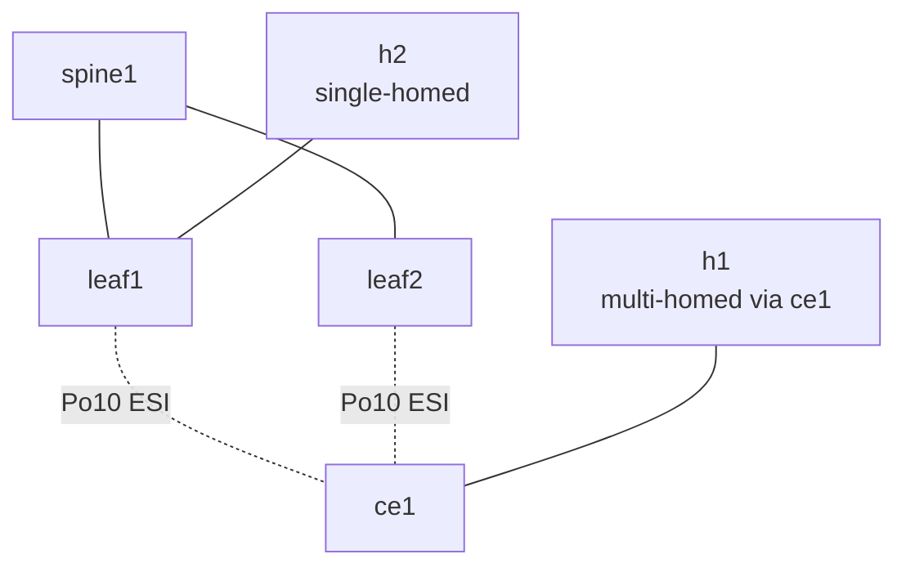

# Lab 33b — EVPN Multi-Homing (Ethernet Segment / ESI)

> **Format:** Hands-on. The same dual-homing problem as lab 14 (MLAG), but solved the *EVPN-native* way — no peer-link, no MLAG-specific control plane, no MLAG-specific gotchas. Reference answer in [`solutions/`](solutions/).
>
> **Story chapter:** Phase 6 · Senior · Year 4. You're designing a new pod for the EVPN fabric. The old pods use MLAG (lab 14) for dual-homing servers. For this new build you're going EVPN-MH: cleaner, no peer-link cabling, no MLAG quirks (orphan ports, peer-keepalive split-brain, etc.). The mechanism is what every modern EVPN deployment chooses for new builds. See [`STORY.md`](../../STORY.md).

> **cEOS caveat (read before the Verification section):** EVPN-MH all-active is part **control plane**, part **ASIC data plane**. The control-plane half works in cEOS-lab and is what you actually verify here: Ethernet Segment formation, Type 1 (A-D) and Type 4 (ES) routes, DF election state, and LACP bundling the two leaf links into one bundle on ce1. The **data-plane half is hardware behaviour and is NOT faithfully enforced in a container** — specifically (a) true per-flow active-active ECMP load-balancing across both leaf VTEPs, (b) non-DF BUM filtering (a non-DF leaf dropping broadcast/unknown-unicast so the CE never sees duplicates), and (c) fast mass-withdrawal convergence. On real DCS-7050X/7280R/7500R hardware the ASIC enforces all three; on cEOS the routes and election state are present but the forwarding may be approximated. So **verify the control-plane state** (`show evpn ethernet-segment`, `show bgp evpn route-type ...`) and treat the failover/ECMP demos as illustrative of the *mechanism*, not as proof the container is hashing flows across both VTEPs. Confirm exact behaviour against the actual cEOS 4.35.4M build on the VM.

## Real-world scenario

When you built the first EVPN pod, you re-used what you knew: MLAG for dual-homed servers (lab 14), with anycast gateway via VARP (lab 15) on top. It works, but the MLAG layer is doing a lot:
- Peer-link cabling (and the operational risk of losing it)
- Peer-keepalive protocol
- MLAG-specific commands (`mlag configuration`, `mlag <id>`)
- Orphan-port gotchas, peer-config consistency checks
- Vendor-specific (every vendor's MLAG is slightly different)

For the new pod, you want to eliminate the MLAG layer entirely. **EVPN-MH (Multi-Homing via Ethernet Segment)** does this. The dual-homing is signaled via BGP-EVPN itself — the same control plane already running the fabric. No peer-link, no MLAG protocol, no vendor-specific glue. Two leaves agree on a shared **Ethernet Segment Identifier (ESI)** and a shared **LACP system-id**, and from the downstream device's perspective they appear as one LACP partner. EVPN Type 1 (Ethernet Auto-Discovery) and Type 4 (Ethernet Segment) routes carry the necessary state between the leaves.

## Goal

By the end you should be able to answer:

- What is an **Ethernet Segment Identifier (ESI)**, and how do two leaves share one?
- What's the role of the shared **`lacp system-id`** in EVPN-MH?
- What EVPN route types are added by multi-homing (Type 1 and Type 4)?
- Why are member-port channel-groups in **`mode on`** instead of `mode active`?
- Why must **STP be disabled** on the multi-homed VLAN at the PE side?
- How does this compare to MLAG (lab 14) — what's gone, what stayed, what's new?

## Topology



| Device | Role | VTEP IP |
|---|---|---|
| spine1 | Underlay + EVPN route forwarder | 100.100.100.1 |
| leaf1 | EVPN-MH peer A | 11.11.11.11 |
| leaf2 | EVPN-MH peer B | 22.22.22.22 |
| ce1 | Downstream "customer edge" — runs ordinary LACP | — |
| h1 | Multi-homed host (behind ce1) | 10.10.10.10/24 |
| h2 | Single-homed host (directly on leaf1) | 10.10.10.20/24 |

Note: **no peer-link between leaf1 and leaf2**. That's the visual difference from lab 14.

## Theory primer

### Ethernet Segment (ES) and ESI

In EVPN-MH terminology, an **Ethernet Segment (ES)** is a set of links from multiple PE routers (leaves) terminating on the same customer-side device (CE). Each ES is identified by a 10-byte **Ethernet Segment Identifier (ESI)**.

Both leaves' port-channel toward the CE must:
- Use the **same ESI** — that's how EVPN identifies them as part of one ES
- Use the **same `lacp system-id`** — that's how the CE sees them as one LACP partner

Convention for ESI: a 10-byte hex value, colon-separated like `0011:1111:1111:1111:1111`. Pick any unique value per ES. Common pattern: encode site/pod/rack in the bytes so it's not just a random number.

### LACP system-id (shared)

LACP normally uses each switch's MAC as its "system-id" — which is how a LACP partner identifies who it's bonding with. Two different switches have two different system-ids, so a downstream LACP partner would see them as two separate partners and not form a bundle.

The trick: **override the system-id to a shared value** on both leaves' ES port-channel. Now both leaves advertise the same LACP system-id to the CE. The CE thinks it's bonded to one LACP partner — and forms one Port-Channel across both physical links.

```
interface Port-Channel10
   evpn ethernet-segment
      lacp system-id aabb.ccdd.0001
```

This is the LACP-layer equivalent of MLAG's "share a virtual MAC" — but signaled via EVPN, not via a peer-link.

### Member ports: `mode on`, not `mode active`

Counterintuitive: the channel-group members on the leaf side use `mode on` (static):

```
interface Ethernet2
   channel-group 10 mode on
```

Why not `mode active` (which would run LACP locally)? Because LACP is being run from the leaves to the CE via the **shared system-id** mechanism. The leaves don't run LACP *with each other* (they have no peer-link!) — they each independently terminate one member of the same logical LACP bundle on the CE side. The CE runs `mode active` and sees both leaf-ports as members of one bundle.

(Note: this is the cEOS pattern per the EOS Manual section 19.14.1. Other platforms may handle the LACP layer differently.)

### New EVPN route types

EVPN-MH adds two new route types to what you saw in lab 30:

- **Type 1 — Ethernet Auto-Discovery (A-D) per ES** — "I am a PE on Ethernet Segment X; if any other PE in this ES learns a MAC, I can forward to that MAC via my own port-channel." Used for fast convergence (mass withdrawal) and ECMP load-balancing.
- **Type 4 — Ethernet Segment route** — used for Designated Forwarder (DF) election among PEs sharing an ES. The DF is the one PE responsible for forwarding BUM (broadcast/unknown unicast/multicast) into the ES; non-DFs filter BUM to prevent duplicate delivery.

You'll see these in `show bgp evpn route-type ethernet-segment` and `show bgp evpn route-type auto-discovery`.

### Designated Forwarder (DF)

In active-active EVPN-MH:
- All PEs forward **unicast** traffic in both directions (load-balanced via LACP hashing on the CE, ECMP on the PE side)
- Only the **DF** forwards **BUM** into the ES — preventing the CE from receiving multiple copies of broadcast frames

(Both of these are ASIC data-plane behaviours — see the cEOS caveat at the top. In cEOS-lab you can observe the DF *election state*, but the container does not necessarily enforce non-DF BUM filtering or true per-flow ECMP in the forwarding path.)

DF election uses Type 4 (ES) routes. The default is the RFC 7432 **modulo / service-carving** algorithm: the PEs sharing the ES are ordered by their originating IP (VTEP) address, and the DF for a given VLAN is the PE at index `(VLAN-id mod number-of-PEs)` in that ordered list. So the DF is decided **per-VLAN** — different VLANs on the same ES can land on different leaves, and the lowest-addressed PE does *not* simply win everything. It is tunable to a preference-based scheme (`designated-forwarder election ...` under the ethernet-segment) if you need deterministic placement.

### STP must be disabled on multi-homed VLANs

Per the EOS Manual (section 19.14.3 — Configuration Considerations):

> "L2 loop-free protocols, such as Spanning Tree Protocol (STP) are not supported between PE-CE with EVPN VXLAN All-Active Multi-homing. The topology must be loop-free. STP must be disabled for the Multihomed VLANs on PEs and CEs."

In the lab: `no spanning-tree vlan-id 100` on each leaf (and ce1). This is non-negotiable for EVPN-MH all-active mode.

### EVPN-MH vs MLAG — quick comparison

| | MLAG (lab 14) | EVPN-MH (this lab) |
|---|---|---|
| Peer-link | Required (Po10 between peers) | None — no inter-peer link needed |
| Peer-keepalive | Required (Vlan4094 + SVI) | None — EVPN BGP handles it |
| Control protocol | MLAG (vendor-specific) | EVPN BGP (open standard, multi-vendor) |
| LACP on members | `mode active` | `mode on` (LACP runs via shared system-id at the ES) |
| New EVPN route types | n/a | Type 1 (A-D) + Type 4 (ES) |
| Anycast L3 gateway | VARP (lab 15) | VARP also works; EVPN-anycast-gateway (lab 32) is more idiomatic |
| Vendor portability | Each vendor has their own MLAG | EVPN-MH is RFC-standardized — usable across vendors |
| STP on the multi-homed VLAN | Allowed | Must be disabled |

**For greenfield EVPN fabrics: EVPN-MH is the recommended pattern.** MLAG remains valid for non-EVPN designs or where you have existing MLAG investment.

## Your task

On **both leaf1 and leaf2** (identical config except RD):

1. Create **`Port-Channel10`** as an access port for VLAN 100.
2. Inside the Po, add the `evpn ethernet-segment` block:
   - `identifier 0011:1111:1111:1111:1111` (identical on both leaves)
   - `route-target import 00:11:11:11:11:11` (identical on both leaves)
   - `lacp system-id aabb.ccdd.0001` (identical on both leaves)
3. Add Et2 to Po10 with **`channel-group 10 mode on`** (note: `mode on`, NOT `mode active`).
4. Disable STP for VLAN 100: `no spanning-tree vlan-id 100`.
5. Configure VXLAN1 with VLAN 100 ↔ VNI 10100 mapping.
6. Under `router bgp`, add `vlan 100` service instance with RD/RT.

On **ce1**:

7. Create Port-Channel10 with `switchport access vlan 100`.
8. Add Et1 + Et2 with `channel-group 10 mode active` (regular LACP).
9. STP disabled on VLAN 100 also (CE side requirement).

Verify:
- ES forms; Type 1 + Type 4 routes appear in EVPN RIB
- Both leaves are listed for the ES
- h1 ↔ h2 ping works
- Kill one leaf — ping continues via the surviving leaf

## Hints

EVPN Ethernet Segment config block (verified against EOS User Manual v4.36.0F, section 19.14.1):

```
interface Port-Channel<N>
   switchport access vlan <V>
   evpn ethernet-segment
      identifier <10-byte-hex>
      route-target import <mac-format-RT>
      lacp system-id <shared-MAC>

interface Ethernet<X>
   channel-group <N> mode on
```

Per-VLAN STP disable:

```
no spanning-tree vlan-id <V>
```

Verification commands:

```
show bgp evpn route-type ethernet-segment
show bgp evpn route-type auto-discovery
show evpn ethernet-segment
show evpn ethernet-segment detail
show port-channel summary
show lacp interface
```

Note: `show bgp evpn route-type ethernet-segment` is verified verbatim against the EOS User Manual (v4.36.0F, p.4352). `show evpn ethernet-segment[ detail]` and `show bgp evpn route-type auto-discovery` are standard, real EOS-MH operational commands but were not located verbatim in the manual's searched pages — confirm their exact wording/output on the running cEOS 4.35.4M build and adjust this list if the syntax differs on your image.

## Deploy

```bash
cd ~/containerlab/labs/33b-evpn-multihoming
sudo containerlab deploy
```

Wait ~60 seconds for the underlay BGP, EVPN, and LACP negotiations to settle.

## Verification

### 1. Underlay BGP up

```bash
docker exec -it clab-evpn-multihoming-leaf1 Cli
show ip bgp summary
show bgp evpn summary
```

Both IPv4 and EVPN sessions to spine1 should be Established.

### 2. Ethernet Segment forms

```
show evpn ethernet-segment
```

Should show ESI `0011:1111:1111:1111:1111`, with both leaf1 (local) and leaf2 (remote) listed.

```
show evpn ethernet-segment detail
```

Identifies the **Designated Forwarder** (one of the two leaves wins; the other is non-DF).

### 3. EVPN Type 1 and Type 4 routes

```
show bgp evpn route-type ethernet-segment
```

Type 4 routes — one per leaf per ES.

```
show bgp evpn route-type auto-discovery
```

Type 1 routes — for fast convergence and load-balancing.

### 4. LACP from ce1's view

```bash
docker exec -it clab-evpn-multihoming-ce1 Cli
show lacp interface
show port-channel summary
```

ce1's Po10 has Et1 and Et2 as members. **Both members are in `Bndl` state** — meaning LACP successfully bundled them. From ce1's view it's plugged into "one switch" (system-id `aabb.ccdd.0001`).

### 5. End-to-end traffic

```bash
docker exec clab-evpn-multihoming-h1 ping -c 3 10.10.10.20
docker exec clab-evpn-multihoming-h2 ping -c 3 10.10.10.10
```

Both directions ✅. The multi-homed h1 and single-homed h2 communicate over EVPN-stretched VLAN 100.

### 6. Failover demo — kill leaf1

Sustained ping:

```bash
docker exec clab-evpn-multihoming-h1 ping 10.10.10.20
```

In another terminal:

```bash
sudo docker stop clab-evpn-multihoming-leaf1
```

On hardware the ping misses ~1-2 packets and resumes — ce1's LACP fails over to the surviving member (toward leaf2), and EVPN withdraws leaf1's Type 1/4 routes (fast mass-withdrawal). In **cEOS-lab the convergence is not ASIC-fast** (fast mass-withdrawal is a hardware behaviour): expect the ping to recover, but the gap may be several packets / a few seconds while LACP and BGP-EVPN reconverge in software, not the sub-second hardware number. The point of the demo is that traffic *does* survive losing one leaf with no peer-link involved — confirm that, and confirm via `show evpn ethernet-segment` / `show bgp evpn route-type ethernet-segment` that leaf1's ES state and Type 4 route are gone while leaf2 keeps forwarding.

Restart leaf1:

```bash
sudo docker start clab-evpn-multihoming-leaf1
```

Wait ~60s for EVPN + LACP to reconverge.

### 7. Examine the Type 2 routes for multi-homed MAC

```
show bgp evpn route-type mac-ip 0000.0000.0001
```

(Use h1's actual MAC, which you can find on ce1 via `show mac address-table` or on a host.)

When h1's MAC is learned at ce1, **both leaves advertise an EVPN Type 2** route for h1's MAC, each with their own VTEP IP but the same ESI in the route. Remote PEs see two equal-cost paths to the same MAC and *can* ECMP traffic between them — this is the "true active-active" mechanism. What you can verify in cEOS-lab is the **control-plane evidence**: two Type 2 routes for the one MAC, one per VTEP, sharing the ESI. Whether the container actually hashes individual flows across both VTEPs in the data plane is the ASIC behaviour flagged in the cEOS caveat — on hardware it does; in a container, don't rely on observing real per-flow load-sharing.

## Peek at solution

- [`solutions/spine1.cfg`](solutions/spine1.cfg), [`solutions/leaf1.cfg`](solutions/leaf1.cfg), [`solutions/leaf2.cfg`](solutions/leaf2.cfg), [`solutions/ce1.cfg`](solutions/ce1.cfg)

## Concepts cheat-sheet

- **Ethernet Segment (ES)** — set of links from multiple PEs terminating on the same CE.
- **ESI** — 10-byte identifier shared by all PE port-channels in the same ES.
- **Shared LACP system-id** — makes multiple PEs appear as one LACP partner to the CE.
- **`mode on`** on member ports — static channel-group; LACP is handled via the shared system-id mechanism, not between the leaves themselves.
- **Type 1 (A-D) routes** — fast withdrawal + load balancing per ES.
- **Type 4 (ES) routes** — Designated Forwarder election.
- **Designated Forwarder (DF)** — the one PE in the ES that forwards BUM into the ES. Prevents duplicate delivery.
- **No STP on multi-homed VLANs** — mandatory for EVPN VXLAN all-active mode.
- **No peer-link** — the entire reason EVPN-MH is cleaner than MLAG.

## Production design notes

- **EVPN-MH is the default for new EVPN fabric builds.** MLAG remains for non-EVPN designs.
- **ESI allocation** — keep a spreadsheet or IPAM-style allocation. Encode rack/pod/site in the bytes for traceability. Avoid pure random ESIs.
- **LACP system-id allocation** — same as ESI — locally-administered MAC range (`02:` prefix or similar), document per-pair.
- **DF tuning** — default election works fine; tune via `evpn ethernet-segment` sub-commands if you need deterministic DF placement.
- **EVPN-MH + anycast gateway** — combines beautifully (lab 32). Every leaf both routes anycast AND participates in ES multi-homing.
- **STP boundary handling** — STP is disabled on multi-homed VLANs at PE side; but the CE still uses STP toward devices behind it. CE is the STP boundary.
- **Migration from MLAG** — possible but disruptive. Generally: build new pods on EVPN-MH; let old MLAG pods age out naturally.

## What's missing (deliberately)

- **Single-active mode** — alternative to all-active. One PE is preferred; others are standby. Niche; less common.
- **DF election tuning** — production knob, but defaults are fine for most.
- **EVPN-MH with bonded server** — instead of a CE switch, a Linux server with mode-4 bonding. Same mechanism on the leaves; different downstream. Could be a follow-up lab.
- **Cross-vendor EVPN-MH** — interop between Arista + another vendor. Real but vendor-specific quirks. Beyond scope.

## Cleanup

```bash
sudo containerlab destroy --cleanup
```
