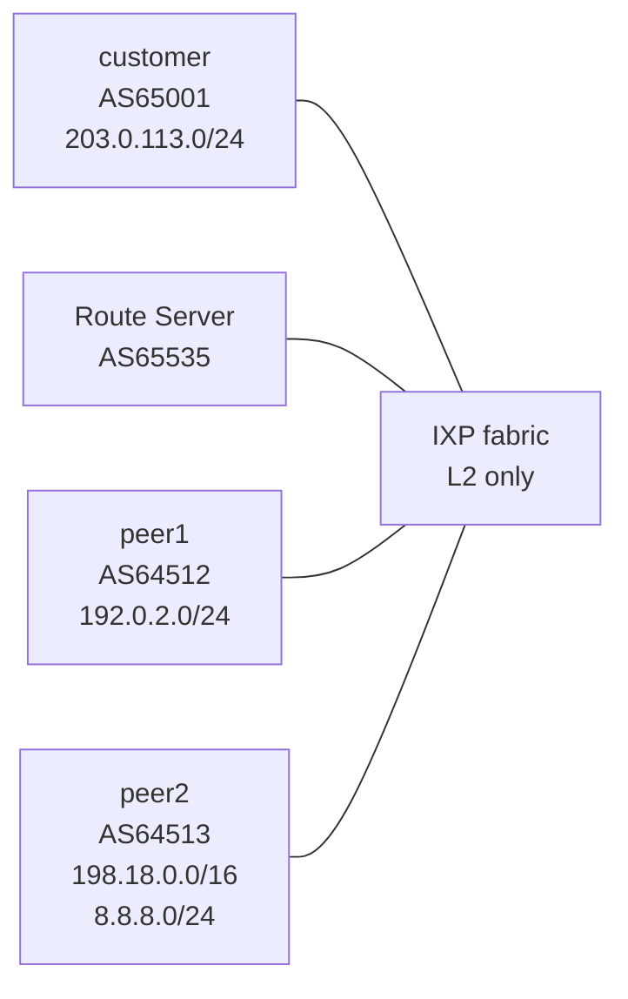

# Lab 34 — eBGP Upstream Peering at Scale (IXP + Route Server)

> **Format:** Hands-on. Five-node topology: an IXP fabric (L2 switch), an IXP route server, two other participants, and you. Reference answer in [`solutions/`](solutions/).
>
> **Story chapter:** Phase 7 · Senior · Year 4. The Company joined its first IXP (Internet Exchange Point). Instead of running bilateral BGP sessions with every peer at the exchange, you connect to the **route server** — one session, all the peers' routes. Plus the IXP has policies on what you must/must-not advertise. See [`STORY.md`](../../STORY.md).

## Real-world scenario

Last quarter The Company became an IXP member (DE-CIX, AMS-IX, NL-IX, BIX, etc.). You're now physically connected to the exchange fabric. There are 200+ other networks at this IXP. You don't want to manage 200 bilateral BGP sessions.

The IXP runs a **route server** (RS): one BGP session per participant. Every participant peers with the RS. The RS redistributes everyone's routes to everyone else (with filtering). You set up *one session* with the RS and get routes from all 200 networks.

But the IXP has rules:
- You must announce only prefixes you actually own (no transit leaking)
- You must filter incoming bogons before reaching the RS
- You must respect each peer's policy (some IXP RSes implement this via communities)
- You shouldn't accept default routes from the RS (the RS isn't your upstream — it's a peering relationship)

This lab implements the IXP peering pattern: one session to the RS, layered filters, no leaks.

## Goal

By the end you should be able to answer:

- What's an **IXP route server** and how is it different from a regular BGP peer?
- Why is **multilateral peering** (via RS) the norm at large IXPs?
- What's the **bogon filter** and why do you apply it on every BGP edge?
- What's the **prefix-length filter** and why is `/24 max, /8 min` the conservative default?
- Why do you use **`maximum-routes`** at peering edges?

## Topology



All four BGP speakers share one L2 segment (`198.51.100.0/24` for the IXP LAN). Only one BGP session needed per participant (to the RS).

## Theory primer

### Why route servers exist

At a large IXP (200+ participants), bilateral peering means N×(N-1)/2 sessions. The RS reduces this to N sessions (each participant to the RS). The RS does **not** participate in forwarding — it's a pure control-plane node.

Real-world route servers run **BIRD** or **OpenBGPD**, both of which have explicit "route server" mode that:
- Preserves the original next-hop (so traffic still goes peer→peer directly, not via the RS)
- Doesn't add itself to the AS-path (so it's "invisible")
- Implements per-peer policy (often via BGP communities)

cEOS doesn't have a dedicated RS mode, so this lab uses standard BGP. Mechanically close enough for learning purposes.

### Multilateral vs bilateral

- **Multilateral**: one session, gets all peers' routes
- **Bilateral**: separate session with each peer

Most IXP participants use multilateral as the default and add bilateral for specific peers where they need finer-grained policy than the RS supports.

### Bogon and prefix-length filtering

Real IXP traffic should be:
- **Bogon-free**: no private/reserved prefixes (RFC 6890)
- **Prefix-length-bounded**: `/24` is the conventional maximum specificity for IPv4 (longer prefixes are often used internally and shouldn't be on the IXP); `/8` is the minimum (no extremely-aggregated prefixes that nobody legitimately owns at IXP scale)
- **Not your own prefix**: never accept your own /24 back from a peer — that's a leak signal

This is the bog-standard "ingress hygiene" filter every BGP edge needs. Most IXP RSes apply their own filters too, but defense in depth — apply yours.

### `maximum-routes`

Set per-neighbor: if the peer announces more than N prefixes, the session drops. Protects against runaway leaks (covered in lab 26).

For an IXP RS: set high enough to accept everything legitimate but low enough that a leak triggers it. `10000` is a reasonable starting point for medium IXPs; tune based on actual peer counts.

### What about RPKI?

In production, you'd also deploy **RPKI** (Resource Public Key Infrastructure) at every BGP edge. The router connects to an RPKI validator (Routinator, rpki-client, FORT) via the RTR protocol; routes are tagged Valid / Invalid / NotFound. Drop Invalids; accept Valids; accept-with-lower-pref NotFounds.

RPKI deployment requires running an actual validator daemon, which is beyond a simple lab. Covered conceptually in [`docs/practice/attacker-perspective.md`](../../docs/practice/attacker-perspective.md) and lab 25 (BGP business).

## Your task

On `customer`:

1. Establish one eBGP session to the route server (`198.51.100.250`, AS `65535`).
2. Build prefix-lists:
   - `BOGONS`: standard bogon ranges
   - `OWN-PREFIX`: your `203.0.113.0/24`
   - `ACCEPTABLE-LENGTH`: prefixes between `/8` and `/24`
3. Apply an **inbound route-map** that:
   - Denies bogons
   - Denies your own prefix
   - Permits everything else that's in the acceptable length range
   - Tags accepted routes with community `65001:200` for visibility
4. Apply an **outbound route-map** that announces only your own prefix.
5. Set `maximum-routes 10000` on the RS neighbor.
6. Verify: you receive peer1's `192.0.2.0/24` and peer2's `198.18.0.0/16` + `8.8.8.0/24` via the RS, but NOT each other directly.

## Hints

```
router bgp <asn>
   neighbor <rs-ip> remote-as <rs-asn>
   neighbor <rs-ip> maximum-routes <n>
   neighbor <rs-ip> send-community
   address-family ipv4
      neighbor <rs-ip> activate
      neighbor <rs-ip> route-map <name> in
      neighbor <rs-ip> route-map <name> out
```

## Deploy

```bash
cd ~/containerlab/labs/34-ebgp-upstream-at-scale
sudo containerlab deploy
```

## Verification

### 1. Single session up

```bash
docker exec -it clab-ebgp-upstream-scale-customer Cli
show ip bgp summary
```

One Established session — to `198.51.100.250` (the RS).

### 2. Routes from BOTH other peers

```
show ip bgp
```

You should see peer1's `192.0.2.0/24` AND peer2's `198.18.0.0/16` and `8.8.8.0/24`. Despite having ZERO sessions to peer1 or peer2 directly.

### 3. Inbound filter caught the bogon

peer2 also announces `198.18.0.0/16` — which is a bogon (RFC 2544 reserved). After your inbound filter applies:

```
show ip bgp 198.18.0.0/16
```

Should NOT show up in your RIB. The BOGONS prefix-list dropped it. Good.

### 4. Your prefix being advertised correctly

```
show ip bgp neighbors 198.51.100.250 advertised-routes
```

Only `203.0.113.0/24`. Not the routes you learned from peers.

## Peek at solution

- [`solutions/customer.cfg`](solutions/customer.cfg) — the main work
- [`solutions/rs.cfg`](solutions/rs.cfg) — the RS configuration
- [`solutions/peer1.cfg`](solutions/peer1.cfg), [`solutions/peer2.cfg`](solutions/peer2.cfg) — the other participants

## Concepts cheat-sheet

- **IXP** — physical exchange point where many networks interconnect
- **Route Server (RS)** — pure control-plane BGP speaker; reduces N×N peering to N
- **Multilateral peering** — one session to RS, get everyone's routes
- **Bilateral peering** — separate session per peer (sometimes needed despite the RS)
- **Bogon filter** — drop private/reserved/martian ranges (RFC 6890)
- **Prefix-length filter** — typical `/8` min, `/24` max for IPv4 on IXP
- **`maximum-routes`** — session-killer for leak protection

## Production deployment notes

- **Real RS**: BIRD or OpenBGPD, NOT a standard BGP router. The lab's cEOS is an approximation.
- **Apply your filters even though the RS filters too**: defense in depth.
- **Tag inbound routes with the source-peer's ASN in a community**: useful for diagnostics ("where did this route come from?").
- **Check the IXP's published peering policy**: each IXP has rules (allowed prefix sources, communities supported by their RS, etc.).
- **Look up the participating networks at PeeringDB**: see who you peer with, their ASN, their policy.
- **Some IXPs offer different RS "service levels"**: full, filtered, signed-only. Pick the one that matches your trust level.
- **RPKI on top**: your local RPKI validator gives you "is this announcement legitimate from this AS?" — additive to the RS's own filters.

## What's missing (deliberately)

- **Real RPKI ROV deployment** — requires running a Routinator/rpki-client instance; covered conceptually in [`docs/practice/attacker-perspective.md`](../../docs/practice/attacker-perspective.md).
- **Peering DB integration** — automate prefix-list generation from PeeringDB; production but operational.
- **Per-peer communities for fine-grained policy** — common at large IXPs; lab simplifies.

## Cleanup

```bash
sudo containerlab destroy --cleanup
```
