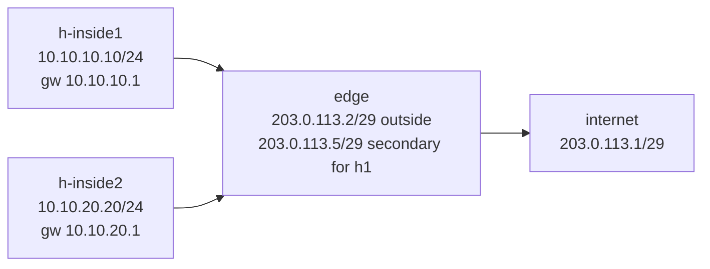

# Lab 35 — NAT in the DC

> **Format:** Hands-on. One edge router doing source NAT (PAT) + 1:1 NAT for inside hosts. Reference answer in [`solutions/`](solutions/).
>
> **Story chapter:** Phase 7 · Senior · Year 4. The Company has customers using private IPs internally but needing internet access. Plus some customer services need dedicated public IPs (web/mail servers). You're standing up NAT at the edge. See [`STORY.md`](../../STORY.md).
>
> **Syntax verification:** NAT syntax here is EOS User Manual v4.36.0F section 9.3.1 (IP NAT). Hardware switches (DCS-7280/7500/etc.) implement NAT in TCAM. **cEOS has no ASIC and may accept the NAT config without forwarding/translating** — see the cEOS caveat before the Verification section. The value of this lab is the config model and concepts.

## Real-world scenario

Two requirements:

1. **Outbound NAT for everyone**: customer VMs / inside hosts use RFC 1918 addresses; they need to reach the internet. PAT (Port Address Translation, a.k.a. source-NAT overload) maps all inside-source-IPs to one public IP.
2. **1:1 NAT for specific services**: h-inside1 hosts a public-facing web service. Inbound traffic from internet needs to reach a specific private IP. 1:1 NAT statically maps a public IP to a private IP.

Both are configured on the same edge router.

## Goal

- Understand the difference between **PAT (Port NAT / overload)** and **1:1 NAT (static NAT)**
- Know where each is used (outbound vs inbound + outbound)
- Recognize common NAT failure modes (state table exhaustion, asymmetric paths, NAT-unfriendly protocols)

## Topology



The outside link is a `/29` (203.0.113.0/29) on purpose: it is wide enough to hold both the edge's primary public IP (`.2`) **and** the 1:1 NAT public IP (`.5`), so the internet peer can route replies back to `.5`. The two inside hosts sit in **separate** RFC 1918 subnets (10.10.10.0/24 and 10.10.20.0/24) — a more realistic DC layout where each access segment is its own subnet.

## Theory primer

### PAT (source-NAT overload)
Many inside IPs → one outside IP, distinguished by source port. The NAT box keeps a translation table:

```
inside-IP:src-port  <-->  outside-IP:translated-port  <-->  remote-IP:dest-port
10.10.10.10:43210   <-->  203.0.113.2:50001          <-->  8.8.8.8:53
10.10.20.20:43210   <-->  203.0.113.2:50002          <-->  8.8.8.8:53
```

This is what every home router does. State per connection; thousands of inside hosts can share one public IP.

### 1:1 NAT (static NAT)
One public IP maps statically to one private IP. Inbound traffic to the public IP is rewritten to the private IP. Outbound traffic from the private IP appears as the public IP.

Used for: any service that must be reachable from outside (web servers, mail servers, etc.).

### NAT failure modes

- **State exhaustion**: NAT keeps state per connection. Tables fill up under heavy load or attack; new connections fail.
- **NAT-unfriendly protocols**: SIP, FTP, SCTP, some peer-to-peer protocols break because IP addresses are embedded in payloads. NAT-ALG (Application Layer Gateway) is the workaround, but it's fragile.
- **Asymmetric NAT**: traffic out one path, return path a different way → state doesn't match → drops.

## Your task

Reach the **goal state** below. Unlike Cisco IOS, EOS has no per-interface `ip nat inside`/`ip nat outside`/`ip nat enable` toggle — an interface participates in NAT simply by carrying an `ip nat source ...` rule, and **those apply commands live under the outside (egress) interface**, not at global config.

1. Add a **secondary** IP on the outside interface for the 1:1 NAT (`203.0.113.5`, same `/29` as the primary so it is routable back).
2. Configure a **NAT pool** referencing the primary outside IP (`203.0.113.2`).
3. Configure a **NAT ACL** matching both inside subnets (10.10.10.0/24 and 10.10.20.0/24).
4. Apply **PAT** on the outside interface so all inside traffic SNATs to the pool, overloaded by port.
5. Configure **1:1 NAT** on the outside interface mapping h-inside1's private IP to its dedicated public IP.

Goal state to confirm: both inside hosts can reach the internet peer, and h-inside1's translations show its dedicated `203.0.113.5` while h-inside2's show the shared `203.0.113.2`.

## Hints

- Global config (these contexts are correct in EOS): `ip nat pool <name> <start> <end> prefix-length <len>` and `ip access-list <name>` with `permit ip <subnet> any`.
- Apply context is the **outside interface** (`interface Ethernet1`, then `config-if`):
  - PAT (overload): `ip nat source dynamic access-list <acl> pool <pool> overload`
  - 1:1 / static: `ip nat source static <inside-ip> <outside-ip>`
- There is **no** `ip nat enable`, `ip nat inside`, or `ip nat outside` in EOS — don't go looking for one.
- Secondary outside address: `ip address 203.0.113.5/29 secondary` under the outside interface.
- Inspect with `show ip nat translations` and `show ip nat pool`.

## cEOS caveat — read before you trust the pings

NAT in EOS is a **hardware/TCAM data-plane feature** ("installs hardware translation entries", manual 9.3.1.1.1 / 9.3.1.2). cEOS is a container with **no ASIC**, so it commonly **accepts the NAT configuration without actually translating or forwarding** NAT'd traffic. On cEOS you may well see:

- `show running-config` containing every NAT line correctly (the config model is what this lab teaches), but
- `show ip nat translations` staying **empty**, and
- the Verification pings below **failing** even though the config is correct.

That is a platform limitation, **not** a mistake in your config. If the pings don't pass on your cEOS, you have still met the learning objective as long as the config matches the reference. The "you should see ..." statements below describe behaviour on a NAT-capable hardware switch (or a confirmed NAT-forwarding cEOS build).

## Verification

### 1. Outbound PAT (h-inside2 → shared public IP)

```bash
docker exec clab-nat-in-dc-h-inside2 ping -c 2 203.0.113.1
```

On a NAT-capable platform this succeeds and h-inside2 (10.10.20.20) is translated to the shared pool IP `203.0.113.2` with a random source port.

### 2. Outbound 1:1 NAT (h-inside1 → dedicated public IP)

```bash
docker exec clab-nat-in-dc-h-inside1 ping -c 2 203.0.113.1
```

h-inside1 (10.10.10.10) is translated to its dedicated `203.0.113.5` (the static rule wins over the dynamic PAT rule for this source).

### 3. Inbound 1:1 NAT (internet → h-inside1's public IP)

The `ip nat source static` rule is **bidirectional** — it also DNATs traffic arriving for `203.0.113.5` back to `10.10.10.10`. This is the whole point of giving h-inside1 a dedicated public IP (it hosts a public service). Because the outside `/29` contains both the link and `.5`, the internet peer can route to it:

```bash
# Start a listener on h-inside1 (its public service)
docker exec -d clab-nat-in-dc-h-inside1 nc -l -p 8080

# From the "internet" node, connect to the PUBLIC IP, not the private one
docker exec clab-nat-in-dc-internet ping -c 2 203.0.113.5
docker exec clab-nat-in-dc-internet nc -zv 203.0.113.5 8080
```

On a NAT-capable platform the ping/connection reaches h-inside1 via the DNAT half of the static rule. h-inside2 has **no** static rule, so it is reachable outbound only — there is no public IP that maps inbound to it.

### Check the translation table

On edge:
```
show ip nat translations
show ip nat pool
```

On a NAT-capable platform you should see entries for h-inside2 with translated source `203.0.113.2:*`, for h-inside1 with translated source `203.0.113.5`, plus a static (and any inbound) entry for `203.0.113.5 ↔ 10.10.10.10`.

> On cEOS this table is likely **empty** and the pings above likely **fail** — see the cEOS caveat above. Confirm your `show running-config` matches [`solutions/edge.cfg`](solutions/edge.cfg); that is the deliverable.

## Peek at solution

Full reference answer: [`solutions/edge.cfg`](solutions/edge.cfg). Note that the NAT `pool`/`access-list` live at global config while the `ip nat source dynamic ...` and `ip nat source static ...` apply lines sit under `interface Ethernet1` (the outside interface).

## What's missing (deliberately)

- **PAT pool with multiple outside IPs** (production scale)
- **NAT-ALG for SIP / FTP**
- **CGNAT** (lab 36 — different scale, different mechanics)
- **NAT64** (lab 38 — IPv6-to-IPv4 translation)
- **DNAT for port-forwarding** (similar to 1:1 but port-specific)

## Cleanup

```bash
sudo containerlab destroy --cleanup
```
