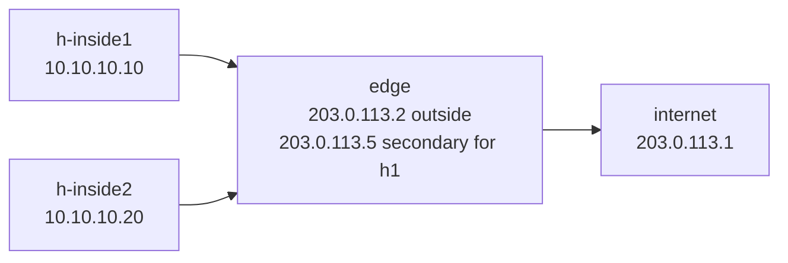

# Lab 35 — NAT in the DC

> **Format:** Hands-on. One edge router doing source NAT (PAT) + 1:1 NAT for inside hosts. Reference answer in [`solutions/`](solutions/).
>
> **Story chapter:** Phase 7 · Senior · Year 4. The Company has customers using private IPs internally but needing internet access. Plus some customer services need dedicated public IPs (web/mail servers). You're standing up NAT at the edge. See [`STORY.md`](../../STORY.md).
>
> **Syntax verification:** cEOS NAT support varies by platform and version. Verify against EOS User Manual v4.36.0F section 9.3.1 (IP NAT) before deploying. Hardware switches (DCS-7280/7500/etc.) implement NAT in TCAM; cEOS approximates in software.

## Real-world scenario

Two requirements:

1. **Outbound NAT for everyone**: customer VMs / inside hosts use RFC 1918 addresses; they need to reach the internet. PAT (Port Address Translation, a.k.a. source-NAT overload) maps all inside-source-IPs to one public IP.
2. **1:1 NAT for specific services**: h-inside1 hosts a public-facing web service. Inbound traffic from internet needs to reach a specific private IP. 1:1 NAT statically maps a public IP to a private IP.

Both are configured on the same edge router.

## Goal

- Understand the difference between **PAT (Port NAT / overload)** and **1:1 NAT (static NAT)**
- Know where each is used (outbound vs inbound + outbound)
- Recognize common NAT failure modes (state table exhaustion, asymmetric paths, NAT-unfriendly protocols)

## Topology



## Theory primer

### PAT (source-NAT overload)
Many inside IPs → one outside IP, distinguished by source port. The NAT box keeps a translation table:

```
inside-IP:src-port  <-->  outside-IP:translated-port  <-->  remote-IP:dest-port
10.10.10.10:43210   <-->  203.0.113.2:50001          <-->  8.8.8.8:53
10.10.10.20:43210   <-->  203.0.113.2:50002          <-->  8.8.8.8:53
```

This is what every home router does. State per connection; thousands of inside hosts can share one public IP.

### 1:1 NAT (static NAT)
One public IP maps statically to one private IP. Inbound traffic to the public IP is rewritten to the private IP. Outbound traffic from the private IP appears as the public IP.

Used for: any service that must be reachable from outside (web servers, mail servers, etc.).

### NAT failure modes

- **State exhaustion**: NAT keeps state per connection. Tables fill up under heavy load or attack; new connections fail.
- **NAT-unfriendly protocols**: SIP, FTP, SCTP, some peer-to-peer protocols break because IP addresses are embedded in payloads. NAT-ALG (Application Layer Gateway) is the workaround, but it's fragile.
- **Asymmetric NAT**: traffic out one path, return path a different way → state doesn't match → drops.

## Your task

1. Enable `ip nat enable` on every interface (outside + inside).
2. Add a secondary IP on the outside interface for the 1:1 NAT (`203.0.113.5`).
3. Configure a NAT pool referencing the primary outside IP.
4. Configure a NAT ACL matching all inside subnets.
5. Apply PAT: `ip nat source list <acl> pool <pool> overload`.
6. Configure 1:1 NAT: `ip nat source static <inside-ip> <outside-ip>` for h-inside1.

## Verification

```bash
# h-inside2 outbound (PAT)
docker exec clab-nat-in-dc-h-inside2 ping -c 2 203.0.113.1

# h-inside1 outbound also works (1:1 NAT)
docker exec clab-nat-in-dc-h-inside1 ping -c 2 203.0.113.1
```

On edge:
```
show ip nat translations
```

You should see entries for h-inside2 traffic with translated source = 203.0.113.2:* and for h-inside1 with translated source = 203.0.113.5 (its dedicated public IP).

## What's missing (deliberately)

- **PAT pool with multiple outside IPs** (production scale)
- **NAT-ALG for SIP / FTP**
- **CGNAT** (lab 36 — different scale, different mechanics)
- **NAT64** (lab 38 — IPv6-to-IPv4 translation)
- **DNAT for port-forwarding** (similar to 1:1 but port-specific)

## Cleanup

```bash
sudo containerlab destroy --cleanup
```
