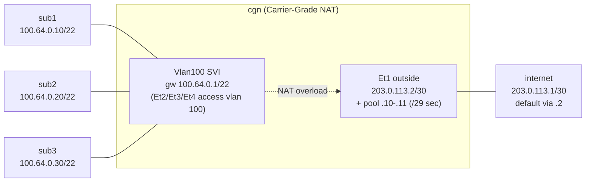

# Lab 36 — CGNAT (Carrier-Grade NAT)

> **Format:** Hands-on. One CGN box NATs many subscribers (in RFC 6598 100.64.0.0/10 space) to a small pool of public IPs. Reference answer in [`solutions/`](solutions/).
>
> **Story chapter:** Phase 7 · Senior · Year 4. The Company's /22 of IPv4 is running out. New customers can't get individual public IPs anymore. CGN (Carrier-Grade NAT) lets you share a few public IPs across many customers. See [`STORY.md`](../../STORY.md).
>
> **Syntax verification:** Production CGN runs on dedicated hardware (ASR1000, MX, A10). The EOS syntax in this lab is verified against EOS User Manual v4.36.0F section 9.3.1.
>
> **cEOS limitation (read this first):** NAT in EOS is a *hardware-forwarding* feature — `show ip nat translation` reflects translations programmed into the switch ASIC. cEOS is a container with no ASIC datapath, so the NAT config below is **parsed and accepted but NOT enforced**: no translation actually happens and subscriber→internet traffic is *not* NATed. The point of this lab is to author **correct EOS NAT config** and understand the CGN model. On real hardware (or a Linux Jool/iptables CGN), the verification pings would succeed and `show ip nat translation` would list entries; in cEOS expect the table to stay empty and the pings to fail. Same honesty pattern as lab 38 (NAT64) and lab 47 (PFC/ETS). See [`STORY.md`](../../STORY.md).

## Real-world scenario

IPv4 exhaustion is real. New customers in 2026 can't easily get a /29 or even a single public IP — RIPE/ARIN ran out years ago. Existing /22-blocks are precious.

**CGN (NAT444)** is the answer for ISPs/hosting providers that need to onboard new customers without giving each a public IP:
- Customer assigned an IP from `100.64.0.0/10` (RFC 6598 "shared transition address space" — purpose-built for CGN, NOT RFC 1918)
- CGN box translates many customers' source IPs to a shared pool of real public IPs

It's "double NAT": customer might NAT themselves (RFC 1918 → 100.64.x.x) and then your CGN NATs again (100.64.x.x → public IP). Hence "NAT444" (3 sets of 4-octet IPs).

## Goal

- Understand RFC 6598 (100.64.0.0/10) vs RFC 1918 (10/8 etc.)
- Configure CGN-style pool NAT with overload
- Recognize the per-subscriber port allocation problem (for logging/compliance)
- Know the gotchas: shared public IP = shared reputation; some apps don't work behind CGN

## Topology

All three subscribers sit in **one shared subnet** `100.64.0.0/22` and share a single gateway — the CGN's `Vlan100` SVI at `100.64.0.1`. Et2/Et3/Et4 are access ports in VLAN 100. The CGN translates that RFC 6598 traffic to a 2-address public pool on the outside link toward the internet node.



The gateway `100.64.0.1` is on-link for **all three** subscribers because they share the `100.64.0.0/22` segment via VLAN 100 — there is no per-subscriber subnet.

## Theory primer

### RFC 6598 (100.64.0.0/10)
The "shared transition" range — `100.64.0.0/10` (100.64.0.0 to 100.127.255.255). Reserved for CGN use. Customers' devices get IPs from this range. It is **not** RFC 1918; it's specifically for ISP-to-customer connectivity.

Why not just use 10/8? Some customers ALSO use 10/8 internally. If their gateway is 10.0.0.1 (theirs) and your CGN-side is also 10.0.0.1, conflicts everywhere. 100.64/10 was created to avoid this.

### Port allocation
Modern CGN allocates a **range of ports** per subscriber (e.g., 1000-1100 for subscriber A, 1101-1200 for B). This is required for two reasons:
1. **Logging / Compliance**: when law enforcement asks "who was at 203.0.113.10:54321 at 14:23?", you need a deterministic answer
2. **Performance**: dynamic port allocation has high state churn at CGN scale

Hardware CGN devices implement this efficiently in silicon. cEOS doesn't have this exact mechanism, so this lab uses dynamic PAT with the assumption that production would handle allocation properly.

### NAT pool sizing
Rule of thumb in CGN: 1 public IP per ~64-128 subscribers (assuming ~500 concurrent connections per subscriber, ~65K ports). At ~1000 subs per IP, port exhaustion becomes likely.

### CGN gotchas (in production)

- **Shared reputation**: if one bad actor abuses the IP, the whole pool's reputation suffers (anti-spam blocklists, etc.)
- **Geolocation breaks**: a service trying to geolocate the IP sees the CGN's location, not the subscriber's
- **Port-forwarding impossible**: subscribers can't host services because they don't have a public IP
- **Performance**: stateful NAT requires lots of CPU/memory; production needs purpose-built CGN hardware
- **NAT-unfriendly protocols** (SIP, P2P, FTP): work poorly behind CGN

## Your task

1. Give the subscriber segment its gateway: put `100.64.0.1/22` on the `Vlan100` SVI (Et2/Et3/Et4 are already access ports in VLAN 100). All three subscribers share this one gateway.
2. Add a public secondary to the outside interface (Et1) wide enough that the pool addresses are valid usable hosts — `203.0.113.10/29 secondary` (so `203.0.113.8/29` gives usable `.9-.14`, broadcast `.15`).
3. Configure a NAT pool `CGN-POOL` spanning `203.0.113.10` to `203.0.113.11` with `prefix-length 29`.
4. Write an ACL matching `100.64.0.0/10`.
5. Apply dynamic PAT **under the outside interface** (Et1) with `ip nat source dynamic access-list ... pool ... overload`. (EOS has no global `ip nat source list` and no `ip nat enable` — those are Cisco IOS.)
6. Verify the config is accepted. (See the cEOS limitation callout: translations are not enforced in the container, so the pings below will not actually be NATed — the goal is correct config, not a live datapath.)

## Hints

- Gateway lives on the SVI: `interface Vlan100` → `ip address`.
- Extra outside IPs: `ip address <ip>/<mask> secondary`.
- Pool: `ip nat pool <name> <first> <last> prefix-length <len>`.
- Match traffic: `ip access-list <name>` with a `permit ip <prefix> any` rule.
- Apply PAT under the outside interface: `ip nat source dynamic access-list <acl> pool <pool> overload`.
- Inspect: `show ip nat translation`, `show ip nat translation dynamic`, `show ip access-lists`.

(No `ip nat enable`, no global `ip nat source list` — those are Cisco IOS, not EOS.)

## Verification

First confirm subscribers can reach their **gateway** (this works in cEOS — it's plain L2/L3, no NAT involved):

```bash
docker exec clab-cgnat-sub1 ping -c 2 100.64.0.1
docker exec clab-cgnat-sub2 ping -c 2 100.64.0.1
docker exec clab-cgnat-sub3 ping -c 2 100.64.0.1
```

All three should succeed, because all three live in `100.64.0.0/22` and share the `Vlan100` gateway.

Now confirm the NAT config is accepted on the CGN:

```
show ip nat translation
show running-config section nat
show ip access-lists CGN-INSIDE
```

The config should be present and parse cleanly.

```bash
docker exec clab-cgnat-sub1 ping -c 2 203.0.113.1
docker exec clab-cgnat-sub2 ping -c 2 203.0.113.1
docker exec clab-cgnat-sub3 ping -c 2 203.0.113.1
```

**Expected in cEOS:** these internet pings **fail** and `show ip nat translation` stays **empty** — cEOS has no ASIC datapath, so NAT is config-accepted but not enforced (see the limitation callout at the top). That is the correct, expected result here; it does not mean you misconfigured anything.

**On real hardware** (or a Linux Jool/iptables CGN), the internet pings would succeed and `show ip nat translation` would list one entry per subscriber, each translated to a pool IP `203.0.113.10` or `.11` with a distinct source port — for example:

```
Source        Translation     Protocol  ...
100.64.0.10   203.0.113.10    icmp
100.64.0.20   203.0.113.11    icmp
100.64.0.30   203.0.113.10    icmp
```

## Peek at solution

Stuck? The full reference answer is in [`solutions/cgn.cfg`](solutions/cgn.cfg). Compare it against your config — especially where the NAT `source dynamic` statement lives (under the outside interface, not at global config) and the `/29` mask on the pool/secondary.

## Concept reinforcement

- Why does the gateway need a `/22` and not `/30` per subscriber? Because CGN puts many subscribers in *one* shared segment — that's the whole point of RFC 6598 space; per-subscriber subnets would waste address space and defeat the model.
- Why `/29` on the public pool instead of `/30`? A `/30` only has two usable hosts and the second pool IP (`.11`) would land on the broadcast address — invalid both as an interface secondary and as a translation target. A `/29` gives six usable hosts, so `.10` and `.11` are both legal.
- Why is the NAT statement applied under the *outside* interface? That's the EOS model: dynamic source NAT/PAT is configured on the egress (outside) interface; there is no per-interface `ip nat enable` toggle.

## What's missing (deliberately)

- **Deterministic per-subscriber port allocation** — needs hardware CGN
- **CGN logging** for compliance (every NAT translation logged via Netflow/sflow)
- **NAT64 + CGN combinations** — common in IPv6-transition scenarios
- **CGN HA** (active-active or active-standby pair of CGN boxes)
- **DS-Lite** (Dual-Stack Lite — IPv6-tunneled NAT44, common at ISPs)

## Cleanup

```bash
sudo containerlab destroy --cleanup
```
