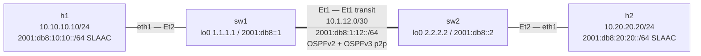

# Lab 37 — IPv6 Fundamentals + Dual-Stack

> **Format:** Hands-on. Two switches and two Linux hosts running IPv4 AND IPv6 simultaneously. Reference answer in [`solutions/`](solutions/).
>
> **Story chapter:** Phase 7 · Senior · Year 4. The Company's `/22` of IPv4 is running out. RIPE has nothing left to sell. Your customer onboardings now require IPv6. You roll out IPv6 across the fabric, dual-stack with the existing IPv4. See [`STORY.md`](../../STORY.md).

## Real-world scenario

IPv4 exhaustion is no longer hypothetical. RIPE ran out in 2019; getting more public IPv4 means buying on the secondary market at ~$50-$60 per IP. IPv6 has been the path forward for 20 years; for The Company it's now necessary, not optional.

The migration strategy: **dual-stack**. Run both protocols simultaneously. Existing IPv4 keeps working; new things get IPv6 too. Customers/services can use either or both. Eventually IPv4 becomes deprecation candidate.

## Goal

- Understand IPv6 fundamentals: addressing, link-local, global scope, NDP (Neighbor Discovery)
- Configure dual-stack on switch interfaces (IPv4 + IPv6 parallel)
- Configure OSPFv3 for IPv6 (separate from OSPFv2 for IPv4)
- Understand SLAAC (Stateless Address Autoconfiguration) via Router Advertisements
- Recognize the differences from IPv4 (NDP not ARP, larger addresses, link-local everywhere)

## Topology



Two cEOS switches connected by a dual-stack transit link, each fronting one Linux
host. IPv4 is OSPFv2; IPv6 is OSPFv3. Hosts get their IPv4 statically (via the
topology `exec`) and their IPv6 via SLAAC from the switch's Router Advertisements.

## Theory primer

### IPv6 address basics
- 128 bits, written as 8 groups of 4 hex digits: `2001:0db8:0000:0000:0000:0000:0000:0001`
- Compressed: leading zeros omitted, longest run of zeros becomes `::`: `2001:db8::1`
- The `2001:db8::/32` range is reserved for documentation (RFC 3849)

### Address scopes
- **Link-local** (`fe80::/10`): auto-generated per-interface, only valid on the local link. Always present on any IPv6-enabled interface.
- **Unique Local** (`fc00::/7`): the RFC 1918 equivalent. Private space.
- **Global Unicast** (`2000::/3`): the public IPv6 internet space.
- **Multicast** (`ff00::/8`): replaces IPv4 broadcast (which IPv6 doesn't have).

### NDP (Neighbor Discovery Protocol)
Replaces ARP. Uses ICMPv6 messages:
- **Router Solicitation (RS) / Router Advertisement (RA)**: hosts find their default router
- **Neighbor Solicitation (NS) / Neighbor Advertisement (NA)**: hosts find each other's MAC
- **Redirect**: router tells host "use this other router instead"

### SLAAC (Stateless Address Autoconfiguration)
Host hears an RA from the router; uses the advertised prefix + its own EUI-64 (derived from MAC, or random) to generate a global address. No DHCP needed for the basic case.

For more control: **DHCPv6** (the IPv6 version of DHCP) can assign addresses + options. RAs can flag "use DHCPv6 too".

### Why OSPFv3 (not OSPFv2)
OSPFv2 carries IPv4 routes; OSPFv3 carries IPv6 routes. Same protocol concepts, slightly different mechanics (link-local-only neighbor addressing, removed authentication moved to IPsec). They run as separate processes.

## Your task

1. On both switches, enable OSPFv3 on the transit + host-facing interfaces (`ipv6 ospf 1 area 0`).
2. Set the transit link to point-to-point network type for **both** address families.
   This is two separate interface commands — OSPFv2 and OSPFv3 each have their own
   network-type knob: `ip ospf network point-to-point` (v4) **and**
   `ospfv3 network point-to-point` (v6). Setting only the v4 one leaves OSPFv3 at its
   default broadcast type (it still adjacency-forms on a 2-router segment, but that's
   exactly the v4/v6 asymmetry to avoid).
3. Verify Router Advertisements are emitted on the host-facing interfaces. RA is
   already pre-seeded (`ipv6 nd ra interval 4`) on **both** switches' host interfaces
   in the starter, so there's nothing for you to add here — just confirm it's working.
4. Verify:
   - Hosts get SLAAC addresses (run `ip -6 addr show eth1` on each host)
   - End-to-end IPv6 connectivity between h1 and h2

## Hints

```
interface Ethernet<n>
   ipv6 address <prefix>/64
   ipv6 ospf 1 area 0
   ip ospf network point-to-point      ! OSPFv2 (v4) network type — transit only
   ospfv3 network point-to-point       ! OSPFv3 (v6) network type — transit only
   ipv6 nd ra interval 4               ! host-facing only (already in starter)
ipv6 router ospf 1
   router-id <id>
```

Verification:

```
show ipv6 ospf neighbor
show ipv6 route
show ipv6 nd ra interface
show ipv6 neighbor
```

## Verification

```bash
docker exec clab-ipv6-dual-stack-h1 ip -6 addr show eth1
# Should show a global 2001:db8:10:10:.../64 SLAAC address. The interface ID
# (everything after the /64 prefix) is a full 64-bit value — either EUI-64
# derived from the MAC (…:XXff:feXX:…) or an RFC 7217 / privacy-random suffix
# on modern kernels — NOT a tiny ::1-style host part.

docker exec clab-ipv6-dual-stack-h1 ping6 -c 3 2001:db8:20:20::1
# Reaches h2's gateway via IPv6 OSPF routing.
# (If the image has no `ping6`, use: ping -6 -c 3 2001:db8:20:20::1)

# h2's SLAAC address
docker exec clab-ipv6-dual-stack-h2 ip -6 addr show eth1 | grep global

# h1 to h2 (replace with h2's actual SLAAC address)
docker exec clab-ipv6-dual-stack-h1 ping6 -c 3 <h2-slaac-address>
```

**Stretch (loopback reachability).** The solution also enables `ipv6 ospf 1 area 0`
on each `Loopback0`, so the v6 loopbacks are reachable fabric-wide, symmetric with
the IPv4 side. From sw1's CLI you should be able to reach sw2's v6 loopback:

```
sw1# ping ipv6 2001:db8::2 source 2001:db8::1
```

> **First-deploy sanity check.** SLAAC end-to-end depends on three runtime
> behaviours that are worth confirming on the first deploy (none is a config
> error — the config and topology are internally consistent):
> 1. cEOS actually emits the periodic RAs. EOS suppresses unsolicited periodic
>    RAs by default; `ipv6 nd ra interval 4` re-enables them. Confirm with
>    `show ipv6 nd ra interface Ethernet2` on each switch.
> 2. The host kernel runs SLAAC. The topology sets
>    `sysctl -w net.ipv6.conf.eth1.accept_ra=2`, which forces RA acceptance even
>    though the host has IPv6 forwarding semantics. Confirm the `/64` appears in
>    `ip -6 addr show eth1`.
> 3. `ping6` exists in the host image. If not, fall back to `ping -6`.

## What's missing (deliberately)

- **DHCPv6** (M-flag / Managed-config)
- **IPv6 prefix delegation** (DHCPv6-PD, for downstream networks)
- **VRRP for IPv6** (VRRPv3)
- **IPv6 BGP**
- **IPv6 multicast**

## Cleanup

```bash
sudo containerlab destroy --cleanup
```
