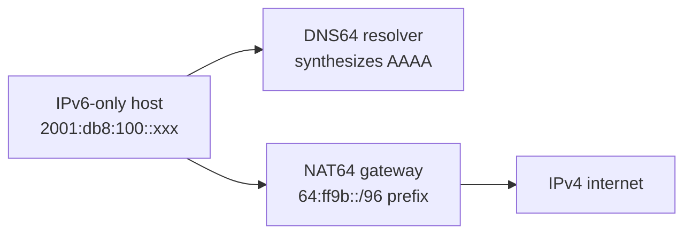

# Lab 38 — IPv6-Only Deployment with NAT64/DNS64

> **Format:** Conceptual + setup-only. cEOS doesn't have a full NAT64 implementation, so this lab is partly architectural discussion. To hands-on a real NAT64, deploy Jool on a Linux box (instructions in the README). Reference scaffolding in [`solutions/`](solutions/).
>
> **Story chapter:** Phase 7 · Senior · Year 4-5. Some of The Company's new customer offerings are IPv6-only by design. But the world still has IPv4-only services (think: legacy enterprise APIs, some SaaS endpoints). Customer needs to reach both. NAT64 + DNS64 is how. See [`STORY.md`](../../STORY.md).

## Real-world scenario

You're rolling out an IPv6-only customer segment (cleaner, simpler, no NAT44 between customers). But the customer needs to reach IPv4-only services on the internet (lots of legacy stuff still IPv4-only).

The fix: **NAT64 (RFC 6146)** + **DNS64 (RFC 6147)**:
- DNS64: when the IPv6 client looks up `example.com` and the AAAA record doesn't exist, the DNS resolver synthesizes one (`64:ff9b::<IPv4>` — RFC 6052 well-known prefix)
- NAT64: when the client connects to that synthesized IPv6, the NAT64 gateway translates to IPv4 toward the real destination

Result: IPv6-only client reaches IPv4-only server, transparently.

This is how T-Mobile USA's network operates for cellular data: IPv6-only on the radio, using **464XLAT** (RFC 6877 — a CLAT on the handset plus a stateful NAT64 PLAT in the core) to reach the IPv4 internet. NAT64 is the core of that design (464XLAT is covered under "What's missing" below). It scales.

## Goal

- Understand NAT64 + DNS64 conceptually
- Recognize when to deploy it vs sticking with dual-stack
- Know the production options (Jool, Tayga, vendor hardware)

## Architecture



When the IPv6-only host wants to reach `example.com`:
1. Asks DNS64 resolver for AAAA record
2. DNS64 resolver checks: AAAA exists? Return it. Doesn't exist? Synthesize one from the A record: `64:ff9b::<IPv4-of-example.com>`
3. IPv6 host connects to `64:ff9b::<v4>` via IPv6
4. NAT64 gateway sees the destination is in `64:ff9b::/96` (the well-known NAT64 prefix), translates to IPv4
5. IPv4 traffic flows to example.com

## Theory primer

### Well-known NAT64 prefix
RFC 6052 defines `64:ff9b::/96` as the **default well-known NAT64 prefix**. Operators can also use a local prefix from their own IPv6 space.

### Stateful vs stateless NAT64
- **Stateful (RFC 6146)**: many IPv6 sources share a small pool of IPv4 addresses. Port-mapping. Common.
- **Stateless (RFC 7915)**: 1:1 IPv6-to-IPv4 mapping. Requires sufficient IPv4 addresses. Rarely used.

### DNS64 sits in the resolver
DNS64 is a feature of the recursive DNS resolver (Unbound, BIND, etc.), not a separate box. Customer's resolver synthesizes AAAA records as needed.

### Why not just stay dual-stack?
- Dual-stack means every host has BOTH addresses → twice the configuration, twice the state, twice the surface for bugs
- IPv6-only is operationally cleaner — one stack to monitor, one stack to debug
- T-Mobile, Facebook (internally), and many modern deployments are IPv6-only behind the scenes; NAT64 handles the (shrinking) need to reach IPv4

## Production deployment options

### Linux + Jool (most popular open-source)
```bash
# On a Linux box (Ubuntu/RHEL/etc.) inside the lab:
sudo apt install jool-tools jool-dkms
sudo modprobe jool
sudo jool instance add --netfilter --pool6 64:ff9b::/96
sudo jool pool4 add 192.0.2.0/24 1-65535
```

Jool intercepts IPv6 packets destined for `64:ff9b::/96` and NATs them. Free, well-maintained.

### Tayga (older alternative)
Similar to Jool, more conservative feature set. Easier in some respects, less actively maintained.

### Vendor hardware
- Cisco ASR 1000 series — full NAT64 in hardware
- Juniper MX series — NAT64 service
- A10 Thunder CGN — CGN + NAT64 combined

### Cloud-native
- Octavia for OpenStack
- Cloud provider NAT64 (AWS, Azure offer it as managed service)

## Your task

This is a structural/conceptual lab. Two paths:

### Option A: Discussion only
Read this README. Understand the mechanism. Recognize when you'd deploy NAT64+DNS64. Move on.

### Option B: Hands-on with Jool
1. Replace `nat64gw` in `topology.clab.yml` with a Linux node running Jool.
2. Install Jool (`apt install jool-tools jool-dkms`) and load the module (`modprobe jool`).
3. Create the NAT64 instance with its translation prefix, then add the IPv4 pool — exactly as in the Production options above:
   ```bash
   sudo jool instance add nat64 --netfilter --pool6 64:ff9b::/96
   sudo jool pool4 add 192.0.2.0/24 1-65535
   ```
   Note: for stateful NAT64 the `--pool6` prefix is fixed at instance-creation time. `jool pool6 add` is a **stateless SIIT-mode** command and does *not* apply to stateful NAT64.
4. Set up an IPv6-only DNS resolver (Unbound with `dns64-prefix: 64:ff9b::/96`).
5. From h-v6, query the legacy IPv4 service by name; observe NAT64 in action.

The README + topology.clab.yml provides the scaffolding (IPv6 segment, IPv4 legacy host); the rest is Linux configuration outside the scope of cEOS.

## What's missing (deliberately)

- **464XLAT**: a related mechanism for IPv4-only apps on IPv6-only networks
- **DS-Lite vs NAT64**: similar transition technologies, different mechanism (DS-Lite tunnels IPv4 over IPv6 instead of translating)
- **Layered NAT64 + CGN** scenarios
- **NAT64 HA/redundancy patterns**

## Verification

Even though cEOS doesn't run the NAT64 data plane, the IPv6-only / IPv4-only scaffolding *is* deployable and verifiable. Confirm the environment is wired correctly:

1. **The IPv6-only host gets a SLAAC address from nat64gw's RA.** `h-v6` accepts Router Advertisements (`accept_ra=2`) on the `2001:db8:100::/64` segment:
   ```bash
   docker exec clab-ipv6-only-nat64-h-v6 ip -6 addr show eth1
   ```
   Expect a global `2001:db8:100::.../64` address (the host's EUI-64 / privacy SLAAC address) alongside the link-local `fe80::` address. If only the link-local appears, the RA isn't being received — check that nat64gw's Ethernet1 is up.

2. **nat64gw is emitting Router Advertisements on the IPv6 side:**
   ```bash
   docker exec clab-ipv6-only-nat64-nat64gw Cli -c "show ipv6 nd ra interface Ethernet1"
   ```
   The RA interval should reflect the configured `ipv6 nd ra interval 4`.

3. **nat64gw learns the IPv6-only host as a neighbor:**
   ```bash
   docker exec clab-ipv6-only-nat64-nat64gw Cli -c "show ipv6 neighbors"
   ```
   You should see h-v6's `2001:db8:100::/64` address on Ethernet1.

4. **The IPv4 legacy side is reachable from nat64gw** (`legacy-v4` sits at `192.0.2.10/24` with `192.0.2.1` as its gateway):
   ```bash
   docker exec clab-ipv6-only-nat64-nat64gw Cli -c "ping 192.0.2.10"
   ```

What you will **not** see: end-to-end IPv6→IPv4 translation. There is no NAT64 data plane on cEOS, so `h-v6` cannot reach `192.0.2.10` through a `64:ff9b::` synthesized address in this topology. That requires the Jool path in Option B. The checks above confirm the two single-stack ends and the gateway scaffolding are correct — which is the goal of this lab.

## Cleanup

```bash
sudo containerlab destroy --cleanup
```
