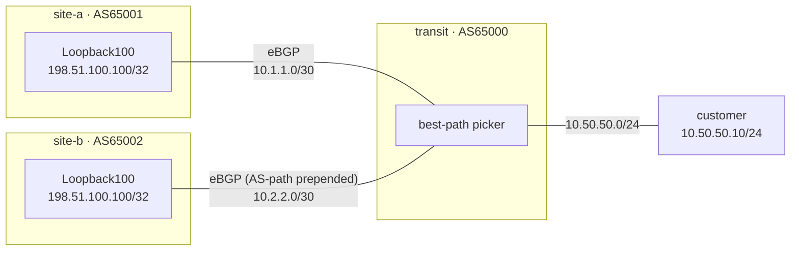

# Lab 39 — Service Anycast

> **Format:** Hands-on. Two "sites" both announce the same `/32` service IP. The transit picks one as primary via BGP best-path. Reference answer in [`solutions/`](solutions/).
>
> **Story chapter:** Phase 7 · Senior · Year 4. The Company is rolling out a DNS resolver service for customers: `dns.thecompany.example` at IP `198.51.100.100`. You want this service to be **globally reachable** with low latency, regardless of where the customer is. The answer: anycast. Same IP, multiple sites, nearest-site wins. The pattern behind 1.1.1.1, 8.8.8.8, and every modern CDN. See [`STORY.md`](../../STORY.md).

## Real-world scenario

Customer wants a globally-available service at IP `198.51.100.100`. You operate two sites:

- Site A: low-cost transit, high latency
- Site B: high-cost transit, low latency

You don't want to operate a single service in one DC because:
- Latency from far-away customers is bad
- A site outage means the service is down

**Anycast** lets multiple sites announce the same IP. The internet's BGP routing automatically sends each customer's traffic to the *closest* site. Add or remove sites without changing IPs.

This is how:
- Cloudflare's `1.1.1.1` works (~250 datacenters worldwide, all anycast)
- Google's `8.8.8.8` works
- Every CDN edge POP works
- Root DNS servers work (13 logical, hundreds physical)

## Topology

Two sites (`site-a` AS65001, `site-b` AS65002) each announce the **same** anycast `/32` (`198.51.100.100/32` on `Loopback100`) over eBGP to a single transit (`transit` AS65000). The customer hangs off the transit and reaches the service by whichever path the transit installs as best.



| Link | site / iface | transit iface | Subnet |
|------|--------------|---------------|--------|
| site-a ↔ transit | `site-a:eth1` (`10.1.1.1`) | `transit:eth1` (`10.1.1.2`) | `10.1.1.0/30` |
| site-b ↔ transit | `site-b:eth1` (`10.2.2.1`) | `transit:eth2` (`10.2.2.2`) | `10.2.2.0/30` |
| customer ↔ transit | `customer:eth1` (`10.50.50.10`) | `transit:eth3` (`10.50.50.1`) | `10.50.50.0/24` |

## Goal

- Understand anycast as a deployment pattern (not a protocol)
- Configure two sites announcing the same `/32`
- Use BGP attributes (AS-path prepend) to influence which site is preferred
- Recognize the limitations (stateful applications, TCP session affinity)

## Theory primer

### Anycast = same IP at multiple sites

Multiple servers announce the same IP via BGP. The internet routes each user to the topologically-closest one. Other sites act as automatic failover.

### Configuration mechanics

1. Each site has a server (or load balancer) listening on the anycast IP (usually on a loopback interface).
2. The site's edge router announces the `/32` of the anycast IP via BGP to its transit/peer.
3. The internet routing tables reflect multiple announcements; each network's BGP picks one based on local policy + AS-path length.

### What anycast handles well

- **Stateless services**: DNS, NTP, CDN edge serving — request-response, no session state. Each request can hit a different site.
- **TCP with short sessions**: HTTP requests that complete in <1s usually stay on one path.
- **Geographic load balancing**: closest user → closest site, automatically.

### What anycast handles poorly

- **Long-lived stateful sessions**: a TCP session where the path changes mid-flight will reset (different site, different session state). Modern routing changes might cause this.
- **WebSockets, persistent connections**: same issue.
- **Anything with server-side session state**: each request could go to a different server. Either keep state in a shared backend (DB, redis), or use a sticky-cookie load balancer at the destination.

### Influencing site selection

- **BGP path attributes**: shorter AS-path wins. Use AS-path prepending on the less-preferred site to make it "farther" from upstreams.
- **MED**: when one transit peers with multiple sites, MED can hint preference.
- **Local-preference (within an AS)**: forces internal routing decisions.
- **Communities**: many transits accept BGP communities like `<asn>:50` to deprioritize.

In this lab: site-b prepends its AS-path twice, making site-a's path shorter and preferred by the transit.

## Your task

1. On `site-a`: configure eBGP to the transit, announce `198.51.100.100/32`.
2. On `site-b`: configure eBGP to the transit, announce the same `/32`, but **prepend AS-path twice** on outbound to make site-b less preferred.
3. Verify: customer's path to `198.51.100.100` goes via site-a (the shorter AS-path).
4. Failover test: shut down site-a's link to the transit (its `Ethernet1`, which tears down the eBGP session and withdraws the `/32`) — verify traffic now goes to site-b.

## Hints

You don't need every command spelled out — these are the verbs to reach for:

- Bring up the eBGP session and advertise the anycast prefix from each site:
  - `router bgp <asn>` / `neighbor <transit-ip> remote-as 65000` / `neighbor <transit-ip> activate`
  - `network 198.51.100.100/32` (the `/32` must be in the RIB first — it's already on `Loopback100`)
- Make site-b less preferred on **outbound** advertisements:
  - `route-map <name> permit 10` then `set as-path prepend <asn> <asn>`
  - apply it with `neighbor <transit-ip> route-map <name> out`
- Inspect what the transit sees and installs:
  - `show ip bgp 198.51.100.100/32` (compare AS-path lengths, look for the `>` best-path marker)
  - `show ip route 198.51.100.100/32` (which next-hop won)
- Fail a site over with `interface Ethernet1` / `shutdown`, then re-check the two `show` commands above.

> Prepending is configured on **site-b** (the less-preferred site), not on the transit. The transit applies plain best-path: shorter AS-path wins.

## Verification

```bash
docker exec clab-service-anycast-customer ping -c 3 198.51.100.100
```

On the transit:
```
show ip bgp 198.51.100.100/32
```

You should see two paths:
- Via site-a: AS-path `65001` (short)
- Via site-b: AS-path `65002 65002 65002` (prepended twice)

Best path = site-a.

```
show ip route 198.51.100.100/32
```

Should show next-hop = `10.1.1.1` (site-a).

### Failover demo

```bash
docker exec -it clab-service-anycast-site-a Cli
configure terminal
  interface Ethernet1
    shutdown
```

On the transit:
```
show ip route 198.51.100.100/32
```

Should now show next-hop = `10.2.2.1` (site-b). The anycast path automatically failed over to the surviving site.

```bash
docker exec clab-service-anycast-customer ping -c 3 198.51.100.100
```

Still ✅. Customer can't tell the change happened.

## Production patterns

- **DNS service**: anycast DNS resolvers. Authoritative DNS for your domain. Easy first deployment because DNS is stateless.
- **CDN POPs**: each PoP announces the CDN's edge IPs. Massive footprint of POPs = closer to every user.
- **DDoS mitigation services**: scrubbing services use anycast to absorb attacks across many sites (lab 40).
- **Time servers (NTP)**: stateless, anycast-friendly.
- **TCP-based services**: possible but you need session-affinity at the destination LB or stateless app design.

## What's missing (deliberately)

- **BGP communities for fine-grained anycast policy**
- **TCP session migration / connection-class affinity**
- **Anycast routing at internet scale** (where 250+ POPs negotiate among each other)
- **Anycast monitoring** (per-POP availability detection)

## Cleanup

```bash
sudo containerlab destroy --cleanup
```
