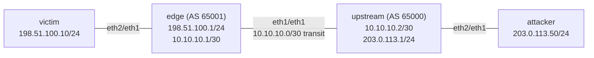

# Lab 40 — DDoS Mitigation (RTBH)

> **Format:** Hands-on. Edge router signals to upstream "drop all traffic to this victim IP" via BGP RTBH (Remote-Triggered Black Hole). Reference answer in [`solutions/`](solutions/).
>
> **Story chapter:** Phase 7 · Senior · Year 4. A customer of The Company gets DDoS'd at 3 AM. The volumetric attack is saturating your inbound transit links. You can't filter the attack inside your network — it's already eating your pipe before it gets to you. You need the **upstream** to drop the traffic before it reaches you. RTBH is how. See [`STORY.md`](../../STORY.md).

## Real-world scenario

Customer at `198.51.100.10` is under a 50 Gbps volumetric DDoS attack. Your transit pipe is 10 Gbps. The attack saturates the link; every other customer's traffic is collateral damage.

You can't filter at YOUR edge because the traffic already arrived. The fix: tell the upstream (your transit provider) to drop traffic to the victim IP **at their edge**, before it reaches your link. That's **RTBH (Remote-Triggered Black Hole)** — RFC 5635.

Mechanism:
- You announce a /32 of the victim IP to the upstream via BGP
- You tag the announcement with a special "blackhole" community that the upstream recognizes (e.g., `65000:666`)
- The upstream's policy rewrites the next-hop of any RTBH-tagged announcement to a discard interface
- Their edge then drops ALL traffic to that /32 — at line rate, in hardware
- Your pipe is freed; the victim is offline but the rest of your network is safe

It's a tactical sacrifice: the attacked IP is down, but everyone else stays up.

> **cEOS note:** RTBH is a pure control-plane mechanism (BGP community → next-hop rewrite → `Null0` in the RIB), so it works correctly in cEOS with no ASIC dependency — unlike hardware-only features elsewhere in this curriculum. In this container the discard is *software*-forwarded via `Null0`; on a real router the same `Null0` next-hop programs a hardware drop at line rate. The mechanism you configure and observe is identical.

## Goal

- Understand RTBH conceptually
- Configure customer-side RTBH announcement (the most common use case)
- Recognize when RTBH is right vs when more sophisticated mitigation is needed

## Topology

The victim sits behind **your** `edge`; the attacker sits behind the **upstream**. That placement is the whole point: attack traffic must traverse the upstream *first*, so a blackhole installed at the upstream drops it before it ever reaches your transit link.



- `edge` ↔ `upstream`: eBGP over the `10.10.10.0/30` transit link (AS 65001 ↔ AS 65000).
- `edge` advertises the customer range `198.51.100.0/24` to the upstream.
- RTBH community between the two: `65000:666`.
- Discard next-hop on the upstream: `192.0.2.1` → `Null0`.

## Theory primer

### RTBH (Remote-Triggered Black Hole)

Customer-triggered: you (the customer) signal to your upstream to drop traffic. Your prefix; your decision.

Provider-triggered: less common; provider's NOC signals their own routers when they detect attacks against you.

Most ISPs publish a BGP community their customers can use. Common conventions:
- `<upstream-AS>:666` — RTBH (blackhole the entire prefix)
- `<upstream-AS>:777` — RTBH source-based (drop traffic FROM a source, not TO a destination)

Per-ISP details vary; check their customer documentation.

### Trade-offs

- **Effective**: attack dropped at provider edge; your network safe
- **Coarse**: drops ALL traffic to the target IP, including legitimate
- **Reversible**: withdraw the BGP announcement; service resumes
- **Limited by provider**: only works if your upstream supports it (most major Tier-1s do)
- **One-IP-at-a-time**: doesn't scale to attacks spread across many destination IPs

### When RTBH is not enough

- **Application-layer DDoS** (Slowloris, HTTP request floods): need WAF, not network blackhole
- **Distributed attack across many targets**: blackholing 100 IPs = 100 services down
- **Critical service that can't be offline**: need scrubbing service instead

### Alternatives

- **BGP Flowspec (RFC 8955)**: more granular than RTBH — specify port, protocol, source IP, drop or rate-limit. Some ISPs support customer flowspec; less common than RTBH.
- **DDoS scrubbing services** (Cloudflare Magic Transit, Arbor Cloud, Akamai Prolexic): traffic redirected via BGP to a scrubbing center, cleaned, returned. Expensive but keeps service up.
- **Upstream announcement of a more-specific cleaner-path**: route legitimate traffic through scrubbing while attack continues elsewhere.

## Your task

1. Configure outbound BGP policy on `edge` that tags **only the /32 host routes** inside your `198.51.100.0/24` range with community `65000:666` (the upstream's RTBH community) — and keeps advertising the base `/24` **without** the community so the rest of the range stays reachable.
2. Announce `198.51.100.10/32` (the victim IP under attack) with this tag.
3. Verify: upstream receives the /32 announcement, applies RTBH (next-hop rewrite to the discard route), and drops traffic to that IP — while the `/24` (and every other host in it) keeps flowing.

> **Why /32-only matters:** if your prefix-list matched the aggregate too (e.g. `le 32`), the route-map would tag your own `/24` with the blackhole community, the upstream would rewrite *its* next-hop to the discard route, and your **entire customer range** would go dark — the opposite of a tactical single-IP sacrifice. Matching `ge 32` (host routes only) plus a second untagged route-map clause for everything else is what keeps the blackhole surgical.

In the lab, the "attack" is simulated by the attacker host pinging the victim. Without RTBH: traffic reaches the victim. With RTBH: traffic dropped at the upstream.

## Hints

CLI verbs, not the full answer:

- Match host routes only: `ip prefix-list … permit 198.51.100.0/24 ge 32` (lengths 32..32). Compare with `le 32` (lengths 24..32) — and reason about what that would tag.
- Outbound policy: `route-map TO-UPSTREAM permit 10` with `match ip address prefix-list …` + `set community 65000:666`; then a second `route-map TO-UPSTREAM permit 20` with **no** match/set so non-RTBH prefixes (your `/24`) pass untagged. (A route-map's trailing implicit deny would otherwise drop everything that doesn't match clause 10.)
- Apply it: `neighbor 10.10.10.2 route-map TO-UPSTREAM out` and make sure `send-community` is set.
- Trigger the /32: `ip route 198.51.100.10/32 Null0` (forces the host route into the RIB) + `network 198.51.100.10/32` under the IPv4 address-family.
- Inspect on the upstream: `show ip bgp 198.51.100.10/32`, `show ip bgp 198.51.100.0/24`, `show ip route 198.51.100.10/32`, `show ip community-list`.

## Verification

### Before RTBH
```bash
docker exec clab-ddos-mitigation-attacker ping -c 3 198.51.100.10
```
✅ — attacker can reach victim.

### Apply RTBH for the victim
On `edge`, the outbound route-map already exists in the solution (it tags **only** /32s — see `solutions/edge.cfg`). You need to actually announce the /32:

```
ip route 198.51.100.10/32 Null0   ! force the /32 into the RIB so BGP can originate it

router bgp 65001
   address-family ipv4
      network 198.51.100.10/32
```

This creates the /32 in your BGP RIB, which is then tagged outbound with `65000:666` by `route-map TO-UPSTREAM permit 10`. The base `/24` matches the second (untagged) clause `permit 20`, so it is advertised **without** the community and stays reachable.

> **Note:** the `ip route 198.51.100.10/32 Null0` you just added also makes the `edge` itself discard the victim locally — that's expected and normal for the *triggering* router. The point of RTBH is that the **upstream** drops the flood before it crosses your transit link; the edge's local Null0 is just the side effect of how you originate the /32.

On the `upstream`, confirm only the /32 is blackholed and the /24 is clean:
```
show ip bgp 198.51.100.10/32
```
Should show the route with next-hop rewritten to `192.0.2.1` (the discard next-hop) and community `65000:666`.

```
show ip bgp 198.51.100.0/24
```
Should show the base /24 with its **normal** next-hop (`10.10.10.1`) and **no** blackhole community — proof the surgical match worked and the customer range as a whole is untouched.

```
show ip route 198.51.100.10/32
```
Should show: route via `Null0` (recursing through the `192.0.2.1` discard next-hop). Traffic to the victim is dropped here, at the upstream's edge.

### After RTBH
```bash
docker exec clab-ddos-mitigation-attacker ping -c 3 198.51.100.10
```
❌ — packets dropped at upstream. Victim is "offline" from attacker's perspective.

The rest of `198.51.100.0/24` is unaffected. In this minimal lab only `.10` exists as a real host, so you verify "the range still works" on the **control plane** rather than with a ping to a non-existent host: the upstream's `show ip route 198.51.100.0/24` (and `show ip bgp 198.51.100.0/24` above) still points the /24 at the live next-hop `10.10.10.1`, never at `Null0`. Only the /32 was sacrificed; the aggregate route the rest of the customers ride is intact.

### Recovery
Withdraw the /32 announcement (remove the `network 198.51.100.10/32` statement, and the `ip route … Null0` if you want the edge to forward it again). RTBH lifts within seconds — the upstream re-resolves the /32 via the normal /24 and service resumes.

## Peek at solution

The full edge-side answer is in [`solutions/edge.cfg`](solutions/edge.cfg): the `ge 32` prefix-list, the two-clause `route-map TO-UPSTREAM` (tag /32s, pass everything else untagged), and the outbound `route-map … out` application. The upstream receiver side ships pre-built in [`configs/upstream.cfg`](configs/upstream.cfg).

## Concept reinforcement

- **RTBH is destination-based by default**: you sacrifice the *target* IP. If you need to keep the target up and drop only the *sources*, that's S-RTBH (`:777`) or Flowspec — see "What's missing".
- **The community is a contract**: `65000:666` only does anything because the upstream's inbound policy looks for it. Use the wrong community and your /32 is just a normal, fully-reachable route.
- **Surgical match is the whole game**: `ge 32` (host routes) keeps the blackhole to one IP; a sloppy `le 32` would blackhole your entire aggregate. Always reason about exactly which prefix lengths your RTBH policy can tag.

## What's missing (deliberately)

- **Source-based RTBH (S-RTBH)**: drops traffic from specific sources, leaves destination reachable
- **BGP Flowspec deployment** — significantly more involved
- **Integration with DDoS scrubbing services** (Cloudflare, Arbor, etc.)
- **Automated RTBH triggering** from monitoring detection systems
- **uRPF + RPF checks** at the edge (complementary defense)

## Cleanup

```bash
sudo containerlab destroy --cleanup
```
