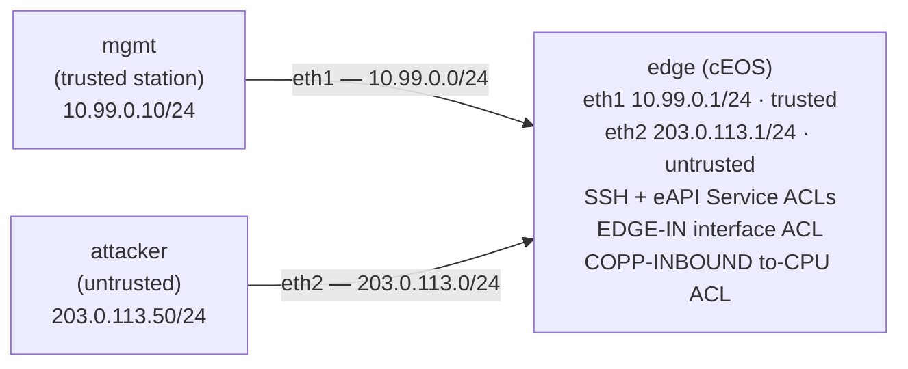

# Lab 41 — Control-Plane Protection

> **Format:** Hands-on. Lock down management services to trusted networks; apply CoPP to rate-limit traffic to the device CPU. Reference answer in [`solutions/`](solutions/).
>
> **Story chapter:** Phase 7 · Senior · Year 4. Last week an attacker tried to brute-force SSH on edge routers from the public internet. The brute-force itself failed (good passwords + AAA), but the CPU load from processing 100k SSH attempts/sec made the route processor sluggish — BGP started flapping. You realize: the mgmt plane needs to be unreachable from untrusted networks, AND the CPU itself needs DoS protection. See [`STORY.md`](../../STORY.md).
>
> **Syntax verification:** CoPP syntax varies by platform. cEOS has limited CoPP; production hardware (DCS-7280/7500/7800) has richer per-class policing. Verify against EOS User Manual v4.36.0F.

## Real-world scenario

Two threats this lab addresses:

1. **Management plane exposure**: SSH, HTTPS API, NETCONF — anyone who can route IP packets to the router can attempt connection. Default-allow exposes attack surface. Default-deny + explicit allowlist is the right posture.

2. **Control-plane CPU DoS**: even legitimate-looking traffic can saturate the route processor's CPU. ARP storms, BGP UPDATE floods, ICMP redirects, malformed packets — all consume CPU. Rate-limit per traffic class to prevent any one class from monopolizing CPU.

## Goal

- Configure mgmt-plane ACLs to restrict access to management services
- Apply CoPP (Control-Plane Policing) to rate-limit CPU-bound traffic
- Verify legitimate access works; attacker access is blocked

## Topology



The mgmt station sits on the trusted `10.99.0.0/24` segment; the attacker
sits on the untrusted `203.0.113.0/24` segment. The edge router's job is to
let the mgmt station reach its management services while keeping the attacker
out — without breaking transit forwarding.

## Theory primer

### Management Plane ACL

Standard ACL applied to the device's mgmt services. Each service (SSH, NETCONF, HTTPS-API) accepts an ACL that filters incoming connection attempts.

Best practice: default-deny. Only explicitly-allowed source networks reach the service.

```
ip access-list MGMT-PLANE-ACL
   counters per-entry
   10 permit ip <trusted-mgmt-net>/<prefix> any
   20 deny ip any any

management ssh
   ip access-group MGMT-PLANE-ACL in

management api http-commands
   vrf default
      ip access-group MGMT-PLANE-ACL
```

Note the asymmetry, which is a real EOS quirk: the SSH Service ACL is
applied at the `management ssh` level with a trailing `in`, but the eAPI
Service ACL is applied *inside the `vrf <name>` sub-context* (e.g.
`vrf default`) and takes **no** `in` keyword. Display them with
`show management ssh ip access-list` and
`show management api http-commands ip access-list`.

`counters per-entry` is required to see per-rule hit counts — new EOS ACLs
default to non-counting, so without it `show ip access-lists` shows the
rules but no match counts.

### CoPP (Control-Plane Policing)

CoPP is policy applied to packets destined to the device itself (the "control plane"). It classifies traffic into traffic classes and rate-limits or drops by class.

Without CoPP, a single attack against, say, the device's ICMP could saturate the CPU and starve other protocols (BGP, OSPF, NDP).

With CoPP:
- BGP gets reserved bandwidth/rate
- OSPF gets reserved
- SSH gets reserved (only from trusted nets)
- ICMP gets a small reserved budget
- Everything else: dropped

When attack traffic hits, only its specific class is rate-limited. Critical protocols stay healthy.

**Both port directions for client-initiated protocols.** When you write a to-CPU permit for a TCP protocol like BGP, remember the router is often the TCP *client*: it opens the session to the peer, so the peer's reply/established traffic arrives with **source** port 179, not destination port 179. A permit that only matches `tcp any any eq bgp` (destination 179) catches the inbound connect but can miss the return path. The built-in EOS default-control-plane-acl permits *both* directions (`… eq bgp any` and `… any eq bgp`) for exactly this reason — otherwise a client-initiated session's return packets get policed/dropped, which is precisely the BGP-flap symptom this lab's story is trying to avoid.

### CoPP on cEOS

cEOS's CoPP capabilities are limited compared to dedicated hardware. This lab uses a simplified ACL-based approach. On production Arista hardware (DCS-7280/7500/7800), CoPP is **not** a free-form policy you attach — EOS ships a single fixed control-plane policy map, `copp-system-policy`, that is *always* applied to the control plane (there is no command to add or remove that assignment). You tune it by editing its built-in dynamic classes, adjusting `bandwidth`/`shape` in **pps** (packets/sec) or **kbps** — there is no IOS-style `police … burst` knob:

```
! EOS form — edit the always-applied copp-system-policy.
! (This is the production-hardware dialect; do NOT copy it into the
!  cEOS solution, which uses the ACL approach below.)
class-map type copp match-any copp-system-bgp
   match access-group BGP-CONTROL
!
policy-map type copp copp-system-policy
   class copp-system-bgp
      bandwidth pps 10000
   class copp-system-icmp
      shape pps 1000
```

> **Heads-up — wrong-NOS trap.** `policy-map type control-plane … police 10000 burst 1500` / `control-plane / service-policy input …` is **Cisco IOS-XR** syntax and does not exist in EOS. EOS uses `policy-map type copp` and the fixed `copp-system-policy` shown above. Earlier drafts of this lab carried the IOS-XR form — if you see it elsewhere, it's wrong for Arista.

The lab simplification: instead of tuning `copp-system-policy`, we attach a custom to-CPU **ACL** under the `control-plane` stanza (`ip access-group COPP-INBOUND in` — this *is* valid EOS and replaces the read-only default-control-plane-acl) to express *which* classes are allowed. On real hardware you'd combine this allowlist with the per-class `bandwidth`/`shape` rate-limits in `copp-system-policy`.

> **cEOS limitation — control-plane enforcement is config-only.** Like labs 38 and 47, the to-CPU datapath here is an ASIC feature that cEOS does not implement. The `control-plane / ip access-group COPP-INBOUND in` config is *accepted* and you can inspect it, but cEOS will **not** actually police or drop to-CPU traffic against it, and its hit counters are not reliable. You are learning the **syntax and intent**, not watching enforcement. The observable attacker-block in this lab's verification comes entirely from the **`EDGE-IN` interface ACL** on Ethernet2 — a data-plane ingress ACL, which *is* enforced in cEOS — and from the SSH/eAPI **Service ACLs**, which the control-plane agent enforces in software. On real hardware (DCS-7280/7500/7800) the `copp-system-policy` plus the to-CPU ACL would do the rate-limiting in silicon.

## Your task

1. Create a control-plane allowlist ACL `MGMT-PLANE-ACL` permitting only the
   trusted mgmt network (10.99.0.0/24) and denying the rest. Enable per-entry
   counting so you can observe hit counts.
2. Apply `MGMT-PLANE-ACL` as the **Service ACL** under `management ssh` (with
   `in`) and under `management api http-commands` (inside `vrf default`, no
   `in`). These filter connections *to the router's own services*.
3. Build a **targeted edge filter** `EDGE-IN` and apply it inbound on the
   untrusted interface (Ethernet2). It must deny untrusted hosts reaching the
   router's *own* management ports (SSH/HTTPS on either router address) but
   **permit everything else** so transit traffic still forwards. (A blanket
   deny-all on a transit interface would black-hole all inbound traffic — that
   is a data-plane filter, not a management-plane one. Keep the two ideas
   separate.)
4. Configure CoPP via an inbound ACL on `control-plane` (`COPP-INBOUND`) that:
   - Permits BGP (TCP 179) in **both** port directions (the router can be the
     TCP client — see the theory note), OSPF (proto 89), PIM, NTP, SNMP, ICMP
   - Permits SSH and HTTPS only from 10.99.0.0/24
   - Drops everything else
   - (cEOS will accept but not enforce this — you are learning the syntax.)

## Hints

- Create ACLs with `ip access-list <name>`; enable per-rule counters with
  `counters per-entry` as the first line inside the ACL.
- TCP/UDP port matches accept named ports (`eq bgp`, `eq ntp`, `eq snmp`) or
  numbers (`eq 22`, `eq 443`); match a single host with `host <addr>`.
- IP-protocol matches like `ospf`, `pim`, `icmp` go where you'd put `tcp`/`udp`.
- Service ACLs: `management ssh` → `ip access-group <acl> in`. The eAPI form is
  different — go into `management api http-commands`, then `vrf default`, then
  `ip access-group <acl>` (no trailing `in`).
- The to-CPU ACL attaches under the `control-plane` stanza:
  `ip access-group <acl> in`.
- Display: `show ip access-lists <name>`, `show management ssh ip access-list`,
  `show management api http-commands ip access-list`. (`show control-plane` is
  Cisco IOS-XR, not EOS — don't reach for it.)

## Verification

### From the trusted mgmt host
```bash
docker exec -it clab-control-plane-protection-mgmt ssh admin@10.99.0.1
# Prompts: admin@10.99.0.1's password:  (password is: admin)
# Login should succeed — source IP 10.99.0.10 matches the permit.
```

### From the attacker
```bash
docker exec -it clab-control-plane-protection-attacker ssh admin@203.0.113.1
# Should fail (connection refused / timeout) — EDGE-IN drops TCP/22 to 203.0.113.1
```

```bash
docker exec clab-control-plane-protection-attacker curl -k --max-time 3 https://203.0.113.1/
# Should fail (timeout) — EDGE-IN drops TCP/443 to 203.0.113.1
```

> The block you observe here is enforced by the **EDGE-IN interface ACL** (a
> data-plane ACL, which cEOS enforces) and by the SSH/eAPI **Service ACLs**.
> The `control-plane` to-CPU ACL is config-only in cEOS (see *CoPP on cEOS*).

### Verify the ACLs are doing work
```bash
docker exec -it clab-control-plane-protection-edge Cli
show ip access-lists EDGE-IN
show ip access-lists MGMT-PLANE-ACL
show management ssh ip access-list
show management api http-commands ip access-list
```

Because the ACLs carry `counters per-entry`, you should see the **deny rule on
`EDGE-IN`** (TCP/22 and TCP/443 to `203.0.113.1`) incrementing as the attacker
tries. Without `counters per-entry` the rules display but show no match counts.

```bash
# Inspect the to-CPU ACL config (accepted, but not enforced in cEOS):
show ip access-lists COPP-INBOUND
# The built-in CoPP policy (hardware counters only — zero/empty on cEOS):
show policy-map copp copp-system-policy
```

`show policy-map copp copp-system-policy` is the EOS command for the built-in
CoPP policy; on cEOS its hardware counters will be empty/zero because the to-CPU
datapath isn't implemented.

## Peek at solution

The full reference config is in [`solutions/edge.cfg`](solutions/edge.cfg).
Compare your ACLs, Service ACL placement (note the eAPI `vrf default`
sub-context), and the `control-plane` to-CPU ACL against it.

## Concept reinforcement — what's deliberately left out

- **Management-plane vs data-plane filtering**: `EDGE-IN` (interface, sees all
  traffic) is *not* the same as the SSH/eAPI Service ACLs or the to-CPU ACL
  (control-plane, see only to-CPU traffic). Don't collapse them into one
  deny-all interface filter.
- **Per-class rate-limiting on cEOS** — not enforced; real hardware tunes
  `copp-system-policy` with `bandwidth`/`shape` in pps/kbps.
- **Strict CoPP with deny-by-default for unknown protocols**
- **Mgmt VRF + ACL combination** (lab 08 covers VRF)
- **VTY ACLs** for legacy non-management-plane CLI access
- **AAA-driven ACL enforcement** (lab 09)
- **DoS protection at L2** (storm-control) — covered in lab 06

## Cleanup

```bash
sudo containerlab destroy --cleanup
```
