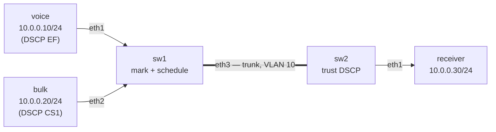

# Lab 42 — QoS Fundamentals

> **Format:** Hands-on. Classify traffic at ingress, mark with DSCP, give the latency-sensitive class strict priority on egress. Reference answer in [`solutions/`](solutions/).
>
> **Story chapter:** Phase 8 · Senior+ · Year 4–5. A customer added a VoIP service to their hosting bundle. When their nightly backup runs, voice quality collapses — calls go choppy, audio drops. Same network, same uplink. The fix isn't "more bandwidth" — it's making sure voice gets to skip the queue. See [`STORY.md`](../../STORY.md).
>
> **cEOS limitation (verified live on cEOS 4.35.4M — stronger than "not enforced"):** QoS marking (`policy-map type qos` / `class` / `set dscp`) and egress scheduling (`tx-queue …`) are **forwarding-ASIC features** (Arad/Jericho). cEOS has **no forwarding ASIC**, and these commands are **rejected outright** — `policy-map type qos` returns `% Unavailable command (not supported on this hardware platform)` and the `tx-queue`/`bandwidth percent` lines fail too — so this config **does not even load** in the container, let alone enforce. This is **hardware-only**: study the config pattern here, deploy and verify it on production hardware (7280R/7500R/7800R) with `show qos interface` / `show policy-map interface`. The solution keeps the full production config as reference; do not expect to apply it on cEOS. See the Verification section for what you can and can't do in the container.
>
> **Syntax verification:** QoS syntax varies significantly across cEOS / production EOS / different chipsets. The config in this lab represents the *pattern*; on a specific platform check `show qos interface` and the EOS Manual chapter "Quality of Service".

## Real-world scenario

A customer hosts both a VoIP PBX and a file-backup target on the same VM cluster. Their uplink is 1 Gbps. Most of the time everyone's happy. But every night at 02:00 the backup runs and saturates the uplink — and the on-call engineer in Singapore (where it's daytime) can't have a clear call with the team.

You can't buy more bandwidth (it's a fixed customer contract). The real fix: when the link is full, **voice packets jump the queue**. Bulk traffic waits a few milliseconds longer; voice stays sub-20ms one-way. The customer hears nothing different. That's QoS.

## Goal

- Classify traffic at the network edge by some attribute (port, ACL, DSCP)
- Mark traffic with a DSCP value that *survives the trip* through the fabric
- On every potentially-congested interface, configure queue scheduling so voice (EF) gets priority over bulk (CS1)

## Topology

All four hosts live in **VLAN 10 / 10.0.0.0/24**, so the data path is pure L2 across the inter-switch trunk — no routing involved, and the DSCP marking applied at the edge is carried unchanged end-to-end. `sw1` marks at ingress; the trunk is where the (would-be) congestion scheduling happens; `sw2` trusts the marking and delivers to the receiver.



## Theory primer

### The QoS pipeline

```
[ingress] → classify → mark → [transit] → queue → schedule → [egress]
              ↑          ↑                  ↑          ↑
            "what       "stamp it"      "put in     "decide
             is this?"                   the right   what to
                                         queue"     send next"
```

Three jobs, three places:
- **Edge (ingress)**: classify and mark. This is where you decide what class a packet belongs to. Do it once, at the trust boundary.
- **Core (transit)**: trust the marking. Don't reclassify.
- **Every potentially-congested interface (egress)**: queueing and scheduling. This is where QoS actually does work — when the link is full and you have to choose what to send next.

### DSCP — the marking field

6 bits in the IPv4 ToS / IPv6 Traffic Class byte. 64 possible values, but in practice only a handful are used:

| DSCP name | Decimal | Typical use |
|---|---|---|
| EF (Expedited Forwarding) | 46 | Voice RTP — strict priority |
| CS5 | 40 | Broadcast video / network signaling |
| AF41 | 34 | Video conferencing |
| AF31 | 26 | Multimedia streaming |
| CS3 | 24 | Call signaling (SIP/SCCP) |
| AF21 | 18 | Important data |
| CS1 | 8 | Scavenger / bulk / backups |
| 0 (BE) | 0 | Best-effort default |

> Marking conventions vary by model. The values above follow **RFC 4594 / Cisco medianet**, which marks **call signaling as CS3 (24)**. Some legacy vendor designs use CS5 for signaling instead — what matters is that every device on the path agrees, not the specific number.

The values themselves don't *do* anything — they're just labels. What matters is that every device on the path agrees what each label means and treats them accordingly.

### Scheduling

When a link is congested, the scheduler decides which queue to drain next. Common patterns:

- **Strict priority (LLQ — Low Latency Queue)**: queue X is drained first whenever it has packets. Used for voice. Risk: starves everything else if not capped.
- **Weighted Round Robin (WRR) / DWRR**: each queue gets a share proportional to its weight. Used for everything that isn't LLQ.
- **WFQ / CBWFQ**: fair queueing with class-based weights.

A typical voice-aware config on Arista:
- **tx-queue 7 (EF)** is the highest queue and is **strict-priority by default** — and on Arista it is *not* configurable, so EF simply stays SP. That's what voice wants.
- The remaining queues default to strict priority too. To give the **default queue** a guaranteed share instead, you convert it (and the lower queues) to round-robin with `no priority`, then assign `bandwidth percent`. The rest then split bandwidth by DWRR.

> There is no "add a `priority strict` line to tx-queue 7" step — that command is rejected on Arista. The interesting knob is taking *lower* queues *out* of strict priority so they're scheduled by weight.

### Shaping vs policing

- **Policing**: drop (or remark) traffic exceeding a rate. Cheap, but bursty traffic suffers.
- **Shaping**: buffer traffic up to a rate. Smoother but adds latency and uses memory.

Use policing at edges for ingress contracts; use shaping at egress to smooth traffic toward a sub-rate.

## Your task

1. On `sw1`, mark all ingress from `voice` (Ethernet1) as DSCP EF.
2. Mark all ingress from `bulk` (Ethernet2) as DSCP CS1.
3. On the uplink trunk (sw1 Ethernet3), make sure EF keeps strict priority and give the default queue ~20% guaranteed bandwidth. (Hint: tx-queue 7 is *already* strict-priority by default and is not configurable — the work is converting the *default* queue away from strict priority so it gets a bandwidth share instead.)
4. On `sw2`, trust DSCP on the trunk (don't re-mark).

## Hints

- Classification + marking objects: `class-map type qos match-any …`, `policy-map type qos …`, `class class-default`, `set dscp …`.
- Apply marking at the edge with `service-policy type qos input …` on the access ports.
- Honor a marking instead of re-classifying with `qos trust dscp` (remember a switched/trunk port defaults to CoS trust, not DSCP).
- Egress scheduling lives under `interface … / tx-queue N`. The top queue (7) is already strict-priority and not configurable; to give a lower queue a guaranteed share you take it out of strict priority (`no priority`) before `bandwidth percent`.
- Inspect with `show qos interface Ethernet3`, `show qos maps`, `show policy-map interface`.

## Verification

> **Read this first — what cEOS will and won't show you.** The marking objects and tx-queue scheduling all parse and appear in `show` output, but cEOS has no forwarding ASIC, so:
> - **Scheduling/priority is not enforced.** The iperf3 experiment below will *not* demonstrate voice being protected under load — there are no real hardware queues to drain in priority order. On production hardware (7280R/7500R/7800R) voice jitter/loss stays low; on cEOS the voice flow degrades with the bulk flow like everything else.
> - **Ingress DSCP rewrite is not applied in the data plane**, so the receiver will generally *not* see the rewritten `tos` bytes. Confirm the *config intent* via `show` commands instead of on-wire bytes.
>
> So: use the `show` steps as the real verification on cEOS; treat the iperf3/tcpdump steps as the experiment you'd run on hardware.

### Inspect QoS state (works on cEOS)
```bash
docker exec -it clab-qos-fundamentals-sw1 Cli
show qos interface Ethernet3
show qos maps
show policy-map interface Ethernet1
```
You should see the `MARK-VOICE`/`MARK-BULK` policies attached to Ethernet1/Ethernet2 and tx-queue 0 converted to a bandwidth share on Ethernet3. This confirms the configuration is correct and accepted.

### Generate voice + bulk traffic (hardware-only result)
On `receiver`, listen with iperf3:
```bash
docker exec -d clab-qos-fundamentals-receiver iperf3 -s
```

From `voice` (mimics voice with small UDP packets at ~100 kbps):
```bash
docker exec clab-qos-fundamentals-voice iperf3 -c 10.0.0.30 -u -b 100K -l 200 -t 30
```

From `bulk` (saturate):
```bash
docker exec clab-qos-fundamentals-bulk iperf3 -c 10.0.0.30 -b 0 -t 30
```

The flows now reach the receiver (all four hosts share VLAN 10 / 10.0.0.0/24 across the L2 trunk). **On production hardware** the voice flow's jitter and loss stay low even when bulk saturates, while without the QoS policy voice loss climbs with bulk's throughput. **On cEOS** there is no scheduler in the data plane, so expect both flows to be treated equally — this step illustrates the *experiment*, not a result you can reproduce in the container.

### Verify DSCP marking (hardware-only result)
On `receiver`:
```bash
docker exec clab-qos-fundamentals-receiver tcpdump -i eth1 -nn -v 'src host 10.0.0.10' -c 5
```

**On hardware** you'd look for `tos 0xb8` (DSCP 46 = EF), and for `10.0.0.20` (bulk) `tos 0x20` (DSCP 8 = CS1) — the hex is `DSCP << 2`. **On cEOS** the ingress rewrite is not performed in the data plane, so the captured packets generally retain their original ToS; verify the marking intent with `show policy-map interface` on `sw1` instead.

## What's missing (deliberately)

- **WRED (Weighted Random Early Detection)** — TCP-friendly congestion avoidance
- **Hierarchical QoS** (parent shaper + child policy) — common on WAN edges
- **Per-tenant rate limits** (covered conceptually in lab 48)
- **MPLS EXP / 802.1p CoS interaction** — relevant on L2 service-provider gear
- **Trust boundary discussions** (when not to trust DSCP from a customer) — production policy
- **End-host marking** — Linux `tc` / Windows QoS / softphone DSCP

## Cleanup

```bash
sudo containerlab destroy --cleanup
```
