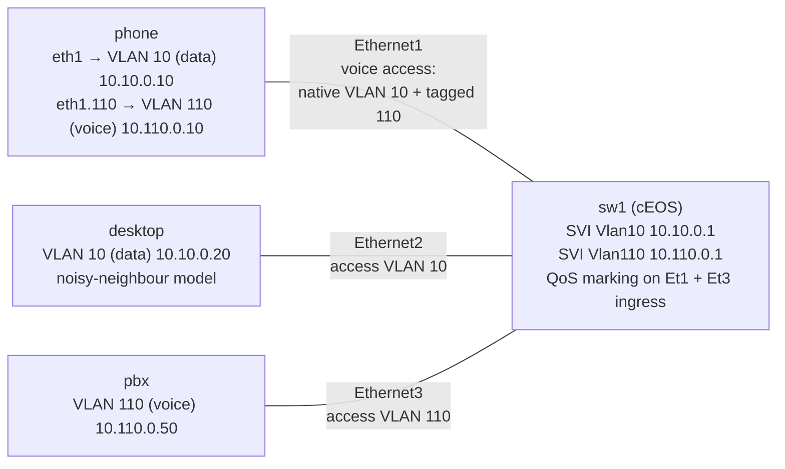

# Lab 43 — VoIP Networking

> **Format:** Hands-on. Build a voice-aware access port pattern (data VLAN + voice VLAN), mark RTP and signaling, harden the port. Reference answer in [`solutions/`](solutions/).
>
> **Story chapter:** Phase 8 · Senior+ · Year 4–5. A customer onboards a hosted PBX product. Within a week you have your first "one-way audio" ticket. You realize: voice is not "just another flow" — it has latency, jitter, and loss budgets the rest of the network doesn't care about. See [`STORY.md`](../../STORY.md).
>
> **cEOS limitations (read before you start):** Three features in this lab are config-accepted as a learning exercise but are **not enforced** by cEOS — they only work on production hardware (DCS-7280/7500/7800 etc.):
> - **LLDP-MED policy advertisement** — cEOS support is limited; production EOS advertises the voice-VLAN/DSCP network-policy TLV so the phone auto-provisions. This lab uses static voice-VLAN config and describes LLDP-MED conceptually.
> - **`storm-control`** — cEOS rejects `storm-control <type> level <n>` with `storm-control not supported on this hardware platform` (same as lab 06). The syntax is shown for production-hardware reference; expect rejection on cEOS.
> - **QoS DSCP marking** (`policy-map type qos` / `class` / `set dscp`, plus `match ip access-group` in a class-map) — **rejected by cEOS** (`% Unavailable command (not supported on this hardware platform)` / `% Invalid input`): the marking policy **does not even load** in the container, so there is nothing to capture. You learn the EOS config pattern here; production hardware applies and enforces it. See the Verification section for what you can do on cEOS.

## Real-world scenario

The customer's IP phones use the classic "voice access port" pattern: one cable runs from the wall jack into the phone, a second cable runs from the phone into the user's PC. The phone tags its own RTP and SIP traffic with VLAN 110; the PC's data is untagged. Both share the same switch port.

Three things go wrong without proper QoS + port config:
1. **One-way audio** — outbound RTP gets dropped by a shaper somewhere; remote side hears you, you don't hear them. Usually NAT or DSCP-remarking by an intermediate device.
2. **Choppy audio under load** — voice shares queue with bulk traffic; bursts cause jitter > 30ms and packet loss > 1%.
3. **Calls drop on PoE renegotiation** — phone reboots when switch port renegotiates power; user blames you.

This lab addresses #2 directly (port + QoS config) and gives you the mental model for debugging #1 and #3.

## Goal

- Configure a "voice access" trunk-style port (untagged data + tagged voice)
- Mark RTP (DSCP EF) and SIP signaling (DSCP CS5) at the access layer
- Apply common protections: storm-control, BPDU guard, PortFast

## Topology



- **VLAN 10 (data)** = `10.10.0.0/24` — the daisy-chained PC and the desktop.
- **VLAN 110 (voice)** = `10.110.0.0/24` — the phone and the PBX.
- The phone→PBX RTP/SIP path is an intra-VLAN-110 L2 switch between Ethernet1 (tagged) and Ethernet3.

## Theory primer

### Latency / jitter / loss budgets for voice

Industry rules of thumb for IP voice (ITU-T G.114):
- **One-way latency**: < 150ms acceptable, < 100ms good, < 50ms transparent
- **Jitter**: < 30ms (a jitter buffer typically handles up to ~50ms)
- **Packet loss**: < 1% for narrowband codecs, < 0.5% for HD codecs

A round-trip ping from London to Singapore is ~170ms. Already over budget. Codecs (Opus, G.722) tolerate some loss; G.711 is brittle.

Your network's contribution to the budget is small (sub-1ms per hop in a DC, ~5-15ms across a region). But **queueing delay during congestion** can blow up to hundreds of ms — that's where QoS matters.

### Voice VLAN pattern

```
[wall] ──── [PHONE] ──── [PC]
              │
              └── eth0 → switch port:
                  - untagged frames     → VLAN 10 (data, for the PC)
                  - tagged VLAN 110     → VLAN 110 (voice, for the phone itself)
```

The switch port is technically a trunk, but configured with:
- Native VLAN = data VLAN (untagged from PC traverses normally)
- Allowed VLANs = data + voice
- The phone learns its voice VLAN ID dynamically via **LLDP-MED** ("network-policy" TLV)

LLDP-MED also tells the phone which DSCP to mark with, so the phone marks itself.

### RTP / SIP traffic shapes

- **SIP signaling**: TCP or UDP port 5060, low bandwidth, latency-tolerant but loss-sensitive (registration failures are bad). Mark CS5.
- **RTP voice payload**: UDP, ephemeral ports (usually 16384-32767 range per vendor), ~80 kbps per call (G.711) or ~20-50 kbps (Opus/G.722). Mark EF.
- **RTCP control**: UDP, same ports as RTP+1.

Identifying RTP by 5-tuple is tricky because the ports are dynamic. Options:
1. ACL by source/destination subnet (the voice VLAN's range) — what this lab does
2. Trust DSCP markings from the phone (set via LLDP-MED) — production approach
3. Stateful inspection (firewall/SBC) — heaviest but most accurate

### Common pitfalls

- **Asymmetric routing breaks SBC NAT**: outbound RTP via one path, inbound via another → SBC drops it as not-matching-flow. Fix: deterministic routing for voice subnets.
- **DSCP gets stripped at an internet edge**: most ISPs zero out DSCP on inbound. Voice traversing the internet is best-effort. For multi-site voice, build site-to-site VPN/MPLS where DSCP is preserved.
- **Jumbo frames + voice = no benefit**: voice packets are tiny (~200 bytes). Jumbo MTU helps bulk; ignore for voice.
- **PortFast on phone port matters**: switch port spends 30s in STP listening/learning by default. Phone DHCPs in that window → fails → reboots → loops. PortFast required.

## Your task

1. Configure `Ethernet1` as a voice access port: native VLAN 10 (data), tagged voice VLAN 110, both allowed.
2. Build an ACL matching RTP (UDP from/to voice VLAN range) and one matching SIP (port 5060).
3. Apply a QoS input policy on `Ethernet1` and `Ethernet3` that marks RTP → EF, SIP → CS5.
4. Harden the phone port: PortFast, BPDU Guard, storm-control thresholds. (PortFast/BPDU Guard work on cEOS; storm-control is config-only — see the limitations note at the top.)

## Hints

You're building the class-map → policy-map → service-policy chain plus a voice-access port. Verbs, not answers:

- **Port mode**: `switchport mode trunk`, `switchport trunk native vlan`, `switchport trunk allowed vlan` (voice access = a trunk with the data VLAN as native).
- **Matching traffic**: `ip access-list`, `permit udp … range 16384 32767` (RTP), `permit … eq 5060` (SIP).
- **Classifying**: `class-map type qos match-any …`, `match ip access-group …`.
- **Marking**: `policy-map type qos …`, `set dscp ef` (RTP), `set dscp cs5` (SIP).
- **Attaching**: `service-policy type qos input …` on the ingress ports (Ethernet1 and Ethernet3).
- **Hardening**: `spanning-tree portfast`, `spanning-tree bpduguard enable`, `storm-control broadcast/multicast level …` (config-only on cEOS).

## Verification

### 1. Check the port mode and that the policy is attached

```bash
docker exec -it clab-voip-networking-sw1 Cli
show interface ethernet 1 switchport      # native VLAN 10, trunking VLANs 10,110
show qos interface ethernet 1             # service-policy VOICE-MARK applied, input
show policy-map interface ethernet 1 input
```

> On cEOS this is the **authoritative** check: it confirms your class-map/policy-map/service-policy chain is built and attached correctly. The packet captures below are where cEOS's data-plane limitation shows up.

### 2. Generate fake voice (RTP-range) traffic

On `pbx`, start a UDP listener:
```bash
docker exec -d clab-voip-networking-pbx nc -u -l 20000
```

From `phone`, send UDP to the RTP destination port. **Single-quote** the `bash -c` body so `$(seq …)` and `$i` expand *inside* the container, not on your host:
```bash
docker exec clab-voip-networking-phone bash -c 'for i in $(seq 1 100); do echo voice-packet-$i | nc -u -w0 10.110.0.50 20000; sleep 0.02; done'
```

On the PBX, capture and inspect the ToS byte:
```bash
docker exec clab-voip-networking-pbx tcpdump -i eth1 -nn -v 'udp port 20000' -c 5
```

> **cEOS limitation — DSCP is not rewritten.** On **production hardware** the marked frames arrive with `tos 0xb8` (DSCP 46 / EF — the `0xb8` math: 46 << 2 = 0xb8). On **cEOS** the `set dscp` policy is accepted but *not enforced* in the software data plane, so the capture shows the **original** DSCP the host sent, typically `tos 0x0`. That does **not** mean your config is wrong — verify correctness with `show policy-map interface ethernet 1 input` (step 1) instead. This is the same class of cEOS gap as storm-control (lab 06) and PFC/ETS (lab 47).

### 3. Verify SIP marking

```bash
docker exec clab-voip-networking-phone bash -c "echo 'REGISTER sip:pbx' | nc -w1 10.110.0.50 5060" &
docker exec clab-voip-networking-pbx tcpdump -i eth1 -nn -v 'tcp port 5060 or udp port 5060' -c 3
```

> On **production hardware** SIP would arrive marked `tos 0xa0` (DSCP 40 / CS5 — 40 << 2 = 0xa0). On **cEOS** you'll again see the unmarked ToS; confirm the SIG class is matching with `show policy-map interface ethernet 1 input` (look for the SIG class packet counter incrementing).

### 4. (Optional) The noisy-neighbour path

The `desktop` node (10.10.0.20, data VLAN 10) models the daisy-chained-PC / data-VLAN path that shares the access layer with voice — it motivates pitfall #2 ("choppy audio under load"). You can generate bulk data from it while the voice flow runs:
```bash
docker exec clab-voip-networking-desktop bash -c 'for i in $(seq 1 5000); do echo bulk-$i; done | nc -u -w1 10.10.0.1 9999'
```
> On real hardware, EF-marked voice in a priority queue would be insulated from this bulk traffic. cEOS does **not** enforce egress queueing/scheduling, so you won't observe the queue-protection effect here — the desktop is illustrative of *where* contention happens, not a live demonstration of QoS scheduling.

## What's missing (deliberately)

- **LLDP-MED policy advertisement** (cEOS limitation; production EOS does this — see top note)
- **Enforced DSCP remarking + storm-control** (config-accepted but not enforced on cEOS — see top note; the syntax is the takeaway)
- **End-to-end QoS across the WAN** (handled in lab 42; combine here for production)
- **SIP-aware ALG / SBC** — application-layer concern, not network
- **PoE configuration for IP phones** — hardware-only
- **Voice gateway / FXS interfaces** — Asterisk/FreePBX territory, not switch
- **E911 / location services** — regulatory; LLDP-MED civic location TLV

## Cleanup

```bash
sudo containerlab destroy --cleanup
```
