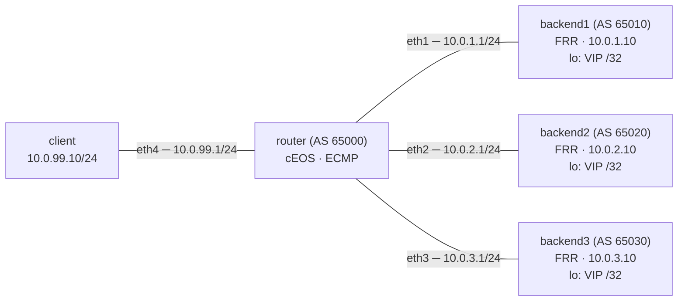

# Lab 44 — Load Balancing Patterns

> **Format:** Hands-on. Build network-layer load balancing: three backends each announce the same VIP via BGP, the router installs all three as ECMP paths, traffic is hashed across them. Reference answer in [`solutions/`](solutions/).
>
> **Story chapter:** Phase 8 · Senior+ · Year 4–5. A customer's web service is outgrowing one backend VM. They could buy a hardware load balancer (expensive). Or — since they're already running BGP for their hosted service — they can let the **network** do the load balancing for them via ECMP. This is the same pattern that lets Cloudflare have 1.1.1.1 served from thousands of machines. See [`STORY.md`](../../STORY.md).
>
> **Note:** Uses FRR on the backend hosts (not cEOS) — that's realistic; Linux servers running BGP daemons (FRR, BIRD, GoBGP) is the production pattern.

## Real-world scenario

You have a service that needs to scale horizontally. Three common approaches:

1. **Dedicated load balancer (HAProxy / F5 / NetScaler / Envoy)**: a box (or VM) in front of the backends that does L4 or L7 LB. Stateful, sees every flow, can do health-checks, SSL termination, content rules.
2. **DNS round-robin**: client gets a different A record each query. Cheap but coarse — clients cache, no health checks, fail-over is slow.
3. **Network-layer (this lab)**: every backend announces the same VIP via BGP. Router installs all paths as ECMP. Traffic is hashed (5-tuple) across backends.

When is option 3 the right call?
- **High throughput, low LB intelligence needed**: you don't need L7 routing, just spread traffic.
- **Stateless services**: DNS resolvers, NTP, anycast HTTP CDN edge.
- **The backends already speak BGP**: if you're running BGP for your hosted service, you've already paid the cost.
- **You want to avoid an LB SPOF**: ECMP across N backends is inherently redundant.

When option 3 is wrong:
- **Stateful flows** that must stick to a backend (login sessions): need session affinity. Hard with stateless ECMP unless you do consistent hashing (Maglev, Katran).
- **L7 routing decisions** (path-based routing, header rules): need an L7 LB.
- **Health-check granularity**: BGP session up != backend healthy. The backend can be running BGP fine but serving 500s.

In practice: combine. ECMP across multiple LBs, each LB does L7 in front of its backend pool. That's how Google, Cloudflare, AWS work.

## Goal

- Three backends announce the same VIP `10.99.99.1/32` via eBGP
- Router installs all three as ECMP paths
- Verify traffic distributes across all three
- Verify automatic re-hashing when a backend's BGP session drops

## Topology



All three backends announce the **same** VIP `10.99.99.1/32` from `lo` via eBGP. The router (AS 65000) peers with each backend in its own AS and, with ECMP enabled, installs all three as equal-cost next-hops. Client traffic to the VIP is then hashed across the three.

## Theory primer

### ECMP — Equal-Cost Multi-Path

When the routing table has multiple equal-cost paths to a destination, the router can install all of them. For each flow, hash the 5-tuple (src IP, dst IP, src port, dst port, proto) to pick a path. Flows are sticky (same flow → same path), but different flows distribute.

Default Arista EOS will only install one BGP-learned path per prefix (`maximum-paths` defaults to 1). To enable ECMP:
```
router bgp 65000
   maximum-paths 4 ecmp 4
   bgp bestpath as-path multipath-relax    ! for eBGP from different ASes
```

The `maximum-paths` part is always required: without it, only the single best path is installed regardless of how many equal-cost candidates exist.

The `multipath-relax` part relaxes the rule that candidate AS-paths must be *identical* (same ASes, not just same length) to be considered for multipath. With one AS per backend, the AS-paths differ, so strict multipath would reject them. **Version note:** on older EOS this had to be enabled explicitly; on EOS 4.36.0F (per the EOS User Guide, *Multipath Relax* section) it is **enabled by default**, so the command is a harmless confirming no-op there. Configuring it explicitly is always safe — required on older trains, idempotent on 4.36+ — so we keep it in the solution. Don't be surprised if `show running-config` already shows it implied.

### Health checking via BGP session

The backend's BGP daemon (FRR here) **only announces the VIP if its application is healthy**. Two common patterns:

1. **ExaBGP / GoBGP with health hooks**: the BGP daemon checks (curl localhost, systemd service status) and announces or withdraws.
2. **FRR + service binding**: the VIP is only on `lo` while the service is bound to it (e.g., a script that adds/removes the IP based on systemd state).

Either way: backend dies → VIP withdrawn → router removes that path from ECMP → traffic rehashes. BGP hold timer defaults are 180s/60s — for fast failover, tune to 3s/1s + BFD.

### Hashing & flow stickiness

Hash inputs typically include src IP, dst IP, src port, dst port, proto. A given flow keeps going to the same backend. New flows may pick a different backend.

Risk: hash polarization — if every router in a chain uses the same hash, the same flow lands on the same path at every step. Modern hardware randomizes per-router; not usually a problem.

### Connection draining & graceful removal

To take a backend out of rotation for maintenance:
- Backend stops announcing the VIP (e.g., `network 10.99.99.1/32` removed from BGP config)
- Existing flows finish (or get reset by the backend); new flows go to remaining backends
- Once drained, backend can be rebooted / patched / replaced
- Bring back: re-announce, traffic rebalances

Compare to: HAProxy `set server backend1 state drain` — same idea, different actuation mechanism.

### When you outgrow ECMP-only

Once you need:
- L7 (path / hostname / header routing) → put HAProxy / Envoy in front
- Connection affinity → use consistent hashing (Maglev, Katran, GLB)
- TLS termination → L7 LB (or per-backend)

The pattern: ECMP across L7 LBs, L7 LBs in front of pools. ECMP is the "outer" distribution; L7 does the "inner" smart routing.

## Your task

1. On `router`, configure eBGP to all three backends.
2. Enable ECMP: `maximum-paths 4 ecmp 4` + `bgp bestpath as-path multipath-relax`.
3. Verify all three paths install in the FIB.
4. From the client, generate traffic and verify it distributes.

## Hints

You shouldn't need the full answer — these are the CLI verbs that get you there:

- `router bgp <asn>` / `neighbor <ip> remote-as <asn>` — bring up an eBGP session to each backend (each backend is in its own AS: 65010 / 65020 / 65030).
- `maximum-paths <n> ecmp <n>` — **the** knob that lets more than one equal-cost BGP path land in the FIB. Default is 1, which is why ECMP is off until you set this.
- `bgp bestpath as-path multipath-relax` — lets paths with *different* AS-paths still be eligible for multipath (each backend is a different AS). Default-on in EOS 4.36, but set it explicitly for portability.
- `address-family ipv4` → `neighbor <ip> activate` — activate each neighbor for IPv4 unicast.
- On the backends, `network 10.99.99.1/32` (already in the FRR starters) is what advertises the VIP — removing it is how you'd drain a backend.
- Verify with `show ip bgp summary`, `show ip bgp 10.99.99.1/32`, `show ip route 10.99.99.1` — the last one should list 3 next-hops.

## Verification

### BGP state
```bash
docker exec -it clab-load-balancing-patterns-router Cli
show ip bgp summary
show ip bgp 10.99.99.1/32
show ip route 10.99.99.1
```

The route should show 3 next-hops. **In cEOS, this RIB/FIB install is the authoritative thing to verify** (see the caveat below) — three next-hops for `10.99.99.1/32` means ECMP is working at the control plane.

> **cEOS caveat — software forwarding vs. hardware ECMP.** On a real Arista switch the 5-tuple hash is done in the switching ASIC and distributes large numbers of flows very evenly. cEOS has **no ASIC — it forwards in software**, so the actual per-flow distribution you observe in the packet-count test below can be noticeably *lopsided*, especially with only ~30 distinct flows. That is a property of the container, not a bug in your config. Treat `show ip route 10.99.99.1` showing 3 next-hops as the real pass/fail; treat the packet counts as a rough illustration, not a precise 1/3 split.

### Generate traffic and observe distribution

The FRR backend image (`quay.io/frrouting/frr`) is a minimal Alpine image and **does not ship `tcpdump`** — install it first, then capture on each backend's `eth1`:
```bash
for b in backend1 backend2 backend3; do
  docker exec clab-load-balancing-patterns-$b sh -c 'command -v tcpdump >/dev/null || apk add --no-cache tcpdump'
done

docker exec -d clab-load-balancing-patterns-backend1 tcpdump -i eth1 -nn 'host 10.99.99.1' -w /tmp/b1.pcap
docker exec -d clab-load-balancing-patterns-backend2 tcpdump -i eth1 -nn 'host 10.99.99.1' -w /tmp/b2.pcap
docker exec -d clab-load-balancing-patterns-backend3 tcpdump -i eth1 -nn 'host 10.99.99.1' -w /tmp/b3.pcap
```

(If `apk add` has no network on your VM, capture on the router side instead — e.g. `sudo containerlab tools netem` / host-side `tcpdump` on the `clab-...` veth pairs — but the in-backend capture above is simplest when the FRR containers have internet.)

From client (different source ports → different hashes):
```bash
for i in $(seq 1 30); do
  docker exec clab-load-balancing-patterns-client bash -c "echo test | nc -u -w0 -p $((10000 + $i)) 10.99.99.1 7"
done
```

Stop captures and count packets per backend:
```bash
for b in backend1 backend2 backend3; do
  echo -n "$b: "
  docker exec clab-load-balancing-patterns-$b tcpdump -r /tmp/b${b##backend}.pcap 2>/dev/null | wc -l
done
```

Each backend should see *some* of the flows; in cEOS's software forwarding the split is rough rather than an exact 1/3 (see the caveat above). The point is that all three receive traffic — the VIP is genuinely being spread, not pinned to one backend.

### Simulate backend failure

```bash
docker exec clab-load-balancing-patterns-backend2 pkill bgpd
```

`pkill` sends `SIGTERM`, so FRR's `bgpd` shuts down **gracefully**: it sends a BGP Cease NOTIFICATION and closes the TCP socket. The router sees the socket close and tears the session down **within ~1s** — you do *not* wait out the hold timer here. Almost immediately:
```bash
docker exec clab-load-balancing-patterns-router Cli -c "show ip route 10.99.99.1"
```

Only 2 next-hops remain. Re-run the client traffic — it is now spread across 2 backends only.

> **When does the 180s hold timer actually matter?** Only for a *hard* failure with **no** TCP teardown — e.g. `kill -9` of the whole container, the host crashing, or the link going down without a FIN/RST reaching the router. In that case the router keeps the dead path until the hold timer (default 180s) expires. To detect hard failures fast, tune `neighbor x timers 3 9` and add BFD (see the starter `router.cfg` comment, and labs 19/26). To see the slow path here, try `docker exec clab-load-balancing-patterns-backend2 kill -9 1` instead and watch the route linger.

## What's missing (deliberately)

- **Consistent-hash ECMP** (Maglev) for flow stickiness — newer-hardware feature
- **BFD on BGP sessions** for sub-second backend failure detection — covered in lab 19/26
- **Service health binding** — script that conditionally announces based on `curl localhost` health
- **L7 LB integration** (HAProxy / Envoy in front of pools)
- **TCP connection draining** — protocol-level, not network

## Cleanup

```bash
sudo containerlab destroy --cleanup
```
