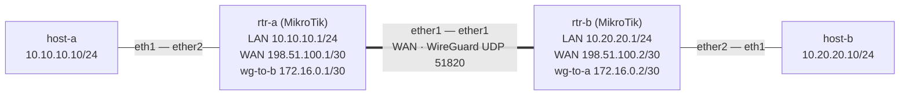

# Lab 45 — VPN Technologies on MikroTik

> **Format:** Hands-on, MikroTik-based. Build a site-to-site VPN between two locations using WireGuard (preferred) with IPsec as an alternative. Reference answer in [`solutions/`](solutions/).
>
> **Story chapter:** Phase 8 · Senior+ · Year 5. The Company picked up a partnership with a vendor who insists on a private connection (no internet hops). They run MikroTik on their side; you spin up MikroTik on yours because it's the cheapest CHR ($45/year for unrestricted) and the partner's team knows the syntax. Welcome to "talking the other team's language." See [`STORY.md`](../../STORY.md).
>
> **Why MikroTik for this lab:** This is the only lab in the curriculum that *isn't* on Arista. In real life you'll routinely encounter MikroTik (small ISPs, edge sites, partner connections), Cisco (legacy enterprise), Juniper, Palo Alto (firewalls). The point of this lab is partly to demonstrate that **the protocols are the same** — IPsec is IPsec, BGP is BGP — only the CLI grammar differs. Don't fear it.

## Setup — MikroTik CHR import

Unlike cEOS, MikroTik's CHR (Cloud Hosted Router) image is not freely redistributable but **is** free to download from MikroTik's site (with a 1 Mbit/s license limit unless you buy a license — fine for labs).

1. Download CHR from https://mikrotik.com/download (look for "CHR" → "Raw disk image")
2. Convert and import as a Docker image. See containerlab docs for the current procedure:
   - https://containerlab.dev/manual/kinds/mikrotik_ros/
3. Tag as `mikrotik_routeros:7.15` (adjust the version match in `topology.clab.yml` to whatever you imported).

If you can't get CHR running, you can substitute with VyOS or a Linux box running strongSwan/WireGuard — the concepts transfer.

### Confirm the clab → RouterOS interface mapping first

This lab's topology and configs assume `ether1` = WAN and `ether2` = LAN. How containerlab's `mikrotik_ros` kind maps each clab link to a RouterOS `etherN` is **version-dependent** — depending on the containerlab/RouterOS build, the management network can consume `ether1` and shift your data links by one. If the mapping differs, every `/ip address ... interface=etherN`, the WireGuard endpoint reachability, and the `interface=ether1` sniffer in Verification will silently land on the wrong port and the tunnel will never converge.

Before configuring anything, deploy once and confirm the names from inside the CHR:

```bash
sudo containerlab deploy
docker exec -it clab-vpn-on-mikrotik-rtr-a /interface print   # or console in
```

Match each `ether*` to the clab endpoint (WAN link vs LAN link) and, if it differs from `ether1`/`ether2`, adjust the `interface=` values in `configs/*.rsc` (and the `interface=ether1` in the Verification sniffer) to suit. Once verified for your containerlab + RouterOS versions, the mapping is stable — note it here for next time.

## Real-world scenario

The partner ("Vendor X") needs encrypted reachability between their internal `10.20.20.0/24` and yours `10.10.10.0/24` for an API integration. Options:

1. **MPLS L3VPN** from a transit provider — clean but slow to provision, expensive, and requires a multi-week procurement.
2. **Public internet + VPN** — fast to set up, "free", encrypted.

You go with #2. Choices within VPN:

| Tech | Pros | Cons |
|---|---|---|
| **WireGuard** | Simple config (~10 lines per side), modern crypto (ChaCha20-Poly1305), great performance, kernel-native on Linux | Newer (less battle-tested in some regulated environments); no NAT-T quirks but also no IKE/IPsec ecosystem |
| **IPsec (IKEv2)** | Interoperable with every firewall ever made, regulators are familiar with it, well-understood | Complex config, NAT-T edge cases, easy to misconfigure crypto and never know |
| **OpenVPN** | TLS-based, traverses most NATs easily | Slow (userspace), CPU-heavy |
| **GRE + IPsec** | GRE carries routing protocols (OSPF/BGP) over the tunnel | Adds overhead, complexity |
| **L2TP/IPsec** | Built-in Windows client | Legacy; mostly for remote-access not site-to-site |

For new builds, default to **WireGuard**. For partner integrations where they say "we use IPsec", do IPsec. For carrying BGP over a tunnel, do GRE-over-IPsec or WireGuard (BGP works fine over WG point-to-point).

## Goal

- Build a working WireGuard tunnel between rtr-a and rtr-b
- Route the LAN subnets across the tunnel
- (Reference) Recognize the IPsec equivalent for partner interop

## Topology



Double line = the WAN segment that the encrypted WireGuard tunnel rides over. The two LANs (`10.10.10.0/24` and `10.20.20.0/24`) reach each other only through the tunnel; clear-text never crosses the WAN.

## Theory primer

### WireGuard fundamentals

```
┌──────────────────┐                    ┌──────────────────┐
│   rtr-a          │                    │   rtr-b          │
│   wg-to-b        │◄══ UDP 51820 ═════►│   wg-to-a        │
│   172.16.0.1/30  │   (the WAN)        │   172.16.0.2/30  │
│   allowed:       │                    │   allowed:       │
│   10.20.20.0/24  │                    │   10.10.10.0/24  │
│   pubkey of rtr-b│                    │   pubkey of rtr-a│
└──────────────────┘                    └──────────────────┘
        │                                       │
        │ LAN: 10.10.10.0/24                    │ LAN: 10.20.20.0/24
       host-a                                  host-b
```

Key concepts:
- **Public/private keypair per peer**. No PSK (well, optional pre-shared key for post-quantum).
- **AllowedIPs** is *the routing table for the tunnel*. Anything destined to those prefixes goes into the tunnel.
- **Endpoint** is the public IP/port of the other side. Dynamic; can move (roaming).
- **Persistent keepalive** keeps NAT mappings alive for hosts behind NAT (set to 25s for behind-NAT, 0 — i.e. disabled — for both-public). In *this* lab both ends are public, so the reference solution leaves it off; it is shown commented-out so you can see where it would go if one side were behind NAT.
- **No "tunnel up/down"** in the IPsec sense — it's stateless. If the keys match and packets arrive, it works.

Versus IPsec:
- WireGuard: 1 protocol, 1 port (UDP 51820 by default), 1 config concept (peers).
- IPsec: IKE phase 1 + phase 2, SAs, lifetimes, DH groups, encryption proposals, dead peer detection, NAT-T, ESP+AH, transport vs tunnel mode — every one is a config parameter and a possible mismatch.

### Routing over the VPN

The tunnel itself is just a point-to-point link from the OS's perspective (interface `wg-to-b` with /30). Standard routing applies:
- Static: `/ip route add dst=10.20.20.0/24 gateway=172.16.0.2`
- Dynamic: run OSPF or BGP across the tunnel. For partner connections, prefer BGP — explicit control over what each side advertises.

### NAT considerations

If `rtr-a` is behind NAT (e.g., a small office), the *outbound* WG packet works but inbound won't reach unless port forwarding is set up. Persistent-keepalive (25s) from `rtr-a` opens the NAT mapping that `rtr-b` then reuses for return traffic.

In this lab both sides have direct WAN IPs — easy case.

### Failure modes & debugging

- **Wrong public key**: silent failure. The receiver decrypts, MAC fails, packet dropped. No log by default.
- **Wrong AllowedIPs**: tunnel "up" but traffic doesn't return — return packet doesn't match AllowedIPs on the way back.
- **MTU**: WireGuard adds 60 bytes of overhead. If your underlying MTU is 1500, set tunnel MTU to 1420. Otherwise large packets fragment or get dropped.
- **Firewall blocks UDP/51820**: `tcpdump -i ether1 udp port 51820`. If nothing's arriving, it's the firewall (or NAT/routing).

## Your task

1. Generate a WireGuard keypair on each router (RouterOS auto-generates on interface create; read public key with `/interface wireguard print`).
2. Exchange public keys between rtr-a and rtr-b.
3. Configure the WireGuard interface with the peer's public key, endpoint, and AllowedIPs.
4. Address the transport network (172.16.0.0/30).
5. Route the remote LAN via the tunnel.
6. Verify reachability: `host-a` pings `host-b`.

## Hints

RouterOS verbs you'll need (commands, not the full answer — figure out the arguments):

- `/interface wireguard add` — creates the tunnel interface; RouterOS auto-generates a keypair if you don't supply `private-key`.
- `/interface wireguard print` — read your own **public** key to hand to the other side.
- `/interface wireguard peers add` — register the remote peer: `public-key`, `endpoint-address`, `endpoint-port`, and `allowed-address`.
- `/ip address add` — put the `/30` transport address on the `wg-*` interface (and confirm the LAN/WAN addresses from the starter).
- `/ip route add` — point the remote LAN prefix at the tunnel.
- `/ip firewall filter add` — let inbound UDP/51820 reach the `input` chain on the WAN interface.

Remember: `allowed-address` is *both* the crypto-routing filter and what RouterOS will accept from the peer — it must list the transport `/30` **and** the remote LAN, on both sides.

## Verification

### Tunnel state
```bash
# Inside the MikroTik (use console or telnet to the management container)
/interface wireguard peers print
/interface wireguard peers monitor 0
```

`monitor 0` watches the peer at index `0` — fine here because each router has exactly one peer. With more than one peer, run `peers print` first and pass the number you want from that list.

Look for: last handshake recent, rx/tx counters incrementing.

### End-to-end
```bash
docker exec clab-vpn-on-mikrotik-host-a ping -c 3 10.20.20.10
```

### Verify it's encrypted
```bash
# Tap the WAN link from the host side
docker exec clab-vpn-on-mikrotik-rtr-a /tool sniffer quick interface=ether1 ip-protocol=udp
```

You see UDP/51820 — payload is encrypted; no clear ICMP visible.

## What's missing (deliberately)

- **BGP over the tunnel** — for partner connections this is the next step
- **High availability / failover** between two VPN tunnels (BGP + ECMP across tunnels, or VRRP on the WG endpoints)
- **Site-to-site IPsec with multi-SA setups** — partner shop quirks
- **Remote access VPN** (WireGuard or OpenVPN per user) — different threat model
- **DMVPN / SD-WAN orchestrated mesh** — vendor-specific (Cisco, Fortinet, SilverPeak)
- **Performance tuning** — multi-core CPU pinning, GRO/GSO, jumbo frames

## Cleanup

```bash
sudo containerlab destroy --cleanup
```
