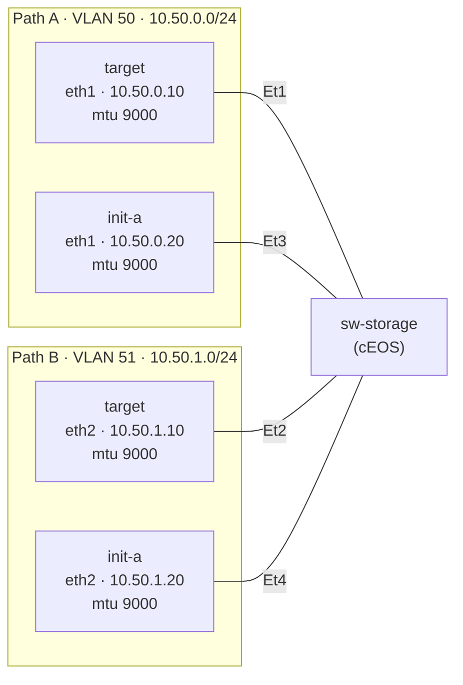

# Lab 46 — iSCSI Fundamentals (Network Side)

> **Format:** Hands-on (network configuration only). Build the storage VLAN, jumbo MTU, multipath topology. Reference answer in [`solutions/`](solutions/).
>
> **Story chapter:** Phase 8 · Senior+ · Year 5. The Company added a managed-storage product. Customer VMs talk to a SAN over the network. Storage traffic looks like normal IP, but if you treat it like normal IP, performance is unusably bad. You learn that storage networking is its own discipline with its own rules. See [`STORY.md`](../../STORY.md).
>
> **Scope:** This lab covers the *network* side: VLAN isolation, MTU, multipath topology, edge protections. iSCSI initiator/target *daemon* config (LUNs, CHAP, etc.) is host-side and not included — link to references at the end.

## Real-world scenario

The storage team buys a new SAN. They plug it into a shared switch with all the customer VLANs and call it a day. Performance is terrible: 50 MB/s on what should be a 10 Gb link, latency spikes to 200ms, customers complain.

You investigate. The findings:
- Storage shares broadcast domain with general VMs → broadcast storms from one tenant ruin storage for everyone
- MTU is 1500 → a single iSCSI block is split across several TCP segments (~3 for a 4 KB block) instead of fitting in fewer larger ones, multiplying the per-frame overhead (this is TCP segmentation, not IP fragmentation)
- No multipath topology → single switch loss = SAN unreachable = every VM crashes
- LLDP runs on storage ports → adds inter-packet processing latency

You build a real storage network. The pattern: **storage traffic is treated like real-time traffic with a low-jitter requirement, not like data traffic.**

## Goal

- Dedicated storage VLANs (separated broadcast domains — one per path)
- Jumbo MTU (9000) end to end
- Multipath topology (2 NICs per host, 2 independent paths to target, one subnet per path)
- Standard edge protections (PortFast, BPDU Guard)

> **cEOS limitation — storm-control:** A real storage-edge build would also add `storm-control` so a misbehaving NIC can't flood the storage VLAN. We deliberately leave it out of this lab because **cEOS does not support storm-control** — configuring `storm-control broadcast/multicast level <n>` returns `storm-control not supported on this hardware platform`, so there's nothing to validate live. You configure and read about it (against production-hardware behavior) in [lab 06](../06-port-security-storm-control/). On production switches (DCS-7280/7500 etc.) it is enforced in ASIC.

## Topology

Two physically independent paths from each host to the storage switch, each in its own VLAN/subnet so MPIO failover is deterministic.



- `sw-storage` Et1/Et3 = VLAN 50 (path A), Et2/Et4 = VLAN 51 (path B).
- Both host NICs run MTU 9000; the Arista L2 ports already pass 9214-byte payloads with no config.
- One switch here (single cEOS node); on real hardware path A and path B would land on two *different* switches for true physical independence.

## Theory primer

### iSCSI in 30 seconds

iSCSI carries SCSI commands over TCP. The host (initiator) opens a TCP connection to the SAN (target). Reads and writes look like SCSI block I/O — but over the network instead of a SAS/FC bus.

- TCP port 3260 by default
- Target identifier: `iqn.YYYY-MM.<reverse-domain>:<unique>` (IQN — iSCSI Qualified Name)
- Each "LUN" (Logical Unit Number) is a block device on the initiator: `/dev/sdb`, etc.
- The initiator's filesystem (ext4, XFS) sits on top of the LUN as if it were a local disk

### Why network design matters for storage

| Network problem | Storage symptom |
|---|---|
| Packet loss > 0.01% | I/O timeouts, retries, perceived "slow disk" |
| Jitter (variable latency) | Inconsistent throughput, application timeouts |
| MTU mismatch | Connection works for small I/O, hangs for large reads |
| Broadcast storm in storage VLAN | All hosts lose disk simultaneously |
| Single path | Single switch/cable failure = production outage |
| Spanning-tree convergence on storage port | 30-60s of "no disk" during STP recalc |

A working ethernet network with 0.5% packet loss is fine for web traffic. For iSCSI it's catastrophic.

### Jumbo frames (MTU 9000+)

Standard MTU = 1500 bytes. iSCSI block transfers are typically 4 KB-64 KB. With MTU 1500, a 64 KB transfer is ~45 ethernet frames. With MTU 9000, it's ~7 frames. Fewer frames = less per-frame overhead = higher throughput, lower CPU.

**Where jumbo is actually configured on this path.** It's a common misconception that you "set jumbo MTU on the switch ports." On Arista, **layer-2 access/trunk ports already carry a 9214-byte payload by default** (the full L2 frame is 9236 bytes) and that value is *not* configurable — there is no per-port L2 MTU knob, and the `mtu` interface command only sets the **L3/routed-interface IP MTU**, which doesn't apply to a pure `switchport`. So an Arista L2 switch is never the jumbo bottleneck. The bottleneck is the **end hosts**, whose NICs default to MTU 1500. That's why in this lab jumbo is enabled host-side (`ip link set ethN mtu 9000` in the topology `exec`), not on the switch.

Requirements:
- Every **end host / routed hop** on the path must agree on the IP MTU (L2 Arista ports already pass jumbo payloads and need no config)
- One mis-configured *host* = oversized frames silently dropped or the kernel refusing to send → worse than no jumbo
- Test with: `ping -M do -s 8972 target` (8972 = 9000 - 28 ICMP+IP overhead). With `-M do` (don't-fragment set), the kernel refuses to send a frame larger than the egress NIC's MTU, so this only succeeds once both hosts are at MTU 9000.

### Multipath I/O (MPIO)

Two NICs per host, two switches, two paths to target. The Linux multipath daemon (`multipathd`) presents one logical device to the OS that internally fans out across both paths. On failure, the other path takes over without the application noticing.

Topology requirement: paths must be **physically independent** — different NICs, different switches, ideally different power. "Both NICs through the same switch" defeats the purpose.

**One subnet per path.** Real MPIO puts each path in its **own IP subnet** (path A = `10.50.0.0/24`, path B = `10.50.1.0/24`). This is deliberate: if both NICs share one subnet, Linux's default weak-host model and ARP behaviour ("ARP flux") let traffic and replies leave/arrive on either NIC non-deterministically, so you can't actually tell which physical path a session is using — and a single-path failure test gives ambiguous results. Separate subnets make each session bind to a deterministic interface, which is exactly how SAN vendors document iSCSI multipath. In this lab we also give each path its **own VLAN** on the switch (50 / 51) so the two broadcast domains are genuinely independent.

### Why storage gets its own VLAN (or VRF, or physical network)

Three reasons:
1. **Broadcast isolation**: a misbehaving NIC in the data VLAN can't impact storage.
2. **QoS / lossless ethernet**: storage VLAN can be configured for PFC/ETS (see lab 47).
3. **ACL simplicity**: it's much easier to say "this VLAN is storage, nothing else here" than "filter port 3260 everywhere."

For high-end deployments, storage gets a *physical* separate network (different switches, different cabling). For mid-range, a separate VLAN with priority queueing is enough.

### Spanning-tree configuration on storage ports

Same rules as access ports (lab 05):
- PortFast: skip listening/learning, go straight to forwarding
- BPDU Guard: shut the port if a BPDU arrives (a host shouldn't be sending BPDUs)
- Optionally: disable STP entirely on the VLAN and rely on physical topology (riskier)

Why: if STP runs normally, a topology change can blackhole storage traffic for 30 seconds during convergence. Filesystem timeouts; data corruption potential.

### Disabling LLDP / CDP on storage ports

Marginal but real: every LLDP/CDP packet processed by the host's NIC firmware adds latency. For latency-sensitive storage hosts, some shops disable LLDP on those specific ports.

## Your task

Goal state on `sw-storage`:

1. Keep each path in its own storage VLAN — path A (Et1/Et3) in VLAN 50, path B (Et2/Et4) in VLAN 51 (already set in starter).
2. Apply `spanning-tree portfast` and `spanning-tree bpduguard enable` on every storage port.
3. Disable LLDP transmit/receive on every storage port.

> **No switch MTU step.** Don't try to "set MTU 9214 on the switch ports." Arista L2 access ports already carry a 9214-byte payload (9236-byte frame) by default and it isn't configurable; the `mtu` command is L3-only and doesn't apply to a `switchport`. Jumbo is enabled **host-side** — the topology already raises each host NIC to MTU 9000 in its `exec` block. Your switch job is VLAN + STP edge + LLDP.

## Hints

- STP edge protection on a host-facing port: `spanning-tree portfast`, `spanning-tree bpduguard enable` (per interface).
- LLDP is enabled by default — turn it off per interface with the `no` form of `lldp transmit` / `lldp receive`.
- Need to see which ports are in which VLAN? `show vlan` and `show interfaces … status`.
- There is intentionally **no** `mtu` verb to use here (see the note above) — resist the urge.

## Verification

### Check VLAN + STP edge state
```bash
docker exec -it clab-iscsi-fundamentals-sw-storage Cli
show vlan
show interfaces ethernet 1 status
show spanning-tree interface ethernet 1 detail
```

`show vlan` should show Et1/Et3 in VLAN 50 and Et2/Et4 in VLAN 51. `show spanning-tree … detail` should report the port as an edge (PortFast) port with BPDU guard enabled.

> We do **not** verify the switch MTU here. `show interfaces ethernet 1` prints `Ethernet MTU 9214 bytes` on a pure L2 access port *by default*, so that number proves nothing about your config — it reads 9214 on the untouched starter too. The real proof of jumbo is the end-to-end host ping below.

### Test jumbo end-to-end (initiator → target, path A)
```bash
docker exec clab-iscsi-fundamentals-init-a ping -M do -s 8972 10.50.0.10
```

Should succeed, because the topology raised both host NICs to MTU 9000. `-M do` sets don't-fragment; with `-s 8972` the frame is ~9000 bytes, so the kernel will only send it if the egress NIC's MTU is ≥ 9000. If a host NIC were still at 1500 you'd get a local `ping: local error: message too long, mtu=1500` — that's the signature of a host MTU mismatch.

### Test redundant paths
Path A is VLAN 50 / `10.50.0.0/24` (host `eth1`); path B is VLAN 51 / `10.50.1.0/24` (host `eth2`). Because the paths are in separate subnets/VLANs, the failover is deterministic:

```bash
# Confirm both paths reach the target first
docker exec clab-iscsi-fundamentals-init-a ping -c 2 10.50.0.10   # path A
docker exec clab-iscsi-fundamentals-init-a ping -c 2 10.50.1.10   # path B

# Drop path A; path B's subnet is unaffected
docker exec clab-iscsi-fundamentals-init-a ip link set eth1 down
docker exec clab-iscsi-fundamentals-init-a ping -c 3 10.50.1.10   # still succeeds via path B
docker exec clab-iscsi-fundamentals-init-a ping -c 3 -W 1 10.50.0.10  # now fails (path A down)

# Restore
docker exec clab-iscsi-fundamentals-init-a ip link set eth1 up
```

In a real deployment `multipathd` does this automatically and the application never sees the path drop.

## Host-side iSCSI (out of scope, here for context)

If you actually want to do iSCSI on Linux:

- **Target side** (`targetcli`): create a backstore, an IQN, an ACL, an LUN
- **Initiator side** (`iscsiadm`): discover the target, log in, the LUN appears as `/dev/sdX`
- **Multipath**: install `multipath-tools`, configure `/etc/multipath.conf`, the LUN appears as `/dev/mapper/mpathX`

Good reference: [Linux iSCSI documentation](https://docs.kernel.org/admin-guide/iscsi.html).

## What's missing (deliberately)

- **PFC / ETS / DCB** — the lossless-ethernet protocols that make iSCSI work at line rate; covered in lab 47
- **NVMe-over-fabrics (NVMe-oF)** — modern replacement for iSCSI, uses RDMA; needs different network design
- **Fibre Channel** — non-IP storage transport, separate fabric
- **iSER (iSCSI over RDMA)** — high-perf iSCSI variant
- **Host-side LUN provisioning** — kernel target / open-iscsi configuration

## Cleanup

```bash
sudo containerlab destroy --cleanup
```
