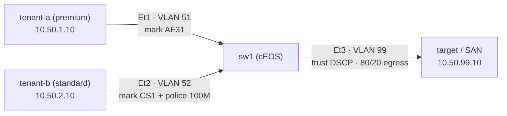

# Lab 48 — Storage QoS & Tenant Isolation

> **Format:** Hands-on. Per-tenant rate-limit (policer) on ingress, DSCP marking by tenant, queue bandwidth allocation on the shared egress. Reference answer in [`solutions/`](solutions/).
>
> **cEOS limitation:** ingress policing and egress tx-queue bandwidth scheduling are **dataplane/ASIC** features. cEOS is a container with no forwarding ASIC: it *accepts* the syntax (the config commits, `show policy-map` / `show qos interface` reflect it) but does **not** enforce rate-limiting or bandwidth allocation. The point of this lab is the *config pattern* and the trust-boundary model — production hardware (DCS-7050X / 7280R / 7500R) enforces; cEOS does not. The throughput numbers in Verification describe what production hardware would produce, not what you will measure in this lab. Same caveat as lab 42 (QoS varies by chipset) and lab 47 (DCB enforcement is partial on cEOS).
>
> **Story chapter:** Phase 8 · Senior+ · Year 5. Multi-tenant storage. Tenant B's backup job at 02:00 is starving Tenant A's database I/O — same SAN, same network. Tenant A pays for "premium IOPS." Tenant B doesn't. The network has to enforce the difference. See [`STORY.md`](../../STORY.md).

## Real-world scenario

The "noisy neighbor" problem in storage:

Two tenants share a SAN backend. Tenant A pays for guaranteed IOPS; Tenant B is on standard pricing. Without QoS, Tenant B's nightly backup hits 8 Gbps and saturates the link to the SAN. Tenant A's database queries slow to a crawl. Tenant A escalates.

The fix has three layers:
1. **Mark per-tenant**: at the ingress port, tag every packet with a DSCP value that identifies the tenant's tier.
2. **Rate-limit (policer) the lower tier**: cap Tenant B's bandwidth so they can't even produce a full saturation. Hard ceiling.
3. **Queue scheduling on the contested egress**: on the link to the SAN, give the premium class 80% of bandwidth when there's contention.

Combined effect: Tenant B can use up to 100 Mbit. Beyond that, dropped at ingress. The link to the SAN reserves 80% for premium even if standard tries to use it all.

## Goal

- Per-tenant DSCP marking
- Ingress policer for the lower tier
- Per-class bandwidth allocation on the contested egress

## Topology



The contested resource is the egress port to the SAN (Et3). Tenant ports (Et1, Et2) are the trust boundary where marking and policing happen.

## Theory primer

### Policer vs shaper

- **Policer**: drop (or remark) packets exceeding rate. Cheap. Adds no latency. Bursty: TCP flows back off, then ramp up again repeatedly.
- **Shaper**: buffer packets to meet rate. Smooths. Adds latency (proportional to buffer depth). Uses memory.

For tenant isolation: policer is usually right — you want a hard ceiling without consuming switch memory. For a customer-facing access link: shaper is sometimes better — smoother user experience.

This lab uses a policer.

### Token bucket

A policer is conceptually a token bucket:
- Tokens generated at `rate` (e.g., 100 Mbit/s = 12.5 MB/s)
- Bucket capacity = `burst-size` (e.g., 64 KB)
- Each packet consumes tokens equal to its size; if not enough tokens, drop
- Bucket can absorb short bursts up to its size, then enforces the rate

Why burst matters: a burst-size of 0 means a single 1500-byte packet exceeds the bucket and gets dropped. Typical bursts: 32 KB - 256 KB for normal traffic.

### Class-based bandwidth allocation on egress

When the egress link is congested (i.e., total demand > link capacity), the scheduler picks. With class-based allocation:
- Class A (AF31): 80% guaranteed minimum
- Class B (CS1): 20% guaranteed minimum

"Guaranteed minimum" — if A doesn't use its 80%, B can borrow it. When A wants its 80%, B is pushed back to 20%. No bandwidth wasted; tenants protected.

This is what implements the "premium gets bandwidth guarantee" promise.

#### DSCP → traffic-class → tx-queue

A DSCP value doesn't go straight to a queue — EOS maps it through a *traffic class*, then the traffic class to a *tx-queue*. With the EOS default maps:

| DSCP | name | traffic-class | tx-queue |
|------|------|---------------|----------|
| 26   | AF31 | 3             | 3        |
| 8    | CS1  | 0             | 0        |

So the 80% reservation belongs on **tx-queue 3** (where AF31 lands), and 20% on **tx-queue 0** (CS1) — not on tx-queue 4. Always confirm the live map with `show qos maps` before you assume a queue number.

One more subtlety: on Arad/Jericho-class platforms a tx-queue defaults to **strict priority**, and `bandwidth percent` only takes effect after you move the queue to round-robin with `no priority`. On Trident/Trident-II there is no `bandwidth percent` on tx-queues at all — the minimum-bandwidth knob is `bandwidth guaranteed <rate> kbps`. The reference answer uses the Arad/Jericho round-robin pattern.

### The trust boundary

Tenants can mark their own packets. You can't trust that — they'll mark everything as the premium tier. Therefore:
- On the tenant-facing port: **re-mark** ingress traffic (don't trust whatever DSCP they sent)
- On internal links: **trust** DSCP (it's already been set by your edge)

This is the same principle as voice marking (lab 43): mark at the edge, trust internally.

### What about IOPS, not just bandwidth?

Network QoS controls bandwidth and latency, not IOPS directly. For per-tenant IOPS limits, that's done at the **storage controller** (LVM, ZFS, vSphere SIOC, Ceph QoS, etc.) — outside the network.

The network's role: don't let one tenant's storage traffic starve another's at the *transport* layer. The storage system handles per-LUN/per-volume IOPS caps.

## Your task

1. Build the marking policy: Tenant A → AF31, Tenant B → CS1.
2. Build the policer: 100 Mbit/s, 64 KB burst, drop on exceed.
3. Apply marking and policer at each tenant's ingress port.
4. On the shared egress (to target): trust DSCP, allocate 80%/20% to AF31/CS1 traffic classes.

## Hints

CLI verbs you'll need (not the full answer — work out the structure yourself):

- `policy-map type qos <name>` / `class class-default` — build a QoS policy
- `set dscp af31` / `set dscp cs1` — mark
- `police rate 100 mbps burst-size 64 kbytes` — token-bucket policer (drop on exceed is the default)
- An interface takes **one** qos input policy — combine marking + policing for tenant-b into a single policy-map
- `service-policy type qos input <name>` — attach a policy to an ingress interface
- `qos trust dscp` — trust the marking arriving on an internal/egress interface
- `tx-queue <n>` / `no priority` / `bandwidth percent <pct>` — weighted egress scheduling (Arad/Jericho); pick the queue that AF31/CS1 actually land in (see the DSCP→TC→queue table above)
- `show policy-map interface ethernet <n> input`, `show qos interface ethernet <n>`, `show qos maps` — verify

## Verification

> **Read the cEOS-limitation callout at the top first.** The config commits and the *show* commands below reflect it, but cEOS does **not** enforce the policer or the egress 80/20 split. The iperf3 results below are what production hardware produces; on cEOS you will not see the cap or the contention isolation. Verify the *config and counters*, not the throughput.

### Check the policies are applied (this is the real cEOS verification)
```bash
docker exec -it clab-storage-qos-isolation-sw1 Cli
show policy-map interface ethernet 2 input
show qos interface ethernet 3
show qos maps
```
Expected on cEOS: Ethernet2 shows the `MARK-SCAVENGER` policy with `set dscp cs1` + `police rate 100 mbps`; Ethernet3 shows `qos trust dscp` and the tx-queue 3/0 bandwidth shares; `show qos maps` confirms DSCP 26 → TC3 and DSCP 8 → TC0. If all three are present, you've built the pattern correctly.

### Test policing (production-hardware behaviour — will NOT cap on cEOS)
> The `iperf3` commands require `iperf3` in the host image (the `network-multitool` image ships it). Throughput over containerlab veth pairs depends on host CPU, not a real ASIC, so even the "near 1 Gbps" framing is environment-dependent.

On target, listen:
```bash
docker exec -d clab-storage-qos-isolation-target iperf3 -s
```

From tenant-b, attempt 1 Gbps:
```bash
docker exec clab-storage-qos-isolation-tenant-b iperf3 -c 10.50.99.10 -b 1G -t 10
```

- **On production hardware:** throughput caps at ~100 Mbit/s, retransmit/loss count is high (the policer is dropping).
- **On cEOS (this lab):** no cap — tenant-b reaches roughly the same throughput as tenant-a, because the policer is config-accepted but not enforced.

From tenant-a, attempt same:
```bash
docker exec clab-storage-qos-isolation-tenant-a iperf3 -c 10.50.99.10 -b 1G -t 10
```

Expected (both platforms): tenant-a is not policed, so it runs at link/veth rate.

### Test bandwidth allocation under contention (production-hardware behaviour)
Run both tenants simultaneously.

- **On production hardware:** Tenant A retains near-full link share even when Tenant B is hammering — Tenant B is policed first, and the egress 80/20 allocation backs it up under congestion.
- **On cEOS (this lab):** with no egress scheduler enforcement, the two flows share the link roughly by TCP fairness, not 80/20. To *see* the isolation behaviour you need the ASIC; what this lab teaches is the config that produces it on real gear.

## What's missing (deliberately)

- **DSCP-aware Linux host marking** — tenants' marking from inside their VM
- **Burst-aware policing** (two-rate three-color marker / 2R3C) — color-aware traffic conditioning
- **Storage-controller IOPS limits** — non-network
- **Per-flow fairness** (DRR / FQ-CoDel) — modern Linux qdisc features
- **Telemetry exporting drops/throttles** to billing/alerting

## Cleanup

```bash
sudo containerlab destroy --cleanup
```
