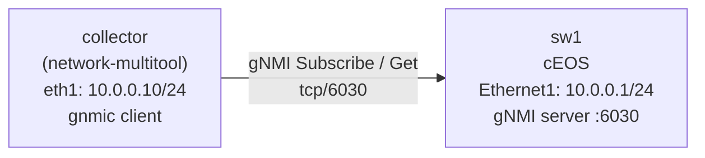

# Lab 49 — Streaming Telemetry (gNMI / OpenConfig)

> **Format:** Hands-on. Enable gNMI on the switch, subscribe from a collector, observe push-based telemetry. Reference answer in [`solutions/`](solutions/).
>
> **Story chapter:** Phase 9 · Tech lead · Year 5+. SNMP polled every 10 seconds is missing 9 seconds of relevant data per cycle. The microbursts that cause customer pain are invisible. You move to streaming telemetry — the device *pushes* metrics at sub-second cadence. See [`STORY.md`](../../STORY.md).

## Real-world scenario

Your monitoring stack polls SNMP every 10 seconds. A customer complains about "intermittent slow responses." You check the interface graphs — flat. No errors. But the customer's trace shows packet loss at exactly 02:17 for ~3 seconds. SNMP couldn't see it because it averaged the 10-second window.

Streaming telemetry is the answer:
- **Push, not poll**: the device sends data to the collector at the cadence the collector subscribed to (typically 1s or sub-second).
- **Structured**: data is YANG-modeled, not free-text. Tooling can parse it consistently.
- **Efficient**: gRPC over a persistent connection, protobuf encoding. Much less overhead than SNMP polling.

The stack:
- **gNMI** (gRPC Network Management Interface): the protocol
- **OpenConfig**: the vendor-neutral YANG model
- **gnmic** / **gnmi_collector** / **gnmi-gateway**: collector tools
- **Prometheus / InfluxDB**: time-series storage
- **Grafana**: visualization

Lab 50 covers the full stack. This lab just gets gNMI talking.

## Goal

- Enable gNMI on the switch
- From the collector, do a `Get` (one-shot) and a `Subscribe` (streaming)
- Understand the structure (YANG paths, encoding)

## Topology

Two nodes on a single routed `/24`. The collector subscribes to sw1's gNMI server over `Ethernet1`.



| Node      | Interface | IP            | Role                         |
|-----------|-----------|---------------|------------------------------|
| collector | eth1      | 10.0.0.10/24  | gnmic client, default via .1 |
| sw1       | Ethernet1 | 10.0.0.1/24   | gNMI server on tcp/6030      |

> The topology also maps host `6030:6030`, so you can optionally test from the lab VM itself with `gnmic -a localhost:6030 ...`. The verification below uses the in-fabric path (collector → 10.0.0.1) instead.

## Theory primer

### gNMI in one paragraph

gRPC service with 4 RPCs:
- **Capabilities**: list supported models
- **Get**: one-shot query at a YANG path
- **Set**: configure (write)
- **Subscribe**: stream updates at a path

Operates over TCP (default port 6030 on Arista, 9339 on Cisco/Juniper for OpenConfig). Two layers of encoding, often conflated:
- **gRPC framing**: the gRPC messages themselves are *always* protobuf — that's how gNMI rides gRPC.
- **Value encoding**: the YANG *payload values* inside those messages can be JSON, JSON_IETF, or PROTO, depending on what you ask for (`--encoding` in gnmic).

### YANG paths

Like XPath. Examples:
- `/interfaces/interface[name=Ethernet1]/state/counters/in-octets`
- `/network-instances/network-instance[name=default]/protocols/protocol[identifier=BGP][name=BGP]/bgp/neighbors`

Paths can be OpenConfig (cross-vendor) or vendor-native (Arista's `eos-native`). Same data, different schema.

### Subscribe modes

- **STREAM SAMPLE**: send at fixed interval (e.g., every 1 second)
- **STREAM ON_CHANGE**: send only when the value changes
- **STREAM TARGET_DEFINED**: device picks (usually ON_CHANGE for config, SAMPLE for counters)
- **ONCE**: like Get, but over the Subscribe stream
- **POLL**: client triggers via Poll messages

For counters: SAMPLE 1s. For state changes (BGP peer up/down): ON_CHANGE.

## Your task

1. Configure `management api gnmi` with gRPC transport on port 6030 (no TLS for the lab — just omit any `ssl profile`).
2. OpenConfig paths are exposed by default; add `provider eos-native` so the Arista native paths are *also* available.
3. From the `collector` container, install `gnmic` (or use it via Docker) and:
   - List capabilities
   - Get the interface state
   - Subscribe to in-octets at 1-second sample interval

## Hints

On sw1 (EOS), the relevant config modes — figure out the exact nesting yourself:

```
configure terminal
  management api gnmi
    transport grpc default
      port <n>
    provider <which one adds Arista native paths?>
  end
```

- To run *without* TLS, simply do **not** add any `ssl profile` line. EOS then reports `SSL Profile: none`. (There is no built-in profile named `NONE`.)
- OpenConfig is on by default — you don't enable it with a `path /openconfig` directive.
- Verify the server is up with `show management api gnmi`.

From the collector, the `gnmic` verbs you'll use:

- `gnmic ... capabilities` — list supported models/encodings
- `gnmic ... get --path <yang-path>` — one-shot read
- `gnmic ... subscribe --path <yang-path> --stream-mode sample --sample-interval 1s` — streaming

## Verification

### Install gnmic on the collector

> **Needs internet at lab time.** The `network-multitool` image does *not* ship `gnmic`, so this step pulls it from the network. If your lab VM is air-gapped, use the Docker-image option below instead (and pre-pull the image while you have connectivity).

```bash
docker exec -it clab-streaming-telemetry-collector bash
apt update && apt install -y curl
bash -c "$(curl -sL https://get-gnmic.openconfig.net)"
```

**Air-gapped / no-install alternative.** The `10.0.0.0/24` link is a point-to-point veth between `collector` and `sw1`, so the only host inside that subnet is the collector itself — that's why the `gnmic` commands run *from* the collector. To stay air-gapped, pre-pull `ghcr.io/openconfig/gnmic` (or pre-bake the binary into the collector image) while you still have connectivity, then either:
- copy the gnmic binary into the collector with `docker cp`, or
- reach sw1 from the VM host over the published `localhost:6030` map:
  ```bash
  docker run --rm --network host ghcr.io/openconfig/gnmic \
    -a localhost:6030 -u admin -p admin --insecure capabilities
  ```

### Capabilities
```bash
gnmic -a 10.0.0.1:6030 -u admin -p admin --insecure capabilities
```

You should see supported models including OpenConfig and Arista native.

### One-shot Get
```bash
gnmic -a 10.0.0.1:6030 -u admin -p admin --insecure \
  get --path '/interfaces/interface[name=Ethernet1]/state/counters'
```

### Streaming Subscribe
```bash
gnmic -a 10.0.0.1:6030 -u admin -p admin --insecure \
  subscribe --path '/interfaces/interface[name=Ethernet1]/state/counters/in-octets' \
  --stream-mode sample --sample-interval 1s
```

You'll see counter updates every second. Generate some traffic to watch them tick.

## What's missing (deliberately)

- **TLS + client certificate authentication** — mandatory in production; lab uses insecure mode for simplicity
- **Telemetry exporters** (gnmic-to-Prometheus output) — lab 50
- **YANG model browsing** with `pyang` / `yanglint` — orthogonal tooling
- **gNMI Set** for configuration — covered in lab 51 (NETCONF) which is the more common config path

## Cleanup

```bash
sudo containerlab destroy --cleanup
```
